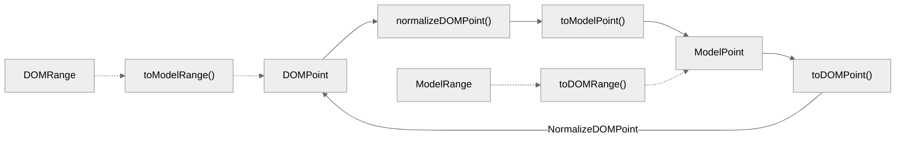

# 浏览器选区与编辑器选区模型同步
在先前我们基于`Range`对象与`Selection`对象实现了基本的浏览器选区操作，并且基于编辑器数据模型设计了`RawRange`和`Range`对象两种选区模型。在这里我们需要将浏览器选区与编辑器选区关联起来，以此来确认应用变更时的操作区间，相当于我们需要基于`DOM`实现受控的选区同步。

- 开源地址: <https://github.com/WindRunnerMax/BlockKit>
- 在线编辑: <https://windrunnermax.github.io/BlockKit/>
- 项目笔记: <https://github.com/WindRunnerMax/BlockKit/blob/master/NOTE.md>

从零实现富文本编辑器项目的相关文章:

- [深感一无所长，准备试着从零开始写个富文本编辑器](./从零设计实现富文本编辑器.md)
- [从零实现富文本编辑器#2-基于MVC模式的编辑器架构设计](./基于MVC模式的编辑器架构设计.md)
- [从零实现富文本编辑器#3-基于Delta的线性数据结构模型](./基于Delta的线性数据结构模型.md)
- [从零实现富文本编辑器#4-浏览器选区模型的核心交互策略](./浏览器选区模型的核心交互策略.md)
- [从零实现富文本编辑器#5-编辑器选区模型的状态结构表达](./编辑器选区模型的状态结构表达.md)
- [从零实现富文本编辑器#6-浏览器选区与编辑器选区模型同步](./浏览器选区与编辑器选区模型同步.md)

## 描述
当前的主要目标是将浏览器选区与编辑器选区模型同步，也就是希望实现受控的`DOM`选区同步。实际上这里需要考虑的问题非常多，例如`DOM`节点是非常复杂的，特别是在支持插件化的渲染模式下，如何将其归一化，以及如何处理`ContentEditable`的受控渲染问题等等。

我们先来处理最简单的选区同步问题，也就是纯文本节点的选区`Case`。先来回顾一下浏览器中纯文本的选区操作，下面的例子中，我们就可以获取文本片段`23`的位置，这里的`firstChild`是`Text`节点，即值为`Node.TEXT_NODE`类型，这样才可以计算文本内容的片段。

```html
<span id="$1">123456</span>
<script>
  const range = document.createRange();
  range.setStart($1.firstChild, 1);
  range.setEnd($1.firstChild, 3);
  console.log(range.getBoundingClientRect());
</script>
```

在编辑器选区模型中，我们定义了`Range`对象以及`RawRange`对象来表示编辑器选区状态。`RawRange`对象的设计与`Quill`编辑器的选区设计保持一致，毕竟通常来说选区设计的直接依赖便是数据结构的设计，`RawPoint`对象则直接维护了起始偏移的值。


```js
export class RawPoint {
  constructor(
    /** 起始偏移 */
    public offset: number
  ) {}
}

export class RawRange {
  constructor(
    /** 起始点 */
    public start: number,
    /** 长度 */
    public len: number
  ) {}
}
```

`Range`对象选区的设计直接基于编辑器状态的实现，基于`Point`对象维护了行索引和行内偏移，`Range`对象则维护了选区的起始点和结束点。此时的`Range`对象中区间永远是从`start`指向`end`，通过`isBackward`来标记此时是否反选状态。

```js
export class Point {
  constructor(
    /** 行索引 */
    public line: number,
    /** 行内偏移 */
    public offset: number
  ) {}
}

export class Range {
  /** 选区起始点 */
  public readonly start: Point;
  /** 选区结束点 */
  public readonly end: Point;
  /** 选区方向反选 */
  public isBackward: boolean;
  /** 选区折叠状态 */
  public isCollapsed: boolean;
}
```

实际上这里进行选区同步的主要目标是我们希望借助`ContentEditable`实现内容的输入，以及借助浏览器原本的选区模型来实现文本选择效果，而不是额外维护`input`实现输入以及自绘选区来实现文本选择效果。因此我们借助了更多浏览器能力，则需要大量逻辑来实现受控的模式同步。

而在整个流程中，我们需要完成双向的转换。当浏览器选区发生变化的时候，我们需要获取最新的`DOM`选区，并将其转换为`Model`选区。而在编辑器内容变更、主动设置选区等场景下，需要将编辑器选区转换为浏览器选区，并且设置到`DOM`节点中。



## 浏览器选区同步
我们首先实现浏览器选区同步到编辑器选区的逻辑，我们分别称为`DOM`选区以及`Model`选区。既然我们将其称之为`DOM`选区，那么我们必须要以`DOM`节点为基础来获取选区信息，而`DOM`的实现是比较复杂的，因此我们必须要兼容各种情况，整体来说我们需要解决如下几个问题:

- 文本节点选区，对于纯文本节点类型的选区处理是最常见的情况，当启用`ContentEditable`状态时，通常情况下光标都落于文本节点上的。在这种情况下，我们只需要通过`Selection`获取`StaticRange`对象，然后根据编辑器内建`State`来转为`Model`选区即可。
- 非文本节点选区，对于非文本节点的选区则是相对复杂一些的情况，主要是需要基于编辑器的`DOM`设计模型来处理选区落点问题。当然在编辑器中进行图文混排的情况是比较常见的，行级嵌入的节点例如图片、视频之类的容易处理，行内的嵌入节点例如`Mention`节点则更加复杂。
- 选区折叠与反选，对于选区的折叠状态和反选状态，我们需要在编辑器选区对象中进行标记，并且在转换时需要注意处理。折叠选区的情况我们可以直接从`Selection`对象中获取，而反选状态则需要通过`Range`对象的起始点和结束点进行判断，主要是通过选区的相关对象判断。
- 浏览器事件兼容，浏览器的默认交互中存在比较多的默认事件来处理，例如双击文本内容时，浏览器会自动选择词组。三击行内容时，浏览器的选区会落在行节点上，我们需要将其重新落到文本节点上。按住`alt`键且按左右键或者执行删除操作时，浏览器都会按词组移动/扩展选区。

那么我们从选区变化的源头开始处理，即从`OnSelectionChange`事件起始的回调函数，在该回调函数中我们需要获取`Selection`对象，以及静态选区的`Range`对象。从`Selection`对象中获取静态选区需要注意，因为`Firefox`支持多段选区，而其他内核不支持，这里我们只处理首段选区。

```js
// packages/core/src/selection/utils/dom.ts
const sel = window.getSelection();
if (!selection || !selection.anchorNode || !selection.focusNode) {
  return null;
}
let range: DOMStaticRange | null = null;
if (selection.rangeCount >= 1) {
  range = selection.getRangeAt(0);
}
if (!range) {
  const compat = document.createRange();
  compat.setStart(selection.anchorNode, selection.anchorOffset);
  compat.setEnd(selection.focusNode, selection.focusOffset);
  range = compat;
}
return range;
```

接下来我们需要判断当前的选区是否在编辑器容器节点内，毕竟如果不在编辑器内的选区我们应该忽略掉。紧接着我们需要判断当前选区是否需要处于反选状态，这里的判断非常简单，因为本身`Selection`对象和`Range`对象提供的节点和偏移是一致的，因此只需要判断其等同性即可。

```js
// packages/core/src/selection/utils/dom.ts
const isBackwardDOMRange = (sel: DOMSelection | null, staticSel: DOMStaticRange | null) => {
  if (!sel || !staticSel) return false;
  const { anchorNode, anchorOffset, focusNode, focusOffset } = sel;
  const { startContainer, startOffset, endContainer, endOffset } = staticSel;
  return (
    anchorNode !== startContainer ||
    anchorOffset !== startOffset ||
    focusNode !== endContainer ||
    focusOffset !== endOffset
  );
};
// packages/core/src/selection/index.ts
const { startContainer, endContainer, collapsed } = staticSel;
if (!root.contains(startContainer)) {
  return void 0;
}
if (!collapsed && !root.contains(endContainer)) {
  return void 0;
}
const backward = isBackwardDOMRange(sel, staticSel);
```

接下来就是重点要处理的部分了，`Range`对象是基于`Node`节点实现的，换句话说`Range`对象就跟我们数学上的区间定义一样，是通过起始节点来处理的。那么我们就以节点为基础来处理模型选区的转换，需要将选区节点进行标准化以及转换模型节点，我们以折叠选区为例来处理。

```js
// packages/core/src/selection/utils/native.ts
const { startContainer, endContainer, collapsed, startOffset, endOffset } = staticSel;
const domPoint = { node: startContainer, offset: startOffset };
const anchorDOMPoint = normalizeDOMPoint(domPoint, {
  isCollapsed: true,
  isEndNode: false,
});
const startRangePoint = toModelPoint(editor, anchorDOMPoint, {
  isCollapsed: true,
  isEndNode: false,
  nodeContainer: startContainer,
  nodeOffset: startOffset,
});
const endRangePoint = startRangePoint.clone();
return new Range(startRangePoint, endRangePoint, isBackward);
```

这其中的`normalizeDOMPoint`方法是来处理节点的标准化处理，因为`DOM`节点的类型是可以是非常复杂的，我们必须要兼容这些情况，特别是非文本的节点类型。针对于纯文本选区的类型，通常来说我们只需要通过渲染节点对应的`State`来得到映射的模型选区节点即可。

而对于非文本的选区节点，我们需要相对更加复杂的处理。首选我们需要明确我们的编辑器选区设计，针对于类似图片等节点，我们放置一个零宽字符的文本节点在放置光标。这样便于我们归一化处理，同样的换行尾节点我们也是使用零宽字符处理，类似语雀是使用`<br>`节点来处理的。

那么很明显，如果出现非文本节点的选区，我们需要查找到其内部设计好带标记的零宽字符节点。这种情况下我们只能通过不断迭代的方式来处理，直到我们找到目标的节点为止，理论上而言非文本节点浏览器的选区是落在最外层的`contenteditable=false`的节点的，因此我们考虑层级查找即可。

```js
// packages/core/src/selection/utils/native.ts
let { node, offset } = domPoint;
const { isCollapsed, isEndNode } = context;
// 此处说明节点非 Text 节点, 需要将选区转移到 Text 节点
// 例如 行节点、Void、Leaf 节点
if (isDOMElement(node) && node.childNodes.length) {
  // 选区节点的偏移可以是最右侧的插值位置, offset 则为其之前的节点总数
  let isLast = offset === node.childNodes.length;
  let index = isLast ? offset - 1 : offset;
  [node, index] = getEditableChildAndIndex(
    node,
    index,
    isLast ? DIRECTION.BACKWARD : DIRECTION.FORWARD
  );
  // 若是新的 index 小于选区的 offset, 则应该认为需要从新节点末尾开始查找
  // 注意此时的 offset 和查找的 index 都是 node 节点的子节点, 因此可以比较
  isLast = index < offset;
  // 如果仍然是非文本节点, 则继续层级查找
  while (isDOMElement(node) && node.childNodes.length) {
    const i = isLast ? node.childNodes.length - 1 : 0;
    [node] = getEditableChildAndIndex(node, i, isLast ? DIRECTION.BACKWARD : DIRECTION.FORWARD);
  }
  offset = isLast && node.textContent !== null ? node.textContent.length : 0;
}
return { node, offset };
```

`getEditableChildAndIndex`方法则是用来尝试迭代所有的子节点，来获取`parent`中`index`处附近的可编辑节点和索引。此外这个方法是优先以`direction`方向进行查找，当向前查找和向后查找都无效时，则只能返回最后查找过的节点和索引。

```js
// packages/core/src/selection/utils/dom.ts
const { childNodes } = parent;
let child = childNodes[index];
let i = index;
let triedForward = false;
let triedBackward = false;
// 当前节点为 注释节点/空元素节点/不可编辑元素节点 时, 继续查找下一个可编辑节点
while (
  isDOMComment(child) ||
  (isDOMElement(child) && child.childNodes.length === 0) ||
  (isDOMElement(child) && child.getAttribute(EDITABLE) === "false")
) {
  if (triedForward && triedBackward) {
    break;
  }
  if (i >= childNodes.length) {
    triedForward = true;
    i = index - 1;
    // <- 向后查找 -1
    direction = DIRECTION.BACKWARD;
    continue;
  }
  if (i < 0) {
    triedBackward = true;
    i = index + 1;
    // -> 向前查找 +1
    direction = DIRECTION.FORWARD;
    continue;
  }
  child = childNodes[i];
  index = i;
  // +1: 向前查找 -1: 向后查找
  const increment = direction === DIRECTION.FORWARD ? 1 : -1;
  i = i + increment;
}
return [child, index];
```

而对于`toModelPoint`方法，则是最终将标准化的`DOMPoint`节点转换为`ModelPoint`。在这个方法中我们需要根据文本节点来拿到渲染模型标记的`data-leaf`和`data-node`两种节点，这两个节点本质上是我们用以实现状态映射的节点，拿到状态表达后，我们就可以计算模型选区了。

```js
//
const { offset, node } = domPoint;
const leafNode = getLeafNode(node);
let lineIndex = 0;
let leafOffset = 0;
const lineNode = getLineNode(leafNode);
const lineModel = editor.model.getLineState(lineNode);
// COMPAT: 在没有 LineModel 的情况, 选区会置于 BlockState 最前
if (lineModel) {
  lineIndex = lineModel.index;
}
const leafModel = editor.model.getLeafState(leafNode);
// COMPAT: 在没有 LeafModel 的情况, 选区会置于 Line 最前
if (leafModel) {
  leafOffset = leafModel.offset + offset;
}
// ... 兼容特殊节点情况
return new Point(lineIndex, leafOffset);
```

在上边的兼容特殊`Case`的情况中，我们先来处理行末尾的`\n`节点类型，当前节点为`data-zero-enter`时, 需要将其修正为前节点末尾。这样做的主要原因是我们计算选区仅存在一个位置的插值，而作为`\n`节点是存在两个位置的插值的，这样会导致多一个位置的偏移，因此需要额外处理。

```js
// packages/core/src/selection/utils/model.ts
// Case 1: 当前节点为 data-zero-enter 时, 需要将其修正为前节点末尾
// content\n[caret] => content[caret]\n
const isEnterZero = isEnterZeroNode(node);
if (isEnterZero && offset) {
  leafOffset = Math.max(leafOffset - 1, 0);
  return new Point(lineIndex, leafOffset);
}
```

其实这里还有个比较有趣的问题，我们的目标是标准化全部以纯文本的形式处理选区的光标落点。而类似语雀这种在行末尾使用`<br>`换行而不是零宽字符的节点，就仅存在值为`0`的单个插值，这就是由于编辑器基础设计不同，而导致需要处理不同表现的`DOM`格式。

至此我们实现了编辑器的纯文本的浏览器节点转换到编辑器选区模型的逻辑，当然在这里我们省略了很多细节的处理逻辑，特别是在`toModelPoint`方法中实现的很多特殊`Case`处理。而对于非纯文本节点，例如图片、视频节点的处理，我们在后续实现`Void`节点的时候再细聊。

## 编辑器选区同步
当浏览器选区变化同步到编辑器选区后，选区同步这件事并没有真正完成。即使现在我们看似是已经根据浏览器选区位置计算出了模型选区位置，但是此时选区的位置是我们所需要的吗，自然是并非如此。我们实现的是编辑器，是需要输入内容的，这样的话我们就必须让选区/光标在我们受控的位置上。

实际上如果仅仅是只读模式下，编辑器仅感知在模型选区的位置是基本可行的，但是在编辑模式下输入内容就不够了。我们此时还需要根据模型选区的位置，再来同步到我们所希望的`DOM`节点上，本质上还是遵循我们的受控原则。此外，诸如输入光标跟随、行级工具栏等都需要依赖主动设置选区的能力。

那么这个流程就变成了，浏览器选区变化 -> 编辑器选区变化 -> 浏览器选区设置。我们这里就很容易发现一个问题，设置选区行为就变成了死循环，浏览器变化导致编辑器选区设置，然后又变更了浏览器选区，再次导致选区同步，无限循环下去。那么自然我们需要加入判断，选区无变化时避免再次设置。

```js
// packages/core/src/selection/index.ts
const sel = toDOMRange(this.editor, range);
if (!sel || !sel.startContainer || !sel.endContainer) {
  this.editor.logger.warning("Invalid DOM Range", sel, range);
  selection.removeAllRanges();
  return false;
}
const currentStaticSel = getStaticSelection(selection);
if (isEqualDOMRange(sel, currentStaticSel)) {
  return true;
}
const { startContainer, startOffset, endContainer, endOffset } = sel;
// 这里的 Backward 以 Range 状态为准
if (range.isBackward) {
  selection.setBaseAndExtent(endContainer, endOffset, startContainer, startOffset);
} else {
  selection.setBaseAndExtent(startContainer, startOffset, endContainer, endOffset);
}
```

然而只是这样还不足以处理所有问题，浏览器中会存在很多默认行为以及操作来处理选区。例如我们可以通过拖拽光标来快速移动光标，此时会不断触发`selection`变更事件，而如果此时我们不断设置选区，再加上鼠标移动光标行为移动选区，会导致大量的事件执行，因此我们需要限制执行。

```js
/**
 * 检查时间片执行次数限制
 */
protected limit() {
  const now = Date.now();
  // 如果距离上次记录时间超过 500ms, 重置执行次数
  if (now - this.lastRecord >= 500) {
    this.execution = 0;
    this.lastRecord = now;
  }
  // 如果循环执行次数超过 100 次的限制, 需要打断执行
  if (this.execution++ >= 100) {
    this.editor.logger.error("Selection Exec Limit", this.execution);
    return true;
  }
  return false;
}
```

当然试想我们本质上是因为鼠标按下事件移动选区，导致选区不断重设选区并且与我们同步的选区冲突，因此我们是可以在鼠标按下之后的状态下避免主动设置选区。此外，由于鼠标按键抬起时不一定会导致选区变化的事件，因此我们还需要在鼠标抬起时再次设置一次选区。

```js
// packages/core/src/selection/index.ts
public updateDOMSelection(force = false) {
  const range = this.current;
  if (!range || this.editor.state.get(EDITOR_STATE.COMPOSING)) {
    return false;
  }
  // ...
}

/**
 * 强制刷新浏览器选区
 */
@Bind
protected onForceUpdateDOMSelection() {
  if (!this.editor.state.get(EDITOR_STATE.FOCUS)) {
    return void 0;
  }
  this.updateDOMSelection(true);
}
```

描述完了浏览器选区与编辑器选区同步逻辑的问题后，我们来实现`toDOMRange`方法，将`ModelRange`转换为`DOMRange`。实际上相对来说，这里的实现并不会像`toModelRange`那么复杂，因为我们的模型选区是简单的格式，而不像`DOM`结构那么复杂，且实际对应的`DOM`由状态模块控制。

```js
// packages/core/src/selection/utils/native.ts
/**
 * 将 ModalRange 转换为 DOMRange
 * @param editor
 * @param range
 */
export const toDOMRange = (editor: Editor, range: Range): DOMRange | null => {
  const { start, end } = range;
  const startDOMPoint = toDOMPoint(editor, start);
  const endDOMPoint = range.isCollapsed ? startDOMPoint : toDOMPoint(editor, end);
  if (!startDOMPoint.node || !endDOMPoint.node) {
    return null;
  }
  const domRange = window.document.createRange();
  // 选区方向必然是 start -> end
  const { node: startNode, offset: startOffset } = startDOMPoint;
  const { node: endNode, offset: endOffset } = endDOMPoint;
  const startTextNode = getTextNode(startNode);
  const endTextNode = getTextNode(endNode);
  if (startTextNode && endTextNode) {
    domRange.setStart(startTextNode, Math.min(startOffset, startTextNode.length));
    domRange.setEnd(endTextNode, Math.min(endOffset, endTextNode.length));
    return domRange;
  }
  return null;
};
```


## 每日一题

- <https://github.com/WindRunnerMax/EveryDay>

## 参考

- <https://quilljs.com/docs/api#selection>
- <https://lexical.dev/docs/concepts/selection>
- <https://docs.slatejs.org/concepts/03-locations#selection>
