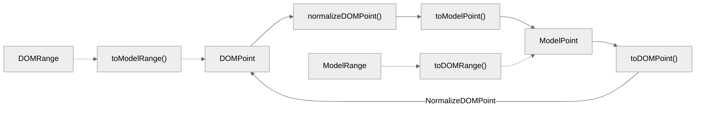

# 浏览器选区与编辑器选区模型同步
在先前我们基于`Range`对象与`Selection`对象实现了基本的浏览器选区操作，并且基于编辑器数据模型设计了`RawRange`和`Range`对象两种选区模型。在这里我们需要将浏览器选区与编辑器选区关联起来，以此来确认应用变更时的操作区间，相当于我们需要基于`DOM`实现受控的选区同步。

- 开源地址: <https://github.com/WindRunnerMax/BlockKit>
- 在线编辑: <https://windrunnermax.github.io/BlockKit/>
- 项目笔记: <https://github.com/WindRunnerMax/BlockKit/blob/master/NOTE.md>

从零实现富文本编辑器项目的相关文章:

- [深感一无所长，准备试着从零开始写个富文本编辑器](./从零设计实现富文本编辑器.md)
- [从零实现富文本编辑器#2-基于MVC模式的编辑器架构设计](./基于MVC模式的编辑器架构设计.md)
- [从零实现富文本编辑器#3-基于Delta的线性数据结构模型](./基于Delta的线性数据结构模型.md)
- [从零实现富文本编辑器#4-浏览器选区模型的核心交互策略](./浏览器选区模型的核心交互策略.md)
- [从零实现富文本编辑器#5-编辑器选区模型的状态结构表达](./编辑器选区模型的状态结构表达.md)
- [从零实现富文本编辑器#6-浏览器选区与编辑器选区模型同步](./浏览器选区与编辑器选区模型同步.md)

## 描述
当前的主要目标是将浏览器选区与编辑器选区模型同步，也就是希望实现受控的`DOM`选区同步。实际上这里需要考虑的问题非常多，例如`DOM`节点是非常复杂的，特别是在支持插件化的渲染模式下，如何将其归一化，以及如何处理`ContentEditable`的受控渲染问题等等。

我们先来处理最简单的选区同步问题，也就是纯文本节点的选区`Case`。先来回顾一下浏览器中纯文本的选区操作，下面的例子中，我们就可以获取文本片段`23`的位置，这里的`firstChild`是`Text`节点，即值为`Node.TEXT_NODE`类型，这样才可以计算文本内容的片段。

```html
<span id="$1">123456</span>
<script>
  const range = document.createRange();
  range.setStart($1.firstChild, 1);
  range.setEnd($1.firstChild, 3);
  console.log(range.getBoundingClientRect());
</script>
```

在编辑器选区模型中，我们定义了`Range`对象以及`RawRange`对象来表示编辑器选区状态。`RawRange`对象的设计与`Quill`编辑器的选区设计保持一致，毕竟通常来说选区设计的直接依赖便是数据结构的设计，`RawPoint`对象则直接维护了起始偏移的值。


```js
export class RawPoint {
  constructor(
    /** 起始偏移 */
    public offset: number
  ) {}
}

export class RawRange {
  constructor(
    /** 起始点 */
    public start: number,
    /** 长度 */
    public len: number
  ) {}
}
```

`Range`对象选区的设计直接基于编辑器状态的实现，基于`Point`对象维护了行索引和行内偏移，`Range`对象则维护了选区的起始点和结束点。此时的`Range`对象中区间永远是从`start`指向`end`，通过`isBackward`来标记此时是否反选状态。

```js
export class Point {
  constructor(
    /** 行索引 */
    public line: number,
    /** 行内偏移 */
    public offset: number
  ) {}
}

export class Range {
  /** 选区起始点 */
  public readonly start: Point;
  /** 选区结束点 */
  public readonly end: Point;
  /** 选区方向反选 */
  public isBackward: boolean;
  /** 选区折叠状态 */
  public isCollapsed: boolean;
}
```

而在整个流程中，我们需要完成双向的转换。当浏览器选区发生变化的时候，我们需要获取最新的`DOM`选区，并将其转换为`Model`选区。而在编辑器内容变更、主动设置选区等场景下，需要将编辑器选区转换为浏览器选区，并且设置到`DOM`节点中。



## 浏览器选区同步

## 编辑器选区同步

## 每日一题

- <https://github.com/WindRunnerMax/EveryDay>

## 参考

- <https://quilljs.com/docs/api#selection>
- <https://lexical.dev/docs/concepts/selection>
- <https://docs.slatejs.org/concepts/03-locations#selection>
