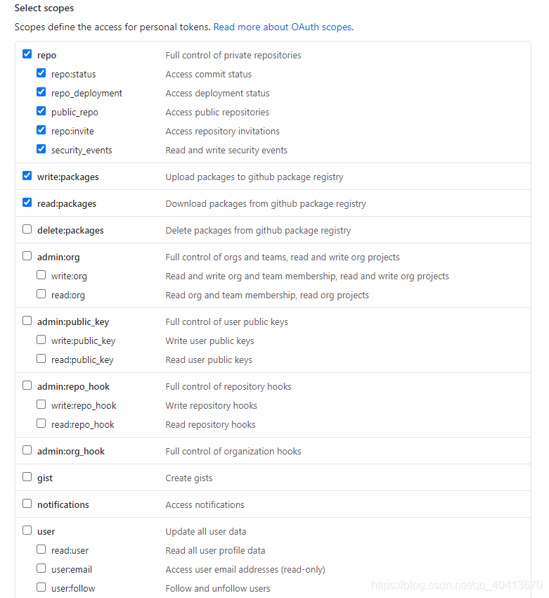

# 发布Npm包到GitHub Packages
`Github`集成了`GitHub Packages`功能，目前提供了`Npm`、`Docker`、`Maven`、`NuGet`、`RubyGems`的包管理工具，可以通过`Github`管理开源包，本文主要介绍使用`GitHub Packages`发布`Npm`包。

## 发布
首先需要制作一个`package.json`文件，可以通过`npm init`命令根据提示生成一个`package.json`文件。


这是已经发布好的`package.json`文件，作为示例，需要注意的是`name`字段、`publishConfig`字段与`repository`字段的配置，在`GitHub Packages`发布的包属于作用域包，需要使用`@username/package-name`的形式作为`name`字段，`publishConfig`是发布到`GitHub Packages`的必填且值固定的字段，`repository`字段是必须要指定的仓库`url`，可以发布多个包到一个仓库，可以参考`https://github.com/WindrunnerMax/Asse/packages/292805`。

```javascript
{
  "name": "@WindrunnerMax/mini-program-cli",
  "version": "1.1.0",
  "description": "Uniapp小程序开发脚手架",
  "author": "Czy",
  "license": "MIT",
  "bin": {
    "mini-program": "bin/cli.js"
  },
  "scripts": {
    "test": "echo \"Please use HbuildX import this project\""
  },
  "engines": {
    "node": ">= 8"
  },
  "publishConfig": {
    "registry": "https://npm.pkg.github.com/WindrunnerMax"
  },
  "repository": "https://github.com/WindrunnerMax/Asse"
}
```
下面需要授权，首先在`Github`申请一个`Token`，`user - setting -  Developer settings - Personal access tokens - Generate new token`，生成一个用以发布`Npm`包的`Token`，需要选择权限，以下权限必选：



接下来将`Token`添加至`~/.npmrc`，`win`用户是路径`C://users/current-user`。

```yaml
//npm.pkg.github.com/:_authToken=TOKEN
```
或者使用`npm login`命令进行授权，注意用户名要全部小写，`Token`的输入是以密码的方式输入，不会显示。

```shell
npm login --registry=https://npm.pkg.github.com
> Username: USERNAME
> Password: TOKEN
> Email: PUBLIC-EMAIL-ADDRESS
```
接下来在项目的根目录添加一个`~/.npmrc`文件，并添加如下配置。

```yaml
registry=https://npm.pkg.github.com/WindrunnerMax
```
接下来就可以使用`npm publish`命令发布包。

```shell
npm publish --access=public
```

## 安装
需要注意的是，无论发布包还是安装包都需要授权，也就是上述生成`Token`以及配置的过程，否则无法安装指定的包，以我发布的包为例，执行安装。

```shell
npm install -g @windrunnermax/mini-program-cli@1.1.0 --registry=https://npm.pkg.github.com/
```
如果使用`Github`安装`Npm`包很慢的话，可以考虑配置代理，同样是在`~/.npmrc`文件中加入配置。

```yaml
proxy=socks5://127.0.0.1:1080
https-proxy=socks5://127.0.0.1:1080
```

## Github

```
https://github.com/WindrunnerMax
```
