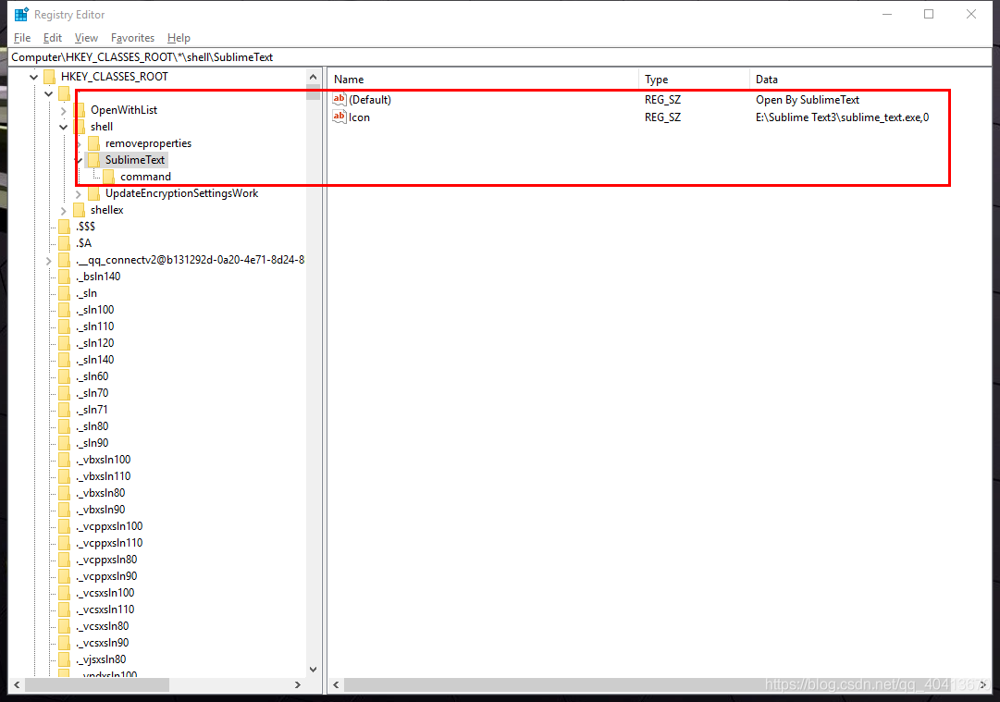

# 将SublimeText加入右键菜单

```bash
Windows Registry Editor Version 5.00

[HKEY_CLASSES_ROOT\*\shell\SublimeText]
@="Open By SublimeText"
"Icon"="E:\\Sublime Text3\\sublime_text.exe,0"

[HKEY_CLASSES_ROOT\*\shell\SublimeText\command]
@="E:\\Sublime Text3\\sublime_text.exe %1"


```
将代码保存为`sublime.reg`双击打开安装即可  
注意`E:\\Sublime Text3\\sublime_text.exe`是sublime安装路径  
执行添加后注册表如下  




## Blog

```
https://github.com/WindRunnerMax
```
