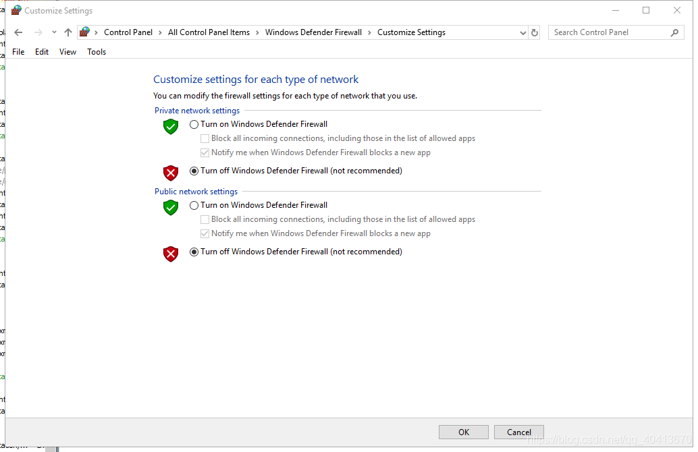

# 手机抓包HTTPS (Fiddler & Packet Capture)

> 以前写了一个小游戏(消灭病毒)的刷金币小脚本，使用需要获取openid ，就需要抓微信的HTTPS包  
> 一直都是用Fiddler抓电脑的包，Packet Capture抓手机的包，突然想试一下用电脑抓手机的包  
> https://github.com/WindrunnerMax/EliminVirus

## 1. Fiddler
首先下载安装Fiddler

打开 Tools - Options - HTTPS 并安装证书

打开 Connections 允许远程主机链接
此操作需重启Fiddler生效

为了防止防火墙阻止手机链接，暂时关闭防火墙
控制面板 - 防火墙 - 更改通知设置

需要手机与电脑在同一个局域网，查看本机ip地址
我用的是wifi，所以我只需要wlan的那个网卡显示的ip地址

手机端打开 ip:8888 下载并安装证书
安装证书如果提示找不到文件，那就去手机的 安全 - 从存储设备安装证书 会让你设置密码

打开手机的已连接wifi，点击设置手动代理

打开 微信 - 消灭病毒，Fiddler就可以抓到包了

## 2. Packet Capture
打开软件右上角 选项-设置

安装证书

点击 开始-选择微信

选择右边带有ssl字样的，即可看到openid

