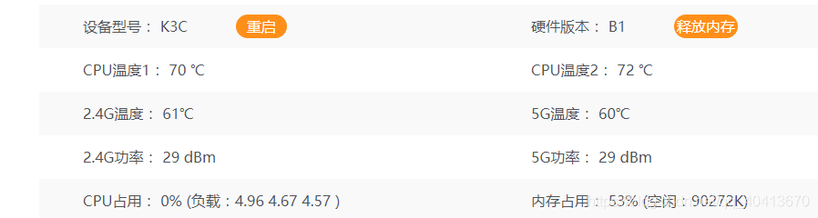
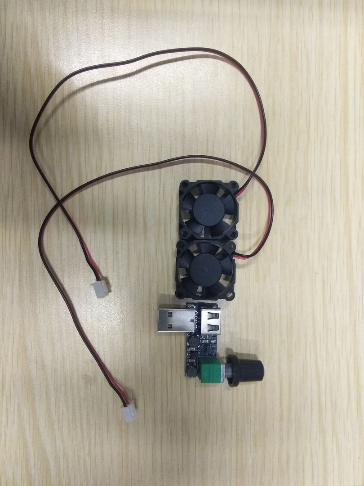
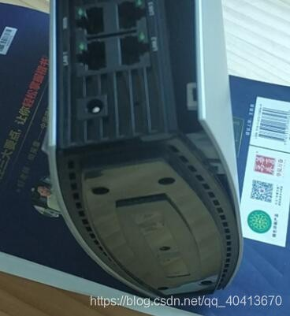
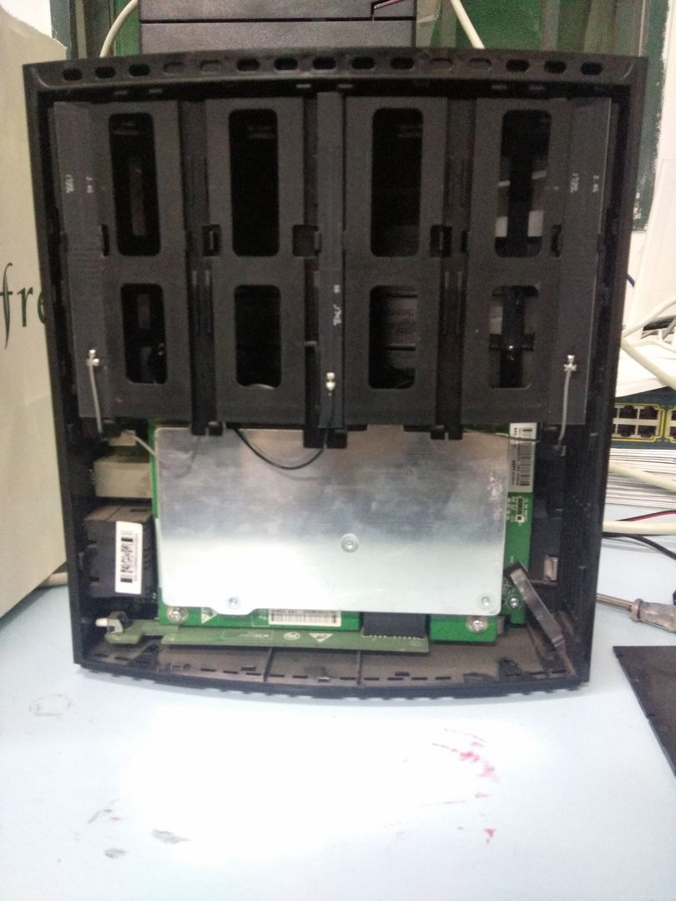
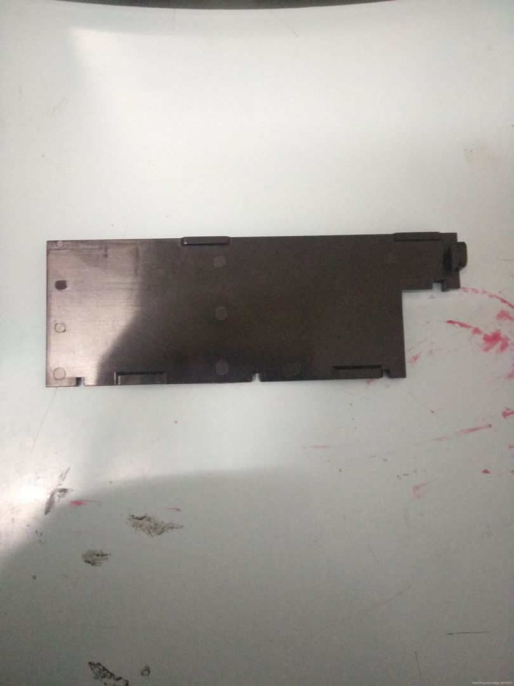
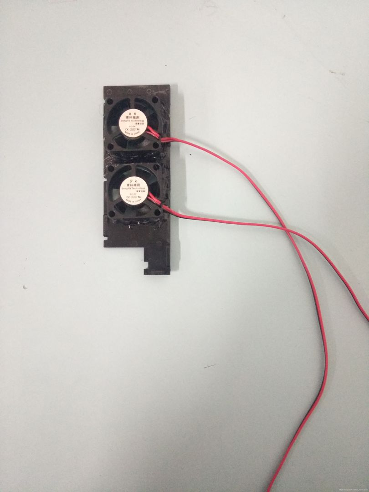
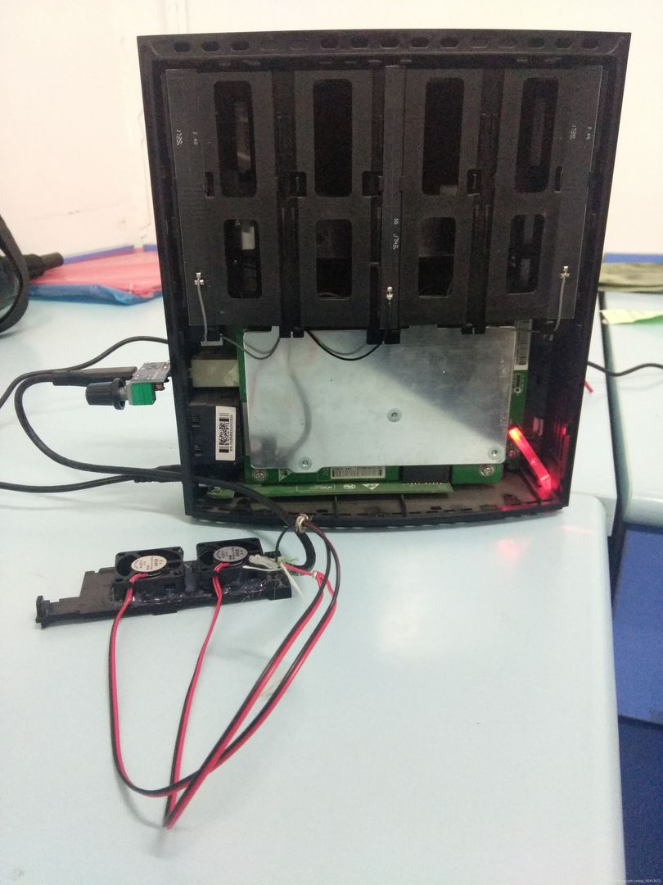
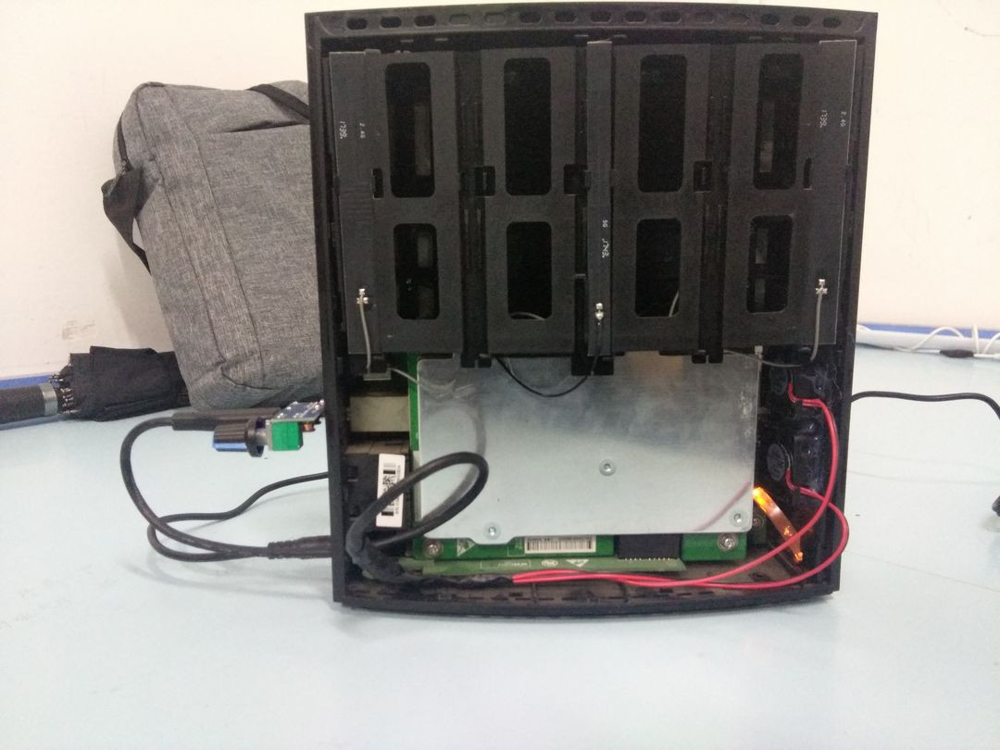
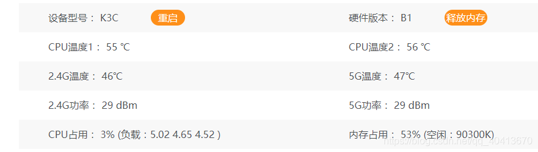
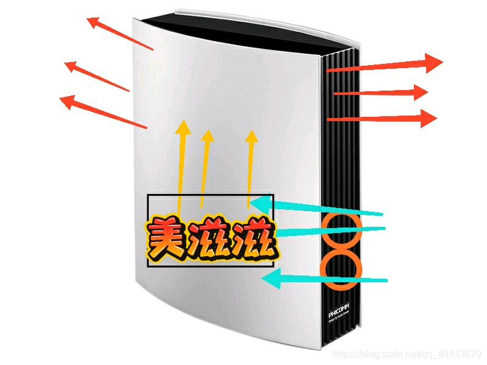

# 斐讯K3C改散热
斐讯`K3C`日常使用还是不错的，就是日常的温度还是比较高的，不过冬天用来当暖手宝还是不错的。



这个改散热的方法是跟贴吧老哥学的，不得不说贴吧老哥还是牛皮，[原贴在这](https://tieba.baidu.com/p/6599983651)，我当时拍的照片不够，有些地方还得借用贴吧老哥的图。  
首先买好3cm的小风扇还有调速器，再加一跟`USB`线。



首先我们要把`K3C`的外壳拆掉，路由器的下边脚垫揭下来后有四个螺丝，只需要卸下来背面的俩螺丝就行了，背面就是没有`interl`喷漆的那一面，我在拆的时候掰断了好几个卡扣，这就比较尴尬，不过要无损地去拆也是比较难的，硬拆就完事了。





拆下来之后右边有个遮光片，正好把这个遮光片拿下来用来固定风扇。



这个遮光片特别厚，在这上边扣俩洞可是废了我很大劲，用刀子割的话不太容易弄，我是用磨具硬生生磨出来了两个洞，在之后就是用胶枪把两个风扇沾到这个遮光片上，我是让他从外部向内吹风的，粘的时候别弄反了。



之后就是把线截断接`USB`线上了，要并联，串分压并分流，通常`USB`的红线和黑线分别是正负极，和风扇上的正负极对起来即可。在`K3C`外部有一个`USB`的插口，将调速器插上之后把`USB`线往内部引，我是用钻头打了个洞，正好插进去`USB`线，我用的这个`USB`比较粗所以插得比较费劲。



之后把遮光板插上就行了，在之后把外壳装上就完事了。



打开风扇之后散热效果还是比较明显的，不过也是有一些噪音的，大概`30%`的转速下能降温十多度。



风道偷一下贴吧老哥的图。



## Blog

```
https://github.com/WindRunnerMax
```
