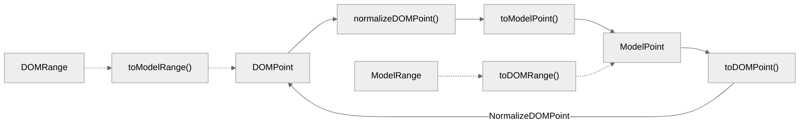

# Synchronizing Browser Selection with Editor Selection Model

Previously, we implemented basic browser selection operations based on the `Range` and `Selection` objects, and designed two selection models `RawRange` and `Range` based on the editor's data model. Here we need to associate browser selection with editor selection to determine the operation range when applying changes, essentially needing controlled selection synchronization based on the `DOM`.

- Open Source Repository: <https://github.com/WindRunnerMax/BlockKit>
- Online Editor: <https://windrunnermax.github.io/BlockKit/>
- Project Notes: <https://github.com/WindRunnerMax/BlockKit/blob/master/NOTE.md>

<details>
<summary><strong>Implementing a Rich Text Editor from Scratch Series</strong></summary>

- [Feeling utterly unskilled, I'm planning to try building a rich text editor from scratch](./从零设计实现富文本编辑器.md)
- [Implementing a Rich Text Editor from Scratch #2 - MVC Pattern-Based Editor Architecture Design](./基于MVC模式的编辑器架构设计.md)
- [Implementing a Rich Text Editor from Scratch #3 - Delta-Based Linear Data Structure Model](./基于Delta的线性数据结构模型.md)
- [Implementing a Rich Text Editor from Scratch #4 - Core Interaction Strategies for Browser Selection Model](./浏览器选区模型的核心交互策略.md)
- [Implementing a Rich Text Editor from Scratch #5 - State Structure Representation of Editor Selection Model](./编辑器选区模型的状态结构表达.md)
- [Implementing a Rich Text Editor from Scratch #6 - Synchronization of Browser and Editor Selection Models](./浏览器选区与编辑器选区模型同步.md)
- [Implementing a Rich Text Editor from Scratch #7 - Semi-Controlled Input Mode Based on Composite Events](./基于组合事件的半受控输入模式.md)
- [Implementing a Rich Text Editor from Scratch #8 - Uncontrolled DOM Behavior in Browser Input Mode](./浏览器输入模式的非受控DOM行为.md)
- [Implementing a Rich Text Editor from Scratch #9 - Controlled Handling of Editor Text Structure Changes](./编辑器文本结构变更的受控处理.md)
- [Implementing a Rich Text Editor from Scratch #10 - Pattern Extension of React View Layer Adapter](./React视图层适配器的模式扩展.md)
- [Implementing a Rich Text Editor from Scratch #11 - Immutable State Management and Incremental Rendering](./Immutable状态维护与增量渲染.md)

</details>

## Overview
The main goal currently is to synchronize the browser selection with the editor selection model, aiming to achieve controlled `DOM` selection synchronization. In reality, there are many considerations to be made here. `DOM` nodes are quite complex, especially in supporting plugin-based rendering modes. How to normalize them and address issues like controlled rendering with `ContentEditable` are key aspects to ponder.

Let's first tackle the simplest selection synchronization issue, focusing on selecting text nodes. To illustrate text selection operations in browsers, in the example below, we can retrieve the position of the text fragment `23`. Here, `firstChild` represents a `Text` node, a node type with a value of `Node.TEXT_NODE`, enabling calculation of the text content fragment.

```html
<span id="$1">123456</span>
<script>
  const range = document.createRange();
  range.setStart($1.firstChild, 1);
  range.setEnd($1.firstChild, 3);
  console.log(range.getBoundingClientRect());
</script>
```

In the editor selection model, we have defined `Range` and `RawRange` objects to represent the editor's selection state. The design of `RawRange` objects aligns with the selection design of the `Quill` editor. Since selection design typically relies on data structure design, `RawPoint` objects directly maintain the initial offset value.

```js
export class RawPoint {
  constructor(
    /** Initial offset */
    public offset: number
  ) {}
}

export class RawRange {
  constructor(
    /** Starting point */
    public start: number,
    /** Length */
    public len: number
  ) {}
}
```

The `Range` object selection design is directly based on the editor's state implementation. It uses the `Point` object to maintain line index and inline offset, while the `Range` object preserves the starting and ending points of the selection. The interval in the `Range` object always points from `start` to `end`, with `isBackward` marking whether the selection is reversed.

```js
export class Point {
  constructor(
    /** Line index */
    public line: number,
    /** Inline offset */
    public offset: number
  ) {}
}

export class Range {
  /** Selection starting point */
  public readonly start: Point;
  /** Selection ending point */
  public readonly end: Point;
  /** Selection direction reverse */
  public isBackward: boolean;
  /** Selection collapse state */
  public isCollapsed: boolean;
}
```

The primary objective of selection synchronization here is to utilize `ContentEditable` for content input and leverage the browser's selection model for text selection effects, without the need for additional maintenance of `input` for input handling or custom selection for text selection effects. Therefore, relying on more browser capabilities necessitates a substantial amount of logic to achieve controlled model synchronization.

Throughout this process, we need to accomplish bidirectional conversion. When the browser selection changes, we must obtain the latest `DOM` selection and convert it to the `Model` selection. Conversely, in scenarios like editor content changes or setting selections actively, we need to convert the editor selection to the browser selection and apply it to the `DOM` nodes.



Our editor is essentially aimed at achieving a structure similar to `slate`. We want the core logic to be separate from the view, so the implementation of selection and rendering needs to be done within the `react` package. The related state management is handled within the core logic. Here we can refer to the selection implementation in `quill` and `slate`, and summarize the following implementations:

- Both `slate` and `quill` focus more on handling points like `Point`. In `quill`, the final step is to subtract points to obtain the length. But before this final step, the concept of `Point` is being processed, as browser selections are also based on `Anchor` and `Focus` points. Hence, the implementation needs to inherit this concept.
- Both `slate` and `quill` normalize the browser selection to align it with text nodes and calculate offsets. Since rich text predominantly revolves around text nodes, this normalization is crucial for correct offset calculation.
- In `quill`, which has a custom view layer, nodes are maintained within `Blot`. Hence, mapping the browser selection to `quill` selection is relatively straightforward. On the other hand, `slate` uses `React` for the view layer, making the mapping process more complex. Therefore, in `slate`, you will see many nodes resembling `data-slate-leaf`, used by `slate` for calculations, not just for selections.
- During selection changes, traversing all nodes to find the target or to calculate positions for constructing a `Range` is inefficient. Hence, a mapping is needed during rendering, where real DOM nodes are mapped to objects containing key, offset, length, etc. This is where `WeakMap` comes in handy, allowing direct retrieval of node information using the DOM node as a key.

## Synchronizing Browser Selection
First, we implement the logic of synchronizing the browser selection with the editor selection, referred to as `DOM` selection and `Model` selection. Since we call it `DOM` selection, we must base it on DOM nodes to retrieve selection information. Handling selection for text nodes, commonly found in a `ContentEditable` state, is straightforward. It involves getting a `StaticRange` object from `Selection` and converting it to a `Model` selection based on the editor's built-in state.
For non-text node selections, especially in scenarios involving mixed media content like images or videos, handling selection positions can be more complex. Similarly, dealing with collapsed or reversed selections requires proper marking and consideration when converting them from `DOM` to `Model` selections.
Moreover, ensuring compatibility with various browser events like double-clicking to select words or triple-clicking to adjust selections on different nodes is crucial. Handling scenarios where modifier keys like `alt` are pressed along with movement keys or deleting content also requires attention.

Starting from the `OnSelectionChange` event callback, we need to extract the `Selection` object and the static range object. Note that browsers like Firefox support multiple selection segments, which needs proper handling, especially focusing on the initial segment.

```js
// packages/core/src/selection/utils/dom.ts
const selection = window.getSelection();
if (!selection || !selection.anchorNode || !selection.focusNode) {
  return null;
}
let range = null;
if (selection.rangeCount >= 1) {
  range = selection.getRangeAt(0);
}
if (!range) {
  const compatibleRange = document.createRange();
  compatibleRange.setStart(selection.anchorNode, selection.anchorOffset);
  compatibleRange.setEnd(selection.focusNode, selection.focusOffset);
  range = compatibleRange;
}
return range;
```

Next, we need to determine if the current selection is inside the editor container node because if the selection is not within the editor, we should ignore it. Then, we need to check if the current selection needs to be in a backward state, and this check is straightforward since the nodes and offsets provided by the `Selection` object and `Range` objects are consistent, so we just need to check their equivalence.

```js
// packages/core/src/selection/utils/dom.ts
const isBackwardDOMRange = (selection, staticRange) => {
  if (!selection || !staticRange) return false;
  const { anchorNode, anchorOffset, focusNode, focusOffset } = selection;
  const { startContainer, startOffset, endContainer, endOffset } = staticRange;
  return (
    anchorNode !== startContainer ||
    anchorOffset !== startOffset ||
    focusNode !== endContainer ||
    focusOffset !== endOffset
  );
};
// packages/core/src/selection/index.ts
const { startContainer, endContainer, collapsed } = staticRange;
if (!root.contains(startContainer)) {
  return void 0;
}
if (!collapsed && !root.contains(endContainer)) {
  return void 0;
}
const isBackward = isBackwardDOMRange(selection, staticRange);
```

Now, we move on to the crucial part — the `Range` object is implemented based on `Node` nodes, in other words, the `Range` object is similar to the mathematical definition of intervals, based on the starting node. Therefore, we need to handle the conversion of the selection based on nodes, normalize the selection nodes, and transform them into model nodes. We will look into how to handle a collapsed selection as an example.

```js
// packages/core/src/selection/utils/native.ts
const { startContainer, endContainer, collapsed, startOffset, endOffset } = staticRange;
const domPoint = { node: startContainer, offset: startOffset };
const anchorDOMPoint = normalizeDOMPoint(domPoint, {
  isCollapsed: true,
  isEndNode: false,
});
const startRangePoint = toModelPoint(editor, anchorDOMPoint, {
  isCollapsed: true,
  isEndNode: false,
  nodeContainer: startContainer,
  nodeOffset: startOffset,
});
const endRangePoint = startRangePoint.clone();
return new Range(startRangePoint, endRangePoint, isBackward);
```

The `normalizeDOMPoint` method is used to standardize and handle nodes because `DOM` nodes can be of various types and complexities. We need to handle these cases, especially for non-text node types. For pure text selection types, usually, we only need to map the model selection nodes through rendering the corresponding node state.

When dealing with non-text selection nodes, we need a relatively more complex handling approach. First, we must clarify the design of our editor's selection nodes. For nodes such as images, we position a zero-width character text node to place the cursor. This enables us to standardize the processing. Similarly, for line break nodes, we also use zero-width characters for processing, like how Typora uses the `<br>` node for handling.

Clearly, if a non-text node is selected, we need to locate the internally marked zero-width character nodes. In such cases, we can only handle this iteratively until we reach the target node. In theory, for non-text nodes, the browser's selection falls on the outermost `contenteditable=false` node. Thus, considering hierarchical searching should suffice.

```js
// packages/core/src/selection/utils/native.ts
let { node, offset } = domPoint;
const { isCollapsed, isEndNode } = context;
// Here, if the node is a non-Text node, we need to move the selection to a Text node
// such as block nodes, Void, Leaf nodes
if (isDOMElement(node) && node.childNodes.length) {
  // The offset of the selection node can be the rightmost insertion point, with the offset being the total nodes before it
  let isLast = offset === node.childNodes.length;
  let index = isLast ? offset - 1 : offset;
  [node, index] = getEditableChildAndIndex(
    node,
    index,
    isLast ? DIRECTION.BACKWARD : DIRECTION.FORWARD
  );
  // If the new index is less than the selection offset, we should start searching from the end of the new node
  // Note that the offset and the searched index are both child nodes of the node, so they can be compared
  isLast = index < offset;
  // If it's still a non-text node, continue hierarchical searching
  while (isDOMElement(node) && node.childNodes.length) {
    const i = isLast ? node.childNodes.length - 1 : 0;
    [node] = getEditableChildAndIndex(node, i, isLast ? DIRECTION.BACKWARD : DIRECTION.FORWARD);
  }
  offset = isLast && node.textContent !== null ? node.textContent.length : 0;
}
return { node, offset };
```

The `getEditableChildAndIndex` method is used to iterate through all child nodes to find a nearby editable node and index in the `parent`. Additionally, this method prioritizes the search direction; when both forward and backward searches are unsuccessful, it can only return the last searched node and index.

```js
// packages/core/src/selection/utils/dom.ts
const { childNodes } = parent;
let child = childNodes[index];
let i = index;
let triedForward = false;
let triedBackward = false;
// Continue to search for the next editable node if the current node is a comment/empty element node/non-editable element node
while (
  isDOMComment(child) ||
  (isDOMElement(child) && child.childNodes.length === 0) ||
  (isDOMElement(child) && child.getAttribute(EDITABLE) === "false")
) {
  if (triedForward && triedBackward) {
    break;
  }
  if (i >= childNodes.length) {
    triedForward = true;
    i = index - 1;
    // <- backward search -1
    direction = DIRECTION.BACKWARD;
    continue;
  }
  if (i < 0) {
    triedBackward = true;
    i = index + 1;
    // -> forward search +1
    direction = DIRECTION.FORWARD;
    continue;
  }
  child = childNodes[i];
  index = i;
  // +1: forward search -1: backward search
  const increment = direction === DIRECTION.FORWARD ? 1 : -1;
  i = i + increment;
}
return [child, index];
```

As for the `toModelPoint` method, it is responsible for transforming the standardized `DOMPoint` node into a `ModelPoint`. In this method, we need to retrieve the `data-leaf` and `data-node` nodes that mark the rendering model based on the text node. These nodes are essentially used for state mapping. Once we have the state representation, we can then calculate the model selection.

```js
// packages/core/src/selection/utils/native.ts
const { offset, node } = domPoint;
const leafNode = getLeafNode(node);
let lineIndex = 0;
let leafOffset = 0;
const lineNode = getLineNode(leafNode);
const lineModel = editor.model.getLineState(lineNode);
// COMPAT: When there is no LineModel, the selection will be placed at the beginning of BlockState
if (lineModel) {
  lineIndex = lineModel.index;
}
const leafModel = editor.model.getLeafState(leafNode);
// COMPAT: When there is no LeafModel, the selection will be placed at the beginning of the Line
if (leafModel) {
  leafOffset = leafModel.offset + offset;
}
// ... Handle special node scenarios
return new Point(lineIndex, leafOffset);
```

In the case of handling special `Cases` mentioned above, let's first address the end-of-line `\n` node type. When the current node is `data-zero-enter`, it needs to be adjusted to the end of the previous node. The reason behind this adjustment is to rectify the offset discrepancies resulting from calculating the selection. While there should be only one position for a cursor point, the `\n` node technically offers two positions, leading to an additional offset. Hence, the extra handling is necessary.

```js
// packages/core/src/selection/utils/model.ts
// Case 1: When the current node is data-zero-enter, it needs to be adjusted to the end of the previous node
// content\n[caret] => content[caret]\n
const isEnterZero = isEnterZeroNode(node);
if (isEnterZero && offset) {
  leafOffset = Math.max(leafOffset - 1, 0);
  return new Point(lineIndex, leafOffset);
}
```

In fact, there is another interesting issue here. Our goal is to standardize the handling of cursor points within the editor as plain text. Nodes like those in Typora, which use `<br>` for line breaks instead of zero-width characters, only have a single insert value of `0`. This discrepancy arises from the inherent design differences of editors, necessitating varied `DOM` format handling.

Thus far, we have implemented the logic to convert browser nodes in plain text to the editor's selection model. Of course, many details and special `Case` handling are omitted here, especially in the `toModelPoint` method. As for non-text nodes, such as images or video nodes, we will delve into their treatment when implementing `Void` nodes subsequently.

## Editor Selection Synchronization
When the browser selection changes are synchronized with the editor's selection, the synchronization of the selection is not yet complete. Even though we seem to have calculated the model selection position based on the browser selection, it might not be the precise position needed. Given that we are dealing with input content in the editor, it is essential to ensure that the selection/cursor is at the controlled position.

While perceiving the position solely in the model selection might suffice for read-only mode, it falls short when inputting content in editing mode. In this case, we need to synchronize the model selection position with the desired `DOM` nodes to uphold the controlled principle. Additionally, features like input cursor tracking and inline toolbar all rely on the capability to actively set the selection.

Thus, the flow transitions to browser selection change -> editor selection change -> browser selection setting. Here, we easily encounter a problem where the selection setting becomes a loop; browser change triggers editor selection setting, which then alters the browser selection, resulting in continued selection synchronization. To address this, we need to introduce a condition to prevent setting the selection when there is no change.

```js
// packages/core/src/selection/index.ts
const sel = toDOMRange(this.editor, range);
if (!sel || !sel.startContainer || !sel.endContainer) {
  this.editor.logger.warning("Invalid DOM Range", sel, range);
  selection.removeAllRanges();
  return false;
}
const currentStaticSel = getStaticSelection(selection);
if (isEqualDOMRange(sel, currentStaticSel)) {
  return true;
}
// ...

However, this alone is not enough to address all issues. There are many default behaviors and operations in the browser to handle selections. For example, we can quickly move the cursor by dragging it, which continuously triggers the `selection` change event. If we keep setting selections while also moving the selection with mouse cursor, it will result in a high volume of events being executed. Therefore, we need to limit the execution.

```js
// packages/core/src/selection/index.ts
/**
 * Check the limit of execution times during time slice
 */
protected limit() {
  const now = Date.now();
  // If the time elapsed since the last record exceeds 500ms, reset the execution count
  if (now - this.lastRecord >= 500) {
    this.execution = 0;
    this.lastRecord = now;
  }
  // If the execution count exceeds the limit of 100 times, the execution needs to be interrupted
  if (this.execution++ >= 100) {
    this.editor.logger.error("Selection Exec Limit", this.execution);
    return true;
  }
  return false;
}
```

Of course, fundamentally, it is due to dragging the mouse to move the selection, causing the selection to be continuously reset and conflicting with the selection synchronized with us. Thus, we can avoid actively setting the selection in the state after the mouse is pressed. Additionally, since releasing the mouse button may not necessarily result in a change in selection, we need to set the selection again when the mouse button is released.

```js
// packages/core/src/selection/index.ts
public updateDOMSelection(force = false) {
  const range = this.current;
  if (!range || this.editor.state.get(EDITOR_STATE.COMPOSING)) {
    return false;
  }
  // ...
}

/**
 * Forcefully update the browser selection
 */
@Bind
protected onForceUpdateDOMSelection() {
  if (!this.editor.state.get(EDITOR_STATE.FOCUS)) {
    return void 0;
  }
  this.updateDOMSelection(true);
}
```

After discussing the synchronization logic between the browser selection and the editor selection, let's implement the `toDOMRange` method to convert `ModelRange` into `DOMRange`. In practice, the implementation here may not be as complex as `toModelRange` because our model range is in a simple format, unlike the complex DOM structure, and the actual corresponding DOM is controlled by the state module.

```js
// packages/core/src/selection/utils/native.ts
/**
 * Convert ModelRange to DOMRange
 * @param editor
 * @param range
 */
export const toDOMRange = (editor: Editor, range: Range): DOMRange | null => {
  const { start, end } = range;
  const startDOMPoint = toDOMPoint(editor, start);
  const endDOMPoint = range.isCollapsed ? startDOMPoint : toDOMPoint(editor, end);
  if (!startDOMPoint.node || !endDOMPoint.node) {
    return null;
  }
  const domRange = window.document.createRange();
  // The selection direction is always from start to end
  const { node: startNode, offset: startOffset } = startDOMPoint;
  const { node: endNode, offset: endOffset } = endDOMPoint;
  const startTextNode = getTextNode(startNode);
  const endTextNode = getTextNode(endNode);
  if (startTextNode && endTextNode) {
    domRange.setStart(startTextNode, Math.min(startOffset, startTextNode.length));
    domRange.setEnd(endTextNode, Math.min(endOffset, endTextNode.length));
    return domRange;
  }
  return null;
};
```

The `toDOMPoint` method is a rather complex implementation. We need to fetch the current line state and leaf state from the editor's status module and then obtain the corresponding `DOM` based on the state mapping. The mapping of `DOM` nodes here is established in the `react` package, which essentially deals with `DOM` related implementations, forming part of the design rules we must adhere to.

```js
// packages/react/src/model/line.tsx
const LineView: FC<{ editor: Editor; index: number; lineState: LineState; }> = props => {
  const { editor, lineState } = props;
  const setModel = (ref: HTMLDivElement | null) => {
    if (ref) {
      editor.model.setLineModel(ref, lineState);
    }
  };
  return (
    <div
      {...{ [NODE_KEY]: true }}
      ref={setModel}
      dir="auto"
      className={cs(runtime.classList)}
      style={runtime.style}
    >
      {runtime.children}
    </div>
  );
}
```

```js
// packages/react/src/model/leaf.tsx
const LeafView: FC<{ editor: Editor; index: number; leafState: LeafState; }> = props => {
  const { editor, leafState } = props;
  const setModel = (ref: HTMLSpanElement | null) => {
    if (ref) {
      editor.model.setLeafModel(ref, leafState);
    }
  };
  return (
    <span
      {...{ [LEAF_KEY]: true }}
      ref={setModel}
      className={runtime.classList.join(" ")}
      style={runtime.style}
    >
      {runtime.children}
    </span>
  );
};
```

By mapping states to nodes, we can access their corresponding nodes. However, the retrieved nodes may not always be reliable, so some fallback measures are required. The subsequent logic involves finding all leaf node containers `DOM` based on the `LineNode`, then calculating offsets according to the text length of each leaf node to determine the corresponding node and offset position.

```js
// packages/core/src/selection/utils/native.ts
export const toDOMPoint = (editor: Editor, point: Point): DOMPoint => {
  const { line, offset } = point;
  const blockState = editor.state.block;
  const lineState = blockState && blockState.getLine(line);
  // Here theoretically we can add logic to find the nearest LineNode from the DOM
  // This can prevent node search issues caused by immediate selection update after content modification
  const lineNode = editor.model.getLineNode(lineState);
  if (!lineNode) {
    return { node: null, offset: 0 };
  }
  if (isDOMText(lineNode)) {
    return { node: lineNode, offset: offset };
  }
  const selector = `span[${LEAF_STRING}], span[${ZERO_SPACE_KEY}]`;
  // Nodes marked with all text types, the search method here tends to favor the left node
  const leaves = Array.from(lineNode.querySelectorAll(selector));
  let start = 0;
  for (let i = 0; i < leaves.length; i++) {
    const leaf = leaves[i];
    if (!leaf || leaf instanceof HTMLElement === false || leaf.textContent === null) {
      continue;
    }
    // The length of the Leaf node, which is the actual offset that the offset cares about
    let len = leaf.textContent.length;
    if (leaf.hasAttribute(ZERO_SPACE_KEY)) {
      // First handle it as 1 universally, at this time the length should not be 0, the specific length needs to check the fake len
      // There may be cases where the IME destroys the content of the node, in this case directly taking the text len is unreliable
      len = 1;
    }
    const end = start + len;
    if (offset <= end) {
      // The Offset here will be handled as an offset relative to the current node
      // For example: text1text2 offset: 7 -> text1te|xt2
      // current node is text2 -> start = 5
      // end = 5(start) + 5(len) = 10
      // offset = 7 < 10 -> new offset = 7(offset) - 5(start) = 2
      const nodeOffset = Math.max(offset - start, 0);
      return { node: leaf, offset: nodeOffset };
    }
    start = end;
  }
  return { node: null, offset: 0 };
};
```

When setting the editor selection, we need to separate the logic for setting the model selection and setting the browser selection. The main reason for this design is that we can handle the DOM selection changes after the browser in batches. Also, when inputting content, we will uniformly handle selection changes when applying, and then update the DOM selection after asynchronous rendering in the view layer.

```js
// packages/core/src/selection/index.ts
/**
 * Update selection model
 * @param range Selection range
 * @param force [?=false] Whether to force update browser selection
 */
public set(range: Range | null, force = false): void {
  if (Range.equals(this.current, range)) {
    this.current = range;
    // [cursor]\n Status aligned by right arrow Model but not by DOM
    // Therefore, even if the selection has not changed, we still need to update the DOM selection in force mode
    force && this.updateDOMSelection();
    return void 0;
  }
  this.previous = this.current;
  this.current = range;
  this.editor.logger.debug("Selection Change", range);
  this.editor.event.trigger(EDITOR_EVENT.SELECTION_CHANGE, {
    previous: this.previous,
    current: this.current,
  });
  if (force) {
    this.updateDOMSelection();
  }
}
```

So far, we have converted the editor's selection model to specific `DOM` nodes and offsets in the browser, so we can now set it on the browser using browser `API`. The logic handling that follows needs to be based on the selection scenarios, execution constraints mentioned at the beginning, and a lot of `Case` handling, which we will describe later.

```js
// packages/core/src/selection/index.ts
const { startContainer, startOffset, endContainer, endOffset } = sel;
// Backward here is based on Range state
if (range.isBackward) {
  selection.setBaseAndExtent(endContainer, endOffset, startContainer, startOffset);
} else {
  selection.setBaseAndExtent(startContainer, startOffset, endContainer, endOffset);
}
```

## Summary
Previously, we implemented basic selection operations based on browser's selection `API`, and designed an editor model selection expression based on editor state to define the operation range when applying changes in the editor. Here, we have implemented bidirectional synchronization between editor selection and model selection to achieve controlled selection operations, which is a crucial foundational capability in the editor.

Next, on top of the editor selection module, we need to implement content input in the editor based on browser's `BeforeInput` event and `Compositing` related events. Editor input is a complex issue that requires handling of the complex default behavior of `ContentEditable` DOM structure, as well as compatibility with various input scenarios of IME input methods.

## Daily Challenge

- <https://github.com/WindRunnerMax/EveryDay>

## References

- <https://quilljs.com/docs/api#selection>
- <https://lexical.dev/docs/concepts/selection>
- <https://docs.slatejs.org/concepts/03-locations#selection>
```