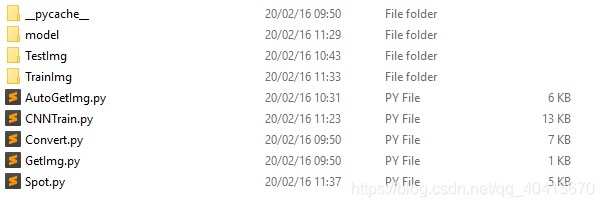

# 强智教务系统验证码识别 Tensorflow CNN

> 一直都是使用API取得数据，但是API提供的数据较少，且为了防止API关闭，先把验证码问题解决  
> 使用Tensorflow训练模型，强智教务系统的验证码还是比较简单的，不用CNN一样可以识别的很好，使用CNN也算是重新温习一下CNN  
> 训练集3109张，测试集128张，训练1600次，ACC为99%，实际测试准确率98%左右  
> 代码与模型 https://github.com/WindrunnerMax/SWVerifyCode 

##### 目录结构



##### 准备工作
首先需要手打码，自动获取验证码，并在powershell手动输入验证码，注意目录中的文件夹需要手动建立
引入`Convert`是为了处理图片，二值化并降噪
手工打200多张验证码，然后开始训练，设置的停止条件低一些，ACC到50%就停止训练
获取一定准确率的模型后再自动获取训练集，再训练，重复过程提高准确率
我重复上述过程三次，最后一次吃了个饭，得到了大约3000张图片的训练集


`GetImg.py`手动打码

```python
import requests
import cv2
import numpy as np
import sys
from Convert import Convert

class GetImg(object):
    """docstring for GetImg"""
    def __init__(self):
        super(GetImg, self).__init__()
    
    def run(self):
        count = 1
        cvt = Convert()
        while True:
            print("第",count,"张")
            req = requests.get("http://xxxxxx/verifycode.servlet")
            with open("pv.jpg",'wb') as fb: 
                fb.write(req.content)
            img = cvt.run(req.content)
            cv2.imwrite("v.jpg",img)
            mark = input()
            if mark == "" : continue;
            count += 1
            cv2.imwrite("TrainImg/%s.jpg" % (mark),img)

if __name__ == '__main__':
    GetImg().run()
```

`Convert.py`预处理图片

```python
import cv2
import numpy as np

class Convert(object):
    """docstring for Convert"""
    def __init__(self):
        super(Convert, self).__init__()
    
    def _get_dynamic_binary_image(self,img):
        '''
        自适应阀值二值化
        '''
        img = cv2.imdecode(np.frombuffer(img, np.uint8), cv2.IMREAD_COLOR)
        img = cv2.cvtColor(img,cv2.COLOR_BGR2GRAY)
        th1 = cv2.adaptiveThreshold(img, 255, cv2.ADAPTIVE_THRESH_GAUSSIAN_C, cv2.THRESH_BINARY, 21, 1)
        return th1

    def clear_border(self,img):
        '''去除边框
        '''
        h, w = img.shape[:2]
        for y in range(0, w):
            for x in range(0, h):
              # if y ==0 or y == w -1 or y == w - 2:
              if y < 4 or y > w -4:
                img[x, y] = 255
              # if x == 0 or x == h - 1 or x == h - 2:
              if x < 4 or x > h - 4:
                img[x, y] = 255
        return img

    def interference_line(self,img):
        '''
        干扰线降噪
        '''
        h, w = img.shape[:2]
        # ！！！opencv矩阵点是反的
        # img[1,2] 1:图片的高度，2：图片的宽度
        for y in range(1, w - 1):
            for x in range(1, h - 1):
              count = 0
              if img[x, y - 1] > 245:
                count = count + 1
              if img[x, y + 1] > 245:
                count = count + 1
              if img[x - 1, y] > 245:
                count = count + 1
              if img[x + 1, y] > 245:
                count = count + 1
              if count > 2:
                img[x, y] = 255
        return img

    def interference_point(self,img, x = 0, y = 0):
        """点降噪
        9邻域框,以当前点为中心的田字框,黑点个数
        :param x:
        :param y:
        :return:
        """
        # todo 判断图片的长宽度下限
        cur_pixel = img[x,y]# 当前像素点的值
        height,width = img.shape[:2]

        for y in range(0, width - 1):
          for x in range(0, height - 1):
            if y == 0:  # 第一行
                if x == 0:  # 左上顶点,4邻域
                    # 中心点旁边3个点
                    sum = int(cur_pixel) \
                          + int(img[x, y + 1]) \
                          + int(img[x + 1, y]) \
                          + int(img[x + 1, y + 1])
                    if sum <= 2 * 245:
                      img[x, y] = 0
                elif x == height - 1:  # 右上顶点
                    sum = int(cur_pixel) \
                          + int(img[x, y + 1]) \
                          + int(img[x - 1, y]) \
                          + int(img[x - 1, y + 1])
                    if sum <= 2 * 245:
                      img[x, y] = 0
                else:  # 最上非顶点,6邻域
                    sum = int(img[x - 1, y]) \
                          + int(img[x - 1, y + 1]) \
                          + int(cur_pixel) \
                          + int(img[x, y + 1]) \
                          + int(img[x + 1, y]) \
                          + int(img[x + 1, y + 1])
                    if sum <= 3 * 245:
                      img[x, y] = 0
            elif y == width - 1:  # 最下面一行
                if x == 0:  # 左下顶点
                    # 中心点旁边3个点
                    sum = int(cur_pixel) \
                          + int(img[x + 1, y]) \
                          + int(img[x + 1, y - 1]) \
                          + int(img[x, y - 1])
                    if sum <= 2 * 245:
                      img[x, y] = 0
                elif x == height - 1:  # 右下顶点
                    sum = int(cur_pixel) \
                          + int(img[x, y - 1]) \
                          + int(img[x - 1, y]) \
                          + int(img[x - 1, y - 1])

                    if sum <= 2 * 245:
                      img[x, y] = 0
                else:  # 最下非顶点,6邻域
                    sum = int(cur_pixel) \
                          + int(img[x - 1, y]) \
                          + int(img[x + 1, y]) \
                          + int(img[x, y - 1]) \
                          + int(img[x - 1, y - 1]) \
                          + int(img[x + 1, y - 1])
                    if sum <= 3 * 245:
                      img[x, y] = 0
            else:  # y不在边界
                if x == 0:  # 左边非顶点
                    sum = int(img[x, y - 1]) \
                          + int(cur_pixel) \
                          + int(img[x, y + 1]) \
                          + int(img[x + 1, y - 1]) \
                          + int(img[x + 1, y]) \
                          + int(img[x + 1, y + 1])

                    if sum <= 3 * 245:
                      img[x, y] = 0
                elif x == height - 1:  # 右边非顶点
                    sum = int(img[x, y - 1]) \
                          + int(cur_pixel) \
                          + int(img[x, y + 1]) \
                          + int(img[x - 1, y - 1]) \
                          + int(img[x - 1, y]) \
                          + int(img[x - 1, y + 1])

                    if sum <= 3 * 245:
                      img[x, y] = 0
                else:  # 具备9领域条件的
                    sum = int(img[x - 1, y - 1]) \
                          + int(img[x - 1, y]) \
                          + int(img[x - 1, y + 1]) \
                          + int(img[x, y - 1]) \
                          + int(cur_pixel) \
                          + int(img[x, y + 1]) \
                          + int(img[x + 1, y - 1]) \
                          + int(img[x + 1, y]) \
                          + int(img[x + 1, y + 1])
                    if sum <= 4 * 245:
                      img[x, y] = 0
        return img 

    def run(self,img):
        # 自适应阈值二值化
        img = self._get_dynamic_binary_image(img)
        # 去除边框
        img = self.clear_border(img)
        # 对图片进行干扰线降噪
        img = self.interference_line(img)
        # 对图片进行点降噪
        img = self.interference_point(img)
        return img
```

##### 训练
我们强智的验证码只有`['1', '2', '3', 'b', 'c', 'm', 'n', 'v', 'x', 'z']`字符
图像大小为 `22 * 62`
学习率设置为 `0.01` 
keep_prob为`0.75`
具体定义CNN在`crack_captcha_cnn`方法注释给出
根据重复的训练，估算 `0.01` 的学习率多少次训练会收敛，ACC能够达到多少，这里设置ACC大于99%停止

`CNNTrain.py` 训练
```python
#!/usr/bin/python 
# -*- coding: utf-8 -*-

#构建CNN，训练分类器

import numpy as np
import tensorflow as tf
import cv2
import os
import random
import time
 
# number
number = ['1', '2', '3', 'b', 'c', 'm', 'n', 'v', 'x', 'z']
 
# 图像大小
IMAGE_HEIGHT = 22  # 80
IMAGE_WIDTH = 62  # 160
MAX_CAPTCHA = 4
 
char_set = number
CHAR_SET_LEN = len(char_set)  #10
 
image_filename_list = []
total = 0
 
train_path = "TrainImg/"
valid_path = "TestImg/"
model_path = "model/"
 
 
def get_image_file_name(imgFilePath):
    fileName = []
    total = 0
    for filePath in os.listdir(imgFilePath):
        captcha_name = filePath.split('/')[-1]
        fileName.append(captcha_name)
        total += 1
    random.seed(time.time())
    # 打乱顺序
    random.shuffle(fileName)
    return fileName, total
 
 
# 获取训练数据的名称列表
image_filename_list, total = get_image_file_name(train_path)
# 获取测试数据的名称列表
image_filename_list_valid, total = get_image_file_name(valid_path)
 
 
# 读取图片和标签
def gen_captcha_text_and_image(imageFilePath, image_filename_list, imageAmount):
    num = random.randint(0, imageAmount - 1)
    img = cv2.imread(os.path.join(imageFilePath, image_filename_list[num]), 0)
    img = cv2.resize(img, (IMAGE_WIDTH, IMAGE_HEIGHT))
    img = np.float32(img)
    text = image_filename_list[num].split('.')[0]
    return text, img
 
 
# 文本转向量
# 例如，如果验证码是 ‘0296’ ，则对应的标签是
# [1 0 0 0 0 0 0 0 0 0
#  0 0 1 0 0 0 0 0 0 0
#  0 0 0 0 0 0 0 0 0 1
#  0 0 0 0 0 0 1 0 0 0]
def text2vec(text):
    text_len = len(text)
    if text_len > MAX_CAPTCHA:
        raise ValueError('验证码最长4个字符')
 
    vector = np.zeros(MAX_CAPTCHA * CHAR_SET_LEN)
 
    def char2pos(c):
        k = -1
        for index, item in enumerate(char_set):
            if c == item : return index
        if(k == -1) : raise ValueError('字符数组中不存在字符' + c);
        return -1
 
    for i, c in enumerate(text):
        idx = i * CHAR_SET_LEN + char2pos(c)
        vector[idx] = 1
    return vector
 
 
# 向量转回文本
def vec2text(vec):
    char_pos = vec.nonzero()[0]
    text = []
    for i, c in enumerate(char_pos):
        text.append(char_set[c % CHAR_SET_LEN])
    return "".join(text)
 
 
# 生成一个训练batch
def get_next_batch(imageFilePath, image_filename_list=None, batch_size=128):
    batch_x = np.zeros([batch_size, IMAGE_HEIGHT * IMAGE_WIDTH])
    batch_y = np.zeros([batch_size, MAX_CAPTCHA * CHAR_SET_LEN])
 
    def wrap_gen_captcha_text_and_image(imageFilePath, imageAmount):
        while True:
            text, image = gen_captcha_text_and_image(imageFilePath, image_filename_list, imageAmount)
            if image.shape == (IMAGE_HEIGHT, IMAGE_WIDTH):
                return text, image
 
    for listNum in os.walk(imageFilePath):
        pass
    imageAmount = len(listNum[2])
 
    for i in range(batch_size):
        text, image = wrap_gen_captcha_text_and_image(imageFilePath, imageAmount)
 
        batch_x[i, :] = image.flatten() / 255  # (image.flatten()-128)/128  mean为0
        batch_y[i, :] = text2vec(text)
 
    return batch_x, batch_y
 
 
####################################################################
# 占位符，X和Y分别是输入训练数据和其标签，标签转换成8*10的向量
X = tf.placeholder(tf.float32, [None, IMAGE_HEIGHT * IMAGE_WIDTH])
Y = tf.placeholder(tf.float32, [None, MAX_CAPTCHA * CHAR_SET_LEN])
# 声明dropout占位符变量
keep_prob = tf.placeholder(tf.float32)  # dropout
 
 
# 定义CNN
def crack_captcha_cnn(w_alpha=0.01, b_alpha=0.1):
    # 把 X reshape 成 IMAGE_HEIGHT*IMAGE_WIDTH*1的格式,输入的是灰度图片，所有通道数是1;
    # shape 里的-1表示数量不定，根据实际情况获取，这里为每轮迭代输入的图像数量（batchsize）的大小;
    x = tf.reshape(X, shape=[-1, IMAGE_HEIGHT, IMAGE_WIDTH, 1])
    

    # 搭建第一层卷积层
    # shape[3, 3, 1, 32]里前两个参数表示卷积核尺寸大小，即patch;
    # 第三个参数是图像通道数，第四个参数是该层卷积核的数量，有多少个卷积核就会输出多少个卷积特征图像
    w_c1 = tf.Variable(w_alpha * tf.random_normal([3, 3, 1, 32]))
    # 每个卷积核都配置一个偏置量，该层有多少个输出，就应该配置多少个偏置量
    b_c1 = tf.Variable(b_alpha * tf.random_normal([32]))
    # 图片和卷积核卷积，并加上偏执量，卷积结果28x28x32
    # tf.nn.conv2d() 函数实现卷积操作
    # tf.nn.conv2d()中的padding用于设置卷积操作对边缘像素的处理方式，在tf中有VALID和SAME两种模式
    # padding='SAME'会对图像边缘补0,完成图像上所有像素（特别是边缘象素）的卷积操作
    # padding='VALID'会直接丢弃掉图像边缘上不够卷积的像素
    # strides：卷积时在图像每一维的步长，是一个一维的向量，长度4，并且strides[0]=strides[3]=1
    # tf.nn.bias_add() 函数的作用是将偏置项b_c1加到卷积结果value上去;
    # 注意这里的偏置项b_c1必须是一维的，并且数量一定要与卷积结果value最后一维数量相同
    # tf.nn.relu() 函数是relu激活函数，实现输出结果的非线性转换，即features=max(features, 0)，输出tensor的形状和输入一致
    conv1 = tf.nn.relu(tf.nn.bias_add(tf.nn.conv2d(x, w_c1, strides=[1, 1, 1, 1], padding='SAME'), b_c1))
    # tf.nn.max_pool()函数实现最大池化操作，进一步提取图像的抽象特征，并且降低特征维度
    # ksize=[1, 2, 2, 1]定义最大池化操作的核尺寸为2*2, 池化结果14x14x32 卷积结果乘以池化卷积核
    conv1 = tf.nn.max_pool(conv1, ksize=[1, 2, 2, 1], strides=[1, 2, 2, 1], padding='SAME')
    # tf.nn.dropout是tf里为了防止或减轻过拟合而使用的函数，一般用在全连接层;
    # Dropout机制就是在不同的训练过程中根据一定概率（大小可以设置，一般情况下训练推荐0.5）随机扔掉（屏蔽）一部分神经元，
    # 不参与本次神经网络迭代的计算（优化）过程，权重保留但不做更新;
    # tf.nn.dropout()中 keep_prob用于设置概率，需要是一个占位变量，在执行的时候具体给定数值
    conv1 = tf.nn.dropout(conv1, keep_prob)
    # 原图像HEIGHT = 22 WIDTH = 62，经过神经网络第一层卷积（图像尺寸不变、特征×32）、池化（图像尺寸缩小一半，特征不变）之后;
    # 输出大小为 11*31*32

    # 搭建第二层卷积层
    w_c2 = tf.Variable(w_alpha * tf.random_normal([3, 3, 32, 64]))
    b_c2 = tf.Variable(b_alpha * tf.random_normal([64]))
    conv2 = tf.nn.relu(tf.nn.bias_add(tf.nn.conv2d(conv1, w_c2, strides=[1, 1, 1, 1], padding='SAME'), b_c2))
    conv2 = tf.nn.max_pool(conv2, ksize=[1, 2, 2, 1], strides=[1, 2, 2, 1], padding='SAME')
    conv2 = tf.nn.dropout(conv2, keep_prob)
    # 经过神经网络第二层运算后输出为 6*16*64 (30*80的图像经过2*2的卷积核池化，padding为SAME，输出维度是6*16)
    
    # 搭建第三层卷积层
    w_c3 = tf.Variable(w_alpha * tf.random_normal([3, 3, 64, 64]))
    b_c3 = tf.Variable(b_alpha * tf.random_normal([64]))
    conv3 = tf.nn.relu(tf.nn.bias_add(tf.nn.conv2d(conv2, w_c3, strides=[1, 1, 1, 1], padding='SAME'), b_c3))
    conv3 = tf.nn.max_pool(conv3, ksize=[1, 2, 2, 1], strides=[1, 2, 2, 1], padding='SAME')
    conv3 = tf.nn.dropout(conv3, keep_prob)
    # 原图像HEIGHT = 22 WIDTH = 62，经过神经网络第一层后输出大小为 11*31*32
    # 经过神经网络第二层运算后输出为 6*16*64 ; 经过第三层输出为 3*8*64，这个参数很重要，决定量后边全连接层的维度
    
    # print(conv3)
    # 搭建全连接层
    # 二维张量，第一个参数3*8*64的patch，这个参数由最后一层卷积层的输出决定，第二个参数代表卷积个数共1024个，即输出为1024个特征
    w_d = tf.Variable(w_alpha * tf.random_normal([3 * 8 * 64, 1024]))
    # 偏置项为1维，个数跟卷积核个数保持一致
    b_d = tf.Variable(b_alpha * tf.random_normal([1024]))
    # w_d.get_shape()作用是把张量w_d的形状转换为元组tuple的形式，w_d.get_shape().as_list()是把w_d转为元组再转为list形式
    # w_d 的 形状是[ 8 * 20 * 64, 1024]，w_d.get_shape().as_list()结果为 8*20*64=10240 ;
    # 所以tf.reshape(conv3, [-1, w_d.get_shape().as_list()[0]])的作用是把最后一层隐藏层的输出转换成一维的形式
    dense = tf.reshape(conv3, [-1, w_d.get_shape().as_list()[0]])
    # tf.matmul(dense, w_d)函数是矩阵相乘，输出维度是 -1*1024
    dense = tf.nn.relu(tf.add(tf.matmul(dense, w_d), b_d))
    dense = tf.nn.dropout(dense, keep_prob)
    # 经过全连接层之后，输出为 一维，1024个向量
 
    # w_out定义成一个形状为 [1024, 8 * 10] = [1024, 80]
    w_out = tf.Variable(w_alpha * tf.random_normal([1024, MAX_CAPTCHA * CHAR_SET_LEN]))
    b_out = tf.Variable(b_alpha * tf.random_normal([MAX_CAPTCHA * CHAR_SET_LEN]))
    # out 的输出为 8*10 的向量， 8代表识别结果的位数，10是每一位上可能的结果（0到9）
    out = tf.add(tf.matmul(dense, w_out), b_out)
    # out = tf.nn.softmax(out)
    # 输出神经网络在当前参数下的预测值
    return out
 
 
# 训练
def train_crack_captcha_cnn():
    output = crack_captcha_cnn()
    # loss
    # loss = tf.reduce_mean(tf.nn.softmax_cross_entropy_with_logits(output, Y))
    # tf.nn.sigmoid_cross_entropy_with_logits()函数计算交叉熵,输出的是一个向量而不是数;
    # 交叉熵刻画的是实际输出（概率）与期望输出（概率）的距离，也就是交叉熵的值越小，两个概率分布就越接近
    # tf.reduce_mean()函数求矩阵的均值
    loss = tf.reduce_mean(tf.nn.sigmoid_cross_entropy_with_logits(logits=output, labels=Y))
    # optimizer 为了加快训练 learning_rate应该开始大，然后慢慢减小
    # tf.train.AdamOptimizer（）函数实现了Adam算法的优化器
    optimizer = tf.train.AdamOptimizer(learning_rate=0.001).minimize(loss)
 
    predict = tf.reshape(output, [-1, MAX_CAPTCHA, CHAR_SET_LEN])
    max_idx_p = tf.argmax(predict, 2)
    max_idx_l = tf.argmax(tf.reshape(Y, [-1, MAX_CAPTCHA, CHAR_SET_LEN]), 2)
    correct_pred = tf.equal(max_idx_p, max_idx_l)
    accuracy = tf.reduce_mean(tf.cast(correct_pred, tf.float32))
    saver = tf.train.Saver()
    with tf.Session() as sess:
        sess.run(tf.global_variables_initializer())
        step = 0
        while True:
            batch_x, batch_y = get_next_batch(train_path, image_filename_list, 64)
            _, loss_ = sess.run([optimizer, loss], feed_dict={X: batch_x, Y: batch_y, keep_prob: 0.75})
            print(step, loss_)
            # 每100 step计算一次准确率
            if step % 100 == 0:
                batch_x_test, batch_y_test = get_next_batch(valid_path, image_filename_list_valid, 128)
                acc = sess.run(accuracy, feed_dict={X: batch_x_test, Y: batch_y_test, keep_prob: 1.})
                print("Predict: " + str(step) + " " + str(acc))
 
                # 训练结束条件
                if acc > 0.99 or step > 3000:
                    saver.save(sess, model_path, global_step=step)
                    break
            step += 1
 
 
def predict_captcha(captcha_image):
    output = crack_captcha_cnn()
 
    saver = tf.train.Saver()
    with tf.Session() as sess:
        saver.restore(sess, tf.train.latest_checkpoint('.'))
 
        predict = tf.argmax(tf.reshape(output, [-1, MAX_CAPTCHA, CHAR_SET_LEN]), 2)
        text_list = sess.run(predict, feed_dict={X: [captcha_image], keep_prob: 1})
 
        text = text_list[0].tolist()
        vector = np.zeros(MAX_CAPTCHA * CHAR_SET_LEN)
        i = 0
        for n in text:
            vector[i * CHAR_SET_LEN + n] = 1
            i += 1
        return vec2text(vector)
 
if __name__ == '__main__':
    train_crack_captcha_cnn()
    print ("FINISH")
    # print(vec2text(text2vec("123z")))


```

##### 测试集测试数据准确率
训练集3109张，测试集128张，训练1600次，测试集准确率大约96%

`Spot.py`测试数据集

```python
import numpy as np
import tensorflow as tf
import cv2
import os
import random
import time
import sys
 
# number
number = ['1', '2', '3', 'b', 'c', 'm', 'n', 'v', 'x', 'z']
 
# 图像大小
IMAGE_HEIGHT = 22  # 80
IMAGE_WIDTH = 62  # 160
MAX_CAPTCHA = 4
 
char_set = number
CHAR_SET_LEN = len(char_set)  #10
valid_path = "TestImg/"
model_path = "model/"
 
 
X = tf.placeholder(tf.float32, [None, IMAGE_HEIGHT * IMAGE_WIDTH])
Y = tf.placeholder(tf.float32, [None, MAX_CAPTCHA * CHAR_SET_LEN])
keep_prob = tf.placeholder(tf.float32)  # dropout
 
 
# 定义CNN
def crack_captcha_cnn(w_alpha=0.01, b_alpha=0.1):
    x = tf.reshape(X, shape=[-1, IMAGE_HEIGHT, IMAGE_WIDTH, 1])
 
    # 3 conv layer
    w_c1 = tf.Variable(w_alpha * tf.random_normal([3, 3, 1, 32]))
    b_c1 = tf.Variable(b_alpha * tf.random_normal([32]))
    conv1 = tf.nn.relu(tf.nn.bias_add(tf.nn.conv2d(x, w_c1, strides=[1, 1, 1, 1], padding='SAME'), b_c1))
    conv1 = tf.nn.max_pool(conv1, ksize=[1, 2, 2, 1], strides=[1, 2, 2, 1], padding='SAME')
    conv1 = tf.nn.dropout(conv1, keep_prob)
 
    w_c2 = tf.Variable(w_alpha * tf.random_normal([3, 3, 32, 64]))
    b_c2 = tf.Variable(b_alpha * tf.random_normal([64]))
    conv2 = tf.nn.relu(tf.nn.bias_add(tf.nn.conv2d(conv1, w_c2, strides=[1, 1, 1, 1], padding='SAME'), b_c2))
    conv2 = tf.nn.max_pool(conv2, ksize=[1, 2, 2, 1], strides=[1, 2, 2, 1], padding='SAME')
    conv2 = tf.nn.dropout(conv2, keep_prob)
 
    w_c3 = tf.Variable(w_alpha * tf.random_normal([3, 3, 64, 64]))
    b_c3 = tf.Variable(b_alpha * tf.random_normal([64]))
    conv3 = tf.nn.relu(tf.nn.bias_add(tf.nn.conv2d(conv2, w_c3, strides=[1, 1, 1, 1], padding='SAME'), b_c3))
    conv3 = tf.nn.max_pool(conv3, ksize=[1, 2, 2, 1], strides=[1, 2, 2, 1], padding='SAME')
    conv3 = tf.nn.dropout(conv3, keep_prob)
 
    # Fully connected layer
    w_d = tf.Variable(w_alpha * tf.random_normal([3 * 8 * 64, 1024]))
    b_d = tf.Variable(b_alpha * tf.random_normal([1024]))
    dense = tf.reshape(conv3, [-1, w_d.get_shape().as_list()[0]])
    dense = tf.nn.relu(tf.add(tf.matmul(dense, w_d), b_d))
    dense = tf.nn.dropout(dense, keep_prob)
 
    w_out = tf.Variable(w_alpha * tf.random_normal([1024, MAX_CAPTCHA * CHAR_SET_LEN]))
    b_out = tf.Variable(b_alpha * tf.random_normal([MAX_CAPTCHA * CHAR_SET_LEN]))
    out = tf.add(tf.matmul(dense, w_out), b_out)
    # out = tf.nn.softmax(out)
    return out
 
 
# 向量转回文本
def vec2text(vec):
    char_pos = vec.nonzero()[0]
    text = []
    for i, c in enumerate(char_pos):
        text.append(char_set[c % CHAR_SET_LEN])
    return "".join(text)
 
 
def predict_captcha(captcha_image):
    output = crack_captcha_cnn()
 
    saver = tf.train.Saver()
    with tf.Session() as sess:
        saver.restore(sess, tf.train.latest_checkpoint(model_path))
 
        predict = tf.argmax(tf.reshape(output, [-1, MAX_CAPTCHA, CHAR_SET_LEN]), 2)
        text_list = sess.run(predict, feed_dict={X: [captcha_image], keep_prob: 1})
 
        text = text_list[0].tolist()
        vector = np.zeros(MAX_CAPTCHA * CHAR_SET_LEN)
        i = 0
        for n in text:
            vector[i * CHAR_SET_LEN + n] = 1
            i += 1
        return vec2text(vector)
 
 
if not os.path.exists(valid_path):
    print('Image does not exist, please check!, path:"{}"'.format(os.path.abspath(valid_pathb)))
    sys.exit()
image_list = os.listdir(valid_path)
 
 
output = crack_captcha_cnn()
 
saver = tf.train.Saver()
with tf.Session() as sess:
    saver.restore(sess, tf.train.latest_checkpoint(model_path))
 
    predict = tf.argmax(tf.reshape(output, [-1, MAX_CAPTCHA, CHAR_SET_LEN]), 2)
    
    count = 0
    acceptCount = 0
    for image_ in image_list:
        count += 1
        text_ = image_.split('.')[0]
        image_p = os.path.join(valid_path, image_)
        # 单张图片预测
        image = np.float32(cv2.imread(image_p, 0))
        image = image.flatten() / 255
 
        text_list = sess.run(predict, feed_dict={X: [image], keep_prob: 1})
 
        text = text_list[0].tolist()
        vector = np.zeros(MAX_CAPTCHA * CHAR_SET_LEN)
        i = 0
        for n in text:
            vector[i * CHAR_SET_LEN + n] = 1
            i += 1
        predict_text= vec2text(vector)
 
        print("真实值: {0}  预测值: {1}".format(text_, predict_text),text_ == predict_text)
        if text_ == predict_text: acceptCount += 1;
    print("测试集准群率",acceptCount,count,acceptCount/count)


```


##### 自动获取训练集
直接使用爬虫爬取图片，并模拟登录验证是否正确即可

`AutoGetImg.py`自动获取训练集

```python
import numpy as np
import tensorflow as tf
import cv2
import os
import random
import time
import struct
import requests
from Convert import Convert
import re
import socket
 
# number
number = ['1', '2', '3', 'b', 'c', 'm', 'n', 'v', 'x', 'z']
 
# 图像大小
IMAGE_HEIGHT = 22  # 80
IMAGE_WIDTH = 62  # 160
MAX_CAPTCHA = 4
 
char_set = number
CHAR_SET_LEN = len(char_set)  #10
model_path = "model/"
 
 
X = tf.placeholder(tf.float32, [None, IMAGE_HEIGHT * IMAGE_WIDTH])
Y = tf.placeholder(tf.float32, [None, MAX_CAPTCHA * CHAR_SET_LEN])
keep_prob = tf.placeholder(tf.float32)  # dropout

 
# 定义CNN
def crack_captcha_cnn(w_alpha=0.01, b_alpha=0.1):
    x = tf.reshape(X, shape=[-1, IMAGE_HEIGHT, IMAGE_WIDTH, 1])
 
    # 3 conv layer
    w_c1 = tf.Variable(w_alpha * tf.random_normal([3, 3, 1, 32]))
    b_c1 = tf.Variable(b_alpha * tf.random_normal([32]))
    conv1 = tf.nn.relu(tf.nn.bias_add(tf.nn.conv2d(x, w_c1, strides=[1, 1, 1, 1], padding='SAME'), b_c1))
    conv1 = tf.nn.max_pool(conv1, ksize=[1, 2, 2, 1], strides=[1, 2, 2, 1], padding='SAME')
    conv1 = tf.nn.dropout(conv1, keep_prob)
 
    w_c2 = tf.Variable(w_alpha * tf.random_normal([3, 3, 32, 64]))
    b_c2 = tf.Variable(b_alpha * tf.random_normal([64]))
    conv2 = tf.nn.relu(tf.nn.bias_add(tf.nn.conv2d(conv1, w_c2, strides=[1, 1, 1, 1], padding='SAME'), b_c2))
    conv2 = tf.nn.max_pool(conv2, ksize=[1, 2, 2, 1], strides=[1, 2, 2, 1], padding='SAME')
    conv2 = tf.nn.dropout(conv2, keep_prob)
 
    w_c3 = tf.Variable(w_alpha * tf.random_normal([3, 3, 64, 64]))
    b_c3 = tf.Variable(b_alpha * tf.random_normal([64]))
    conv3 = tf.nn.relu(tf.nn.bias_add(tf.nn.conv2d(conv2, w_c3, strides=[1, 1, 1, 1], padding='SAME'), b_c3))
    conv3 = tf.nn.max_pool(conv3, ksize=[1, 2, 2, 1], strides=[1, 2, 2, 1], padding='SAME')
    conv3 = tf.nn.dropout(conv3, keep_prob)
 
    # Fully connected layer
    w_d = tf.Variable(w_alpha * tf.random_normal([3 * 8 * 64, 1024]))
    b_d = tf.Variable(b_alpha * tf.random_normal([1024]))
    dense = tf.reshape(conv3, [-1, w_d.get_shape().as_list()[0]])
    dense = tf.nn.relu(tf.add(tf.matmul(dense, w_d), b_d))
    dense = tf.nn.dropout(dense, keep_prob)
 
    w_out = tf.Variable(w_alpha * tf.random_normal([1024, MAX_CAPTCHA * CHAR_SET_LEN]))
    b_out = tf.Variable(b_alpha * tf.random_normal([MAX_CAPTCHA * CHAR_SET_LEN]))
    out = tf.add(tf.matmul(dense, w_out), b_out)
    # out = tf.nn.softmax(out)
    return out
 
 
# 向量转回文本
def vec2text(vec):
    char_pos = vec.nonzero()[0]
    text = []
    for i, c in enumerate(char_pos):
        text.append(char_set[c % 10])
    return "".join(text)
 
 
def predict_captcha(captcha_image):
    output = crack_captcha_cnn()
 
    saver = tf.train.Saver()
    with tf.Session() as sess:
        saver.restore(sess, tf.train.latest_checkpoint(model_path))
 
        predict = tf.argmax(tf.reshape(output, [-1, MAX_CAPTCHA, CHAR_SET_LEN]), 2)
        text_list = sess.run(predict, feed_dict={X: [captcha_image], keep_prob: 1})
 
        text = text_list[0].tolist()
        vector = np.zeros(MAX_CAPTCHA * CHAR_SET_LEN)
        i = 0
        for n in text:
            vector[i * CHAR_SET_LEN + n] = 1
            i += 1
        return vec2text(vector)
 

if __name__ == '__main__':
     
    output = crack_captcha_cnn()
     
    saver = tf.train.Saver()
    with tf.Session() as sess:
        saver.restore(sess, tf.train.latest_checkpoint(model_path))
     
        predict = tf.argmax(tf.reshape(output, [-1, MAX_CAPTCHA, CHAR_SET_LEN]), 2)
        cvt = Convert()
        session = requests.Session()
        count = 1
        acceptCount = 1
        headers = {}

        while True:
            try:
                IP = socket.inet_ntoa(struct.pack('>I', random.randint(1, 0xffffffff)))
                headers['X-FORWARDED-FOR'] = IP
                headers['CLIENT-IP'] = IP
                req = session.get("http://xxxxxxxx/jsxsd/",headers = headers)
                req = session.get("http://xxxxxxxx/jsxsd/verifycode.servlet",headers = headers)
                img = cvt.run(req.content)
                cv2.imwrite("vvvv.jpg",img)

                image = np.float32(img)
                image = image.flatten() / 255
                text_list = sess.run(predict, feed_dict={X: [image], keep_prob: 1})
                text = text_list[0].tolist()
                vector = np.zeros(MAX_CAPTCHA * CHAR_SET_LEN)
                i = 0
                for n in text:
                    vector[i * CHAR_SET_LEN + n] = 1
                    i += 1
                predict_text= vec2text(vector)
                # predict_text = input()
                print(predict_text)
                
                params={
                    "encoded": "MjAyMDE2MTIyMzU=%%%MjAyMDE2MTIyMzU=",
                    "RANDOMCODE": predict_text
                }
                req = session.post("http://xxxxxxxx/jsxsd/xk/LoginToXk",data=params,headers = headers)
                if not re.search("验证码错误", req.text) :
                    print("Load",acceptCount,count,acceptCount/count)
                    acceptCount += 1
                    cv2.imwrite("TrainImg/%s.jpg" % (predict_text),img)
                count += 1
                time.sleep(0.3) #稍微延时一下
            except Exception as e:
                print(e)
            pass


```

##### 训练完成
训练集3109张，测试集128张，训练1600次，ACC为99%，实际测试准确率98%左右

提供代码与模型  
[https://github.com/WindrunnerMax/SWVerifyCode](https://github.com/WindrunnerMax/SWVerifyCode)
[https://gitee.com/windrunner_Max/IMGPATH/tree/master/DL/SW](https://gitee.com/windrunner_Max/IMGPATH/tree/master/DL/SW)