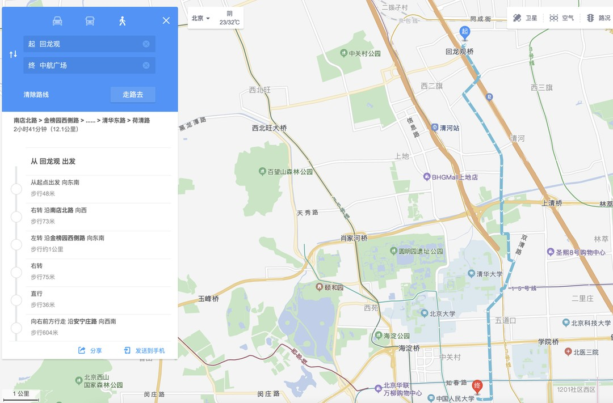
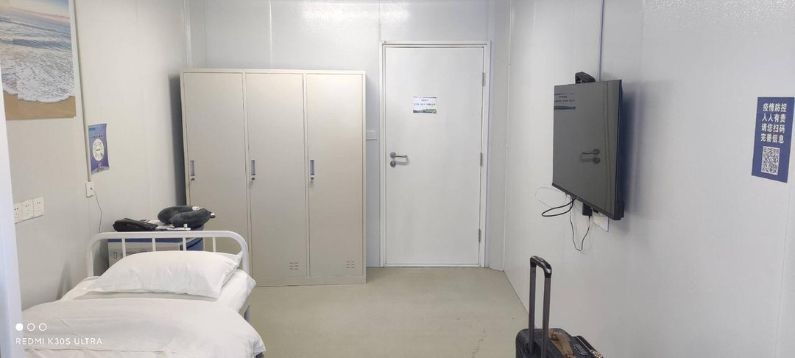

# 2022字节实习实录
从2022.04.18入职以来，一直在线上远程实习，直到2022.07.26终于抵达的北京开始正式现场实习，之后又一直实习到了2023.06.29转正式，这次的故事非常漫长，所以只记录了部分经历。同样的，跟前边腾讯实习实录一样，工作方面的东西不能写，红线警告，所以依旧是写写生活相关的内容，记记生活中比较有意思的事情。

其实本来应该去上海实习的，只不过上海疫情反反复复，今年上海疫情的各种骚操作属实是给整怕了，而且最近上海疫情又有着席卷而来的趋势，这属实是有点绷不住，怕再关几个月回不去学校了就麻烦了，毕竟论文还是得搞的，毕业要紧。​

## 2022.07.26 到达北京实习​
我住在回龙观，说到回龙观，就不得不提海淀卷王​ 何通洋 同学了，这家伙除了我刚来的时候见了一次之后，再也没回公寓住过，天天在公司(百度)卷，说一句海淀卷王不过分吧。​

从回龙观到中航广场还是很远的，高德路线是需要12公里的，主要是我这实习在公司附近的短租相当难找，当然有钱人除外，所以直接不要房补了，直冲回龙观那边住下了。

虽然是有12公里，但是地铁13号线算是直达的，当然这里的直达的意思是不需要转车，只需要走个两公里即可，这里就不得不说中航广场这个地方前不着地铁后不着公交的，下地铁就骑车倒是也行，不过似乎看起来也没有必要，走两步也是可以的。

那么问题来了，这样就需要一个挤地铁的最佳实践，因为字节早上是11点才上班，这样的话就可以就可以尽量晚点去地铁站，从而尽可能避免早高峰。

今天早上我是09:40出发，然后本着得疯狂挤地铁的预期过去，发现站内并没有多少人，虽然地铁上人不少，但是也不算挤，比我上次挤深圳八点的1号线好的不知道到哪里去了，反正就一下子就上去了，然后在西二旗站也就是龙泽的下一站，下了相当一大部分人，我都看傻了，地铁瞬间宽敞了，然后就是平平无奇地坐到了知春路站下了车，然后开始了长达两公里的路程，实际上走起来还好，今天不算很热，并且路上都是有树荫的，我已经探索出一条基本都有树荫的路线，明天再探索一下看看有没有其他的路线能近一点，两公里确实也是需要走一阵子的，最终我在10:28到达了公司一楼大堂。

来了之后不认路，还是天瑞老哥带我过来的，中午吃饭是直接吃的盒饭哈哈，说是盒饭更好吃一些，然后带着我去IT那边去领了鼠标键盘和支架，我还给我自己的电脑多领了一个支架，这三件套还是不错的，工卡也因为我提前申领了，就直接拿到了，比较遗憾的是没有申请4K屏幕，这申请到要好久，指不定我都走了也没申请到位，这波只能说是血亏。

整体来说体验还是不错的，最想让我吐槽的是那个椅子，只适合葛优躺，没办法调整位置，这就让我觉得很不舒服，尤其是脖子基本没地方靠，会觉得脖子很累的，这个椅子就是让我躺着玩手机比较合适，一躺着就想玩手机，啥事不想干，但是没办法还是得搬砖，继续搬砖吧，感觉效率应该不如远程办公哈哈。

晚上大概是九点多坐的十三号线，发现这个时间才是真的挤，不过凭我不要脸的精神反正是一下子就挤上去了，然后挤了一路，到了换成昌平线的那个站之后又没人了，这是真的离谱，可以看出来那边住的究竟是有多少人。

## 2022.07.27 上班挤地铁
丢人了，今天龙泽站一趟没挤上去，今天这个人就太多了，好家伙给爷整的有点懵，怎么昨天没这么多人，今天就炸锅了，感觉是走的有点晚，或者是今天下雨的原因，明天恢复9:30出发。路上倒是还好，起码今天是真的不热，甚至还有点冷，只是今天探索的新路线看起来还比上次要远，这我就不会了，明明看起来更近一些的，反正是看起来近就完事了。

## 2022.07.29 整个月卡
今天早上那个大太阳属实是牛皮，于是我看了看附近有美团的自行车直接就办了个月卡，感觉骑车上班确实爽啊，路上这个汽车站风吹起来也爽，也不用太担心这个热的问题，主要问题就是不容易找自行车，此外还耽误了我锻炼的大计哈哈哈。​

## 2022.08.01 到八月了
新的一月了，这离我实习结束的时间也快了，当时是跟老师约好了九月需要回去继续搞论文的，这鸽子是不好放的，这边环境确实是比在学校呆着舒服的多，就是温度比较高，不过回去也是不错的，回学校可以享受一下最后的学生时光了，只是在这期间需要先把工作落实好了才行。​

此外，每次一周末回公司，都忘了自己应该干点啥了，感觉有点晕乎乎的，今天天气特别热，我在地铁里、骑自行车都觉得热，确实应该是比家里的温度热好几度，每天通勤四十分钟以上，在外边热的大汗淋漓的。

## 2022.08.03 有座位的地铁
普天同庆，今天挤地铁竟然有个座位，好家伙挤了这么久的地铁这可是头一次，之前可没见过这架势哈哈哈，怕不是昨晚被台海问题气的睡不着觉，还是关注的太多了熬夜到太晚早上没起来床呢，哈哈哈反正这坐着的地铁是真的头一次。

下了地铁就是抢共享单车的时间了，感觉北京这边有个好处是共享单车特别多，但是美团的似乎并不是很多，滴滴的青桔单车倒是很多，可惜我当时办的是美团单车的月卡，这就没次下地铁就跟他们去抢美团的单车，不过话说回来抢不到也问题不大，毕竟走个几百米是京东，那边就有很多共享单车了。

## 2022.08.09 共享单车没了
这两天很怪，我走的这条路上竟然抢不到共享单车了，今天和昨天都没有共享单车了，最最奇怪的是，在京东科技大厦下边竟然也没有共享单车了，这是我来了这么久都没有见到过的事情，很奇怪，不知道发生了什么，直接找不到车了，这就导致我只能步行走过来公司，这大概得走2公里，当然锻炼一下也不是不行的。

今天温度是我来了这么久最低的一天，早上出去甚至感受到了一点寒冷，最高气温竟然才28摄氏度，这个温度还是挺舒服的。可惜的是从明天开始温度就要恢复到32度了，当然这比起来上一周的一周35度已经是能够笑醒的温度了，这个温度还能接受，上个周那个温度属实是让人蚌埠住，太热了，出去一圈能热疯了，今天就有点冷了，在公司不穿外套就能感受到寒冷。​

## 2022.08.11 找到热的原因了
难怪每天上班都觉得热，抬头一看这个街，好家伙迎夏街，每天迎夏当然会感觉到热了，不过在立秋过了之后感觉温度也还好吧，上个周那是真的热。

今天总算是抢到共享单车了，今天是09:40才出门的，下地铁之后老哥正好在调度共享单车，一大堆共享单车可以骑，真爽，那么问题来了，这个点出门的话，地铁又特别的挤，这就很尴尬，感觉这共享单车真的是纯凭运气碰了，最后看怎么取舍折中，不行09:35出门试一下。

## 2022.08.31 答辩完喽
好久没写了，昨天终于答辩完了，解放了，直接起飞，至于结果嘛估计要等三批结束，那估计都十月了吧，这个问题就等着吧。然后今天早上遇到了一件非常牛逼的事，坐了这么多次地铁，第一次感受到地铁的紧急制动，好家伙这个制动是真的牛逼，怪吓人的感觉，我还以为这个列车出什么问题了，然后他又慢慢地启动了，挺怪的，不过这个制动确实狠啊，我两个手扶着上边的那个横梁都站不稳，惯性太大了，似乎是与前边列车距离太近了，咱也不知道，反正挺怪的。​

然后今天又要开始修BUG了，好家伙手里这一大堆BUG，简直顾头不顾腚的，左一个右一个的，此外还有很多需求等着我去做，好家伙人快麻了，直接一个头两个大好吧。

## 2022.09.05 出差失败
本来这个时间我应该在杭州出差的，没想到拉了胯，浙江附近有台风，导致基本所有的航班都取消了，话说这个国航CA1712属实离谱，我都到机场了，你才取消航班，13:30的飞机12:00附近取消航班，真有你的啊国航。不过后来基本所有的飞机都取消了航班，唯有海航比较牛逼，果然在海里的航司就是不一样啊哈哈哈。

## 2022.09.13 准备写论文
因为要回学校中期答辩以及写大论文，离开了北京，这就不算是在北京搬砖了。​

这个中期答辩就很诡异，今年刚出来的政策，之前都是没有的，就很离谱，老师也因为这个把我召回了。要不然今天依旧是在北京搬砖的，还能多吃两顿公司的盒饭，还有我的24寸大屏幕啊555，刚用了一个月就要把他还回去了。​

这个大论文也不知道需要写多久，小论文的话本来我发一篇普刊就能毕业的，然后硬生生发了一篇SCI，虽然是水刊吧，但是也废了我不少功夫。大论文估计也得很费劲了，不知道怎么样才能达到毕业条件，我们带专学校虽然不咋样，但是论文要求是真的严格，等我完成大论文，估计就需要再次开启搬砖生活了。​

## 2022.10.27 终于可以回校了
今天终于踏上了返校的旅途，然后呢，学校通知要隔离，我这个起码连续俩月低风险的地方也要被隔离，然后被拉去了青岛这边的方舱，反正是蚌埠住了。学校的一刀切政策，凡是市外回去的都需要在方舱隔离，注意是市外，不光是省外，蚌埠。唯一的好消息是不需要自费隔离，但是被隔离总归是有点蚌埠的。

## 2022.10.28 隔离的第一天
这边生活配套设施还算是齐全，居住起来还是可以的，但是隔音特别特别差，隔壁只要有人说话的话这边能听的一清二楚，隔壁老哥一直在打电话，导致我中午睡不着。此外这种板房很难保温，因为现在还是秋天，昼夜温差比较大，基本情况就是中午需要开空调制冷，晚上就特别冷甚至需要开一会空调制热，如果没有空调的话是真的折磨。​

今天青岛这边又出现了病例，今天和明天返校的同学又必须滞留了，不允许返校。这边也又运来了大量的密接，这个方舱也几乎满了，导致整体运行效率大幅下降，饭都送的很不及时了，饿死我了。另外吐槽一下这个四点半起来做核酸是真的逆天，饭不及时做核酸那是真的及时。

## 2022.10.29 隔离的第二天
昨晚差点猝死，这个方舱是板房，隔音效果真的是太差了，我简直顶不住，也不知道是隔壁还是楼下，还是对面，昨晚有个人打游戏打到了凌晨两点，我在家都是最晚十一点就睡着了的人，然后被他吵的一直没睡着。对了，我不太到九点就已经睡着了，然后被他吵醒了，然后他就一直开黑打游戏，打了半天CF之后又打王者农药，他和他开黑的那个人的语音我都听的清清楚楚，要了命了简直。此外，昨晚三点半又被叫起来做核酸，真的是究极折磨。
​
另外，还记得这篇文章的第一段嘛，我就是因为怕回不去学校才转base去北京实习的，结果到头来效果是一样的，一样的回不去学校，一样的需要被隔离，属实是转了个寂寞。
​
今天是周末，不需要上班，就打开电视看了，我平时看电视只关注少儿频道的，所以正好看到了这部熊出没的电影，2022年的贺岁档，熊出没之重返地球。这可以算是我这几年看到的非常不错的一部电影了，包括去年的熊出没之狂野大陆，设定都很新颖，剧情也很饱满，这部重返地球的打斗戏也是很不错的，最主要的是设定和剧情新颖，吊打很多科幻片，可以说是2022年贺岁档唯一一部可以看的电影，当然毕竟也算是子供向的动画，逻辑不算是特别的严谨，但是瑕不掩瑜，这依旧是一部非常优秀的电影。

对了，说到这个，喜羊羊与灰太狼的羊村守护者系列也是很不错的，当然因为不是电影，所以剧情比较拖沓，也有很多穿帮的地方，但是也是不错的动画了，在几年前的喜羊羊与灰太狼确实略显幼稚与尴尬，但是这几年的喜羊羊与灰太狼确实变成了优秀的动画。​

这些动画片让大人和小孩看可能会比较幼稚，但我这个年龄段就刚刚好啦，毕竟我这个年龄段还是有那么一些童心未泯的哈哈哈。

## 2022.10.30 最后一天隔离
昨晚在游戏哥的嚎叫声中睡了一个多小时，一点半又被吵醒了，真的要了命，然后大概两点他终于不打游戏准备睡觉了，我也终于睡了个安稳。BUT，两点半左右，又被叫起来做核酸，简直要了命啊，在这里其他的都还好说，睡觉睡不安稳是真的难受。​

本来今天通知说是可以直接走了，但是看了一眼名单发现我是疫情重点地区人员，好家伙现在划分重点地区是直接按市划分了不按区划分了是吧，那既然这样还是得等待下午核酸结果出来才能走，估计得五六点左右，折磨。

## 2022.11.07 核酸检测小能手
我自从回到了学校，每天都在做核酸，我已经持续每天做核酸做了两个多周了，而且学校这边人特别特别多，简直要了命。有一说一，假如真的在学校出现病例，那么核酸检测的时候就是传染的最厉害的时候，这是真的聚集，看图就懂了。图这边是出口，后边的队伍绕了好几个圈，就这个小广场挤了得几千人，而且我拍照的时间还没下课，过一会会有更多的人涌过来，没法看了。

## 2022.11.14 学校终于解封了
普天同庆，今天终于解封了，可以随意出校门了。

我今天出门第一件事是出门把我的自行车修一修，我就是去实习了一下，然后滞留在家里一段时间，大概加起来也就三个月吧，等我回来看我的自行车，好家伙就没个好地方了。首先后闸拉不动了，没法刹车了，然后前轮的辐条断了一根，后轮的车胎漏气了，支撑自行车的那个撑子还断了。我属实是蚌埠住了，出去一趟回来直接没法骑了，所以今天出去第一件事把我的自行车修了修，花了我65大洋。

 然后出去顺便把我头发剪了剪，也是在学校很久没剪了，剪头发的时候我想起来一件很有意思的事情，之前大一的时候我们宿舍楼停水了，为什么停水呢，是因为修网络把水管挖断了，当时就差停电了。然后呢导致我们整个B区宿舍楼都没水，然后我们就没办法洗头，喝水都费劲。然后我鑫哥攒了一个周没洗的头，出去剪头发顺便让人家把头洗一洗，笑死我了。

 看了看最新的返校政策，市外返校的还需要去A7宿舍楼隔离，这就完全是形式主义大于实际作用了，去A7隔离是四个人在一个宿舍，然后里边的各种防疫物资还没发动，只能看，此外宿舍里边是没有独卫的，还是得去公共的卫生间，这隔离跟不隔离有什么区别，最牛逼的是没有饭吃，必须还得麻烦舍友去给你送饭，所以有一说一去A7隔离还不如去方舱。所以现在的情况是，比如跟随大部队一起返校，否则就是一件相当相当麻烦的事情了。

## 2022.11.21 比做核酸更折磨
 我某银行的银行卡之前身份证过期了一直没去处理，一直是一个“暂停非柜面交易”的状态，然后又因为近期有需要用的地方，那就没办法了就必须去重新激活银行卡，看了看周末银行是不开门的，那就今天骑着我的宝马去了一趟银行，其实还是挺远的骑的我屁股疼。

 我是先在学校做了个核酸，然后才去的，一直到09:40到了银行叫了个号，然后折磨的地方来了，今天人特别特别多，多数是来处理存折的问题的，处理存折问题就特别特别特别的慢，我叫的号是18号，我是从09:40足足等到了13:30才叫到我，中午我也没吃饭也没睡觉，我处理完了大概也就十几分钟，然后就迅速的骑着我的宝马回到了学校，然后正好亮点开始上班，排队排这么久比做核酸排队还折磨，好处是不用天天去。

 周五去跟同学吃饭的时候，他跟我说毕业论文起码要3w字，我这一段时间绞尽脑汁才写了1w多个字，然后也就是说我起码还差2w字，我的天，要了命了，我感觉我急了，太恐怖了。

## 2022.11.29 真冷啊
今天是真的冷，突然就降温了，而且是剧烈降温，我这就直接穿上了我的羽绒服，否则就要被冻死了，现在是物理寒气 + 经济寒气，属实是名副其实的寒气逼人了。就这个又降温又刮风又下雨的，都把我的宝马刮倒了，防雨布也破了好几个洞，让我属实是有点蚌埠，不过缝缝补补的还能接着用，现在就是防雨与防风不可兼得。

经过一个星期的努力，3w字的论文已经写了2w字了，还差1w字就能达到最低标准了，问了问去年的毕业生都写了五六万字，是真能编啊，属实是给我整的有点蚌埠，如果让我写这么多字，我感觉我得补充很多实验进去才行，那就是个巨大的工作了。

## 2022.12.07 连夜跑路回家了
前天晚上，我正开心地写着代码，搞着流程图功能，然后我舍友突然回来了，跟我说家属区🐑了，让我收拾收拾快准备跑路。我本来是没当回事的，然后学校开了个会，说是让大家都快回家，别留在学校了，下一步可能要封宿舍，还有可能在这过年。好家伙那这可不行，我连夜收拾了我的行李，然后准备第二天跑路。

昨天早上四点我就起来了，然后收拾收拾就走了，就是我舍友贼墨迹导致六点才出门，主要是这家伙是八点的高铁，他倒是一点也不急哈哈，最后出了门全是人，打车都打不到，一直到七点我终于打上车了，然后送到了高铁站，价格是平时的两倍了，要一百大洋，有点蚌埠。然后高铁站不让进，只有快发车的才能进，那我就蚌埠住了，我立马买了个最近发车的，毕竟就只有一站而已，然后我就混进去了，等了一会就坐上高铁回家了。到了日照高铁站，还挺有意思的，想做核酸的从这走，不想做的从另一个地方走，合着开始自愿核酸了啊。回家打了个出租，到家花了27大洋，这才九点半我就到家了，属实是流批，还不耽误上班哈哈哈。只是有点尬的是，村里让我居家隔离，别跟人接触，还给我门上贴了个红纸，那也行吧，别又给我拉方舱去就行。

然后今天，跟我说不用隔离了，注意点就好，这个红纸可以撕了，哈哈哈蚌埠住了。病毒不会消失，外加抗疫需要大量的人力和资源，撑不住也很正常，现在最好是常备一些药品，然后注意防护就好了。

我每天写一千字的论文，到今天终于写了30091个字了，这是正文内容的字数，就是从绪论到参考文献外加一小段摘要的字数，感觉已经到我的极限了，不过听说去年我师姐们都写了五六万个字，我估计我是没这个水平了，真写不下去了，我这是差不多每天写一点整整写了半个月了，要了老命了。

## 2022.12.25 元旦前的决赛圈
本以为22年能够不🐑的，可惜很明显这个愿景已经很难实现了，我家里没有一个能够幸免的，昨天我爸妈开始发烧了，我也开始嗓子痒了，然后今天我就明显的感受到了嗓子的疼痛以及浑身的乏力，大概率是要开始了，幸亏之前发布20条的时候我就让家里囤了一点药，然后我还从学校里边带回家里一点，现在是派上用场了，就是没买抗原，但是看这个发烧的程度，已经不需要抗原来证明了。​

这两天的感觉就是，前天晚上开始嗓子痒流鼻涕，昨天嗓子痒有点加重，今天上午是嗓子痒加一直咳嗽，只不过咳嗽的程度不是很严重，中午睡了个午觉，下午就开始浑身乏力，估计是开始发低烧了，幸亏我还从学校带了支体温计回来，量了一下37.3­°C了，已经开始低烧了。没想到在我们这小小的农村里，竟然这么快就蔓延了过来，而且看起来是绝大部分人都是有症状的，跟今年统计的无症状感染者的比例简直大相径庭，现在这个情况也只能靠着身体生扛了。

## 2022.12.30 终于退烧了
🐑了是真的折磨啊，从12.25下午开始发烧，晚上七点的时候就开始向着39°C冲锋了，下午吃饭的时候就觉得特别特别冷，然后晚上就开始慢慢的往上冲锋到39°C吃布洛芬是没管一点用，然后半夜又吃了一次布洛芬，这玩意得最低间隔四个小时才能吃。发烧基本睡不着觉，而且感觉特别精神，发着39°C的烧跟七八个人聊天，一晚上醒了好几次没睡几个小时，好处是半夜吃了药之后开始慢慢降下来一点了，到了凌晨三点大概是37.5°C了。​

第二天白天起床又开始发烧，起床就是38.3°C，然后一天都感觉特别昏沉，下午又开始冲锋39°C，一直又到了38.8°C，最主要的是，无论是吃布洛芬还是吃复方氨酚烷胺片都没有用，一直是高烧。感觉顶不住了就直接去打了个点滴，连排队带打针一下午过去了，回去之后还是38.8°C，不过到了睡前就慢慢退下来了，一直到37.2°C，然后晚上就睡了个好觉。​

高烧不退两天时间，然后第三天开始一整天感觉都还不错，一直是低烧，也就维持在37.2°C-37.8°C之间，整体来说还算能接受。然后第四天又开始高烧，这玩意真的是反反复复，有两次直接冲锋到了38.5°C上，我还琢磨是不是又要去打点滴了，不过这一天我灌了一暖瓶的热水，外加现在吃布洛芬确实有效了，不跟第二天一样吃了药根本不退烧，所以就没有必要去打针了，硬扛下来了。第五天就稳定多了，体温没超过37.5°C，然后又灌了一天的水，只不过现在开始嗓子疼然后咳嗽、流鼻涕，真的是折磨。今天也就是第六天才算是彻底退烧，今天体温都不在37°C以上了，算是彻底退烧了吧，但是还是有咳嗽的症状，真的是折磨。

## 2023.01.26 掏了个马蜂窝
在1.2那天我跟我妈去山上搞了点土回家种花，山上的土因为常年的植物腐烂，就有了表面的一层黑色的土壤，栽花比较好用，然后整了两桶土提着回家，毕竟都是自己种着玩，不需要太多的土。然后在下山的路上发现了一个马蜂窝，我妈发现的，本来以为是个野鸡的巢，我看了下应该是个马蜂窝，然后就过去近距离观察了一下，果然是个巨大的马蜂窝，但是当时因为没有工具啥的，再加上确实有点高，就先回家了。然后因为懒癌犯了，再加上山还是挺高的，来回一趟挺费劲的，一直没去把马蜂窝掏了。

今天我跟我爸全副武装的带着装备，准备了两根很长的竹竿以及绳子之类的，想着如果长度不够就爬树给他掏下来。到了之后发现把两根竹竿绑在一起是能够得到的，但是毕竟是两根竹竿绑在一起，第一根竹竿的前边比较细，又绑上一根之后就变的特别难控制，再加上马蜂窝吸附在树枝上很结实，而且一戳就是一个窟窿，就跟很薄的纸壳一样，一戳就烂了，所以没办法直接给他戳下来，所以就只能一点点地把连接处给他破坏掉，最终让他一整个掉下来，可惜掉下来之后摔地上摔碎了，本来还算是挺完整的，掉地上就四分五裂了。马蜂应该是不会在巢穴内越冬的，好像是会找一些石缝什么的来孤王越冬，冬天过去可能没剩下几个活的马蜂了，所以蜂窝里边特别多冻死的马蜂，以及很多冻死的蜂蛹，整个马蜂窝有三斤多，了却了月初想把马蜂窝掏了的愿望哈哈哈。

## 2023.03.17 欢乐Go
今晚我只想说，欢乐是别人的，一晚上折腾的我想Go。倒不是因为欢乐Go这个活动咋样，因为我甚至都没能成功地参与其中，所以欢乐一定不是我的。

今晚看他们都在准备搞这个，我这个从没用过抖音的选手也准备下一个抖音试试，然后呢下载注册一气呵成，再然后就绑定了飞书进入了直播间，本来是没什么事的，过了一会提示我账号，把我强行踢了下去，我再登录就必须要实名认证。那实名认证不就是身份信息+刷脸嘛，混迹于互联网这么多年了见得多了，就实名认证下呗，然后就是正常的流程。那么问题来了，刷完脸以后，一直提醒我“操作频繁，请稍后再试”，提示了一晚上，从第一次开始尝试到最后，一直都提示这个，期间我搜索了内部文档、切到内网、找抖音值班号，都没能解决这个问题，那到最后我也没办法，只能又把抖音卸载了，留一张折磨了我一晚上的这个状态。

我也是没想到有一天所谓的字节员工会被自家的服务拦在门外，之前我认证火山引擎的时候就非常的迅速，到了抖音这里就卡住了，甚至后边我又换了个手机号也是同样的效果。不过话又说回来我也不刷抖音，所以基本对我没啥影响，只是想起来这回事的时候可能还是会有点郁闷吧。

## 2023.04.20 从杭州回来了
去趟杭州真不容易啊，高铁一趟要7个小时，那真的是坐的浑身难受了都。去的那天是17号，早上七点起来的，然后搭了顺风车到了青岛西站，大概在14:41到达了上海虹桥站，这边人是真的多啊，然后换乘了一趟去杭州，到的时间大概是15:44分，然后才到公司去卷。好家伙，这整个折腾一天。回来也是挺折磨，12:38从杭州东站出发，然后13:46到达上海虹桥，之后坐了个全程票，14:11从上海虹桥一直坐到了青岛站，然后坐的地铁到的井冈山路，打车回的学校，这就到九点了，回去还得卷，有两个比较重要的任务需要搞完，一直到十一点多。​

去探查了一番杭州，杭州是真的热，我在青岛15℃，杭州32℃，这都直接翻了个番。不过杭州的地铁比青岛多得多，听说杭州这边打车还不如地铁快，地铁不堵车，于是就坐了地铁去的公司，不得不说还行，五常地铁站离八方城只有一公里。八方城周围全是吃的，好家伙整个美食好几条街，真的离谱。晚上还去看了看西湖，可惜不能下去摸鱼，只能在边上遛弯，有点美中不足哈哈哈。

另外看了一下，司龄1.01年了，已经拉高了平均值，网传不是在职七个月嘛。再实习下去，那我这个研究生有一半的时间是在这些厂里度过的了，有点感慨哈哈哈哈。不过说起来也就俩厂而已，腾讯和字节。最近忙到爆炸，这搬砖日记都不会写了，需求起码都排到了六月了，有点蚌埠。

## 2023.06.29 正式上班了
昨天到了杭州，本来我家里(日照)也就是27摄氏度的天气，到了杭州直接飙到了36度，热死个人，要不是之前去过深圳有过预期南方会很热，初来乍到的真的会顶不住。到了之后收拾了一下，然后出去吃了个饭，还跟​浙大爷去浙大紫金港校区里边转了转，做梦都想去浙大奈何考不上哈哈哈哈。​

这次租的房子是在盛奥铭座，离工区只需要步行4分钟，相比于之前在北京搬砖每天地铁加步行的单程40分钟通勤，已经是相当不错了，而且这边楼下吃的也多，到处都是吃的，在北京那边因为我住的非常偏远，点外卖都很费劲，相比较来说这里还是比较有生活气息的，后边有空也出去转一转，只不过现在杭州这个温度出门就是对自己的不尊重，目前还是躺在床上吹空调比较合适。

正式入职了之后司龄也清零了，想我实习了这么久的1.19年的司龄现在成0.0了，有点难绷。当然我也同时变成了刚入职的小萌新，然后再开始新人landing，毕竟数据是不会骗人的，现在我是刚入职第一天的萌新切图仔。那么至此我历时1.19年的字节实习也结束了，接下来就是需要正式地工作了。
