# 致我三年的研究生生活
我在山科的故事还没有讲完，在我四年的大学生活结束之后，又在学校开始了新的三年的研究生生活，那么，欢迎继续走进我的世界。

时间回到2020.06.24，在那天我们全员回家之后，我的大学生活是正式结束了，那么我又有了一个新的暑假，通常来说我的暑假一般都不会闲着的，所以在鲁老师的帮助下，我去了威海的广瑞电力科技有限公司实习去了，主要是从事了电力数据分析相关的工作。

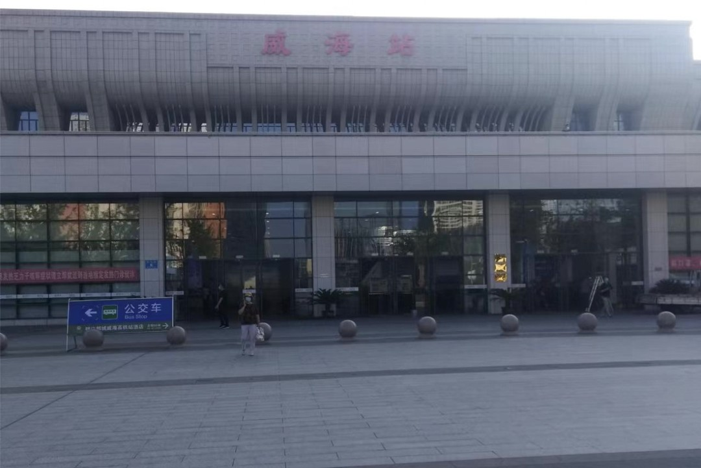

在这里我遇到了孙姐和崇星老哥，他们都是非常优秀的人，也是非常的热情，对我非常好，同样也在这里学到了很多东西。我发现威海真是个不错的地方，环境非常好，温度也比较适宜，也靠海非常近，毕竟我是日照人，离着海也挺近的，有种家乡的感觉，体感是非常的不错。在公司这段时间，我们一点都不加班，八点上班，五点半下班，然后公司还给我安排了个公寓的住处，我甚至可以直接步行上班，感觉是非常的不错。因为是做电力相关的业务，我们还去了济南参加了电力交易的会议，这也是我第一次去济南，感受到济南是真的热哈哈哈。

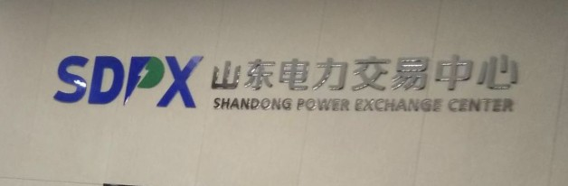

快乐的时光也总是短暂的，在两个月之后我也开学了，需要回学校继续我的学生生涯了。同时我也非常不舍在这里的时光，特别是孙姐和崇星老哥实在是待我太好了，最后还请假陪我去了一趟刘公岛。最后我才知道为了陪我去这一趟刘公岛甚至崇星老哥女儿的舞蹈比赛都没有时间去参加，这在让我感动的同时也让我非常愧疚，非常感谢他们带给我的快乐时光。

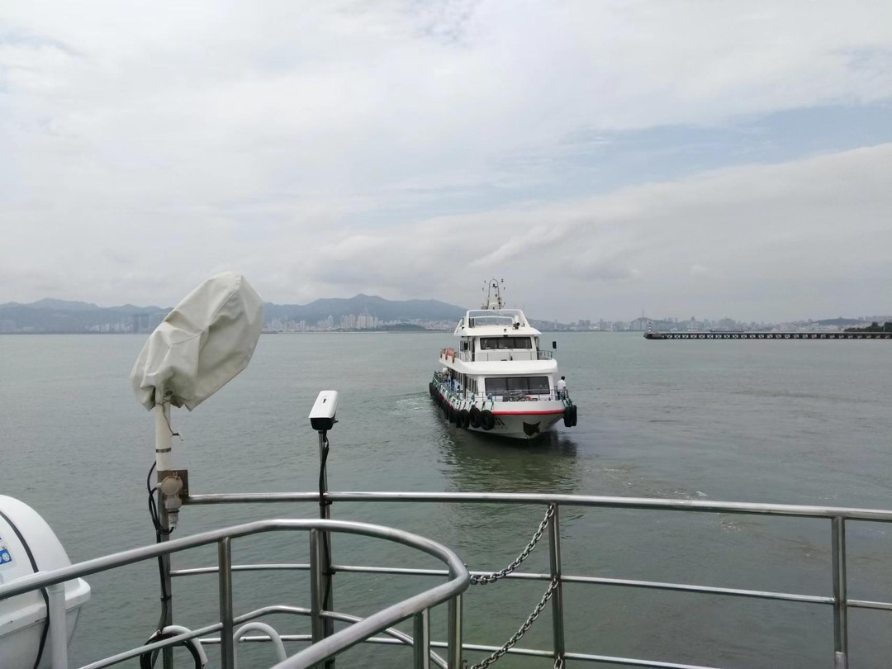

时间到了九月，这是我们大家开学的日子，这一天我印象非常深刻的一件事是当时明明通知的是去A4楼下办理入学，我去了却没人在那，最后才知道突然改到了尤洛卡广场办了，这直接给我整蚌埠住了。很可惜的是，当时我们没有分到A4宿舍，我们去了A8宿舍，实际上这也就意味着除了我们班的男生之外，都有着上床下桌，而我们宿舍还是上下铺，只不过也只有我们A8有独卫，但是这边的独卫是有很大问题的，平时根本不敢开门，没有排气扇并且我觉得那个洗手盆下边的回水管是有问题的，特别是这个独卫是在走廊这一侧的，没有办法开窗户通风，所以你懂的，味道特别大，门一开一宿舍都是厕所，至于上下铺倒是还好。

研一刚去的时候我是很痛苦的，我考研是375分总感觉是血亏的，回想当年为什么要读本校的研究生，如果看看我这大学的经历，我觉得我已经算是很卷的了。技术方面做过项目，前后端都写过，服务器也都是自己搭建的，业务上也是谈过项目的，虽然都是些外包的项目，但是对一个大学生也是有一定含金量的。但是在大三的下学期就得开始找实习了嘛，我踌躇满志投了阿里，但是很遗憾，简历都没过。当时我就开始反思，究竟是哪里出了问题，当然实际上问题很多，在这里就不一一列举了。当时我自己得出了一个结论，我对技术深度的研究不行，但是当时已经很晚了，如果没有实习的话预期是很难进所谓大厂的。于是我当时做了一个决定，考研，也就是所谓的时间换空间，因为我是比较笨的，不是天赋型选手，必须要很长时间才能搞明白一些知识。然后对自己研究生的生活做了一个规划，研究生最终目标还是奔着大厂去的，目标清晰明确。

在研一的这段时间，特别是上半学期，我觉得我的生活应该是非常枯燥乏味的，因为研究课题不明确，需要看大量的论文来寻找课题方向，并且这也是为毕业做准备，虽然我是专硕但是鲁老师要求一般是比较严格的，所以最好还是发个论文。所以整个上半年看了一大堆英文论文，看得我自己都觉得头皮发麻，天天脑瓜子嗡嗡的，但是为了毕业也得看呀。我感觉我的生活没什么快乐的，我认识的同学们基本都毕业走了，新同学们基本都不认识，平时也都在做科研也不跟大学一样会一起上课，认识的机会很少，不过在圣诞节lx还送我的一个苹果哈哈。

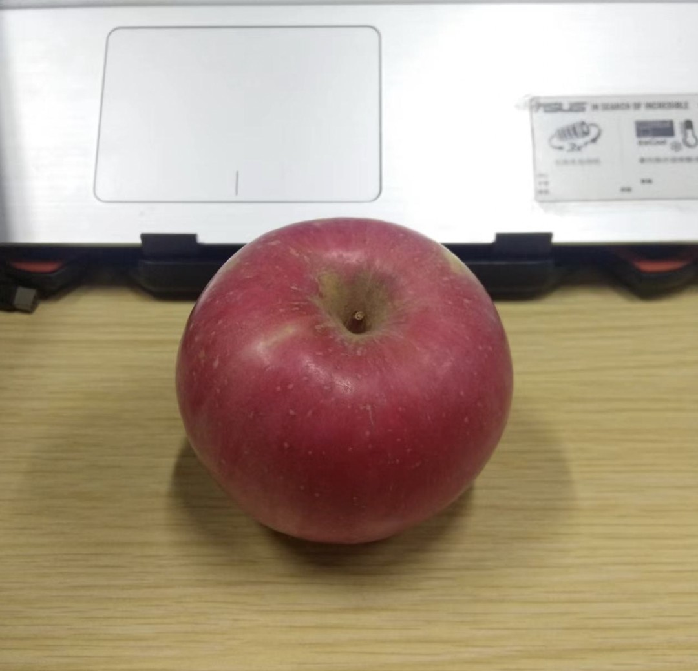

在研一的寒假我基本就放飞自我了，只不过我还没忘记我的目标，我已经开始准备物色实习了。我的第一个阶段的目标，就是在研一暑假去腾讯实习，因为我当时已经调研的很清楚了，腾讯是收研一的实习的，而且不区分暑期实习和日常实习，这就非常适合我现在的状态。于是在3.1我就开始投递腾讯，当然我也还投了美团和字节跳动，在这个时候我已经写了很多博客了，大概得三百七十篇的样子，所以在面试的时候我的表现还是可以的，在最后我也成功拿到了腾讯的实习offer。

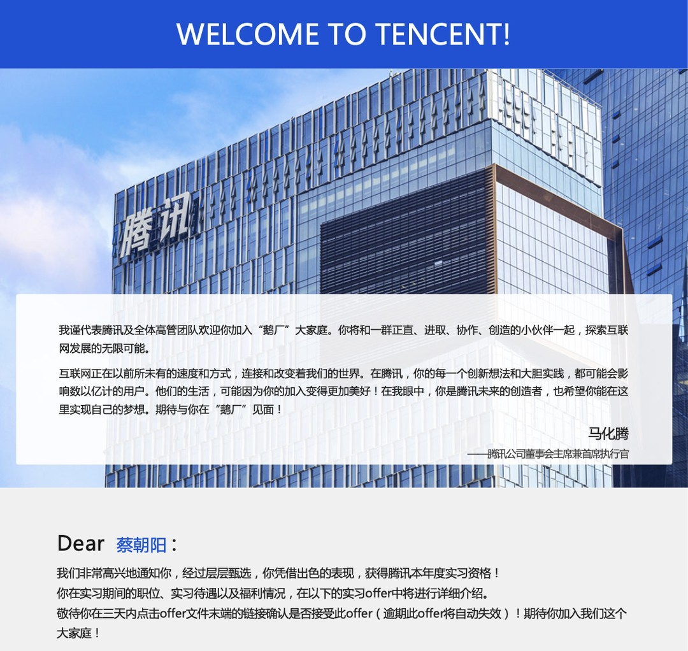

虽然我拿到了offer，这个学还是得上的，毕竟直到我拿到offer这段时间，我都还没有确定研究方向，搞科研太难了。就这样我依然天天在看着论文，特别是英文论文看得我头皮发麻，最后终于也确定了研究方向。经过了7.12最后一门考试完成了以后，终于可以准备去腾讯实习了，这个期末考试时间也是改了又改，最后的时间还是定在了放暑假那天飞深圳，第一次坐飞机，为了防止不认路，还不到四点就到了，到了机场又是办登机牌又是托运又是安检啥的，这一套下来一个小时过去了，然后坐在机场百般无聊，机场的wifi网速非常差，本来是19:50深航的飞机，延误了一个小时，8:50才起飞，不过隔壁东航友谊架航班本来应该17:35就飞的，然后我登机的时候他们飞机还没到。这是我第一次坐飞机，这机票是真的贵啊，花了我1312大洋，原本挺期待坐飞机的，好家伙直接整了个晕机，要命了，今后要不是迫不得已绝对不坐飞机了，降落的时候还整了几个特别大的转弯，跟漂移似的，落地那一下震动还吓我一跳，真是要命，另外上飞机是直接走的连廊，下飞机坐的摆渡车费老劲了，深圳机场挺大的，等托运行李也挺费劲的，点名表扬深圳机场的厕所真干净。先去找同学在他家睡了一晚，然后我们去大梅沙海边看了看，然后我们得出一致结论，外边的世界太危险，周末就应该躺在家里哈哈哈。腾讯这边提供了七天免费酒店住宿，我先去找lzf住了两晚上，之后就去深圳新豪方酒店住下了。

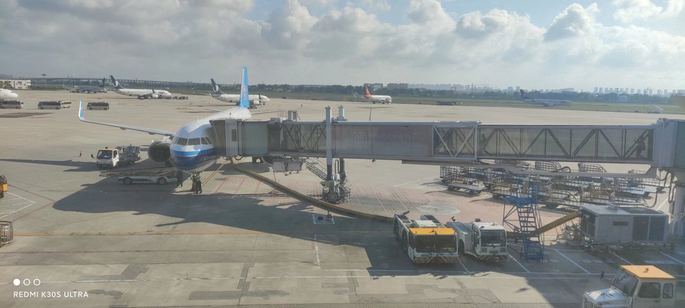

在腾讯实习的日子还是非常快乐的，我们组里只有我一个实习生，没有人跟我一起愉快的玩耍，只能自己孤独的在这里摸鱼了。欢迎到鹅厂实习工作哈哈，亲身体验福利还不错，至于氛围方面都得各自看组，抛开部门和组去谈氛围那都是很不精确的，各个组都有各个组的情况，不过总体看起来鹅厂整体氛围还算是比较可以的，人文关怀做的还不错。首先是工位足够大，对面客户端有位老哥工位摆了3个27寸的屏幕外加一个iMAC，这就可以看出来工位放啥也是够用的，公司发放的电脑主要是看导师怎么给申请了，我的机器是i7-9700/16G*2/1T SSD+2T HDD/RTX 2060 6G，还有一个27寸的4K屏，实习生一般是只有台式机的。我是在科兴这边上班的，这边的话有C和D两栋楼的食堂，一共是有三层，花样还是不少的，另外早餐完全免费，午餐也吃不了多少钱，晚上八点以后刷卡离开的话可以获得一个夜宵券，现在应该是完全免费了，当然你要是住的近的话可以六点下班，八点来散个步打个卡也能拿夜宵券，而且不一定是科兴，随意哪个鹅厂的大厦的门禁，应该是个办公楼都可以，夜宵券基本可以抵扣晚餐，自选窗口的话基本上管饱，当然你要是夜宵券数量充足的话，可以去稻香吃，在C3一楼那里的餐厅吧，我只在leader请客的时候去过两次哈哈哈。科兴这边的话环境除了堵车其他都还是不错的，我最想吐槽的是洗手水都是温的，太奢侈了，旁边都有擦手纸，洗手之后要擦手哈哈。这边因为人太多电梯还是挺堵的，基本上要排队的，公司这边厕所还是不少的，非常方便带薪蹲坑，而且在厕所也是有wifi信号的，不用担心没网。然后到目前为止，我参加了两个比赛白嫖了两件文化衫，就是短袖，可惜的是没有裤子，要不就能配一套了。最近可能是因为节日比较多吧，这一个月我收到了公司发的月饼礼盒的邮件，看起来那个礼盒不便宜，是流心月饼的，另外还收到了水果卡，说起来这个感觉亏了，有同学转手一卖卖了一百多大洋，我这手太快激活了哈哈，没法转手了，只能买点水果压压惊了。每月初是可以白嫖业务体验的，就是很多游戏的点券还有会员啥玩意的，十点开始抢，有一定名额，另外这些东西都只能自己用，甚至用这些点券买了皮肤啥的送给别人，都会被邮件警告，这边还能买一定量的半价Q币，反正体验是不错的，白嫖怪正在上线。在鹅厂的话只有实习生需要打卡，实际上这个打卡吧，只要那一天别忘了随时随地都能打，公司在南山区，我在宝安区，跨了个区都能打，另外半夜十二点都可以打，我最快是抢到第2个打卡鹅哈哈哈，要是忘记了打卡也可以找ld审批补签，最后发实习工资就是按这个算的，实际上就算不打卡吧，像豪哥跟我说的，我来去自由哈哈哈，之后要是还想到有啥福利我再补充一下。对了这个班车也算是福利，班车遍布深圳各地，只要在深圳基本都可以坐班车上下班，只是会比较赶时间。此外还有健身房、免费洗牙、快剪之类的很多东西。深圳，先说随便几个优点，深圳高楼大厦林立，地铁四通八达，物价并没有想象中那么夸张，这个可能是因为我住在城中村没有感受到吧。再随便说几个缺点，地方小而人又多很挤，路上经常堵车，比青岛热的多。深圳是个很年轻的城市，这里在路上基本上见不到年纪相对比较大一些的人，甚至在我住的城中村里边见到的比例都特别特别少，深圳确实很年轻，但是却年轻的让我觉得很惊恐，那些之前在深圳奉献过青春创造过GDP的人最终还是被深圳给抛弃了，人总是会老的，最终我们在这里也是会变成被抛弃的干电池，因为深圳从来都不缺年轻人。深圳的办公用地政府批的很多，很容易就能看到在建的办公大楼，在我住的城中村周围就有一个刚建完的大楼，正在写着招租，而深圳批的住宅用地特别少，不过是出于什么目的只批了这么点住宅用地，在我看来无非是为了维持房价并且赶走逐渐老去的打工人罢了。深圳这边的中小学教育感觉不是很多，我坐班车的时候没见到什么中小学，倒是深圳大学就在公司南边，相比青岛来说，坐车经常能看到十几中五十几中的，不过这个我只是看一下不予置评，因为我在深圳也就这么几个月，说不定深圳的中小学都集中在宝安或者福田区呢，反正南山区是比较少见。说回南山区，在这边周围基本上就是个互联网厂聚集地，叫得上名字的公司比比皆是，平时我也不怎么逛，在这周围光我亲眼见到的腾讯、阿里、百度、字节、联想、酷派、中兴、迅雷啥的，不论是不是分公司，至少这边厂是很多的，确实是个工作的好去处。说回工作，感觉深圳这边基本上就只有工作，没有生活，到处都是行色匆匆来来往往的人，似乎都是在忙碌着去上班，这事从周末的地铁就能看出来了，工作日的地铁那真的是人挤人挤人，周末的时候深圳都能有位置坐下，看来像我这样的宅出来花样的人还是不少的。说起来最想让人吐槽的是，深圳没有非机动车道，行人和电动车、自行车、摩托车都在一条路上跑，又很挤很窄，车也怕人也怕的，很不方便，这件事就很离谱，我们十八线小城市日照都知道划分出来非机动车道，合着深圳这么大一座城市连个非机动车道都没有，就很离谱。至于工作CBD，家住城中村的情况，估计各个城市都有，反正存在一丝很强烈割裂感。不过总体来说在深圳还行吧，除了太热，基本上都是能接受的，毕竟来这里确实只是打工的，不存在归属感。

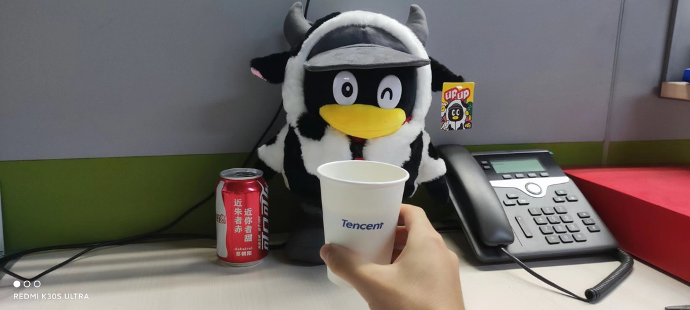

在我的实习结束后，已经是九月底了，我正好准备回家过十月一假期了，于是直接坐飞机回家了，这次回家的机票花了我1037大洋，比从青岛去深圳便宜了三百大洋，还是我大日照比较好。这次坐飞机没有怎么晕，真不容易啊，回家之后呆了几天就又要准备去上学了，这段时间的疫情管理没那么严格，只要没大规模爆发疫情还是能来回跑的。

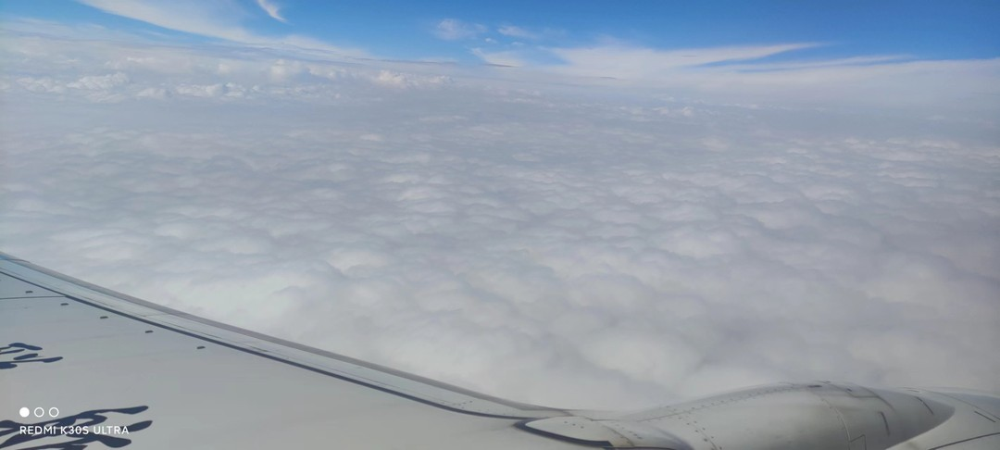

回学校之后，我又开始了我的科研工作，我要深入研究恶意软件检测，并且结合反汇编反编译和自然语言处理技术来研究，在这里特别要感谢lch同学，教我怎么反汇编、插桩、逆向，好家伙这确实是个非常复杂的工作，不过最终好歹是将整个流程走通了，并且完成了很多计算机病毒的逆向工作，可以开始写论文了，这半年是基本什么都没干，光在这搞科研了。我的研究生一半已经过去了，那么在这里就看看学校的小雪吧。

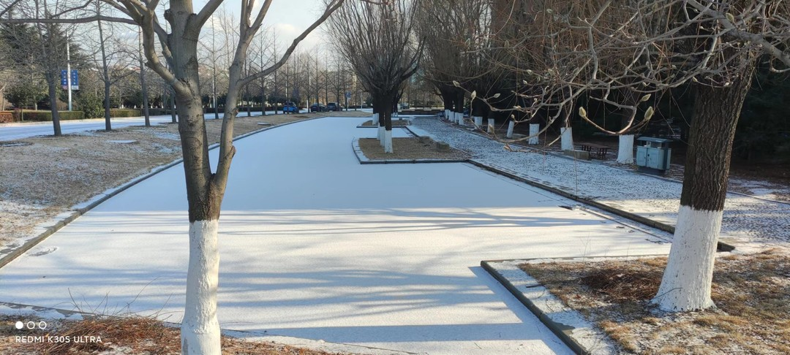

时间来到了研二的下半学期，现在这不是又需要开始找实习了，但是现在的就业环境简直恐怖，比起去年来说，找实习的难度增加了好几倍。我是想只投几家然后拿到offer去实习就可以了，虽然今年比较艰难但是计划还是没变的，当然海投也是可以的，认识的同学有投8家甚至投20家的。回头看了看我的2021年实习春招历程，最后有对22年的期待，“希望明年技术成长能更快一些，春招更顺利一些吧哈哈”，前半部分我觉得我可能实现了，但是后边这半部分，说实话并不算顺利，诸多坎坷不言而喻，还有“要卷就得早卷”这句话我也没有做到，现在回头看真的是比较失策。这次实习我投了字节跳动、美团和蚂蚁，最终也只拿到了字节的offer，这里还有件挺有意思的事情，因为内推的老哥忙的没理我，最后到了下午才投的，最终我是被AI部门截胡一次，又被基础架构截胡一次，基础架构这边是个HR实习生小姐姐捞的我，本着实习生不为难实习生的原则，我的简历在基础架构这边停下了。不得不说字节的效率是真的高，要是All in的话我觉得一个半周走完所有流程不是问题。

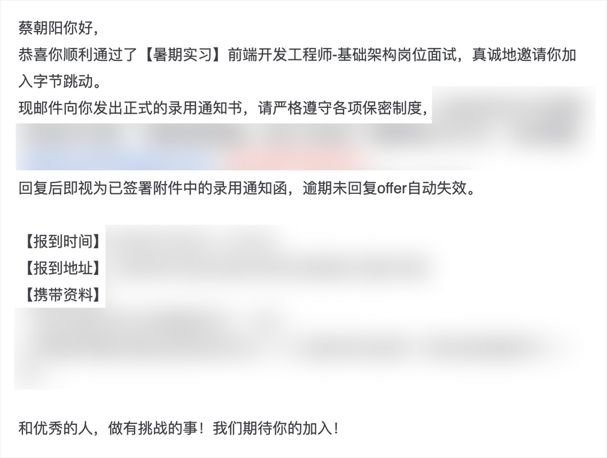

作为参加过21年实习与22年实习的，我觉得我还是有点资格对比一下22年和21年的情况的。先说结论，22年HC也就是萝卜坑大幅度缩水，在数量上相比于去年直接出现了断层，找工作的难度远高于21年，简直没法比。在22年寒假的时候，说实话我还是踌躇满志的，因为我觉得当前的形势还是不差的，造成我这个错误的判断主要有两点，一是在21年底的时候有相当多的大厂开辟了日常实习的通道，这个计划那个计划的，就是招聘日常实习，而且招聘力度还不小。二当时虽然有很多厂传出裁员消息，但是招聘的力度并没有下降，而且当时疫情控制的还可以，感觉经济有一点恢复的势头，虽然有一些利空，但是总归还算是在预期之内吧。所以我一开始并没有着急找实习，虽然21年也有过不少面试经验，但是还是准备一下的好。直到开学的前夕，也就是二月底，我正式开始准备找实习了。从我研究生开始的时候，我就已经打听好了哪些公司招收日常实习可以研一去，哪些公司转正率高可以研二去，所以我一开始就去找了研一就找好的阿里的内推，然后得到了一个坏消息，他们那里只招收985211，不招收双非。然后又去问了问我的学长，还有一些朋友，得到的消息是，某宝、某里云、某钉都不要双非。这对我无异于当头一棒，我立即意识到了今年的形势将会异常艰难，今年恐怕工作是很难找了，我开始慌了，但是事情还是得按部就班地来，总是得一步步地解决。接下来一段时间，某些公司甚至还有极限操作，某些部门劝退了当时已经实习入职的双非实习生，有些核心部门卡第一学历的23所。那段时间某公司裁员的事也闹的沸沸扬扬，甚至毁掉了一些已经签了三方的22届毕业生的offer，可能对于公司来说，毁三方只是那5000块钱的合同，但是对于22届的同学，那是要面对22年春招的地狱级别难度。这里就有一位22届同学现身说法了，他说秋招的时候随便投了简历都有十多家公司给他面试，今年投了很多家只有一家给面试机会了。

22年将会是不好过的一年，从中概股可以略知一二，很多上市公司的股票相较于最高点已经腰斩，甚至已经不如1/3，今年A股的绿也是有目共睹的，美联储还要连续的几次加息，虽然对于这些事情都已经有预期，但是当悬着的达摩克里斯之剑真正落下的时候，还是阵痛不断的。今年有将近千万级别的毕业生，大厂卷不过的去卷中厂，中厂卷不过的去小厂，小厂卷不过的可能就回去考研或者考公，以及本来就有考研和考公的意愿的，在毕业之后的几年里应届生的身份是可以保留的，考研考公还会积攒前几年的考研和考公大军，22年大概有300w人考研失利的新闻相信也都略有耳闻，考公的人只会更多。如果形势继续这么差的话，“今年是过去十年最差的一年，又是未来最好的一年”这句话可能将不会成为一句茶语笑谈了。今年我看到了一句非常让我触动的话，考研唯一的技巧：无他，唯早考耳。现在看来这句话可以用来形容的可多了，找工作是，考研也是，考公也是，等等等等。如果大家想考研的话，我觉得还是找好退路，居安思危，否则的话，怕是只能往死里卷了。

再回到研二下学期，在我拿到了实习offer之后，我准备去上海实习，但是由于众所周知的情况，当时上海是没有办法过去的，所以我实际上从2022.04.18开始一直在线上实习，直到2022.07.26终于抵达的北京开始正式现场实习，这段时间我在实习，我也不去实验室了，鲁老师也没管我哈哈哈。当然本来应该去上海实习的，只不过上海疫情反反复复，今年上海疫情的各种骚操作属实是给整怕了，而且最近上海疫情又有着席卷而来的趋势，这属实是有点绷不住，怕再关几个月回不去学校了就麻烦了，毕竟论文还是得搞的，毕业要紧，恰好我们组可以北京、上海、杭州工作，于是我最终去了北京。到达北京之后我住在回龙观，说到回龙观，就不得不提海淀卷王hetongyang同学了，这家伙除了我刚来的时候见了一次之后，再也没回公寓住过，天天在公司(百度)卷，说一句海淀卷王不过分吧。从回龙观到中行广场还是很远的，高德路线是需要12公里的，主要是我这实习在公司附近的短租相当难找，当然有钱人除外，所以直接不要房补了，直冲回龙观那边住下了。

因为这不是第一次实习了，感觉很多东西都习以为常了。在字节实习的经历还是很忙碌的，特别是我们组里这边很缺人，我作为一个实习生也负责了很多的工作。福利基本上与再腾讯差不多，只不过这边有免费的三餐，并且实习生也给配Mac笔记本了，当然我还是喜欢腾讯的台式机，27寸的4k屏，2060的显卡，简直太香了。因为22年就业压力实在是太大了，并且在字节这边也是有转正机会的，所以我在北京的这段时间做了不少事，最终答辩的时候1v11，简直太刺激了。

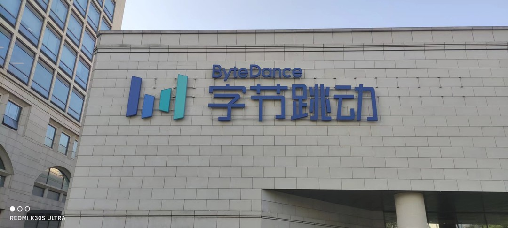

现在时间已经到了研三下学期，因为要回学校中期答辩以及写大论文，离开了北京，这个中期答辩就很诡异，今年刚出来的政策，之前都是没有的，就很离谱，老师也因为这个把我召回了。要不然依旧是需要在北京继续搬砖的，还能多吃两顿公司的盒饭，还有我的24寸大屏幕啊555，刚用了一个月就要把他还回去了。这个大论文也不知道需要写多久，小论文的话本来我发一篇普刊就能毕业的，然后硬生生发了一篇SCI，虽然是水刊吧，但是一边实习一边写论文也废了我不少功夫。大论文估计也得很费劲了，不知道怎么样才能达到毕业条件，咱们带科学校虽然不咋样，但是论文要求是真的严格，等我完成大论文，估计就需要再次开启搬砖生活了。

因为北京当时有些地方有疫情，学校不让回去，那我就先回家了。之后终于通知可以回学校了，然后在踏上了返校的旅途之后，学校又通知要隔离，我这个起码连续俩月低风险的地方也要被隔离，然后被拉去了青岛这边的方舱，反正是蚌埠住了。青岛这边的一刀切政策，凡是市外回去的都需要在方舱隔离，注意是市外，不光是省外，蚌埠。唯一的好消息是不需要自费隔离，但是被隔离总归是有点蚌埠的。这边生活配套设施还算是齐全，居住起来还是可以的，但是隔音特别特别差，隔壁只要有人说话的话这边能听的一清二楚，隔壁老哥一直在打电话，导致我中午睡不着。此外这种板房很难保温，因为还是秋天，昼夜温差比较大，基本情况就是中午需要开空调制冷，晚上就特别冷甚至需要开一会空调制热，如果没有空调的话是真的折磨。然后青岛这边又出现了病例，今天和明天返校的同学又必须滞留了，不允许返校。这边也又运来了大量的密接，这个方舱也几乎满了，导致整体运行效率大幅下降，饭都送的很不及时了，饿死我了。另外吐槽一下这个四点半起来做核酸是真的逆天，饭不及时做核酸那是真的及时。

第一天晚上差点猝死，这个方舱是板房，隔音效果真的是太差了，我简直顶不住，也不知道是隔壁还是楼下，还是对面，昨晚有个人打游戏打到了凌晨两点，我在家都是最晚十一点就睡着了的人，然后被他吵的一直没睡着。对了，我不太到九点就已经睡着了，然后被他吵醒了，然后他就一直开黑打游戏，打了半天CF之后又打王者农药，他和他开黑的那个人的语音我都听的清清楚楚，要了命了简直。此外，昨晚三点半又被叫起来做核酸，真的是究极折磨。今天是周末，不需要上班，就打开电视看了，我平时看电视只关注少儿频道的，所以正好看到了这部熊出没的电影，2022年的贺岁档，熊出没之重返地球。这可以算是我这几年看到的非常不错的一部电影了，包括去年的熊出没之狂野大陆，设定都很新颖，剧情也很饱满，这部重返地球的打斗戏也是很不错的，最主要的是设定和剧情新颖，吊打很多科幻片，可以说是2022年贺岁档唯一一部可以看的电影，当然毕竟也算是子供向的动画，逻辑不算是特别的严谨，但是瑕不掩瑜，这依旧是一部非常优秀的电影。对了，说到这个，喜羊羊与灰太狼的羊村守护者系列也是很不错的，当然因为不是电影，所以剧情比较拖沓，也有很多穿帮的地方，但是也是不错的动画了，在几年前的喜羊羊与灰太狼确实略显幼稚与尴尬，但是这几年的喜羊羊与灰太狼确实变成了优秀的动画。这些动画片让大人和小孩看可能会比较幼稚，但我这个年龄段就刚刚好啦，毕竟我这个年龄段还是有那么一些童心未泯的哈哈哈。

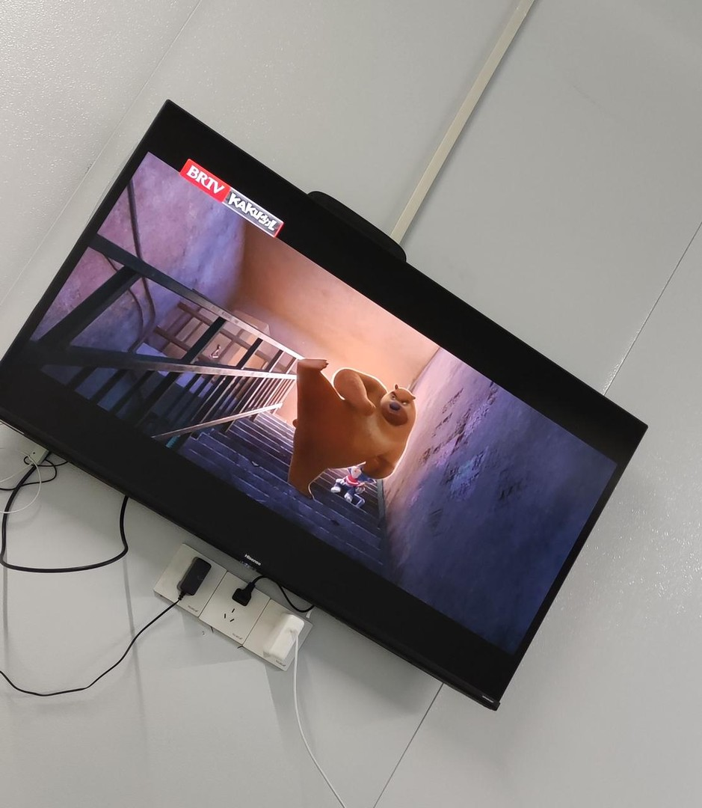

第二天晚上在游戏哥的嚎叫声中睡了一个多小时，一点半又被吵醒了，真的要了命，然后大概两点他终于不打游戏准备睡觉了，我也终于睡了个安稳。BUT，两点半左右，又被叫起来做核酸，简直要了命啊，在这里其他的都还好说，睡觉睡不安稳是真的难受。本来今天通知说是可以直接走了，但是看了一眼名单发现我是疫情重点地区人员，好家伙现在划分重点地区是直接按市划分了不按区划分了是吧，那既然这样还是得等待下午核酸结果出来才能走，估计得五六点左右，折磨。

之后终于回到了学校，我自从回到了学校，每天都在做核酸，我已经持续每天做核酸做了两个多周了，而且学校这边人特别特别多，简直要了命。有一说一，假如真的在学校出现病例，那么核酸检测的时候就是传染的最厉害的时候，这是真的聚集，看图就懂了。图这边是出口，后边的队伍绕了好几个圈，就这个小广场挤了得几千人，而且我拍照的时间还没下课，过一会会有更多的人涌过来，没法看了。

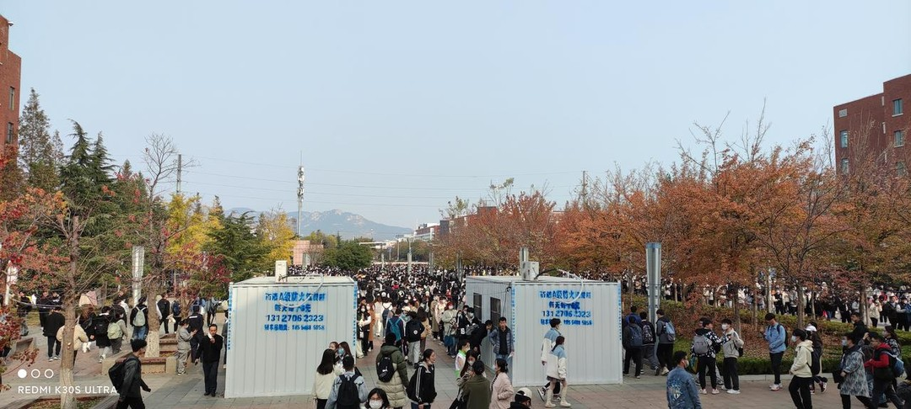

回过头来看看，从七月到十月这段时间，是需要秋招的，今年的秋招是真的折磨，经济肉眼可见的差让所有公司都快速降低了对未来的预期，看起来的结果就是所有公司都不愿意继续扩张了，并且基本都在收缩业务，表现出来的就是都在裁员，大厂都是如此，就更不用说小公司了，这种情况下对于23届的同学来说简直是噩梦，当然很多22届的同学也遭了殃，22届同学们是经历了最好的一次秋招，同样也经历了最大的应届生毕业潮以及三方违约潮，说到三方这件事，对于公司来说违约大概就是5k的违约金，对于应届生来说可能就是错过春招导致相当一段时间找不到工作。至于23届同学，那就是经历了近年来最差的一次秋招了，至于三方违约这件事就不好说了，毕竟一共也没发几个offer，就算违约也谈不上大规模违约了。

今年秋招的HC究竟是什么样子的，对比一下数据就知道了，字节，从22年的8000减到23年的3000，缩减60%多；美团，从22年的10000减到23年的5000，砍掉一半；百度，从22年的80000缩减到23年的2000，缩减了75%；荣耀，从22年的4000缩减到23年的2000，同样砍掉50%；腾讯，23年只招500人，比起22年的7000断崖式狂砍93%。实际情况可能比这个更加惨烈，因为这都是名义上的HC，究竟会不会真的招这么多人还是未知数。如果上边的数据不够震撼的话，我们一起来看一下莉莉丝的一个盲盒岗位的复盘报告吧，莉莉丝算是个很不错的中厂，比较出名的游戏有剑与远征。莉莉丝的盲盒岗位共收到10811份简历，有68位同学进入到了最终的面试环节，有3位同学最终拿到了offer。虽然并不是所有的岗位都是这个样子的，但是也可见一斑了，再比如网传网易的后端校招开了之后，一天时间收到了两万份简历，然后网易下架了这个岗位。或许大家并不是特别在意这些比较大的厂，认为这些厂就是有激烈的竞争，但是现在的情况就是一层一层的卷，大厂卷不过去中厂卷，中厂卷不过去小厂卷，一层一层的卷，绝大部分普通人都会受到影响。当然今年也有比较给力的厂，比如比亚迪，为这惨淡的秋招点缀了一抹光彩。继今年听到的“考研唯一的技巧：无他，唯早考耳”之后，这次秋招又听到了一句话：磨刀不误砍柴工，读完硕士找不到工。

再说回我自己吧，对于我自己来说，秋招也是极其的惨烈，我秋招投了32家，再加字节的转正就算33家，一共10家公司给了面试机会，其他的公司不是简历挂就是笔试挂，流程走到终面的一共6家，最终拿到了5个offer。今年情况确实是太差了，跟找实习完全不是一个难度了，去年找实习投了三家拿了一个腾讯的offer，今年找实习投了三家拿了一个字节的offer，秋招投了33家，拿了字节、顺丰、携程、拼多多、360的秋招offer。

接下来时间到了研三的寒假，从寒假到整个研三下学期，虽然我回学校了，但是我还是一直在远程实习的，顺便还要写着大论文，于是接下来的生活依旧非常的枯燥乏味，依旧是除了上班就是写论文，当然整体来说还是非常痛苦的，因为本来时间就不多，现在就是纯纯的硬肝，当然也幸亏当时还发了篇SCI，写起大论文还算是相对比较轻松一点，当然也并不是那么轻松，毕竟写了97页，总计63164个字，改回来改回去改了好几遍，最后也终于顺利毕业了。

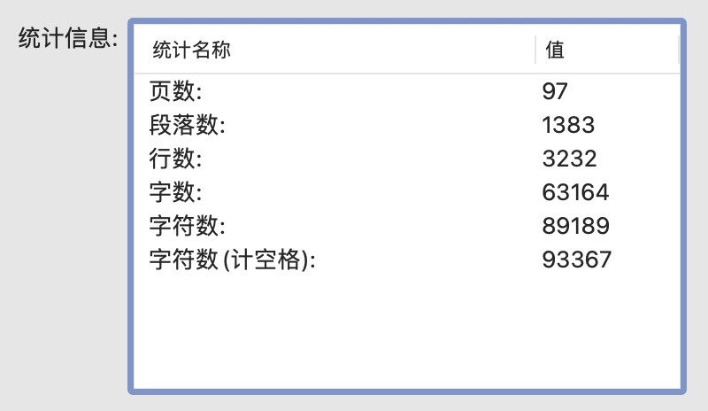

实际上总感觉研究生三年并没有大学期间那么精彩，可能是平时太忙，不是忙着写论文就是忙着上班，感觉像是用了两年时间写了篇论文，然后总共一年半的时间都在实习，当然这其中很多时间是重叠的，这就导致整个人平时都很累，没有能够搞一些新鲜的想法，当然也有可能是因为我没怎么再拍照片了，所以没能留下太多的记忆。研究生生涯总结下来好像只做了几件事，经济独立、拿到了腾讯、字节的实习offer、发了一篇SCI、山科小站5.5万用户以及1.5万日活、拿到了字节、顺丰、携程、拼多多、360的秋招录用offer、顺利毕业。

在17号学校举行了毕业典礼，我们也举行了学位授予，非常感谢鲁老师的栽培，我们也终于毕业了，真的不容易，还有师兄和师弟师妹们，希望能够一起加油，顺利毕业。

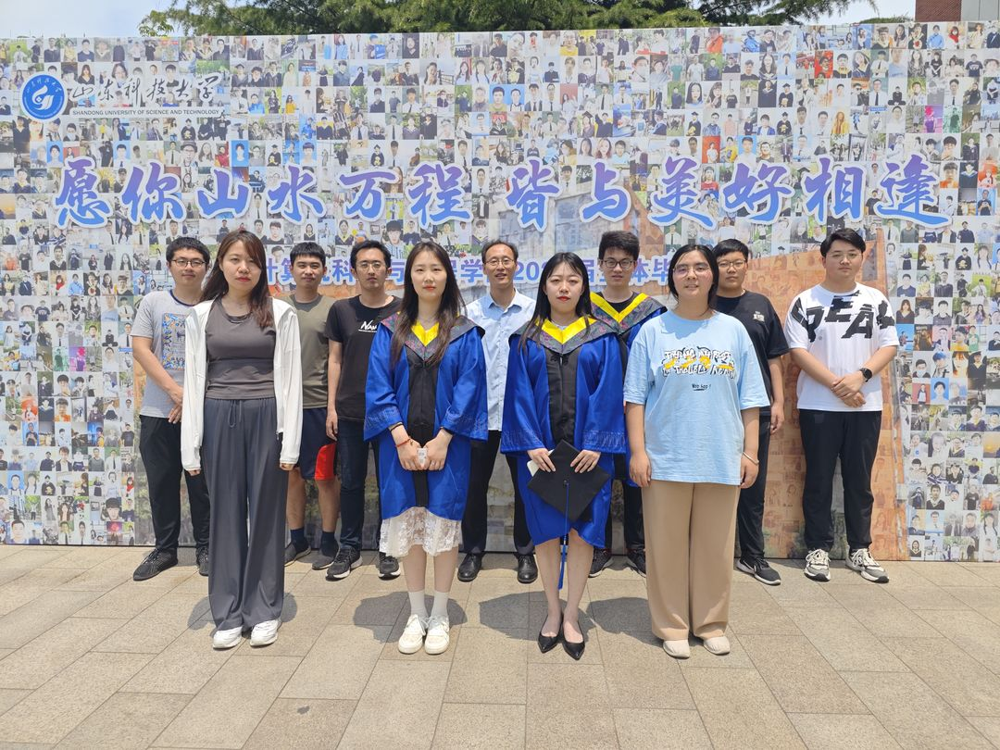

最后，在这研三的下学期，我们终于都顺利毕业了，陪伴我三年的舍友们也都准备回去了，焦焦在18号的一大早就撤了，他需要去大老远的教孩子；瑞宝在中午也撤了，他需要赶下午两点的火车；我在下午三点半也撤了，我需要跟超哥一起回去；嘟嘟在四点也走了，他是入学最后一个来的，也是分别时最后一个走的。至此我们都离开了我们三年的小窝，我们的研究生生涯也就此结束了。

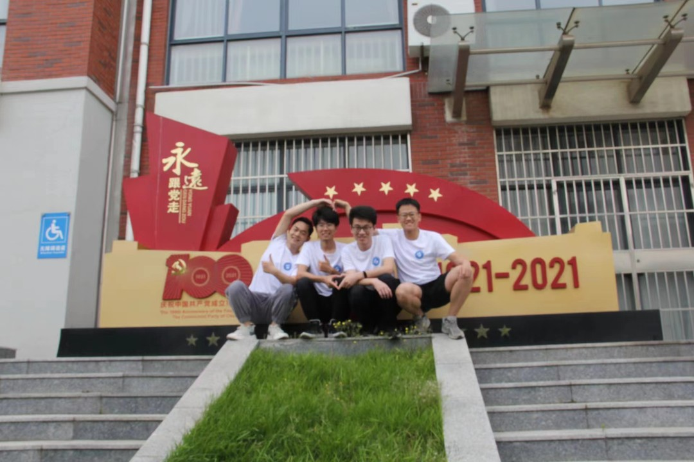

我们的宿舍也宛如三年前刚进去的那样，崭新却又空荡荡，静待着下一届的同学们，他们会在这里度过许多美好的时光，与室友们建立深厚的友谊，同时也迎接挑战和成长，在这里追逐梦想，充满了无限的可能性和未来的希望。我们可以想象，在不久的将来，这里将会洋溢着欢声笑语和生活的气息。当那一天到来时，我们或许会想起这段静谧的时光，怀念这份宁静与平和。

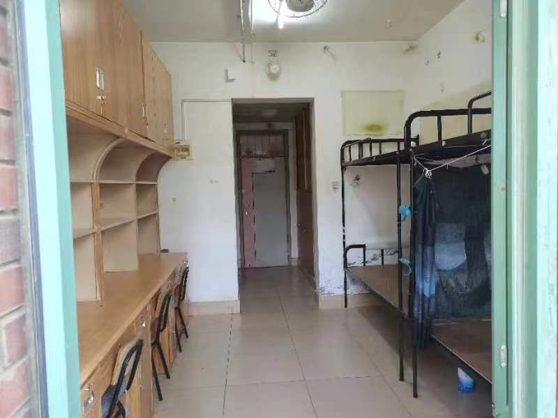

至此，不禁想起B区牌坊上边刻下的联，以此共勉：  

博学于文  
汇人间群书博览者何其好也 集天下英才教育之不亦乐乎  
不戏不怠古今大家皆从学时起 宜勤宜勉中外英才都自苦中来  

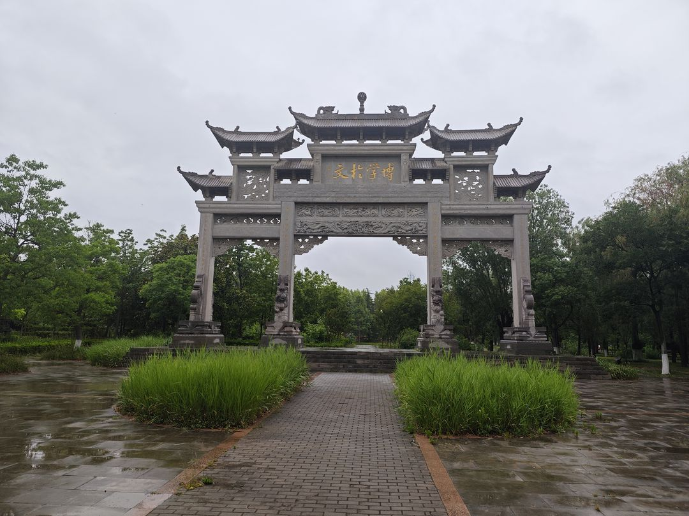

笃行于道   
穷理尽性明德为民达至善 格物致知修身齐家效中华  
水满则溢月盈则亏泽以流长乃称远 有容乃大无欲则刚山因直上而成高  

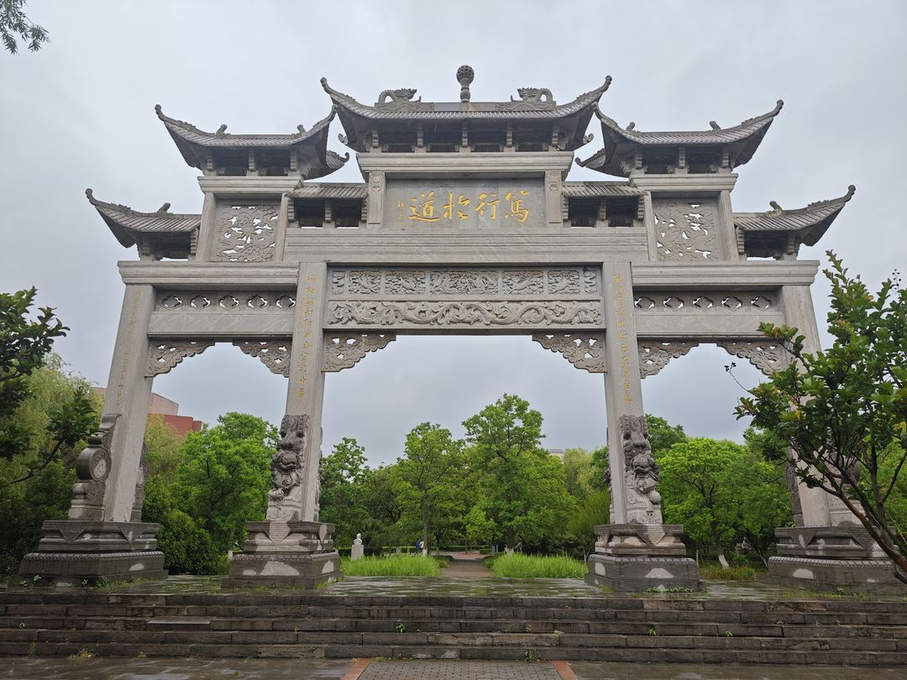

此去经年，应是良辰好景虚设，便纵有千种风情，更与何人说 ---2023.06.18 15:37。

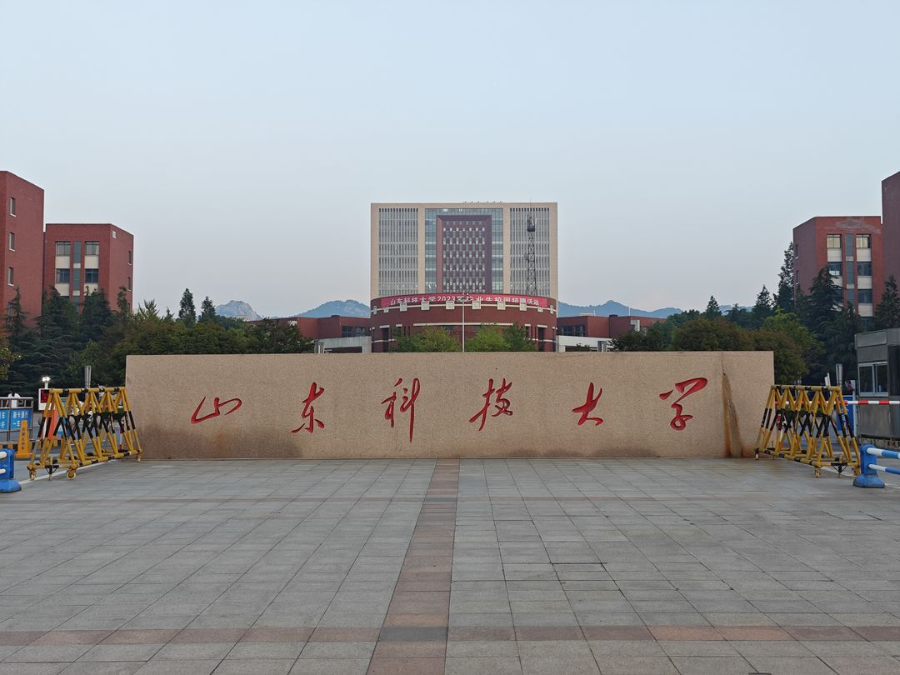

