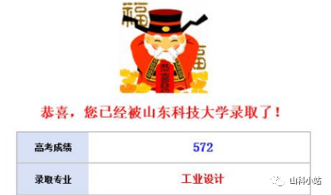
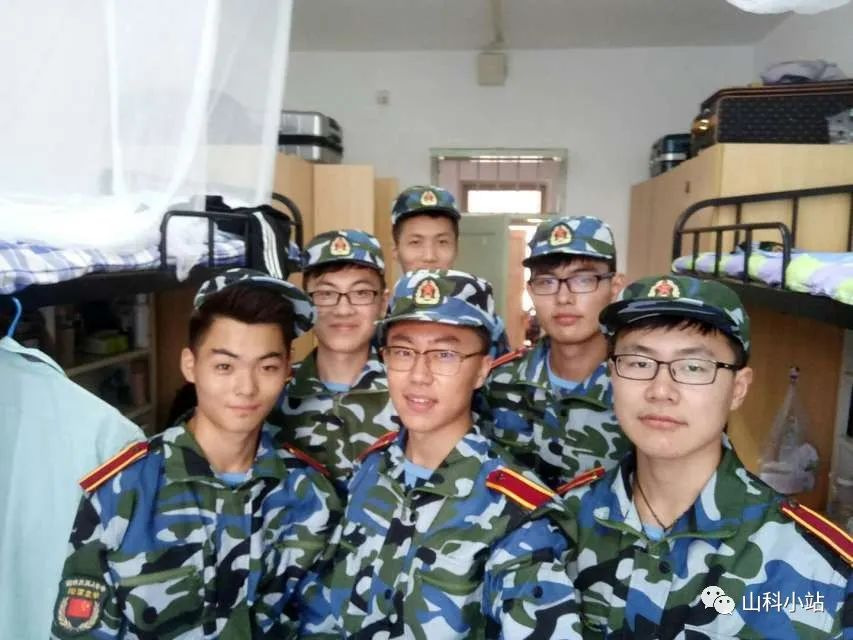
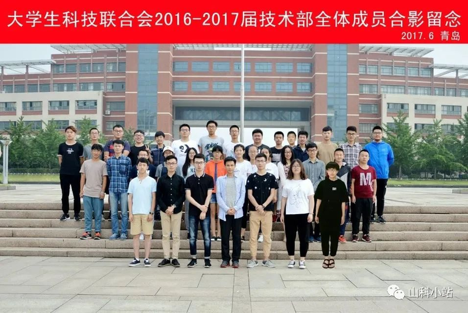
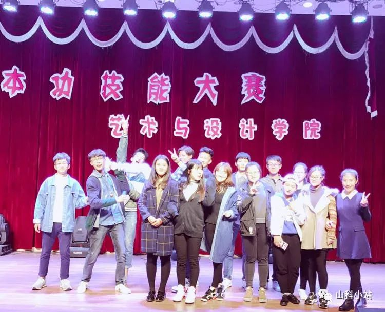
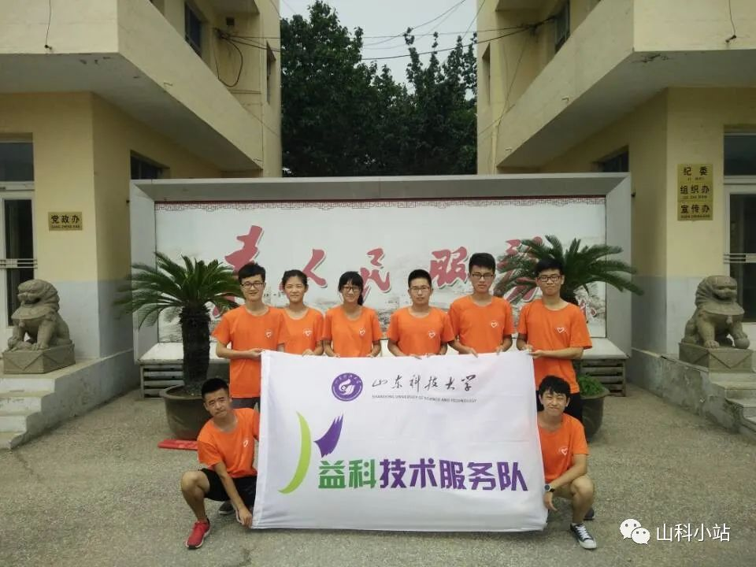
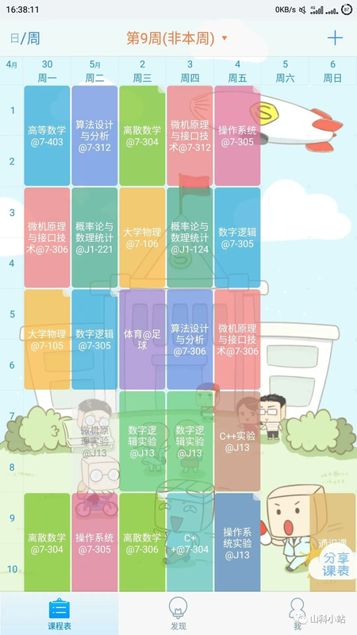
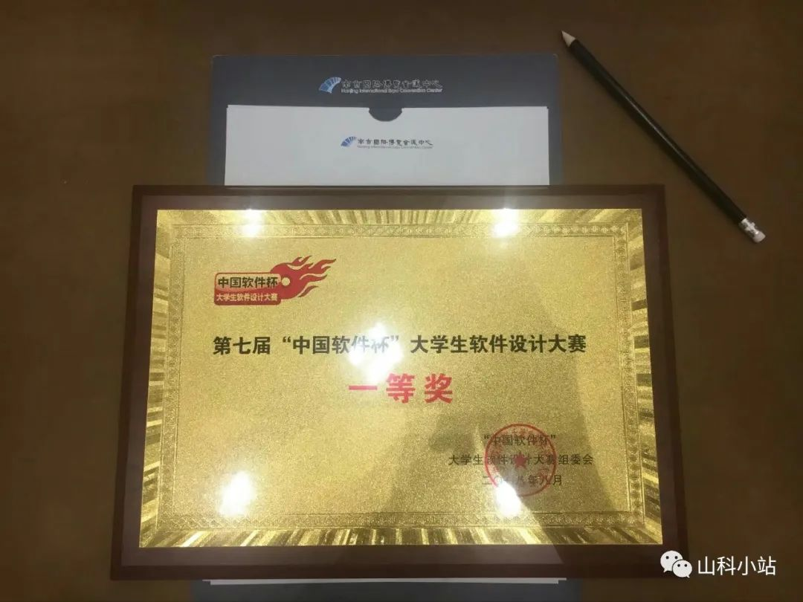
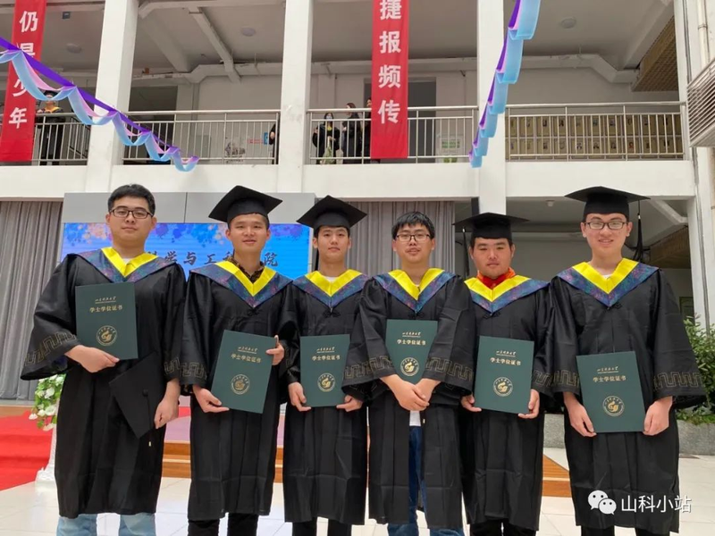
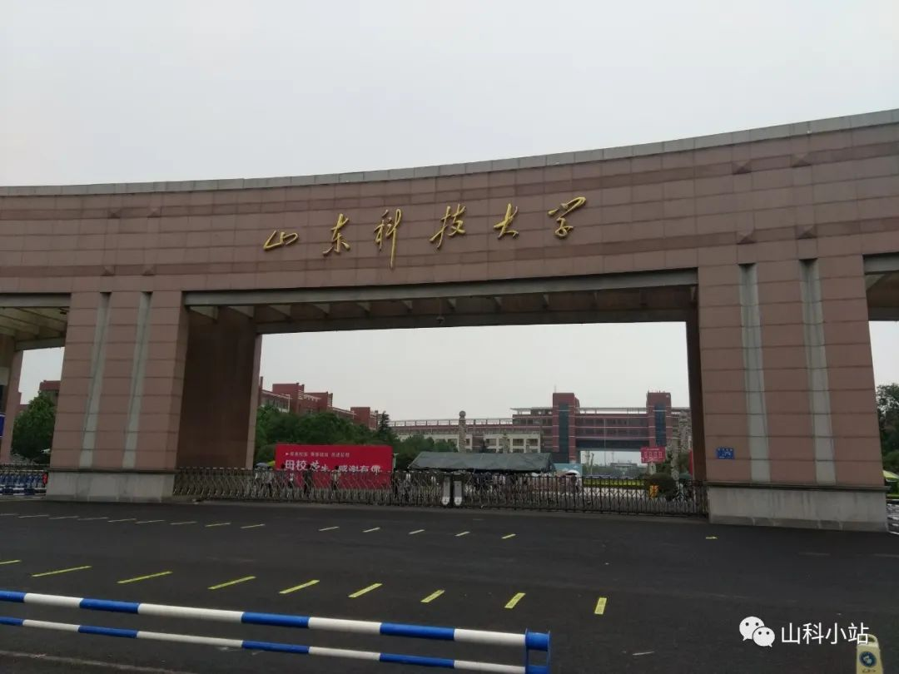

# 致我四年的大学生活
我是个很喜欢听故事的人，我觉得人生无非两件事，听别人的故事，讲自己的故事，那么我也来讲讲我大学的故事。

我的四年大学生活谈不上好，也谈不上不好，算是平淡无奇，或许我们每个人的生活就是平淡无奇而已，有着光辉经历的人只是少数罢了。在这里我也只是分享我的经历，如有不妥，请引以为戒，如有所益，我将不胜荣幸。如果你还想继续看下去，那么，欢迎走进我的世界。

时光荏苒，日月如梭，四年的时光匆匆而过，也终于轮到我毕业了。
回首四年，风雨兼程，在此回顾四年的生活，回忆如梦，以此珍藏。

回到二零一六年的七月，高考填报志愿，我的高考成绩是572分，按照位次来算的话基本也就勉强能上山东科技大学，当时对于学校的各个专业也不是很了解，于是就挑了一些专业报考，等到录取结果出来以后，山科的录取分数线是568，我只是超出提档线四分，而且被调剂了，最终的录取专业是工业设计，像我这么有艺术细胞的人（吹牛逼），做个设计肯定没问题。

之后在家也是闲着没事干，就天天水群，打字的速度就是在当时练成的，然后逐渐就会了盲打，还攒了一堆表情包，不得不说水群还是有点用的，很快就和同学们熟络了起来。在家里除了水群就是和我发小玩游戏，基本就玩两个游戏：合金弹头和红色警戒，真的是整整打了一个假期这俩游戏，也不腻。再有就是了解了一下学校，通过谷歌地球看学校的位置还有一些全景图之类的，当时感觉学校真大，全都是绿色植被，只是位置有些偏，不过不是很影响我，因为我也一般不出去玩哈哈，就这样颓废了一个假期，终于迎来了开学。

开学的时候，不得不说那车堵的就离谱，在向前湾港路拐的那个岔路口，堵了老半天，费劲千辛万苦终于来到了南门门口。当时只觉得学校门口真大，光这个门就这么高，然后就是感觉学校真大，进去走了一段感觉很长的路才到了J1门口的新生报到处，然后就有学长热情地帮我拿行李领我到了B10宿舍楼。然后我们就整理了一下宿舍，准备了一下生活物品，我就和我的家人们去喝了碗羊肉汤。之后，我在山科的大学生活就算正式开始了。

大学第一课那就是军训了啊，当时在太阳下晒得都糊了，说到这不得不说起我舍友老朴，本来假期学车就晒黑了，军训之后那都黑成啥样了啊哈哈。看着当年的照片，不由得感叹当年真的是年轻。

大一嘛，那当然是体验丰富的大学生活了，于是我就加入了两个部门，校级的校科联技术部以及院里的文艺部。技术部这边真的是认识了全校的各个学院的同学，还学了不少技术，整个电烙铁焊焊耳机，修修电脑，压个网线水晶头，拆机清清灰上上硅脂啥的，直接整了个副业修电脑，而且因为接触到了各个专业的同学，看他们都学C语言，给我也整的看着写代码老高大上的样子，也开始自学写了一点C语言。在文艺部这边主要是真的感受到了幕后工作的辛苦，我们部门经常承办一些活动，每次办活动都需要准备很长的时间，办完了活动还需要收拾，幕后工作属实不易，还有在以后吹牛逼的时候，我也是在文艺部工作过，我也是个文艺青年哈哈。不过有一点，参加部门真的是需要很多时间与精力，两个部门就代表着每周两次例会，下了晚自习的时间就得去参加例会到很晚，并且平时在周末，当舍友们都还在睡觉的时候，我就得去组织一些活动或者其他的事情，所以参加学生会这件事情也是有得有失吧。不过要是现在以我现在这个懒劲的，我更加喜欢天天在宿舍躺着睡觉哈哈哈。

在其他的大一同学们还没有上专业课的时候，我们专业就已经上了很多很多专业课了，设计素描、设计色彩等等，这些课一周五节课，虽然上起来是比较轻松的，但是总归还是要去上课的，并且我在B10住着，然后上课的地点在J14双号楼6楼，每次去一趟画室就跟去取经似的，再有就是还参加了两个学生会部门，总感觉自己很忙很忙，根本不是高中听说的大学就是玩，谁在这么跟我说我立马去跟他对线。

到了大一下学期，我们开学之后的这一段时间可能是我整个大一最忙的一段时间，本来专业课就够多了之后又开了一门课，课多到离谱且爆炸，作业需要一点一点涂，如果涂出去一点整张画可能就得重画，当时可是让我头大，等到这门课过去，又有一个采风的课程，去甘肃敦煌参观莫高窟。可惜的是，当时正好赶上了转专业的通知下发，我决定了转专业就不能跟随大部队去玩了，当时转专业也是一件让我非常头疼的事情，转专业的考试考的是高数还有计算机基础，我在我们艺术学院学的是高数C版本，且只有上册没有下册，考试的时候真的是一点都不会啊，计算机基础倒是相对来说简单一些，可以速成。然后我就去图书馆借了一本很薄的C语言以及一本计算机组成原理，关于这个计算机组成原理，我现在真的觉得当时太傻了，直到我学了这门课，我才知道这是个什么多难的东西，我当时怎就想到去借这本书呢，说实话当时我是想转专业到物联网的，因为感觉物联网很牛逼，只是当年物联网不收转专业，所以我转专业的时候就填了计算机科学与技术。当年我是比较幸运的，因为当时转专业到计科的只有三十个人，正好能够组成一个行政班，只要是当年转专业到计科的人都要了，否则凭我在原专业35%的名次以及我的高数水平还真的很难通过这个转专业的考试，不过在2017级转专业到计科的考试就改为C语言了，要是考C语言我还真的不怕，至少考的基础比高数简单的多哈哈。

等到真的转专业成功了之后，这半个学期就算是我最轻松的时候了，也不用担心挂科，平时就比较随便的上上课就好，不过平时就需要开始学习计算机专业大一的课程了，我的压力很大，高数大物等课程都需要补，在这半个学期我自学了线性代数、高数上、C语言、C++等等，感觉好难学。然后到了小学期搬宿舍的时候，我原专业的舍友一人一个行李箱，给我一趟把行李都干到了B1，真的帮了我大忙哈哈，在以后虽然住在B1，但是还是经常会回去一起去大澡堂洗澡，在？有空一起约澡。

时间到了大一的暑假，我和我的小伙伴们去三下乡了，我在的是我们技术部的烟台小分队，我们买了相当多的零件，去三下乡修东西，啥电热水壶、电饼铛、洗衣机等等都修，本来是副业修电脑现在成了副业修家电了，在一起玩的还是很开心的。

经历完三下乡的两个周，我就回家学车去了，要问我为啥不高考完的那个暑假去学车，那只能是因为当时我年龄不够18周岁，不让我报名。于是我只能等到大一的寒假的时候去报了名，并且考了科目一，还是满分过的科目一，现在这个假期我要把科目二学完，然后学了一个多周的车。教练看我这一个假期考一科比较费劲，就让我直接一起把科目二与科目三考了，之后就是上午练科目三，下午练科目二，就这样练了将近两个周的车，然后连着预约了科目二与科目三的考试。当时是第一天考科目二，然后隔一天就考科目三，当时给我紧张的啊，不过最后都是一把过的。之后就是紧接着预约了科目四，在开学之前把科目四也考完了，在放假的最后一天驾照正好也邮递过来了，这一个假期正好把驾照学完了，就是没怎么学习，这个高数下只是学了不到一半，属实是看不懂。

到了大二上学期就正式开始学习计算机了，这也就是疯狂的开始，对于计算机大一的课程，我只学过思修、马原、近代史、毛概、英语等，要补的课那就多了，高数、大物、线代、大物实验、C语言、C++、离散数学等等，每天那就基本上是非常固定的生活，每天早上起来去上课，上一天的课，如果碰到有空的时候就得疯狂做作业，毕竟很多课程都会留下不少作业要做，中午回去睡个觉，然后除了吃饭就一直在自习室学习。掏出一张我珍藏了很久的课程表，再加上我的周末的选修课就正好凑齐了一周25节课，其实我一周的课甚至是都超过了30节课，但是由于课程冲突就必须和老师协商好课程冲突的问题，有时候不能去上课必须就得跟老师解释清楚，反正当时真的是感觉又上了一年高中。

接下来是寒假，寒假在老师的带领下做了一个项目，这也是我做的第一个项目，虽然我是负责前端方面的，但是也接触到了一些后端以及前后端交互方面的知识。假期宿舍楼是不开门的，一直住在研究生师兄的宿舍，一直到小年才跟着研究生一起放假，在这一段时间里，我才真的开始入门软件开发。

大二下学期基本上也就是补课的状态，就是整天上课然后做作业，真的是刺激，下学期参加了中国软件杯，比赛的题目是Activiti国产化迁移与应用实践，就是将开源项目Activiti迁移到国产龙芯CPU环境并且拓展功能，我和zzc以及wfb三个人组队参加了这次比赛。由于我和wfb俩人都需要补课，所以前期工作基本上都是zzc完成的，太强了一神带二坑带我们打进了复赛，复赛结果出来了基本上就快放假了，暑假就得留校做比赛，接下来才是我们三个人的比赛哈哈，就不能光被带了，还是得干点活的，这次比赛学习了不少东西，SSM框架、数据库、Linux基本命令、小程序的开发、Git多人协作开发等等，还使用到了国产的龙芯CPU服务器以及操作系统。如果说做第一个项目是入门的话，那么这次比赛带给我的就是真正的进行软件开发了，当然由于本身技术水平并不高，开发出来的软件可能只能达到能用的程度，可维护性与性能方面可能都比较差。还记得光录视频就录了好十几次，半夜起来改代码，然后经历了几次作品的提交，终于来到了决赛，去南京住酒店，住酒店真的是爽，早餐是自助餐，然后去比赛的时候也是二十块钱一顿饭的标准，点的不够还给补饮料喝，真爽，然后在完成了最后一次答辩之后，我们成功地拿到了国家一等奖，我觉得这可能是我能拿到的最高的一个奖了。

为了打比赛暑假就回家了不到两个周，在家的时候比较无聊就学了学ThinkPHP5，用框架写PHP那感觉就是不一样，不再是纯面向过程了，也有了面向对象的感觉。等到回到学校那就是酷暑，在学校的暑假确实是热的一批，虽然实验室有空调但是吹不到我哈哈，在暑假里我还给自己定了一个小目标，我想之后的大学生活经济自己自足，经济独立，然后研一买辆车，目标总要是有的，万一实现了呢。

大三的上学期课是真的少，就从大二的疯狂补课突然转变成了没啥课可上，就整个感觉很无聊，然后我就开始了我的副业：做外包，整个时候暑假学的ThinkPHP就派上了用场，首先是自己做的一个卖优惠券的网站，因为之前也做过网站的项目，只是以短期使用为目的的话这个网站并不难做，但这个网站最难顶的地方在于对接支付，支付的对接流程真的是比较复杂，看文档看的我有点蒙。第一次对接支付对接了我好久，最后终于把这整个流程弄明白了，然后第一版的订单支付终于完成了，光这就弄了我两天，因为我这个人没有对接支付的资质，就一直在找第四方支付去对接，来来回回换了好几个支付接口，不过有了第一次的经验后边换别的的支付对接就比较简单了。再之后就接了小程序的项目，虽然比赛期间做了小程序，但是我做的并不多，现在正好这个就当我练手了，当然这个是受ly之托做的，并没有收费，练手项目也不好意思收费哈哈。再就是真正的开始接外包项目了，现在主要都是做微信小程序了，现在做微信小程序已经比较熟练了，当然这个时候也只是会用原生的方式去写，模块化组件化等还不熟悉，然后又到了喜闻乐见的对接支付环节了，本来我认为我以前对接过支付应该做的挺快，可是我发现是我太天真了，我又被卡住了，主要是卡在了那个最后的验证签名那一步上，怎么验签都不对，直到那天下午我直接把key等全部重置了，然后就神奇的验签成功了，迷之操作啊，有时候写代码就是玄学。

时间到了寒假，这个寒假玩的是很不爽的，想着开学要开始考研就浑身难受，在家是不可能学习的，但是在家里也属实没啥事干，于是打算投投简历找找工作玩玩。于是简单地制作了一份简历，在Boss直聘上投递了几家青岛本地的公司，当然基本都是小公司，我就一直在跟HR他们聊的还不错，当时感觉还是挺好玩的，直到我投递了一些相对比较大的厂，简历犹如石沉大海，再无声息。

大三下学期开学了，就得开始考研了，这个学期课还贼多，就比较烦，有一天上完了课，想找个教室上自习，找了半天也没找到个自习室，强智的智校园App也没法用了，进不去，之前我通过抓包弄清楚了为什么智校园会崩溃，这是一个没考虑到高并发的设计缺陷。虽然我知道问题所在但一直也就将就用着，现在我忍不了了，我这想起来chd之前找的Api，于是我就回宿舍自己封装了一个网页，套壳的App去替代智校园的功能，虽然当时用户并不多，只有几百位用户，但是我感觉这个确实是可以做下去的，尤其是因为某种原因下学校关闭了外网访问而我搞了一手内网穿透的时候，用户量激增啊。有一次跟ly还有lgj同学去小珠山玩的时候，ly建议我做微信小程序，于是我在上课也抱着电脑的情况下花了两天时间做了第一版的山科小站小程序，对了这个山科小站的名字也是ly同学取得哈哈，之后便是不断地维护修改拓展功能。虽然这段时间应该是考研的时间，但我还是挺不务正业的，这期间我还投了一些公司，我还自不量力地投了一下阿里，连简历关都没过去，还是内推，在现在看来当时真的是有点自不量力，因为现在在深入学习了前端之后才真的明白当时是啥都不会，本来还自我感觉良好来着哈哈，现在想来当时要是像wfb那样深入学习一门语言才是正道啊。

暑假留校考研了，暑假前段时间在原来宿舍学习，宿舍就我和老朴俩人。再到后来他去北京了，我也回家了，回家呆了十几天，回学校继续学习，我们几个人在S1大教室备考，不得不说S1大教室真的是一个神奇的地方，冬冷夏热，当时是哪里都热，本来做题就浑身热，教室也热，宿舍也热，热热热热热热。

八月底正式开学了，现在已经是大四上学期了，这段时间我也不看视频了，出门也不带手机了，代码也不写了，我的电脑几个月的时间有了一层灰。说起来我睡得还是挺多的，每天睡到八点，然后上午一般都是学数学，十二点半去吃饭，到了宿舍就一点了，然后得玩半个小时手机，睡一个半小时，三点启程去学专业课，再到六点多去吃饭，吃完了饭回来看政治视频，然后做一个小时的政治1000题，再做一篇英语阅读，借阿翔的手机查单词，记在本子上，每天背两页。虽然我睡得很多，但是因为不带手机，感觉效率还是挺高的。真的是一学习就啥都想干了，在每天的学习之余就计划着考完研究生我要做什么，想着考完研我要学Vue，重学Java，重写山科小站等等等。在报考的时候确实是怂了，计算机专业属实是太热了，于是我还是稳了一手报了本校。考研的时候，那真的是就怕我把炸弹带进去的样子，在J1门口一处安检，给你扫一遍，钥匙校园卡一律不让带进去，在考场门口还需要扫一遍，比高考严格的多。考完研究生以后，在学校里玩了两天，本来计划宿舍一起出去玩，然后考完了宿舍的家伙们都懒得动弹了，都在宿舍躺着。

回家之后，就算是寒假正式开始了，我并没有完全完成当时的计划，我只重构了山科小站的代码，学了学Vue，学了一点机器学习的相关东西，做了一个App，还看了两部电影追了一部电视剧。之后便是赶上了疫情，开学日期一拖再拖，然后就是考研出成绩了，政治65，英语84，数学88，专业课138，总分375，没想到我能考这么多，今年疫情研究生扩招了很多，各学校分数线相对来说都低不少，确实感觉考本校比较亏，实际上是亏大了，既然已经选择了，那就好好走下去，总结的经验就是我有点太低估自己了。之后便是一个漫长的假期，我开始了我的每日一题计划，真的是学习了wfb还有听了lzf的建议深入地学习一门语言，然后决定了决定了我的目标方向就是前端了，因为我确实对于前端更加的熟悉，每天一道题，大部分是找的一些面试题，每天都把题目当作一篇博客去写，无论是深入学习还是以后遇到了问题当作资料查阅都是很好的方式。

大四下学期开学格外的晚，我是6.6号返校的，当时返校就没有几个人，虽然这么长时间不在学校，但是被子都没长毛，一切照旧，几个人一起玩玩闹闹的时间就过去了，然后就开始给周老板打工了几天。终于到了20号，省外的同学们回来了，做了核酸检测之后基本上当天或者21号就归位宿舍了，22号省内的同学也归位了，宿舍终于聚齐了，今年的毕业季真的是匆忙，23号上午毕业授权仪式，23号下午去原班里拍毕业照，晚上我们宿舍小聚，24号上午学院拍毕业照，下午班里拍毕业照，晚上去616宿舍小聚，25号大哥和侯老爷子就回家了，26号全员回家，毕业季不经意间结束了，匆忙而逝。时至此时，我也完成了我的小目标中的一个，从大二暑假到现在的经济自己自足，至于研一买辆车这个小目标难度有点高，尽力而为吧哈哈。

此去经年，应是良辰好景虚设，便纵有千种风情，更与何人说 ---2020.06.26 07:53。

