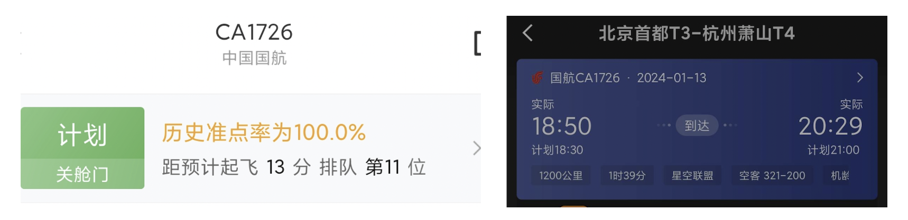
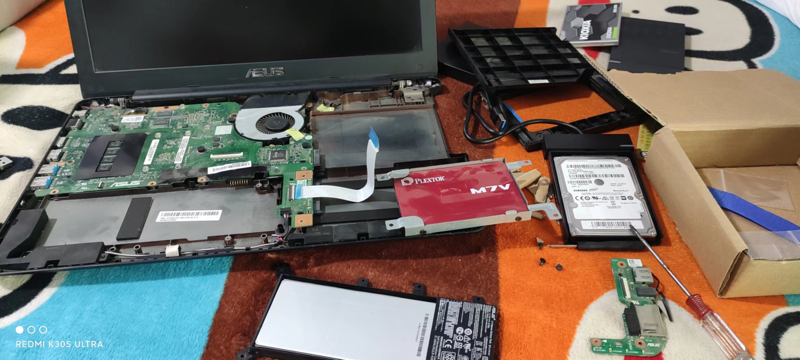

# 记一些日常的想法与思考

## 2024.03.21 好奇心
前段时间我看到了一篇文章，文章中提到他面试时被问到的一个问题，你认为做技术最重要的是什么，他的回答是对技术的好奇心。我觉得这个回答真的很棒，好奇心代表着什么，代表着对于技术的探索，是在遇到有趣的事情时，能够深入挖掘并且认真思考，能够做到对事情独立思考已经是很多人都做不到的事情了，更别提去探索未知的问题。回到好奇心这个问题上，让我们来升华一下，我们不能够否认人类的生活品质提升，或者说生产力的提升，主要是科学技术发展所带来的，而这些科学技术的起源很有可能就是对于某件事产生了好奇心，由此不断深入探索进而产生了促进生产力发展的科技创新。

上周有人问过我为什么要写博客，有这个时间接一些外包的小项目赚钱点不好吗，或者搞搞其他副业之类的，赚点钱多爽。其实我也想过这个问题，毕竟我大三就接过很多外包了，但是后来我深思了一下这个问题，如果搞副业赚的钱是一种财富，那么积累的知识又何尝不是一种财富呢。

## 2024.03.06 内卷
我之前常常在思考一个问题，内卷和努力的区别究竟是什么。这可能并没有准确的定义，我目前的理解是内卷一定是有多个人一起在恶性的竞争，比如两个人在比谁工作的时间长，谁加班加得多，并且实际上没有提高任何效率，加班的时候大部分都是在发呆，这种应该就是所谓的的内卷。那么努力的话是一个人也可以做的事，当然多个人也可以，大家没有利益冲突，相互学习相互帮助，一个人的话就是做着自己感兴趣的事，比如每天下班后学习英语之类的。但是话又说回来了，个人的努力实际上是在更大范围上来说还是竞争，在目不可及的范围内打败对方，大家肯定也体会到整个环境越来越卷了，从另一个角度上讲，这或许也是社会发展的动力所在吧。

或许根本没有努力或者内卷的区别，大家都是在认知范围内做到的局部最优的决定，毕竟凡事没有绝对的黑白之分，大家可能都是在为自己既定的目标努力着而已。此外我觉得我还是比较卷的，想我大学一年学完两年课程，当年一边秋招一边实习一边写论文，那是真的时间规划大师。那么我的朋友，代价是什么呢？代价就是到现在都还没有对象，过年回家差点就要去相亲了，我很难绷。

## 2024.01.13 高速飞机
在返回杭州的时候，我看到了一个非常亮眼的100%准点率的国航航班，所以想坐下试试。经过比较长时间的常规安检等操作，我成功坐到了飞机上，也许是因为首都机场的飞机比较多的原因，飞机一直没有起飞并且一直在排队，一直到最后晚了`20min`才起飞，当时我就在想这次会不会打破这个航班的`100%`准点率，事实上是我想多了，这个国航航班颇有我们山航的风范，晚飞`20min`提前半小时到，终于知道这个`100%`准点率是怎么来的了，合着是在天上超速超出来的。

回来的时候我还发现我干了件蠢事，我用的高德个人账号打车回公寓的，其实只是这样倒是还好毕竟是可以通过发票报销的，但是这其中是有一项机场高速过路费，这个费用我是没有办法拿到发票的，我还咨询了高德客服能否将订单转移为企业订单，得到的答复是不行的，所以这部分就是只能自费了，不过后来咨询了值班号这部分费用是可以按照发票丢失的标准报销的。真的有点难绷，以后我还使用企业滴滴打企业用车吧，高德还是用来个人打车，主动区分开渠道，避免再出现这种低级错误。

## 2023.09.03 跑步的奇效
今天是周日，我平时是非常宅的，于是今天跟往常一样除了出去吃饭就是基本在公寓躺了一天，只不过今天感觉下午躺的时间太久了就起来写了篇博客，写了俩小时理了下大纲写了个开头，之后就准备下楼吃饭了。吃完饭回来之后想接着写，也不知道是下午睡多了还是怎么着，浑身不舒服，又是头疼又是恶心，量了一下体温发现也没发烧，症状一直持续，躺着也不行，非常难受。

因为我最近两个月都是隔天去公园跑步，今天又到了跑步的日子，但是今天这么不舒服又感觉够呛能跑。在躺了一会之后感觉越躺越难受，我直觉告诉我多动动就好了，于是本来平常是九点跑步的今天八点我就下去了。到了公园之后这次我没有立即开始跑，先走了一圈缓一缓，然后开始跑步，跑的过程中就一直警惕不要跑快了，尽量慢一点多出汗，稳重一点。在跑完之后走了两圈，症状虽然有些减轻但是并没有完全消失，我又不太敢回去继续躺着，于是在公园的椅子上坐了一会，大概坐了`20`分钟，症状奇迹般地消失了，看起来平时还是得多运动，毕竟还是狗命要紧。

## 2023.08.27 产品的性格
在这里想聊点有意思的，产品的性格。今天想到这个问题主要是跟`K`同学聊到了山科小站的更新，然后让我想到了之前组长的`BLOG`: 像`Effie`的[官网](https://www.effie.co/)，整体而言非常简约，但通过诗词的点缀，顿时让这个产品有了性格，桐花诗八韵，思绪一何深。 那么为什么我们的产品似乎没有独特的性格，一位同事评论说，也许缺乏创始人的性格注入。

再回到山科小站，山科小站基本是我一个人开发的，也算是创始人了吧。山科小站作为之前做的校园小程序，用户`5.5w`，日活`1.2w`左右，`pv`在`5w`左右，在学校的日活度已经算是很高了，最近一段时间我在想要不要继续更新功能，因为现在要是备案的话山科小站`plus`应该过不了了，我需要将`plus`的部分能力移到小站当中。`K`同学跟我说希望想能把小站传下去，让后面的人能一直参与更好，但是我们后边又聊到了之前做的很好的校园小程序基本都没了，他总结道类似的项目创始人一走直接就垮了。说到这里我就想起来了，在山科小站的主页每天都会有一个中英句，并且还有一封配图，下边这个就是今天的每日一句。这可能就是我作为创始人给产品注入的性格吧，也有很多有心的同学跟我说过每天看到句子特别是一封新的图片会感到很治愈。

再看着`Effie`，`Effie`是一个类`MarkDown`的富文本笔记应用，而我目前在做的也是富文本的产品，那么问题来了，我在做的产品为什么没有自己的性格，或者说没有非常独特的点呢。我想也许真的是像同事说的，缺乏创始人的性格注入，大家在实现功能的时候被太多的建议和反馈掣肘，在需求评审的时候也是众多人的意见注入，这样我们的产品可能是一个符合大多数人需求的应用，但是却并不会成为一个奇妙的产品，当然这并不是一个错误，只是觉得有有一些可惜。虽然这只是我的工作，但是我更希望能完成一个让人眼前一亮的产品，让用户觉得这个产品是有美妙的事情在其中的，而不仅仅是一个合格的工具产品，希望能够让用户在使用的过程中慢慢从我们的产品中发掘特点，借用雷总一句话，可能用在这里不太恰当: 永远相信美好的事情即将发生。

再回到最初的问题，既然我们并不能像创始人一样，将性格毫无顾忌地体现到产品中，那么我也希望能够将我的一些想法体现到产品中，现在我想到的一个点是，希望让用户在使用我们的产品时能够完全脱离键盘，不需要触碰鼠标就能完成整篇文档的编写，这个点说起来容易，起来实际上还是很难的，如何让用户知道所有操作的快捷键，而又不需要用过多的`Tooltip`提示用户，做到一个平衡，并且能够让用户记住这些快捷键，或者能够让用户慢慢挖掘并感到惊叹是有点东西在里边的，这并非一件易事。

## 2023.08.15 铩羽而归
最近我从我为数不多的`3.5`天年假中请了`2`天年假回家去处理事情，对于这件事情大概可以归纳于需要处理档案的问题。大概从六月开始我就在考虑应该怎么处理这件事，一直到八月档案终于到了日照市人才市场，我终于可以开始处理这件事了，实际上档案在两个周之前就到了人社局了，但是一直没有归档，我打电话咨询了一下他们就给我优先处理了一下，人社局的服务是没的挑的。那么关于这个档案，我需要先去镇上开证明，然后去市里再开证明，然后再回到镇上提交，镇上说证明提交必须本人办理，那么我确实是没办法了，我就回家去处理这件事。因为离家确实很远，单程坐高铁基本就需要一整天的时间，那么我只能延着周末回去，请了`2`天的年假，周六回日照，周二回杭州，又因为这些政府单位双休不上班，并且工作时间一天只有`6.5`个小时，那么我就必须在周一这一天的时间跑三个地方把这件事办完。为了尽快处理相关的问题，我在回家之前打了很多电话去了解相关的情况，主要是给镇上打的，起码打了`20`个电话。到了周一，我在他们上班前半个小时就在外边等着了，然后我去跟他们说我要处理这个问题之后，他们竟然说办不了，我之前打电话他们说能够处理，到了我请了假亲自到现场了之后他们说不能办了，我是真的服了，我请了假买了票费了这么大劲回家就跟我说办不了，我是真的服的，不能线上处理就算了，竟然我到了现场你就不给办了，真的牛逼啊，于是在最终没办法的情况下，我只能铩羽而归回到了杭州。

这次回家是真的有点倒霉的成分在里边的，首先是回家想给鱼缸的壁挂过滤器刷一刷青苔，然后因为一个疏忽没加水启动了机器导致离心泵坏了，又弄了一个新的，然后新的密封性不是很好，我用胶枪粘上的，粘完了之后才意识到应该用哥俩好粘，否则玻璃胶泡水容易脱落，在浴缸里脱落了相当于没密封了，但是这个时间我又得急着走了，只能国庆假期回去处理了。然后我晚上嫌我的床上的小风扇太吵了，然后给他拆开上了点润滑油，发现没有用，之后发现其实是风扇和那个连杆固定处发出的声响，那个连杆竟然能自由活动了，电线也因为能够自由活动缠的很厉害，于是我就直接拿哥俩好给他粘上了，之后风扇就没有办法正常转动了，我查了查资料才知道那个连杆需要是需要能够单向转动才能让同步电机单向转动，不过本来确实也坏了，然后我就又买了个新的。再者就是处理档案的问题没处理成功，还白白浪费了一个周末和`2`天年假，本就不富裕的年假更是雪上加霜。最后就是我平时是买不到直达杭州的票的，都需要中转，然后我从日照西到盐城的这段高铁竟然延误了，还延误了`16min`，真的是活久见，以前经常见晚点`2min`的，头次见直接延误`16min`的高铁，主要是怕再延误，这就很容易耽误我的第二程中转，不过最后还是成功到达了杭州。

这次回家经历了诸多不顺利的事，导致了我整个人也非常的`EMO`，感觉到特别的无助，特别是办这个档案的问题，我都在打了那么多电话，把所有流程都摸清了，然后给我整这个，我甚至去找他们的领导反应了问题，他给我的回答也是办不了，我是真的醉了。我计划了这么久处理这件事，到最后还是没有办成，而且是浪费了巨大的精力和时间处理也没有成功解决。这个时候就感觉到特别的无助，好希望有人能够帮帮我，而且后续我也没有想好应该怎么办，这个时候就感觉自己好惨啊，背井离乡这么远来杭州打工，好想找个能开两个小时车就能到家的地方工作，稳定一些离家近一些，回家和处理什么事情也都方便一些。当然，人生不如意事十之九八，失败总是贯穿人生始终，遗憾才是青春的常态。借用宋朝方岳的别子才司令: 不如意事常八九，可与语人无二三。

## 2023.07.15 保持正向反馈
最近我在思考一个问题，应该如何在工作中不断提升自己，保持一个良好的正向反馈，虽然我已经工作了将近一年半了，但是大部分时间都在远程，直到最近这不是才现场入职工作嘛，所以现在的我是实际上还是一个初入职场的萌新。那么作为一个新人我可能对我现在的工作充满了激情和动力，因为很多东西都是之前没有接触过的，能够将慢慢地将问题解决确实是一个对于自我的提高过程，能够在工作的过程中有收获，这是一个正常的反馈。那么问题来了，如果我现在已经工作了五年，我依然在做着跟现在一样的工作，那么对比一下，这个工作完全可以找一个像我这样的应届毕业生来做，那么让我这个工作五年的人来做，对于我来说已经非常轻车熟路地来处理相关问题，可能我对比新人来说能够比较快的解决问题，但是对于我个人来说并没有什么提高或者收获是很少的，那么整个过程中我自己的正向反馈是在不断降低的，这并不是一个好的现象，可能会陷入一些精神内耗的问题。

实际上对于这个问题我现在还没有一个比较好的答案，而且可能想的比较远，对于我个人来说我目前的主要任务还是蓄势，开阔一下视野，因为当前我确实能够在工作中有很多收获，拥有一个比较良好的正向反馈的。但是以后呢，目前我作为小萌新能够想到的未来发展方向主要是两个：如果以后往管理方向发展，希望在管理、业务能力上不断获得正向反馈，那就要不断提高自己“解决问题”的能力，这个解决问题不光是技术上，还有业务上、沟通上、视野上等等等方面的能力，是一个综合发展的方向；如果以后往技术方向发展，那么这个“解决问题”的能力以及正向反馈就主要集中在技术上了嘛，对于我们前端来说也主要是两个发展方向，一个是大前端方向，包括但不限于`Web`、`App`、小程序、`WebRTC`、`WebGL`等等，另一个就是全栈方向，可以借助于`Node.js`不断发展的契机来承接后端的工作，除了在业务上作为全栈之外，一些其他的方向例如`Serverless`等也许也是不错的发展目标。最后，还有一个我自己的观点，通常后端是最了解业务的，那么前端实际上是最了解产品的，也许往产品经理方向发展也是个不错的选择。

## 2023.06.30 正式入职字节
昨天我正式入职了字节，正式入职了之后司龄也清零了，想我实习了这么久的`1.19`年的司龄现在成`0.0`了，有点难绷，那么至此我的字节实习也结束了，接下来就是需要正式地工作了。目前来说对于工作我倒是没什么很特别的体验，因为今天实际上已经是入职第二天了嘛，感觉跟实习似乎没什么区别，当然这也是因为我实习的时间实在是太长了，大家安排的工作基本已经熟悉了，虽然我现在是司龄`0.0`年的小萌新，但是依旧是负责了之前的工作，实际上这么看起来似乎很亏，刚入职不能`landing`还需要负责这么多工作。

让我产生一些想法的是租房的这个问题，因为这次我是找的浙大爷合租的，浙大爷又一直在杭州所以我相当于是个拎包入住的选手，后边我处理的问题基本都是属于锦上添花的工作，主要的租房看房还是浙大爷来做的，这次我们是找的贝壳的中介租房，中介费是月租金的一半。之前无论是我在北京还是深圳租房都是非常抵触中介的，特别是北京深圳的中介要一个月的房租，但是经历过这次租房我感觉中介也不是不可以接受，因为找了中介确实让我们省去了大量的麻烦，之前我一直以为中介只是负责了促成交易，促成交易之后什么就都不管了，这位在我们签合同之后还帮我们处理了不少事情，比如合同、网络、物业的一些问题，另外甚至还帮我们跟房东讲价便宜了`100`大洋并且包了物业，我们两个人是租了两室一厅一共`3700`大洋，当然不排除这两位在唱双簧的可能，但是确实是比贝壳上标注的价格少了`100`大洋。怎么说呢，这次让我感觉中介也不是不可以接受，当然只促成交易的那种还是算了，中介更像是我们花钱买服务，可以省心不少，另外申请房补的材料感觉他也轻车熟路，感觉上比我这个员工还熟悉房补的申请材料。

再说说杭州吧，杭州是真的热，本来我家里(日照)也就是27摄氏度的天气，到了杭州直接飙到了36度，热死个人，要不是之前去过深圳有过预期南方会很热，初来乍到的真的会顶不住。在这里除了房租会便宜点，当然我这是押一付三再加上中介费，两个人平摊一人要`8325`，一次性交出去还是非常肉疼的，这个便宜是相对来说，因为在北京的话这个价格可能得`3/2`甚至`double`，但是在这里物价还是蛮贵的，感觉跟在北京差不多，所以在这里除了买了一些基本的生活用品之外还是网上买吧，毕竟网购是不分地域的便宜，并且这边是江浙沪地区，快递还很快。虽然说我现在没有产生什么刚来的不适应(除了热)，睡的也很好，没有产生什么刚到新地方的焦虑，但是还是想回家，感觉还是回家好，在家里呆着太舒服了不想背井离乡地跑这么老远的哈哈哈。

## 2023.05.20 完成毕业答辩
今天终于结束了我的毕业论文答辩，研究生生活即将画上了句号，之后或许我会像我的大学四年一样聊一聊我的研究生生活。在这里我实际上想聊一聊关于应届生身份的事情，因为最近发生了一件可能决定我人生未来走向的问题，但是因为保密问题我不能说太多，这个问题让我重新思考了我对未来的规划以及应届生身份的问题。

其实我从来没有打算在大城市定居的想法，以后想不想就不知道了，起码目前是这个样子的，我在想我现在去大城市工作几年，最后回五线城市的老家，这个想法究竟可行不可行。在越小的城市里边，体制内就越舒服，这是个杠杆和比例问题，此消彼长的性质，那么我回家了之后，能在家里找到稳定的工作吗，这就需要思考了，甚至于在山东基本都很难找到互联网的相关工作。实际上从体制这个问题就得扯出来应届生身份的问题了，众所周知，应届生的身份非常重要，无论是公务员事业编还是国企、银行等等，应届生的身份都是占有很大的因素，很多地方是非应届不要了，甚至于说应届生有很多非应届基本得不到的优势，比如北京和上海户口，特别是北京户口可以说是此生唯一机会。

那么回到我自己，实际上我现在考虑毕业能不能回家去体制内已经晚了，我答辩完成之后大概率就是要去杭州字节工作了，失去了应届生身份之后，再过几年之后回家真的可行吗，我能回家干什么呢，家里根本没什么产业，我可能回家只能进厂或者开滴滴了，当然我自己还有一些摊煎饼、修电脑的手艺去摆摊开店也不是不行。不过这可能是十年之后的事情了，未来的情况谁也不知道，实际上主要是我这种悲观主义者对未来不看好，而且缺乏对未来一往无前的勇气，也可以说是一个心态问题，不过还是希望未来能够有更好的发展吧。其实话又说回来了，本来人生就是很累的，有无数的人推着你走，根本没有办法停下来歇一歇，如果能放弃一些东西而生活的快乐一点，又何尝不可呢。

## 2023.04.22 为什么要读研
其实这是接着上次去杭州的这件事聊的，而且恰好司龄`1.01`年了，想想看如果再实习下去的话，那我这个研究生有一半的时间是在这些厂里度过的了，有点感慨，但是说起来也就俩厂而已，腾讯和字节。

经常有人问我为什么要读这个双非的研究生，绝大部分人包括我自己也觉得实际上意义不是很大，实际上如果看过我 [致我四年的大学生活](/MyLife/致我四年的大学生活.md) 这篇文章的话，那么大概也能了解到了。其实也可以再介绍下我的大学，我大一是工业设计的，然后这个专业是在艺术学院，那么我们高数什么的都是不学的，然后在大一下学期，我顶着巨大的压力转到了计算机，这个压力是很多方面的，不光是转专业需要补课，还有来自学院的压力，还有当时所谓的采风造成的一系列问题，总归是顶着巨大的压力转到了计算机这边，但是这就结束了吗，很明显并没有。前边我也提到了我基本什么工科的基本专业都没学，都需要补，我整个大二就是在补课中度过的，一周排满了是`25`节课，我一周最多能排到`32`节课，那实际上很多课都是重叠的没法上，但是作业和考试又跑不了，整个大二就是在极大的课程压力下度过的，甚至暑假寒假我都还留在学校做项目。当然我是非常感谢鲁大师带着我们做项目的，鲁大师可以说是我从事计算机这边的引路人。那么补课已经在大二补完了，大三也不是天天闲着应该干点什么呢，正好我假期这不是做了一些项目嘛，我就开始主动接外包，包括谈项目、做项目、设计、前后端、服务器、回款等等，都是我一个人做的，那么取得了什么成果呢，从大三开始包括学费等等的任何费用，我再也没问家里要过，当然一直到现在也没要过，至今我已经五年没再问家里要过钱了，逢个什么节的还给我爸妈买点礼物什么的。

回忆到这里，我们再回到为什么要读这个双非的研究生的问题，其实看看我这大学的经历，我觉得我已经算是很卷的了。技术方面做过项目，前后端都写过，服务器也都是自己搭建的，业务上也是谈过项目的，虽然都是些外包的项目，但是对一个大学生也是有一定含金量的。但是在大三的下学期就得开始找实习了嘛，我踌躇满志投了阿里，但是很遗憾，简历都没过。当时我就开始反思，究竟是哪里出了问题，当然实际上问题很多，在这里就不一一列举了。当时我自己得出了一个结论，我对技术深度的研究不行，但是当时已经很晚了，如果没有实习的话预期是很难进所谓大厂的。于是我当时做了一个决定，考研，也就是所谓的时间换空间，因为我是比较笨的，不是天赋型选手，必须要很长时间才能搞明白一些知识。然后对自己研究生的生活做了一个规划，研究生最终目标还是奔着大厂去的，目标清晰明确。那么当时我的第一个阶段的目标，就是在研一暑假去腾讯实习，因为我当时已经调研的很清楚了，腾讯是收研一的实习的，而且不区分暑期实习和日常实习，这个目标已经做到了；第二个阶段的目标就是研二春天继续找一份大厂实习，这个目标也做到了。第三个阶段的目标就是在秋招进大厂，这个目前看起来也是做到了。这都是对于工作方面的阶段目标，但是有两个对于提高自己的目标没有做到，一个是从头学一遍`Java`，一个是从头重构一遍山科小站。这两个目标没有做到也是挺遗憾的，时间确实非常紧张，我研究生一半的时间是在外实习，我还需要发论文，虽然我是专硕但是我也有科研压力，当然最后也是整了一篇`SCI`出去，现在这个时间我就是希望我能顺利毕业，一边实习一边写论文，毕业论文写了`97`页`63000`字，自己都写麻了。

那么回到读研这个决定本身上，这个决定正确吗，我不敢确定。一方面，在我当时本科毕业就业环境还是很好的，现在的就业环境可以参考 [记2022年实习春招历程](/MyLife/记2022年实习春招历程.md) 与 [记2022年秋招历程](/MyLife/记2022年秋招历程.md) ，我就不再多说了，所以就算是我最终去了大厂，又能成功地苟多久呢。另一方面，我听了天瑞的这个工作经历，也有感慨万千，如果我不读研是不是也能跟天瑞一样在工作中不断沉淀最终去大厂，并且能独当一面呢。这一切看起来都是选择的问题，研究生实际上就是相当于用了三年的工作换了一纸文凭而已，而且又有多少研究生能够对未来有着清晰的规划呢。当然了，其实每个人都是不可复刻的，世界也不是非黑即白非对即错的，所有做过的决定，都只能是为未来在选择的岔路口能多一份参考而已，定下来的事情，努力地在选择的这条路上做好就可以了。

另外扯远一点，总有些人说我卷，有没有一种可能写代码只是我的兴趣爱好，我只是在搞一些我喜欢的东西而已。如果是让我写论文，那么我是绝对不会有这么大动力去搞的，因为写论文并不能让我快乐，除非是迫不得已，其实现在也算是被毕业逼得迫不得已发了一篇`SCI`。

## 2023.04.19 去了趟杭州
去趟杭州真不容易啊，高铁一趟要`7`个小时，那真的是坐的浑身难受了都。去的那天是`17`号，早上七点起来的，然后搭了顺风车到了青岛西站，大概在`14:41`到达了上海虹桥站，这边人是真的多啊，然后换乘了一趟去杭州，到杭州的时间大概是`15:44`分，然后才到公司去卷。好家伙，这整个折腾一天。回来也是挺折磨，`12:38`从杭州东站出发，然后`13:46`到达上海虹桥，之后坐了个全程票，`14:11`从上海虹桥一直到`19:39`才坐到了青岛站，然后坐的地铁到的井冈山路，打车回的学校，这就到九点了，回去还得卷，有两个比较重要的任务需要搞完，一直到十一点多。

去探查了一番杭州，杭州是真的热，我在青岛`15℃`，杭州`32℃`，这都直接翻了个番。不过杭州的地铁比青岛多得多，听说杭州这边打车还不如地铁快，地铁不堵车，于是就坐了地铁去的公司，不得不说还行，五常地铁站离八方城只有一公里。而且八方城周围全是吃的，好家伙整个美食好几条街，真的离谱。晚上还跟天瑞去看了看西湖，可惜不能下去摸鱼，只能在边上遛弯，有点美中不足哈哈哈。这次去杭州，定下来以后正式入职是要在杭州的了，有收益就得有风险，收益和风险之前也都聊过了，反正算是定下来了，那就不需要再考虑太多了。

其实因为我是属于远程在学校的，所以不能出差，所以我这趟行程是自费的，只不过住的是蹭了天瑞出差的酒店哈哈哈，酒店那是真的贵的非常离谱，从来没住过这么贵的酒店，非常感谢天瑞带我体验了一波。另外看了一下，我的司龄`1.01`年了，已经拉高了平均值，网传不是在职七个月嘛，只不过等我正式入职以后，司龄会清零，那么我又就变成了萌新，之前某位瑞文同学说我是老油条，所以实际上我现在的签名已经改成了萌新切图仔了。

## 2023.04.07 ChatGLM浅试
这两天想着是不是能够自己微调个模型出来玩玩，毕竟在我研究生期间，我`1/3`的工作是在处理病毒，搞反汇编反编译一类的，`2/3`的工作是在做自然语言处理，主要是搞的`TensorFlow + BERT`，研究生阶段搞的这些东西这不就派上了用场。同时也是感觉能在我们的产品里有所应用，于是申请了一台`V100 32G`的卡简单尝试了进行微调。因为中文模型实际上还比较少，于是选择了`ChatGLM`做了尝试，`6B`的模型。

连运行带调试用了两天时间，只是部署的话还是很简单的，只需要下载模型然后就很轻松的跑起来了，只是踩了个坑，清华源的权重应该是比较老了，不能成功地跑起来，还得是`HuggingFace`的模型与预处理代码是最新的。在微调的时候，还是配合了`LoRA`跑起来了，大概是占用`19G`显存，之间也踩了个坑，因为那个代码有问题，我调试了很久都没成，主要的时间都在调试这个了，然后第二天直接换了个开源的实现，才成功的，用时俩小时改了改调试完毕的。

因为只是简单地进行测试，构造的`Prompt`并不是很完整，所以在处理输出的时候有些点问题，其实这也侧面反映出了`Prompt`是很重要的，最终也是成功地让他不再认为自己是`ChatGLM`，也成功地教他了一些新的知识，比如我们的产品能干什么，公司有哪些同类产品等等，所以实际上看起来也是不错的。此外，除了`Prompt`很重要之外，`LoRA`的参数也很重要，这些都需要不断的进行调试的，搞了半天，感觉又回到了研究生炼丹的时候了。

## 2023.04.02 大规模预训练模型
昨天本来是想着找个大规模预训练语言模型来玩玩的，`Ly`同志非得拉着我出去玩，而且还是带着他对象出去玩把我当电灯泡，都不知道这是多少瓦的灯泡了，不过最后我倒也还是去了，毕竟也好几年没见了。我们下午去爬了大珠山，好家伙这山是真的高，累死我了，不过好歹最后是上去了，而且杜鹃花开的还不错。

回来之后就准备休息了，然后我想到一个问题，似乎现在并不急着去做这种大规模预训练模型，本身我也是因为看到`Lgy`在群里发的`LLaMa + LoRA`的模型，才准备搞一个看看的。但是考虑到一个问题，这个模型刚出来没多久，通过`LoRA`可以显著的降低训练的显卡要求，那么这样的话训练成本会大大降低，那么在相同的算力下，是不是可以提高参数规模，那么此后各种大规模预训练模型会不会像雨后春笋般涌现，这是件很值得期待的事情。还有一方面，中文的语义不够明确，所以做预训练必须要大量的语料，期待后边会有更强的开源模型出来，有了基础的模型，那么就可以在这个基础上去微调`SFT - Supervised Fine Tuning`，然后再去做生成`Generate`任务，就有在垂直领域中获得突出效果的可能。

不过话又说回来了，这些模型都是以`B`为单位的参数量，看起来更像是大力出奇迹，没有优化的方法那就使劲堆参数呗。但是实际上光大力出奇迹是不够的，有一点很重要，也是能够训练出表现较好的模型的重要因素，如何保证输入的数据是特征而不是噪音，这可能需要大量的人工参与，成本也是不低的。不过换个思路，用成熟的模型做数据蒸馏是个不错的方法。

当然，如果想比肩`ChatGPT`这种的难度还是非常大的，目前来说自己来训练这种大规模的语言模型还是针对于特定的垂直领域会更好一些。但是话又说回来，现在在这方面的发展相当迅速，社区是真的牛逼: `FaceBook`也就是现在的`Meta`在今年的二月底发布了`LLaMa`模型，包含`65B`、`33B`、`13B`和`7B`四个版本；斯坦福通过使用`OpenAI`的`API`，从`ChatGPT`获取了几万数据，类似于数据/模型蒸馏，完成了`7B`的`LLaMa`模型的微调，取得了不错的效果；`tloen`采用`LoRA`的方式，复现了斯坦福的论文，训练过程从`4`张`80G`显存的`A100`降低到了一块`4090`显卡，甚至运行生成时的代码资源占用非常低。

那么以后的发展谁也预料不到，如果能够在进一步降低算力的情况下适应更大的参数规模，以及并行计算方面发力的话，那么这个领域就会有更多的人参与进来，之后能够完成一个开源的比肩`ChatGPT`的模型也不是不可能。此外，实际上`Transformer`架构是谷歌提出来的，然后谷歌和`OpenAI`走了两条不同的路线，谷歌走的是自编码语言模型`Autoencoder LM`，典型的代表就是`BRET - Bidirectional Encoder Representations from Transformers`，`OpenAI`走的是自回归语言模型`Autoregressive LM`，典型的代表就是`GPT - Generative Pre-trained Transformer`，目前看起来，还是`GPT`拥有更好的使用，但是未来呢，谁也说不好。不过两者因为训练方式不同，针对的下游任务也是有所区别的: `BERT`更加倾向于判别式，主要部分由多个`Transformer`编码器组成，更擅长于文本分类、命名实体识别、情感分析；`GPT`更倾向于生成式，主要部分由多个`Transformer`解码器组成，更擅长文本生成、对话系统、机器翻译等。但是天下合久必分，分久必合，未来说不定能够产生更多有创造性的模型，目前来说很有可能是下一个科技引爆点。

历来经济危机通常都是以生产相对过剩、消费相对不足造成的，而科技进步通常能够在一定程度上促进经济复苏。当然引起经济危机的因素是多种多样的，解决经济危机的条件也不是一成不变的，也希望这次经济危机能够趁着这次科技技能点的升级而尽快结束吧。

## 2023.03.24 写小说
这两天在群里看有人经常跟`ChatGPT`来聊天，我突然有个想法，或许利用`ChatGPT`来写小说呢，虽然说不可能整本都用`ChatGPT`来写，但是要是只是个小说整体结构呢，再加上我们可以通过不断交流的方式来完善整改结构，而且还可以在自己写好的内容基础上去完善情节，这相当于是一个集合了全世界大量知识的助手，对于这类文学作品而言绝对有着事半功倍的效果，或许除了摊煎饼和修电脑外，又可以多一门谋生的手艺呢。

最近经济情况实在是太差太差了，比`08`年金融危机的体感还差，预期现在整体经济形势还会下滑，没有一个向前发展的预期，再加上国外很多银行陆续暴雷，国内失业率高企，而一切都在向着更差的情况发展。于个人而言现在`TikTok`也处于一个危险的位置，真的要剥离了的话字节估计还会有大规模裁员，昨晚的听证会感觉也只是能够阐明自己的立场而已，没有办法去说服所谓的议员，不过看现场`shouzi`是真的帅，从容不迫，舌战群儒，是真的牛逼。

不过，未来谁又说得好呢，不如开心一点嘛。

## 2023.03.19 工作去上海还是杭州
我们这边是三地办公的，所以在入职之前我有一次选择的机会，从北京/上海/杭州选一个城市入职，原本杭州不在可选项中的，随着业务发展杭州有了新同学入职，而且产品和最大业务方都在杭州，所以杭州也成为了一个可以去的地方。其实我原本是准备去上海的，我面实习的时候就是准备去上海实习，只不过因为当时的疫情等等原因我最终现场实习是去的北京，然后现在算是回归初心想去上海，但是前几天我听说杭州还有人才补贴，这我就有点不淡定了。本来去杭州可能只是房租会更便宜一些，现在再加上人才补贴，这对我的吸引力就很大了，但是我的三方签的是上海以及之前说好的是去上海，此外还有一些原因可能比较红线，在这里不方便写出来，所以就特别纠结究竟是应该去上海还是杭州。

昨晚一直没睡着，倒不是因为纠结到底应该去哪，毕竟六月底才毕业，算起来还有还算比较长的时间去做选择。我想的问题是，我个人对于任何问题的考虑都是喜欢全面去分析一下，对于这种比较纠结的事情我会把两种或者几种选择的优劣全部列出来，然后一条条比较究竟这个条目究竟是不是最好的选择，或者是不是我想要的，在优势或者劣势中的占比究竟能有多少，当时这一切都是比较主观的行为，我只是希望最终能够帮我去做一个选择。但是，这种方式或者说把问题非常全面的考虑能够帮我做出最好的选择吗，从一直以来的结果上来看并不能，所以我昨晚一直在思考这种全盘考虑的方式意义究竟大不大，甚至说有没有实际的意义，我也想起来了一个说法，对于两个选择无论是选择哪一个，都是会后悔的。所以对于这个问题，我没有答案，或许以后我会依旧按照这种方式去做选择，只不过对于这个选择我不会再去希望是最好的，只是帮我做一个选择，而避免所谓的选择困难症，或许真的如上边那句话一样，无论选择哪一个都会后悔，那么现在要做的只是做出一个选择而已，是否是最正确的，并不重要。另外无论选择哪一个都会后悔，后悔或许只是因为选择会失去的东西而惋惜吧。希望有一天，能够有能力在做出选择的时候，可以无赖地说出：我全都要哈哈哈。

其实我也找了很多同学聊了聊这个问题，我感觉也挺有意思的。有一位同学强烈非常建议我去上海，大体是说杭州那点补贴才多少，上海有很多玩的地方值得去体验一下，然后我想的是这可是好几万大洋，能买多少泡面啊，我自己玩心比较差，没什么想出去玩的想法，所以环境景观什么的不在我考虑范围内。另一位同学非强烈建议我去杭州，大体是说杭州这边生活成本低，而且是有定居的可能的，没道理去上海，对于人才补贴倒是跟前边同学观点一致，人才补贴才几个钱，我想好家伙这泡面不当钱了是吧，这可是好几万大洋啊，只不过杭州这个生活成本低确实是一个非常大的优势，至于定居那就纯扯淡，互联网干两年回家摊煎饼了。还有一位同学，非常的直接，说别整那些虚头巴脑的，直接看钱就完事了，还得是这位同学，说的是真好，目标明确，实在人。同学们的想法并没有帮我做出决定，但是让我有了点其他想法，看起来似乎每个人对选择的理解并不一致，那就更不要提选择所关注的方面也就是要参考的东西了，这也是一件挺有意思的事情。

## 2023.03.11 修电脑的手艺
今天看到哲哥在朋友圈发了个修电脑的图片，看到这个图片，蔡师傅在多年之后也回想起了自己的这门手艺，我想起来了我在大一可是技术部的选手，经过我手里修过的电脑不计其数，无论是拆机清灰换固态装系统样样拿手，这也是门手艺，再学学修手机，再加上我摊煎饼的手艺，直接就可以回去开个店了，也修电脑也卖吃的，非常`Nice`。

之前有很多同学和朋友有定居北京、上海这种大城市的想法，我觉得这基本上就是不可能的事情哈哈哈，那高出天际的房价收入比不是一般人能企及的。我的想法就很简单了，互联网干两年回家摊煎饼了，但是今天蔡师傅回想起来了自己的这门手艺，在回家之后除了摊煎饼可是还能修电脑呢，以及修各种电器什么的，也是个不错的糊口饱腹的手段。

