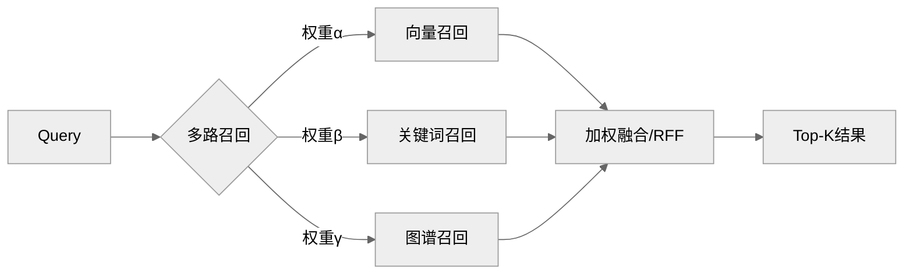
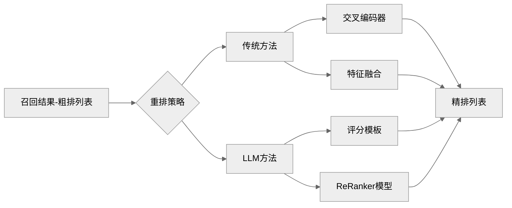

# 基于向量检索实现基础RAG服务
`RAG Retrieval-Augmented Generation`是一种用于自然语言处理的模型架构，结合了检索`Retrieval`和生成`Generation`两种技术。而`RAG`服务在知识问答、代码生成、事实验证、专业领域检索等任务中表现出色，能够通过检索相关知识来增强生成模型的回答质量和准确性。

实际上，当前`RAG`相关建设已经比较成熟，目前看起来其实并不太赶得上潮流，但学习`RAG`最好的时间是`22`年底，其次是现在。`RAG`服务和当前的`AI Infra`建设有着密切的关系，作为基础建设的`RAG`是一个以搜索为核心，围绕各种数据、知识、`LLMs`等服务协作运行的复杂系统。

## 概述
实际上我们当前聊的主要是`RAG`中的`RA`部分，这部分还是比较偏向于传统的`NLP`任务，本文中主要涉及的是文本的向量化和向量检索。而在`G`这部分则结合了检索和生成的框架，主要用于增强生成模型的能力，并且能够根据提问以及召回内容提高生成文本的质量和准确性。

向量检索是`RAG`服务的核心部分，但本质上的主要目标是内容检索，因此我们并非仅限于使用向量方法来检索内容。基于图数据库的`GraphRAG`，或者是`ElasticSearch`基于倒排索引的全文检索能力，都是可以来实现`RAG`的检索服务的，这样我们可以将相关检索方法来统一召回并排名。

此外，我们在使用`LLMs`的时候，是比较难以获取最新的知识的，毕竟`GPT`实际上是生成式预训练模型的缩写，既然是预训练模型自然是不能实时进行训练获取最新知识的。而如果我们使用`RL`强化学习、`SFT`监督微调等方式来进行微调训练，需要更高的标注内容以及计算资源等，成本比较高。

因此，`RAG`服务是较简单且成本低的模式，以此来提供给`LLMs`输入`Context`，而实际上我们调优`Prompt`的方式也可以算作是提供`Context`的一种方式，当然诸如`Function Call`、`MCP`也可以作为给予`LLMs`上下文的方式。而简单来说，`RAG`服务具有以下的使用场景:

- 需要获取较新的知识内容: 当需要查询特定领域的最新研究进展、或者企业内部实时更新的文档，包括我们常用的联网搜索场景，也可以认为是特定形式的`RAG`。当然如果需要获取最新的相关情况，还需要结合`Function Call`的方式，例如查询实时天气等。
- 需要提供特定领域的知识: 当需要查询特定领域的专业知识，例如医学、法律等领域的专业文档，或者是企业内部的知识库内容，这些内容通常是专业、私有、非公开或未包含在`LLMs`通用训练数据中的知识，因此可以结合`RAG`服务来提供相关内容。
- 增强透明性与可解释性: 在需要审核、溯源或理解`LLMs`决策依据的场景，例如金融分析报告、法律建议初稿、医疗信息查询等。`RAG`系统可以同时返回生成答案和其依据的检索来源，这为用户提供了验证答案正确性的途径，也增加了系统输出的透明度和可信度。
- 数据长尾分布的检索: 当数据分布呈现长尾形态时，通用`LLMs`可能因训练数据覆盖不足而无法给出满意答案。`RAG`能够通过检索覆盖到稀有或少见案例，提升模型在这些长尾数据上的表现，当然这本身也会比较依赖于`RAG`服务本身的检索能力。
- 垂直搜索与智能问答: 针对特定领域或企业内容的智能搜索和问答机器人，`RAG`天然适合此类场景。用户问题触发对专属知识库的检索，检索到的相关内容被用于生成精准、简洁、符合上下文的答案，提供比传统关键词匹配更自然、信息量更大。

本文实现了非常基础的`RAG`示例，`Embedding`使用轻量的`all-MiniLM-L6-v2`模型，向量检索的数据库使用轻量的`hnswlib-node`实现，以此可以在`node`中直接运行起来 <https://github.com/WindRunnerMax/webpack-simple-environment/tree/master/packages/hnsw-rag>。

实际上当前很多云服务商以及开源项目提供了开箱即用`RAG`服务的实现，而我们自然可以根据需求来决定是否可以接入开箱即用的服务。只是若是我们需要精细地调配很多功能，例如自定义分片策略等，就比较依赖服务是否暴露相关实现，因此我们不一定可以直接处理。

我们通常都会明确专业的人做专业的事，开箱即用并没有什么问题。但是如果之前看过我的 [从零实现富文本编辑器](https://github.com/WindRunnerMax/EveryDay/blob/master/RichText/从零设计实现富文本编辑器.md) 系列文章的话，就可能会感觉出来，越依赖浏览器的能力就越需要处理默认行为带来的复杂`Case`，我们使用开箱即用的服务也同样如此。如果自定义场景要求比较高，那么就会面临不受控的情况。

所以在这篇文章中我们实现了简单的`RAG`服务，也可以从侧面反映出来我们能够在`RAG`服务上做些什么精调的方案，来提高召回率和召回效果。在知道了我们可以对服务做哪些方面的参数和数据调整后，才能够比较有针对性地进行优化。

## 文本向量化
先前已经提到了，我们在这里主要的侧重点还是倾向传统的`NLP`检索任务，或者我们可以说是文本的搜索任务。因此简化一下我们需要做的事情就是 预处理-编码-存储-检索 这四部分，在本节中我们主要介绍文本的预处理和编码方式。

### 数据分片
在数据预处理环节，我们主要需要做的是数据清洗以及分片，数据清洗部分主要是去除文本内容中的噪音、重复内容、过滤低信息量文本等等，这部分的策略可以根据具体的业务需求来进行调整。而分片则是将较大的文章切分为较小的片段，以便于后续的向量化和检索。

我们在这里主要讨论的是分片方式，分片的方式解决了两个问题，一是文档的内容会很长，若是直接将文档内容作为整体进行向量化，可能会导致向量的维度过高，计算和存储成本较大。二是文档内容的语义信息可能会分布在不同的段落中，大部分内容可能与用户问题无关，整体向量化后召回效果可能欠佳。

实际上还有个额外的原因，通过这种方式我们可以避免整篇文档被召回，这样可以省去不少的`Token`消耗。并且长上下文给予`LLMs`时，最开始的内容可能还是会被遗忘。因此分片是比较公认的处理方案，分而治之的思想在这里就很合适，并且分片的方式我们可以去精调，来提高召回率以及召回效果。

接下来我们可以考虑分片的方式，常见的分片方式有 固定大小分片、基于句段分片、基于结构分片 等方式。在这里我们以下面的一段文本为例，简单介绍一下分片的方式。需要注意的是，由于我们是为了演示用的，分片切的比较小，而实际上分片通常选的是`512/1024/4096`等长度的片段。

```
## 深度学习
深度学习是机器学习的一个子集，使用多层神经网络来模拟人脑处理信息的方式。它在图像识别、语音识别和自然语言处理等领域取得了显著进展。
```

最基本的分片方式是按照固定的长度分片，即固定一个最大长度，然后根据这个长度值直接切分。这种简单粗暴的方式可以快速实现原型，但可能会导致语义信息的丢失。例如，若我们将上面的文本按照每个分片最大长度为`30`字符进行分片，得到的结果是:

```js
[
  "## 深度学习\n深度学习是机器学习的一个子集，使用多层神经网",
  "络来模拟人脑处理信息的方式。它在图像识别、语音识别和自然语言",
  "处理等领域取得了显著进展。"
]
```

虽然文本看起来非常规整，但实际上语义信息被切割得比较碎片化，而且部分片段可能包含填充或冗余信息，导致检索精度降低。而处理这个问题比较常见的思路是采用`overlap`重叠分片的方式，即在每个分片之间保留一定的重叠部分，以便于保留更多的上下文信息，我们在上述基础上重叠`5`个字符:

```js
[
  "## 深度学习\n深度学习是机器学习的一个子集，使用多层神经网络来模拟人",
  "多层神经网络来模拟人脑处理信息的方式。它在图像识别、语音识别和自然语言处理等领域",
  "和自然语言处理等领域取得了显著进展。"
]
```

虽然看起来是好了不少，但实际上这种方式仍然会导致语义信息的丢失，尤其是当分片长度较短时，可能会导致上下文信息的缺失，而上述提到的分片长度比较大的情况下是表现相对好一些的。在本文的示例中，就是采用的这种简单的分片方式来进行分片的。

```js
/**
 * 文本分片方法
 */
const spiltTextChunks = (text: string): string[] => {
  // 这里是直接根据 固定长度 + overlap 分片，此外还有 结构分片 等策略
  const chunkSize = 100;
  const overlap = 20;
  const chunks: string[] = [];
  for (let i = 0; i < text.length; i += chunkSize - overlap) {
    const chunk = text.slice(i, i + chunkSize);
    if (chunk.trim().length > 0) {
      chunks.push(chunk.trim());
    }
  }
  return chunks;
};
```

第二种分片的方式是基于句段分片，即根据文本中的句子或段落进行分片。这种方式可以更好地保留语义信息，因为这样通常会在句子或段落的边界进行切分，而不是任意长度的字符切分。例如，我们可以将上面的文本按照句子进行分片，得到的结果是:

```js
[
  "## 深度学习",
  "深度学习是机器学习的一个子集，使用多层神经网络来模拟人脑处理信息的方式。",
  "它在图像识别、语音识别和自然语言处理等领域取得了显著进展。"
]
```

这种方式看起来会好很多，语义信息保留得比较完整，避免中间分割，确保片段包含连贯思想，有效维护文档的原始流程和上下文完整性。但是实际上还是面临一些问题，例如切出的句子长度太短，或者是切出的句子太长超出了我们的`Max Token`限制等问题。

因此我们也需要针对其实际表现来额外增加一些策略，例如较短句子中我们可以不断拼接后续的内容，直至其逼近`Max Token`限制。而较长的句子我们可以采用固定分片方式进行分割处理，来确保每个片段都在合理的长度范围内，这样可以更好地平衡语义信息的完整性和片段长度的限制。


```js
[
  "## 深度学习\n深度学习是机器学习的一个子集，使用多层神经网络来模拟人脑处理信息的方式。它在图像识别、语音识别和自然语言处理等领域取得了显著进展。"
]
```

第三种分片方式是基于结构分片，即根据文本的结构进行分片，例如标题、段落、列表等，特别是我们给予模型的输入通常都是`Markdown`格式的文本，因此其天然就具有一定的结构化信息。基于结构分片可以更好地保留文本的层次和逻辑关系，避免语义信息的丢失。

```js
[
  "- 列表1\n- 列表2\n- 列表3",
  "## 深度学习\n深度学习是机器学习的一个子集，使用多层神经网络来模拟人脑处理信息的方式。它在图像识别、语音识别和自然语言处理等领域取得了显著进展。"
]
```

实际上，当前并没有一种普遍适用的最佳分片策略，分片的复杂点在于确定片段的最佳大小和结构。如果片段过小，它们可能会丢失关键的上下文信息，从而变得不那么有意义。相反如果片段过大，检索过程的效率会降低，并且可能会无意中包含不相关的信息，从而稀释结果的相关性。

除了上述策略，分片时还需考虑其他重要因素，理想情况下，片段应保留语义单元，例如完整的句子、段落或主题，以确保连贯性并防止意义中断。采用重叠片段或者滑动窗口其实还是个比较好的方案，有助于在片段边界处保持上下文，确保关键信息或过渡上下文不会在片段之间丢失。

此外，我们甚至还可以让`LLMs`来帮助我们进行分片，语言模型其实更擅长理解和处理自然语言文本，这也是一种基于语义分片的策略。然而这种方式在处理大量数据的时候就需要考虑效率以及计算资源问题了，而且`LLMs`也并非银弹，具体效果还是需要构建评测集合来验证。

还有一个比较重要的点是，我们在分片的时候是可以并入元信息的，这点是很容易被忽视的。元信息可以是文档的标题、作者、发布时间等，这些信息可以帮助模型更好地理解片段的上下文和背景，甚至如果我们有文档相关的人工打标信息，会更好地帮助我们进行重排以及内容生成。

### 编码方式
在数据预处理完成后，我们就需要考虑数据存储的方式了。在这里我们首先需要考虑一个问题，计算机是否能直接处理文本，答案自然是否定的。计算机本质上是只能处理数字的，因此我们需要将文本转换为计算机可以理解的数字形式，这个过程称为编码。

那么我们考虑字体的这种形式，如果我们直接将文本处理成`UTF-8`编码的字节流的话，是不是就可以直接存储了。在这种情况下存储自然是可以直接存储的，但检索的时候就会比较麻烦，我们希望的是实现语义搜索，需要理解词语和短语背后的含义和意图，而`UTF-8`自然不能直接提供语义信息。

此外，`NLP`常用的`Token`代表的是词组而非字也是类似的考虑，单词通常包含更丰富的语义信息，而单个字符通常没有这样的语义。例如，苹果这个词有明确的含义，而单个的字符苹和果分别并不能传达完整的语义。且分词可以减少文本序列的长度，降低复杂度和计算量。

而在编码的实现中，我们通常都会使用向量来表示词组，那么最简单的向量化方式是`One-Hot`编码方式。即将每个词组表示为一个高维稀疏向量，其中只有一个元素为`1`，其余元素为`0`。这种方式简单直观，但存在维度灾难和语义信息稀疏的问题。

```
自然   1   0   0   0   [1, 0, 0, 0]  
语言   0   1   0   0   [0, 1, 0, 0]
处理   0   0   1   0   [0, 0, 1, 0]
任务   0   0   0   1   [0, 0, 0, 1]
```

类似维度都是词汇表大小的还有`TF-IDF`编码方式，即词频-逆文档频率​。`TF`词频，一个词在单篇文档中出现的次数越多，可能越重要。​`IDF`逆文档频率`，如果一个词在所有文档中出现得越普遍比如停用词，就越不重要。同样会导致产生非常高的纬度，导致向量语义信息稀疏。

​`TF-IDF`编码主要应用的方向是文档转化为结构化、数值化的向量表示，便于进行文本分类、聚类、相似度计算等任务。是通过词统计的形式来处理文档级的特征信息，而不是单个词的语义信息，因此实际上跟`One-Hot`编码的目标是不一样的，这里主要是举例高纬稀疏向量的问题。

```
文档	自然	 语言	 处理	  任务
D1	   0.223   0.511   0     	0
D2     0.223   0	   0.916	0.121
D3	   0.223   0.511   0.916	0
```

而在`NLP`的词向量生成的发展中，`Google`提出的`Word2Vec`模型是一个重要的里程碑。通过神经网络模型，将文本中的单词映射到高维向量空间，使得语义相似的词在该空间中的距离较近。这个算法可以产生稠密向量，并且捕捉到词语间的语义关系。

其中两种主要的训练方法是`CBOW`和`Skip-Gram`。`CBOW`通过上下文预测中心词，类似于完形填空，而`Skip-Gram`则是反过来，通过中心词预测上下文。这两种方法在训练事，就能有效地联系到词语的语义信息，并且生成的向量维度通常较低(稠密)，能够更好地表示词语之间的关系。

```
 dog                            faster
    \                         /        \
    dogs     cats        fast   slower  fastest
      \      /                 /      \
       animals              slow      slowest
```

`Word2Vec`本身已经非常成熟，但是其本身还是存在一定的局限性。其词向量的意思固定，每个词只有一个向量，无法表达多义词，例如苹果公司与水果苹果。其次，忽视了词语顺序，直接把句子看成词的集合，忽略了词序，例如猫追狗和狗追猫的向量一样。

而在我们的`RAG`系统中，输入的基准都是句段，而不仅仅是简单的词汇集合，因此使用`Word2Vec`的方式还不够。由此`Google`又提出了`Transformers`架构`Attention Is All You Need`，采用动态上下文编码的方式、长距离依赖捕捉等方式解决上述的问题。

```
I ate an [apple].             apple => [0.8, -0.2, 1.1]
I bought an [apple] phone.    apple => [1.5, 0.3, -0.7]
```

然而`Transformers`同样并非银弹，其计算复杂度较高，尤其是长文本的处理，因此在实际应用中会面临计算资源和时间成本的问题。此外，因为这种一词多义的表达，如果数据集不够大或者不够多样化，可能会导致模型无法很好地捕捉到词语的多义性和上下文信息，因此需要的语料是巨量的。

说句题外话，`GPT`和`BERT`都是基于`Transformer`实现，以当年我的理解来说，`BERT`无疑是更优秀的模型，其能够理解文本，后续只需要跟随一个解码器，例如全连接层就可以轻松实现诸如文本分类的任务。而由于`BERT`实际是文本编码，将其再接`GPT`作为解码器生成文本自然可行。

- 编码器: 编码器的主要任务是将输入序列转换为一种表示，这种表示能够捕捉输入序列的全局信息。
- 解码器: 解码器的主要任务是根据某种输入，可能是编码器的输出或之前的生成结果，逐步生成输出序列。
- `GPT`模型: `GPT`采用单向`Transformer`解码器，只能利用上文信息，适合生成任务。通过自回归语言模型预测下一个词，训练目标是最大化序列的联合概率，适合于文本生成类任务，文本翻译、生成式回答等。
- `BERT`模型: 使用双向`Transformer`编码器，能同时捕捉上下文信息，适合理解任务。通过`MLM`随机掩码部分词并预测，`NSP`判断两个句子是否连续，适合于理解分析类任务，文本分类、相似度比较等。

但是实际上目前看还是`GPT`成功了，还是以文本生成+`Prompt`这种看起来迂回式地完成任务，看起来更容易普及一些。生成式预训练的单向解码器，配合提示词可以完成多种任务，无需针对每个任务单独设计模型结构或训练方式。

回到我们的基础`RAG`服务，我们使用的是非常轻量的`all-MiniLM-L6-v2`模型来进行文本的向量化。具体来说是`INT8`量化的版本，因为我们的主要目标是跑`DEMO`，而不是追求最高的精度和性能，真正跑的话可以使用服务商提供的服务，例如`bge-m3`、`text-embedding-3`等模型。

```js
import { env, pipeline } from "@xenova/transformers";

// 初始化编码模型
const model = "Xenova/all-MiniLM-L6-v2";
env.localModelPath = path.resolve(__dirname, "../", "embedding");
const featureExtractor = await pipeline("feature-extraction", model);

/**
 * 文本 embedding
 */
const embeddingTextChunk = async (
  featureExtractor: FeatureExtractionPipeline,
  text: string
): Promise<number[]> => {
  const output = await featureExtractor(text, {
    pooling: "mean",
    normalize: true,
  });
  return Array.from(output.data);
};
```

## 向量检索
在数据预处理以及数据编码部分完成后，我们就需要处理数据存储和数据检索的方式了。虽然这部分是看起来过于专业，就像是计算向量的相似度这种问题，我们通常无法过于干涉底层的实现细节，但实际上我们还是可以对其进行一些优化和调整，也就是所谓的调参或者称为炼丹。

### 向量距离
在前边我们费了那么大的劲介绍了文本向量化的实现方式，现在终于将其派上用场了。最开始我们就提到了，`RAG`服务是以搜索为核心的服务，那么在文本向量化的情况下，搜索的核心就是对比两段文本的向量相似度，即用户`Query`和即将要召回的文本片段的向量相似度。

而对比文本相似度的意义就在于，向量距离越小，语义相似度越高。常见的向量向量相似度计算方法有曼哈顿距离`L1`、欧氏距离`L2`、余弦相似度。在`NLP`领域中通常使用的是余弦相似度，主要是出于下面的一些原因:

- 注重方向而非长度，余弦相似度通过计算向量夹角的余弦值，忽略向量的模长，只关注方向差异。这使得其更适合衡量文本语义相似性，因为文本向量的长度可能受词频、文档长度等无关因素影响。
- 适用于高维稀疏向量，余弦相似度在高维空间中表现良好，能够有效处理高维稀疏向量的相似性计算问题。高维空间中，欧氏距离容易失效，所有向量两两距离趋于相似，而余弦相似度能更敏感地捕捉方向差异。
- 计算效率高且便于归一化，余弦相似度的计算只需要点积和模长计算，计算复杂度较低，尤其适合大规模文本数据的相似性检索任务。余弦距离的计算范围在`[-1, 1]`之间，易于归一化处理，而`L1`和`L2`距离的计算结果为`[0, +∞)`。

那么再回到我们最简单的`RAG`服务的实现中，同样使用的是轻量的`hnswlib-node`服务来实现向量检索的功能。`hnswlib`是一个高效的近似最近邻搜索库，支持高维稠密向量的快速检索，同样适用于大规模向量数据集。

```js
import { HierarchicalNSW } from "hnswlib-node";

const embeddingDIM = 384; // 嵌入向量的维度
const maxElements = 1000; // 最大元素数量
const efConstruction = 200; // 构建时动态候选列表大小
const M = 16; // 每个节点的最大连接数
const vectorStore = new HierarchicalNSW("cosine", embeddingDIM);
vectorStore.initIndex(maxElements, efConstruction, M);
```

接下来我们需要将预设的文本内容切片并且将其向量化存储到`hnswlib`中，首先将文本内容切片，然后针对每个切片做向量化处理，最后将向量存储到`hnswlib`中。这里其实有点业务逻辑，`hnswlib`仅支持传入一个主键`id`来存储向量，因此我们还有一个并行存储来实际存储切片和`meta`数据。

```js
const textChunks = spiltTextChunks(doc);
for (let chunkIndex = 0; chunkIndex < textChunks.length; chunkIndex++) {
  const chunk = textChunks[chunkIndex];
  const chunkId = `doc_${docIndex}_chunk_${chunkIndex}`;
  const vector = await embeddingTextChunk(featureExtractor, chunk);
  const documentChunk: DocumentChunk = {
    id: chunkId,
    content: chunk,
    metadata: { docIndex, chunkIndex },
  };
  const { label } = await getParallelStoreLabel(documentChunk);
  vectorStore.addPoint(vector, label);
}
```

那么接下来我们就可以再使用`hnswlib`来进行向量检索了。在用户传入查询内容之后，需要对其进行向量化处理，然后使用`hnswlib`的`searchKnn`方法来进行向量检索，返回与查询内容最相似的文本片段，这就是完整的一个召回流程了。

```js
const searchQuery = "机器学习是什么？";
const queryEmbedding = await embeddingTextChunk(featureExtractor, searchQuery);
const searchResults = vectorStore.searchKnn(queryEmbedding, /** TopK */ 3);
const results = searchResults.neighbors.map((index, i) => ({
  id: labelMap[index].id,
  chunk: labelMap[index].content,
  metadata: labelMap[index].metadata,
  score: 1 - searchResults.distances[i],
}));
```

这里还有个比较有趣的点，我们的向量检索实际上是召回了与查询内容相关的分片`id`，而具体内容是我们从并行存储中获取的。那么我们在存储到向量数据库的内容还可以二次清洗，例如`Md`的标题格式，用户输入通常不会携带`##`标记，检索时可能会更好匹配，召回时在从并行存储中获取实际内容。

```js
// 向量数据库
["机器学习", 0]

// 并行存储
["## 机器学习", 0]
```

当然这里的实现还是与向量数据库本身的实现有关，如果数据库本身支持存储`meta`信息，那么我们就可以直接从向量数据库中获取到相关的内容，而不需要额外的并行存储了。实际上大多支持向量查询的数据库都支持存储`meta`信息，因此我们可以直接从向量数据库中获取到相关的内容。

### 多路召回
在最开始我们也提到了，我们使用向量检索的方式本质上是为了对比语义的相似性，从而进行检索召回，核心的目标就是模糊搜索。那么我们自然可以结合多种搜索方式，例如倒排索引、知识图谱等方式，克服单一方法的局限性，从而实现更全面、更精确的信息检索。

虽然我们在前边研究了很多词向量的编码方式，发现与`LLMs`同源的`transformers`存在比较好的向量相似度计算效果，但是并非传统的关键词检索就完全不适用。实际上，关键词检索在处理特定类型的查询时仍然非常有效，如果结合分片的关键字元信息则可以让用户动态调整检索权重。

组合向量检索和关键词搜索的方式有很多，例如先使用关键词搜索进行初步筛选，然后再使用向量检索进行精细化的结果排序。或者是先使用向量检索进行召回，然后再使用关键词搜索进行过滤和排序。不过现在普遍是两者同时启动，然后将两种方式的召回结果统一加权排序/`RRF`等算法，取`TopN`即可。



此外，如果对于`Query`重写要求非常高的话还是可以对较小模型进行微调来用的。`LLMs`虽然通常都是通用模型，但是现在也在向着专精化的方向发展，例如`Claude`系列模型对于问题更倾向于代码实现来回答，而非常见的问答模式。专有任务也有相关的模型，例如`embedding`、`rerank`任务。

其实在这里也体现出来`RAG`检索部分的复杂性，能看出来`RAG`不仅仅是简单的向量相似性搜索，而是可能涉及多种技术协同工作的复杂系统。想要做出来简单的系统比较简单，但是想要做出高质量的`RAG`服务就需要综合考虑多种因素。

### 召回重排
召回重排`Re-Ranking`是`RAG`流程中的一个关键后处理步骤，目标是在进一步优化初步检索阶段的结果，从而提高最终生成响应的准确性和相关性。这里并不是简单的排序，而是对检索到的文档进行上下文相关性评估，确保最有意义的片段浮现到顶部。

重排这部分可以做两件事，首先是对召回的结果进行过滤，去除掉一些明显不相关的片段。其次是对召回的结果进行排序，将最相关的片段排在前面。实际上如果跑我们的简单`RAG`服务也可以发现，我们觉得最相关的片段并不一定是最前面的片段，因此重排是非常有必要的。

重排这部分是可以显著提高召回结果的质量的，尤其是在召回结果数量较多的情况下。`NLP`领域传统的方法可以使用交叉编码器`Cross-Encoder`，例如使用`BERT`作为交叉编码器，来执行`NSP`任务，计算查询与文档的精细相关性，从而对召回结果重排。

比较现代的方案通常都是用`LLMs`来进行重排，`LLMs`可以通过更复杂的上下文理解和生成能力来对召回结果进行重排。将召回的数据即粗排数据，外加用户`Query`作为输入，给予`LLMs`处理后得到精排的数据，这属于提高召回结果质量的方式，为了保证效率和成本通常选择较小的模型来处理。

此外，还记得我们在数据分片的时候提到的元信息吗，在重排的时候也可以将元信息作为输入的一部分，例如更新时间等，帮助`LLMs`更好地理解片段的上下文和背景，从而提高重排的效果。如果能够提供一些人工打标的样本数据，甚至可以进一步提高重排的效果。

与`Embedding`模型类似，现在的云服务商也会提供`ReRanker`模型的服务，例如`BGE-Reranker-v2-M3`、`Qwen3-Reranker`等等。类似专门精调的`ReRanker`模型通常是专业任务模型，能够提供更低的延时以及更稳定的服务，适用于较大的任务规模。



在具体的实践中，我们可以会先调整召回的数量，以便于得到更多的结果，然后再使用重排来过滤和排序这些结果。而实际上这些相对更加的复杂任务加入到我们的系统里并不一定是正向的结果，因为不可避免地造成了更高复杂行和响应耗时，因此还是需要看具体的场景和需求来处理`RAG`任务。

## LLMs
表面上看起来`LLMs`在`RAG`系统中主要扮演着生成器的角色，但其作用远不止于此。实际上当前的`RAG`服务已经深度融合了`LLMs`的能力，因此我们不可避免地需要考虑`LLMs`在`RAG`服务中的应用，不过在这里我们会讨论的比较简单一些。

### 查询改写
在`RAG`服务中，用户的查询内容通常是自然语言的形式，这种情况用户的查询内容可能会存在拼写错误、多意图、过于口语化、过于宽泛、上下文联系等问题。因此我们需要对用户的查询内容进行改写，以便于更好地匹配到相关的文档片段。我们可以举几个例子:

- 拼写错误: `microsft office`下载方法 => `Microsoft Office`下载方法
- 多意图: 失眠导致头痛怎么办 => 因失眠引起的头痛症状及综合治疗方案
- 口语化: 我想找一个离我当前位置不太远的价格合理的意大利餐厅 => 附近的意大利餐厅
- 过于宽泛: 奥运会奖牌榜 => `2024`年巴黎奥运会奖牌榜
- 上下文关联: 多轮对话，`Python`安装教程 - `Mac`系统的 => `Mac`系统的`Python`安装教程

用户的查询内容通常来说并非最合适的，特别是在比较专业的领域性知识库场景下，将用户输入的内容进行比较规范化的改写是很有必要的。这个过程其实跟业务相关性比较大，而`LLMs`是非常适合处理这种自然语言的改写任务的，理论上而言改写之后应该会有更正向的表现。

而我们也可以实现一些通用的策略来处理用户查询改写的问题，再具体的领域规则以及专业词汇等，就需要特殊处理了。在这部分同样需要保持微妙的平衡，过于具体的改写可能排除相关结果，而过于宽泛的改写则可能导致不相关结果。

- 去噪: 纠正拼写错误或语法问题，使查询更清晰 。   
- 分解: 将包含多个意图的复杂查询分解为结构化的子查询。
- 扩展: 为原始查询添加相关术语或同义词，以扩大检索范围，提高召回率。
- 重构: 将口语化或模糊的查询重写为更正式、更精确的表达，使其与知识库中的内容更匹配。

### 输入优化
在现代的`RAG`服务中，`LLMs`已经穿行在了整个流程中，除了查询改写之外，`LLMs`还可以用于输入优化。这个输入代指的部分非常宽泛，因为`RAG`服务本质上就是文本的处理服务，而`LLMs`在文本处理方面有着非常强大的能力，因此理论上涉及文本处理的事情都可以由`LLMs`介入。

首先，`LLMs`可以用于文本的分片和编码，虽然我们在前边已经介绍了文本分片和编码的方式，但是实际上`LLMs`可以更好地理解文本的语义和结构，因此可以更智能地进行文本分片和编码。例如`LLMs`可以根据文本的语义和结构自动确定分片的大小和位置，从而更好地保留文本的上下文信息。

其次，`LLMs`可以用于构建知识图谱的实体关系提取，微软开源的`GraphRAG`就是利用`LLMs`来提供文档内的命名实体，然后利用这些知识来构建知识图谱。构建知识图谱除了可以用于知识库的构建，还可以用于知识库的知识相关性、覆盖度检查等，从而提高`RAG`服务的智能化水平。

再者，`LLMs`可以广泛用于多模态内容信息的提取，例如从图像、音频等非文本内容中提取信息。最开始我们一直处理的内容都是文本，这些多模态信息我们也是需要先转换为文本再进行`Embedding`流程，而现在我们可以直接对多模态的内容做`Embedding`，省去了转文本的步骤。

最后，我们可以发现整个`RAG`服务的流程中，涉及了非常多的环节，特别是我们如果加入了更多扩展服务，例如多路召回、召回重排等环节。那么是不是可以类似流程编排的形式，进行节点的自由组合。甚至类似于`Function Call`的形式，让模型来决定如何执行后续流程。

### 生成增强
生成增强这部分就是比较常见的`LLMs`生成内容的能力了，这部分其实比较简单。主要是将召回的片段内容作为上下文信息，如果有必要的话还可以结合原始文档的部分内容，结合用户的查询内容，使用`LLMs`来生成最终的回答内容。

这个过程可以看作是一个文本生成任务，`LLMs`可以根据召回的片段内容和用户的查询内容来生成更自然、更流畅的回答。毕竟，如果只是简单地将召回的片段内容直接返回给用户，可能会导致回答不够连贯或者缺乏上下文信息，用户读起来也比较难。

我们这里其实还可以思考一个问题，既然最终都是用`LLMs`来生成回答，那么为什么还需要召回重排。实际上这里主要目的还是提升召回结果的质量，尤其是在召回结果数量较多的情况下，减少噪音以及提高相关性。这也是分而治之的体现，合理的流程设计可以让每个环节都发挥最大的作用。

其实到这里，我们已经基本完成了整个流程。我个人觉得`RAG`系统的一个显著优势是其能够提供生成答案的来源，这种透明度增加了用户对系统输出的信任，而不是考虑是不是模型幻觉。我们也可以再深入提升体验，并且点击跳转后可以直接定位到原文位置上，这理论上应该是一个不错的体验。

## 总结
在本文中我们讨论了`RAG`服务的基础实现，主要包括数据预处理、数据编码、向量检索、多路召回、召回重排以及`LLMs`的应用等方面。我们通过一个简单的示例来展示如何实现一个基础的`RAG`服务，并且介绍了相关的技术细节和实现方式。

除了上述的应用场景，`RAG`服务作为`LLMs`的`Context`补充服务也发挥了重要作用。前些时间我在知乎看到了一个问题，如果`LLMs`存在足够长的输入，是否有必要使用`RAG`服务来补充`Context`信息。实际上这个问题我之前也考虑过，目前来说答案自然是否定的。

最明显的问题就是成本，尽管现在`Token`的成本已经大幅度下降，但是使用`RAG`和全部作为`Prompt`输入相比成本差异还是巨大的。其次，即使`Transformer`可以有更长的上下文，但是越长的内容，模型的处理时间和资源消耗也会显著增加，过长的上下文也同样会造成遗忘。

此外，最开始我是想使用`LangChain`来搭建这个最简单的`RAG`服务的，但是发现`LangChain`的服务封装的太复杂了，反而不利于理解`RAG`的基本实现方式了。其实这也与最开始我们讨论的问题呼应，若是需要开箱即用的服务，`LangChain`是不错的选择，反之则需要更灵活的实现方式。

## 每日一题

- <https://github.com/WindRunnerMax/EveryDay>

## 参考
- <https://www.zhihu.com/question/653424464>
- <https://www.volcengine.com/docs/82379/1583857>
- <https://blog.langchain.com/evaluating-rag-pipelines-with-ragas-langsmith/>
