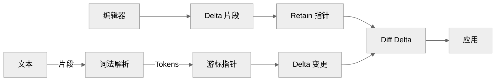

# 流式Markdown增量富文本解析算法
在先前我们实现了`SSE`流式输出的实现，以及基于向量检索的`RAG`服务，这些实现都可以算作是`AI Infra`的范畴。这里我们再来聊一下在`SSE`流式输出的基础上，将`Markdown`解析和富文本编辑器的渲染结合起来，实现编辑器的增量解析算法，同样属于文档场景下的`Infra`建设。

<details>
<summary><strong>AI Infra 系列相关文章</strong></summary>

- [基于 fetch 的 SSE 方案](../Browser/基于fetch的SSE方案.md)
- [基于向量检索实现基础 RAG 服务](./基于向量检索实现基础RAG服务.md)
- [流式 Markdown 增量富文本解析算法](./流式Markdown增量富文本解析算法.md)

</details>

## 概述
在`SSE`流式输出的场景下，`LLMs`模型会逐步输出`Markdown`文本，在基本场景下我们只需要实现`DOM`的渲染即可。然而，在富文本编辑器的场景下，这件事就变得复杂了起来，因为编辑器通常都是自行维护一套数据结构，并不可以直接接受`DOM`结构，再叠加性能问题就需要考虑到下面几点:

- 流式: 流式意味着我们需要处理不完整的`Markdown`文本，在不完整的情况下语法会出现问题，因此需要支持已渲染内容的重建。
- 增量: 增量意味着我们不需要每次都进行全量渲染，已经稳定的内容实际上不需要再次解析，而是只需要在已有内容的基础上进行增量更新。
- 富文本解析: 富文本解析意味着我们需要完整地对应到`Md`的解析情况，无论是流式处理还是增量解析都需要在编辑器结构基础上对等实现。

当然，即使是在基本场景下的`DOM`渲染，也会涉及到很多边界情况的处理，例如若是每次都是`SSE`输出`Md`时都进行全量渲染的性能问题、以及类似图片节点重渲染可能存在的重新加载问题等。因此，这里的增量解析算法流程，即使是对于基本场景也是很值得参考的。

并且，还有更复杂的场景，例如在`SSE`流式输出的过程中，用户总是会存在临时的不完整的`Md`文本，在完整输出`Md`文本之前，就会存在不符合规范的`Md`解析，或者是错误地匹配到另一种`Md`语法的情况。这些情况都需要额外的算法处理，实现一些额外的语法修复方案。

```
 remark + mdast -> remark plugins + mdast -> remark-rehype + hast -> rehype plugins + hast-> components + ->react elements
```

不过在这里我们并不展开讨论这些自定义语法解析的内容，而是主要聚焦在基本的`Md`语法解析和增量渲染上，但是在解析的过程中我们还是会涉及到针对语法错误匹配的相关问题处理。

文中的相关实现可以参考 [BlockKit](https://windrunnermax.github.io/BlockKit/streaming.html) 以及 [StreamDelta](https://github.com/WindRunnerMax/webpack-simple-environment/tree/master/packages/stream-delta) 中，且有单元测试可以检查实现效果以及各种需要注意的边界情况。



## Markdown增量解析
首先我们来实现`Markdown`的流式增量解析，能够实现增量解析的重要的基础是，`Md`输出的后续内容格式通常不会影响先前的格式，即我们可以归档已经稳定的内容。因此我们可以设计一套数据处理方案，在解析的过程中需要遵循的整体大原则:

- 非全量解析`Markdown`, 基于流渐进式分割结构处理数据。
- 基于`Lexer`解析的结构, 双指针绑定`Delta`的增量变更。

### 词法解析
首先我们需要一个词法解析器将`Md`解析成`Token`流，或者是需要一个语法解析器将`Md`解析成`AST`。由于我们的数据结构是扁平化的，标准词法解析的扁平`Token`流对我们的二次解析并非难事，而若是完全嵌套结构的数据结构，语法解析生成`AST`的解析方案对则可能更加方便。

当前的主流解析器有比较多的相关实现，`marked`提供了`lexer`方法以及`marked.Lexer`作为解析器，`remark`作为`unified`庞大生态系统的一部分，也提供了`mdast-util-from-markdown`独立的解析器，`markdown-it`同样也提供了`parse`方法以及`parseInline`作为解析器。

在这里我们选择了`marked`作为解析器，主要是由于`marked`比较简单且易于理解。`remark`系列的生态系统过于庞大，但是作为标准的`AST`解析是非常不错的选择。`markdown-it`的`Token`解析器稍微复杂一些，其不直接嵌套而是使用`heading_open`等类型标签进行数据处理。

从名字上也可以看出`marked`提供的`lexer`是偏向于词法解析的，但是其也并非完全纯粹的词法解析器。因为输出的结构也是存在嵌套存在嵌套的结构，当然其也并非比较标准的`AST`结构，这里更像是偏向`Token`流的混合结构实现。一段`Md`文本的解析结构如下所示:

```js
// marked.lexer("> use marked")
{
    "type": "blockquote",
    "raw": "> use marked",
    "tokens": [
        {
            "type": "paragraph",
            "raw": "use marked",
            "text": "use marked",
            "tokens": [{ "type": "text", "raw": "use marked", "text": "use marked", "escaped": false }]
        }
    ],
    "text": "use marked"
}
```

### 归档索引
那么在解析的过程中，我们需要维护几个变量来持有当前解析的状态。`content`维护了当前正在解析的片段，接受流式的数据需要不断拿到新片段来组装，`indexIds`以索引值作为稳定的键用来映射`id`值，`archiveLexerIndex`则维护了已经归档的主级`Tokens`节点索引值。

```js
/** 正在解析的内容 */
protected content: string;
/** 索引幂等的记录 */
public indexIds: O.Map<O.Map<string>>;
/** 归档的主级节点索引值 */
public archiveLexerIndex: number;
```

当执行追加内容时，我们直接将`content`与本次追加的`text`内容合并解析，然后借助`marked`词法解析就可以得到`Token Tree`，在调度的主框架中，我们只解析主级节点。只解析主级节点可以尽可能简化我们需要处理的数据，而子级节点可以再建立二级扩展索引处理。

```js
const tree = marked.lexer(this.content);
const archiveLexerIndex = this.archiveLexerIndex;
// 只迭代 root 的首层子节点
for (let i = 0; i < tree.length; i++) {
  // ...
}
```

接着我们需要将归档的位置处理一下，归档就意味着我们认为该`Token`将不会再处理了，因此持有的索引`index`就自增。而`block.raw`就是该`Token`就是解析的原始内容，这也是使用`marked`的简单之处，否则还需要自行根据索引解析一下，文本归档的部分我们直接移除即可。

```js
/**
 * 归档部分内容
 * @returns archived 字符长度
 */
public archive(block: Token) {
  this.archiveLexerIndex++;
  const len = block.raw.length;
  this.content = this.content.slice(len);
  return len;
}
```

在处理好归档索引之后，我们就可以在循环中具体处理这归档的部分。这里的策略非常简单，如果循环时某个节点存在前个节点，就可以归档上一个节点了。当然这里的归档并没有那么理想，特别是存在列表、表格等节点时，这里就需要特殊地处理，我们后续会讨论这个问题。

而后续就是解析当前的`Token`了，这部分是需要适配编辑器本身数据结构的实现。在当前编辑器中，我们认为`Token`作为主级节点存在，然而其本身并不能够完整对应到编辑器行的状态，例如`list`节点会存在嵌套的`list_item`节点，而我们的结构是纯扁平化的行结构，因此需要独立适配处理。

```js
const prev = tree[i - 1];
const child = tree[i];
// 首层子节点存在第二级时，归档上一个节点
// 此外诸如表格等节点可以正则匹配来避免过早归档
if (prev && child) {
  this.archive(prev);
}
const section = parseLexerToken(child, {
  depth: 0,
  mc: this,
  parent: null,
  index: archiveLexerIndex + i,
});
```

将`Token`转换到`Delta`片段的过程我们以`heading`行格式以及`bold`行内格式为例，简单地说明一下解析过程。对于行节点而言，执行顺序很重要，需要先递归地处理所有行内节点，然后再执行行节点的处理，而无论是行节点还是行内，都是封装好的原地修改的方式来修改属性值。

```js
switch (token.type) {
  case "heading": {
    const tokens = token.tokens || [];
    const delta = parseChildTokens(tokens, { ...options, depth: depth + 1, parent: token });
    applyLineMarks(delta, { heading: "h" + token.depth });
    return delta;
  }
  case "strong": {
    const tokens = token.tokens || [];
    const delta = parseChildTokens(tokens, { ...options, depth: depth, parent: token });
    applyMarks(delta, { bold: "true" });
    return delta;
  }
}
```

此外，如果需要再继续解析`HTML`节点的话，则需要引入`parse5/htmlparse2`等独立解析`HTML`片段，不过`parse5`的解析结果会严格处理`DOM`的嵌套结构，因此用`htmlparse2`来处理`HTML`片段更合适。当然还有一种常见的解析方案，将所有数据处理为`HTML`，再行解析`HTML-AST`。

### 语法修复
在上述的实现中，我们已经能够实现针对于`Markdown`部分的增量解析了。虽然这个策略多数情况下是没有什么问题的，但是在流式输出的过程中，会出现两个问题，一是流式输入过程中会存在临态节点，会导致错误的归档，例如缩进的列表，二是错误的语法匹配，例如无序列表缩进时的`-`解析为标题。

因此我们需要处理这些`Case`，当然这里目标主要是针对于语法的错误匹配修复，而并非补全不完整的语法。首先我们来看一下列表的缩进问题，若是直接使用上述的策略，那么在下面这个例子中，就会导致第一行`1`节点被归档，然后导致`1.1`节点没有缩进格式，因为此时不存在嵌套的`list token`。

```md
- 无序列表项1
   - 无序列表项1.1
```

先来分析一下这个问题所在，流式的输出过程中，`1.1`行会有一个临态`   `也就是缩进的前置三个空格的状态，而其在输出到`-`字符之前，这个`Token`的解析格式是下面的内容。则按照上述策略，先前的`Token`存在且当前的`Token`存在，则前置的`Token`进行归档。

```js
[{ type: "list", raw: "1. xxx", ordered: true, start: 1, loose: false, items: [ /* ... */ ]},
{  type:"space", raw:"\n   \n" }]
```

因此在归档之后，就仅剩下`1.1`的节点需要解析了，而由于前一行的`1`节点已经被归档，那么此时`1.1`就是新的`list`以及`list_item`节点了。因为不存在嵌套节点，所以其虽然能够正常解析内容，但是就不存在缩进的格式了。

```js
{ type:"list", raw:"   -\n", ordered: false, start: "", loose: false, items: [ /* ... */ ]}
```

因此，针对这个问题，我们需要对解析的`Token`进行一些额外的处理。在上述的这个`Case`中，我们可以认为是由于`space`节点的存在，导致了前一个`list`节点被过早归档了，因此我们可以认为`space`节点是临时状态，不应该导致前一个节点的归档。

```js
export const normalizeTokenTree = (tree: Token[]) => {
  const copied = [...tree];
  if (!copied.length)  return copied;
  const last = copied[copied.length - 1];
  // 若是需要等待后续的数据处理, 就移除最后一个节点
  // Case1: 出现 space 节点可能会存在等待输入的情况, 例如上述的 list
  // 1. xxx
  //    [前方三个空格会出现 space 导致归档]
  if (last.type === "space") {
    copied.pop();
  }
  return copied;
};
```

而针对于第二个问题，同样会表现的很明显，由于格式的错误匹配会导致样式，而这个状态同样也是临态，因此在继续解析的过程中，会匹配到正确的结构，在这个过程中就会导致明显的样式突变，在输出的过程中非常明显。例如下面的这个例子中，本应该认为是无序列表的`-`，却被错误地解析为标题。

```md
- xxx
   - 
```

```js
({
  type: "list",
  items: [
    {
      type: "list_item",
      tokens: [ { type: "heading", tokens: [ /* ...*/ ] } ],
    },
  ],
});
```

实际上这个格式并没有什么问题，因为这本身就是规范中的格式，只不过通过`---`设置标题的格式在平时并不常用。我们自然也可以去查阅一下规范中的格式定义，在`Setext headings`部分中可以看到相关的定义:

> The setext heading underline can be preceded by up to three spaces of indentation, and may have trailing spaces or tabs - Example 86

```md
Foo
   ----
```
> A list item can contain a heading - Example 300

```md
- # Foo
- Bar
  ---
  baz
```

因此，处理这个问题的方法也很简单，即我们避免这个临时状态的出现，这也是我们处理这两个问题所要遵循的原则。因此我们可以通过正则来匹配这个临态，若是匹配成功则将该行移除掉，等待后续的正确格式出现。

```js
export const normalizeFragment = (md: string) => {
  // Case 1: 在缩进的无序列表尾部出现单个 - 时, 需要避免被解析为标题
  // - xxx
  //    -
  const lines = md.split("\n");
  const lastLine = lines[lines.length - 1];
  if (lastLine && /^[ ]{2,}-[ \n]?$/.test(lastLine)) {
    lines.pop();
  }
  return lines.join("\n");
};
```

## 编辑器流式渲染
在`Markdown`的增量解析实现之后，我们还需要将解析的结果映射到编辑器本身的数据结构中，这里的主体流程则需要配合`Md`解析流程的实现。同样的，我们也遵循上述`Md`解析的流程，同样是实现归档索引，以及当前数据的解析数据重建等方法。

### 流式解析
在流式解析的过程中同样需要几个变量，首先是正在解析的`Token Delta`，这部分是需要保证独立顶级的`Token`节点，这也是匹配`Md`解析的主级节点。其次是已经归档的`Delta`长度，与`Md`解析不同的是其索引为`Token`数组索引，此时是`Delta`的文本长度索引。

```js
/** 归档的索引 */
public archiveIndex: number;
/** 正在处理的 token-delta */
public current: Delta | null;
```

在追加内容时，我们需要将最新的`Token`应用到编辑器上，但是由于编辑器此时已经应用了编辑器的内容，编辑器应用的是变更内容，因此则需要计算出已经应用的内容和目标的内容差异，才可以直接将其应用到编辑器本身。

```js
/**
 * 追加 delta
 * @returns 变更的差异
 */
public compose(delta: Delta) {
  const copied = new Delta(cloneOps(delta.ops));
  if (!this.current) {
    this.current = copied;
    return delta;
  }
  // 这里也可以避免 diff, 直接构造删除原始内容再添加新内容即可
  // 由于本身会归档内容, 无论是比较差异还是删除/新增都不会太耗费性能
  const diff = this.current.diff(copied);
  this.current = copied;
  return diff;
}
```

归档的实现则比较简单，主要是将当前的`Delta`归档掉，并且更新归档的索引。由于此处理论上仅会存在`insert`操作，因此可以直接调用`length`方法来得到此时的`Delta`长度，实际上这里还是应该检查一下操作类型。

```js
/**
 * 归档部分内容
 * @returns archived 的 delta 长度
 */
public archive() {
  if (this.current) {
    // 此处理论上只有 insert, 因此无需考虑 delete 的指针问题
    const len = this.current.length();
    this.archiveIndex = this.archiveIndex + len;
    this.current = null;
    return len;
  }
  return 0;
}
```

接下来我们就需要将`Delta`的组合流程结合到`Md`的解析流程当中了。首先我们需要取得当前已经归档的索引，这部分需要转换为`retain`以对齐索引。然后在循环归档的时候，需要处理继续处理索引信息，主要是因为后续的处理是`merge diff`, 此时的长度并非是`dc`的长度。

而最后的`compose`方法则是将剩余解析的`Token`转换的`Delta`进行合并，最终返回的`delta`就是本次追加内容的变更差异，也就是先前提到的`diff`方法。最后的`merge`方法则是将变更合并先前的`retain`指针，以此来保证索引的正确。

```js
// 因为 delta 首个值是 retain, 这里同样需要对齐其长度表达
let archiveLength = this.dc.archiveIndex;
for (let i = 0; i < tree.length; i++) {
  if (prev && child) {
    this.archive(prev);
    archiveLength = archiveLength + this.dc.archive();
    const deltaLength = getDeltaPointerPosition(delta);
    // 若归档长度大于当前 delta 长度, 则需要移动指针
    if (archiveLength - deltaLength > 0) {
      delta.push({ retain: archiveLength - deltaLength });
    }
  }
  // ...
  const diff = this.dc.compose(section);
  delta.merge(diff);
}
```

实际上这部分实现是非常需要测试来保证稳定性的，特别是在不断处理各种`Case`中，需要避免之前测试过的内容解析出现问题，因此维持一个测试集是非常有必要的，在单元测试的过程中我们主要专注于下面几种类型的输入以及输出:

- 首先是完整的`Md`文本输入，这部分主要测试的是将所有的`Token`解析的正确性。
- 其次就是文本内容的流式输入，这部分测试就可以完全使用单个字符的稳定流渲染输出即可。
- 还有就是随机的字符流式输入，这种情况下不容易维持稳定的单元测试的输出，此时需要测试最终的输出。

### 稳定键值
虽然此时我们的编辑器当前并未实现块级的结构嵌套，但是块级结构通常是不可避免的，例如代码块、表格等结构的实现。而无论是单纯的块结构嵌套，还是`Blocks`模式下的结构实现，通常都是存在`id`值来标识唯一的块级结构。

那么在流式输出的过程中，就很容易出现`id`值被重建的问题，特别是在表格种复杂的结构中，在仅实现主级节点解析归档的情况下，每个单元格都可能会被重新解析而生成新的`id`值。因此我们需要在解析的过程中，维持一个`id`值的映射表，就比较重要，也可以避免重复的渲染带来性能问题。

因此维持`id`映射表就需要实现一个稳定的键值，若是没有稳定的键值，那么在解析的过程中就无法确定上次解析的`id`和当前解析的`id`应该是一致的。那么在这里我们使用`index`以及`depth`的组合值作为索引，以此来映射复杂结构的`id`值，这也就是之前的`indexIds`作用。

```js
const key = `depth:${depth}-index:${index}`;
const id = (mc.indexIds[key] && mc.indexIds[key].id) || generateId();
const delta = parseChildTokens(tokens, { ...options, depth: depth + 1, parent: token });
const block = new Block({ id, delta });
// ...
```

### 编辑模式
通常来说，我们一般是不需要在流式输出的过程中允许用户进行编辑的，因此只需要在流式输出的过程中将`readonly`设置为`true`，等到流式输出完成之后再将`readonly`设置为`false`即可。然而，若是用户需要在流式输出的过程中进行编辑，这个问题就变得复杂起来。

回到编辑模式这个问题本身，由于存在多种输入模式可能导致的数据冲突，解决这个问题通常都是使用`OT`算法来解决的。若是编辑器结构是能够支持`CRDT`数据模式的话，这个问题应该会更加简单，毕竟理论上而言其处理的编辑位置是相对的，而我们需要处理索引冲突本质是由于绝对位置引起的。

`OT`的实现中最重要的就是`transform`方法，我们可以先看看`transform`所代表的意义。如果是在协同中的话，`b'=a.t(b)`的意思是，假设`a`和`b`都是从相同的`draft`分支出来的，那么`b'`就是假设`a`已经应用了，此时`b`需要在`a`的基础上变换出`b'`才能直接应用。

而我们也可以换种理解方式，即`transform`解决了`a`操作对`b`操作造成的影响。那么类似于`History`模块中`undoable`的实现，`transform`同样可以来解决单机客户端`Opa`以及`Opb`操作带来的影响，那么自然也可以解决流式输出以及用户输入本身相互的数据影响。

这个策略实际上同样适用于在存量文档上的增量流式处理，即已有的文档上进行增量的`Md`解析，这部分实现对我们的编辑器的场景中意义会更大一些。设想这样的场景，类似于`IDE`的编辑模式实现，用户希望在存量文档上增删内容，那么就可以直接将内容应用而非弹窗的模式实现。

由于我们已经记录了`archiveLength`，在`archiveLength`内的文档内容变更我们认为是已经稳定的结构，而`archiveLength`外的文档内容我们认为是临时的状态。因此这里的`OT`则变得简单了很多，我们需要做的计算拆分为了两部分:

- 对于`archiveLength`内的变更，对于`insert`操作我们就将索引值相加，而对于`delete`操作我们就将索引值相减。
- 对于`archiveLength`外的变更，我们则需要根据索引构造一个`retain`操作，然后将用户变更的`changes`组合到当前的`Delta`中。

在这里我们需要明确一个基本原则，`archive`指的是已经稳定的内容，那么在变更中仅有`retain`表达的值应该作为索引，而`insert`以及`delete`操作都应该作为实际改编内容的长度。因此在计算归档的索引值时，我们仅应该考虑`retain`的长度，其他操作作为变更内容的长度。

还有一个问题，虽然理论上我们在内容输入的时候大概率仅会存在`retain + insert/delete`的操作，但是为了避免一些不可预见的情况，我们还是应该完整地处理所有的操作类型。因此我们需要以`retain`计算切割的位置，左侧的操作作为归档长度的变更，右侧的操作作为当前`Delta`的变更。

```js
/**
 * 获取变更带来的内容片段
 */
export const getContentChangeFragment = (delta: Delta, dc: DeltaComposer) => {
  /** 剩余的 archive retain */
  let archive = dc.archiveIndex;
  /** 目标 archive 变更的长度 */
  let changeLength = 0;
  /** delta 的分割 -> archive | current delta */
  let dividing = 0;
  let op: Op | undefined;
  const newOps = [...delta.ops];
  while ((op = newOps.shift())) {
    if (isRetainOp(op)) {
      if (op.retain > archive) {
        newOps.unshift({ retain: op.retain - archive });
        dividing = dividing + archive;
        break;
      } else {
        archive = archive - op.retain;
        dividing = dividing + op.retain;
      }
      continue;
    }
    if (isDeleteOp(op)) {
      changeLength = changeLength - op.delete;
      dividing = dividing + op.delete;
      continue;
    }
    if (isInsertOp(op)) {
      changeLength = changeLength + op.insert.length;
      dividing = dividing + op.insert.length;
      continue;
    }
  }
  return { delta: new Delta(newOps), changeLength };
};
```

## 总结
在本文中我们实现了`Md`的词法解析，在此基础上处理了增量的`Token`归档以及增量处理，在`Md`整个流程的基础上结合了，编辑器数据结构本身的增量渲染。并且还处理了具体的语法匹配问题，以及编辑器细节`id`索引和编辑模式。在这些内容的基础上，实现了流式`Markdown`增量富文本解析算法。

此外，由于编辑器数据结构通常都是各自维护的一套模式，因此在这里我们更偏向于业务代码实现，而并非通用的解析模式，在不同的业务场景下都需要额外的适配。不过在`Md`解析的流程上抽象出来更底层的实现是比较通用的模式，这部分确实是可以提供通用算法出来的。

实际上到这里，还需要考虑一个问题，若是目标是从零输出内容而不是增量处理，我们也完全可以实现一套流式输出的纯`HTML`渲染模式，等待流式输出完成之后再替换为编辑器。这当然是个可行的方案，并且还可以避免很多复杂的实现，只不过这样实现成本就转移到了需要额外做一套纯渲染的样式，以匹配编辑器本身的样式，来保证用户体验。

## 每日一题

- <https://github.com/WindRunnerMax/EveryDay>

## 参考

- <https://astexplorer.net/>
- <https://spec.commonmark.org/0.30/>
- <https://marked.js.org/using_pro#lexer>
- <https://github.com/remarkjs/react-markdown>
- <https://marked.js.org/demo/?outputType=lexer>
- <https://github.com/syntax-tree/mdast-util-from-markdown>
