# OD反汇编EXE添加一个启动时的消息框
最近有一个要修改`PE`文件的需求，就先从`EXE`文件下手吧，我也是初学一个小时而已，不过之前接触过一点汇编罢了，这篇文章算是个`DEMO`，主要的思路是将其反汇编得到汇编代码后，然后手动修改他的逻辑首先跳转到弹框区域再跳转回来去执行原来的代码，相关的工具有`ollydbg`，以及要修改的一个`xp`系统自带的扫雷软件，还有参考的文章，都会在文末给出。

## 描述
首先准备好要用到的`OD`工具也就是`ollydbg`和扫雷这个软件。


使用`OD`将扫雷导入之后，自动定位到了入口点。


之后选择前`2`行将其`Ctrl + C`复制，主要是为了空出来足够的位置让我们完成指令的修改。

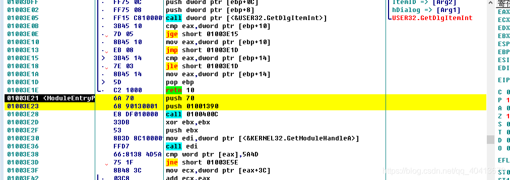


然后返回到`OD`，我们需要找到`HEX`数据是`00`的地方，通常也就是尾部位置存在的空白位置，注意我们是不能直接插入一些指令的，只能跳过去执行了我们想要的代码之后再跳回来执行原代码，我们可以使用右击-查找-二进制字符串，多输入几个`0`点击搜索即可，因为在扫雷中前边也有一堆`00`数据段，我们可以使用`Ctrl + L`，不断搜索下一个。


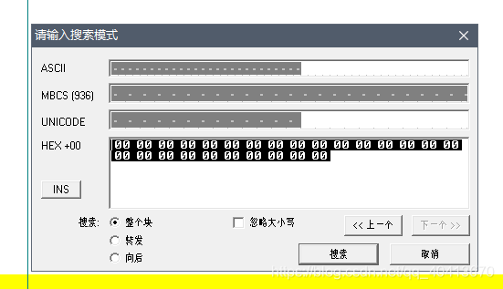

我们定位到尾部的`00`位置后，我们多选择一些行，选中几十行，右击-编辑-使用`00`填充。


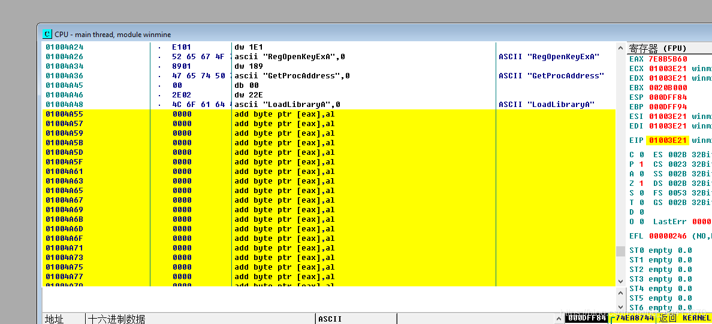

现在我们随便空几行，我是在`01004A65`这个地址开始修改，可以直接`Ctrl + G`，定位到这个位置。


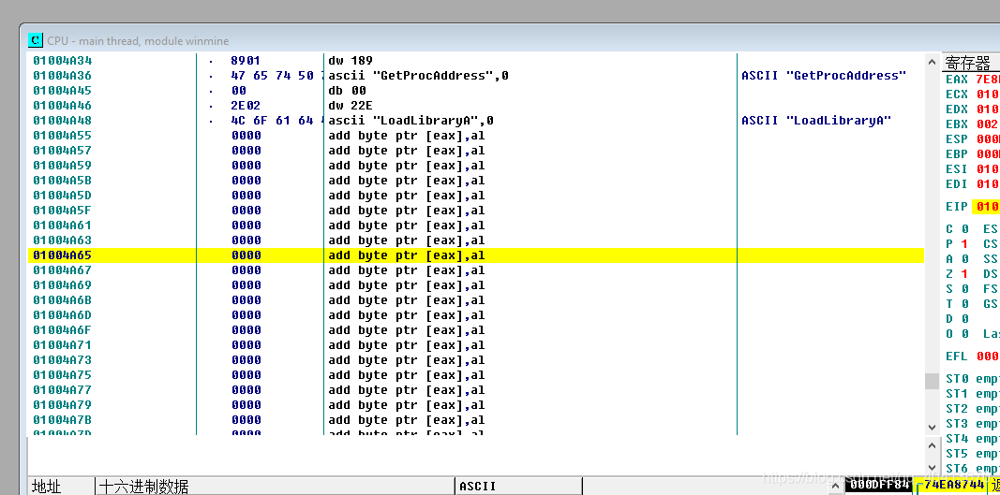


我们选定这个位置后，开始打一个空格，尝试修改一下汇编代码，填入`PUSH 0`。


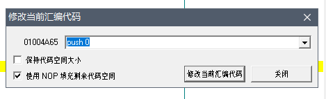

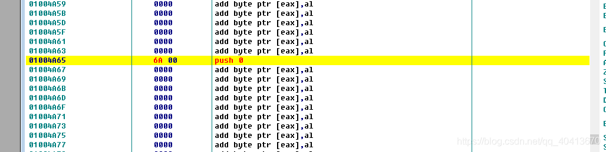


之后我们再占用一下位置，填写一下如下的代码，这个`01004AB5`是我随意写的，只是为了占一个位置。

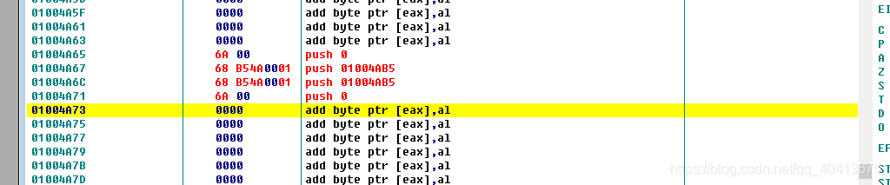

接着我们需要找到弹窗的地址，右击-查找-名称，在弹出的窗口点一下名称，让他排一下序，我们找到`&USER32.MessageBoxW`，之后右击-复制到剪贴板-地址。

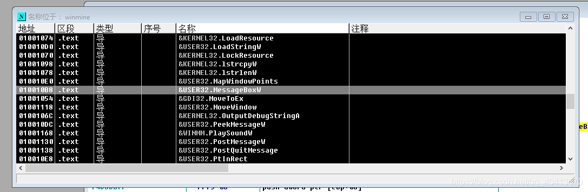

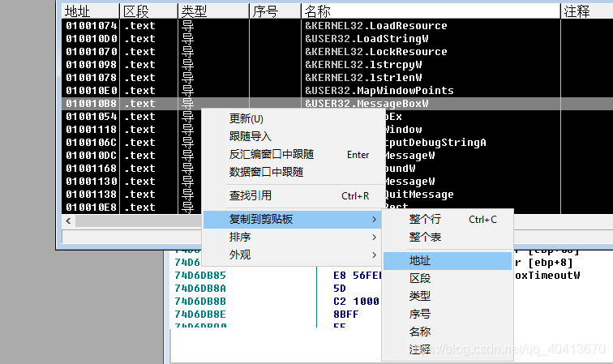

之后我们定位到`01004A73`这个位置，填入`CALL DWORD PTR DS:[010010B8]`，在`DS:[010010B8]`中的地址就是刚才复制的地址。

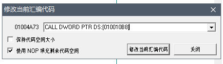

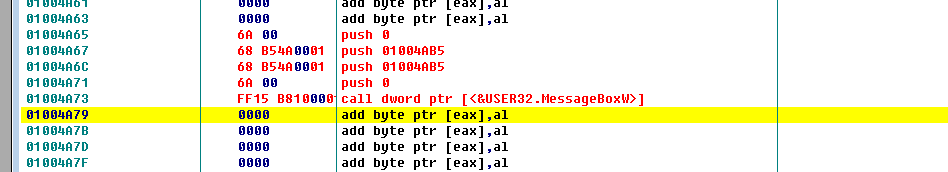

这样弹出消息框的部分就完成了，四个`push`加一个`call`就是弹消息框的，中间的两个`push`第一个就是传标题第二个就是传内容的，现在我们依旧再写两行语句进行占位，这主要是为了后边启动逻辑方面用，也就是为了最初的时候我们复制的启动时定位的那两行使用。

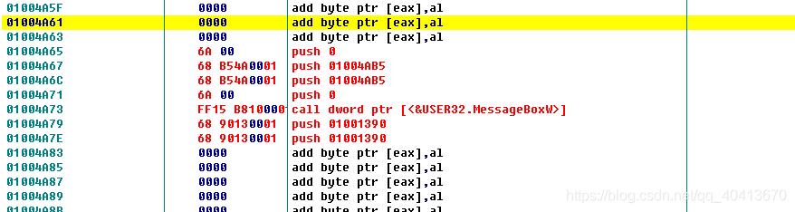

之后我们再空出来几行代码，在`01004A91`地址上右击-编辑-二进制编辑。

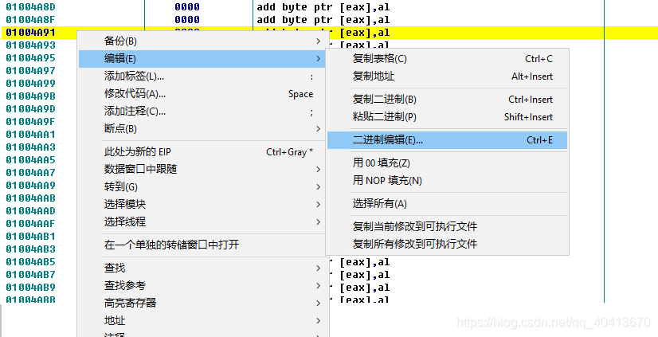

在`UNICODE`区域填入`Title`，然后保存。

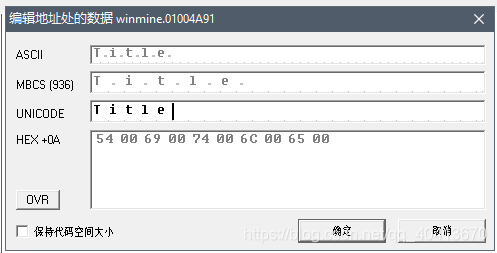

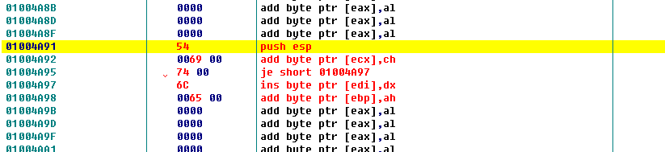

同样空几行位置，在`01004AE3`添加一个`Hello World`。

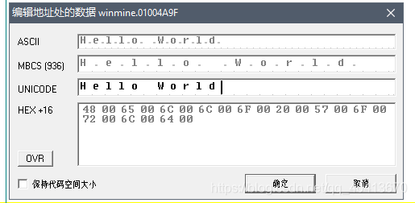

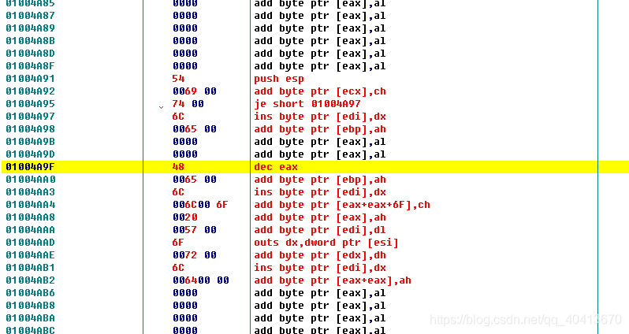

之后我们回到`01004A67`，在此处开始添加汇编，双击或者按空格都可以，在`01004A67`位置修改为`PUSH 01004A91`，之后接着修改，在下一个位置也就是`01004A6C`修改为`PUSH 01004A9F`，也就是将刚才两个添加的字符串放置于此处引用。

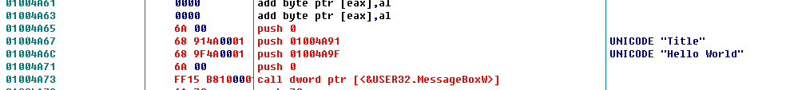

紧接着我们修改启动的逻辑，点击右边的`EIP`定位到入口位置。

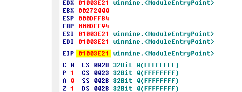

在最初的时候我们选择了前`2`行位置的代码进行了复制，现在我们同样选中前`2`行，然后右击-编辑-用`NOP`填充。

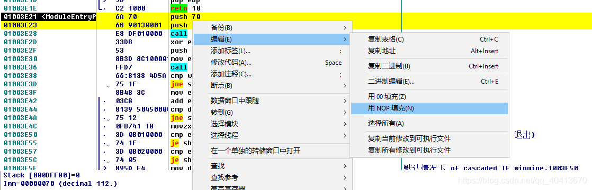

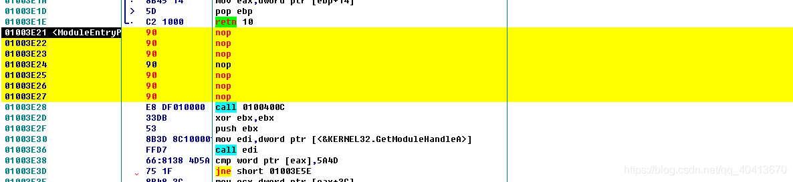

然后在第一个位置也就是`01004A65`，填入`JMP 01004A65`，也就是我们刚才找到的编辑过的`00`段的第一个位置。

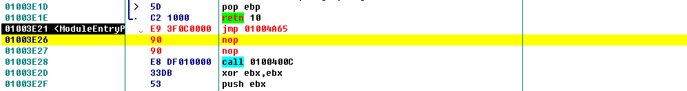

然后我们再回到`01004A65`，从`01004A79`开始按照顺序将原来的`2`行汇编填充进去，就是在最初的时候我们复制到记事本的代码，出现了多个`nop`的话我们就对于要编辑的从`01004A79`开始重新右击-编辑-用`00`填充，然后再接着填写，注意最后我们还有一个`jmp`跳回的操作，也就是在上图的`nop`后的第一条语句地址即`01003E28`。

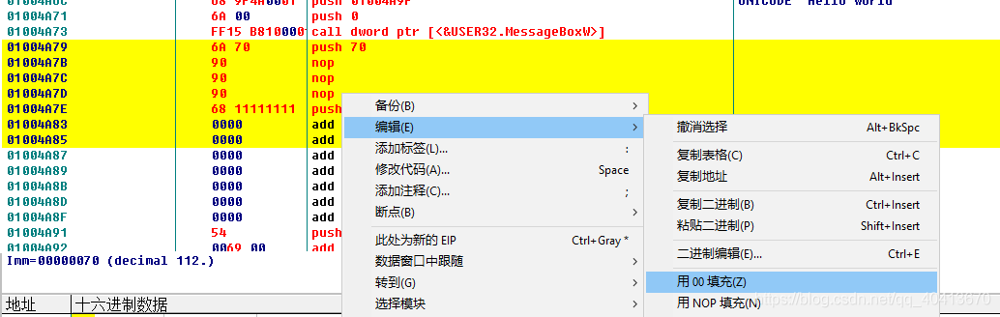

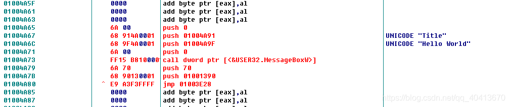

到这基本就差不多了，思路就是从入口开始执行我们自己的代码，然后执行完了再跳转回去继续执行原来的代码。之后我们右击-编辑-复制所有修改到可执行文件。

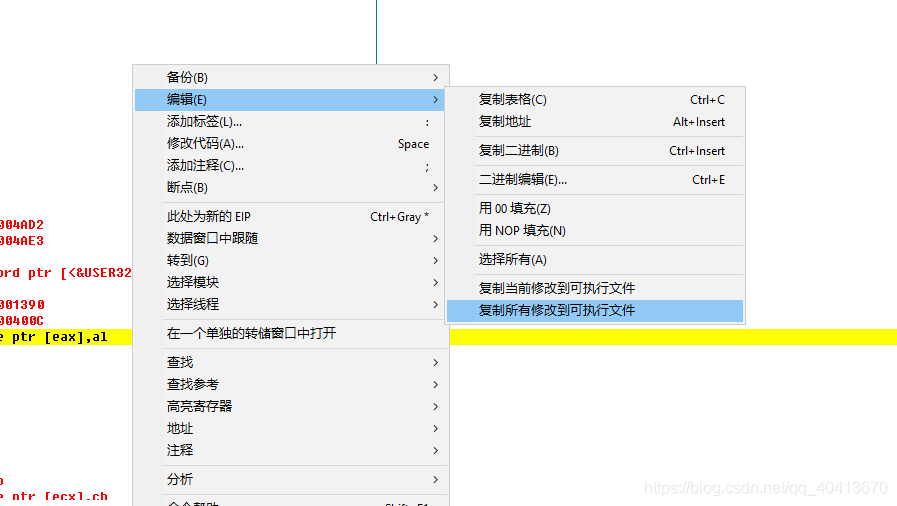

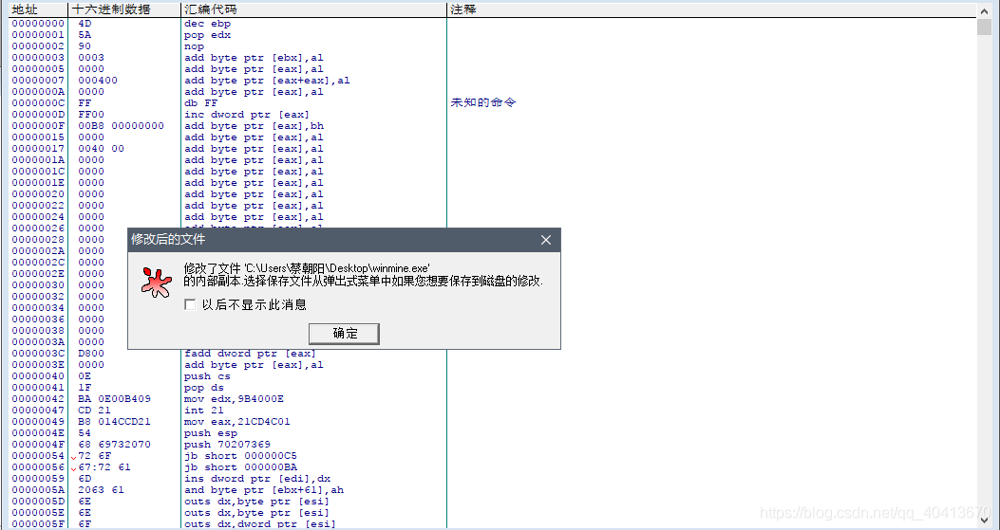

右击-保存文件，选是，即可保存，注意这边还是要另存为一个文件名，用来和原来的有所区分。


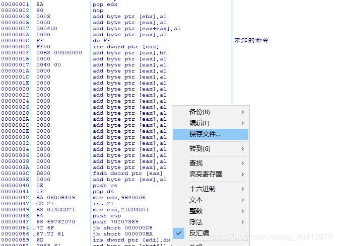

保存过后，运行该文件即可看到效果。


## Blog

```
https://blog.touchczy.top/#/
```

## 参考

```
http://www.downcc.com/soft/24420.html
https://www.xiazaiba.com/html/3979.html
https://www.52pojie.cn/thread-217068-1-1.html
```
