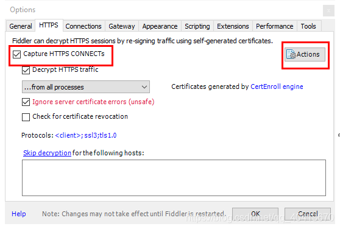
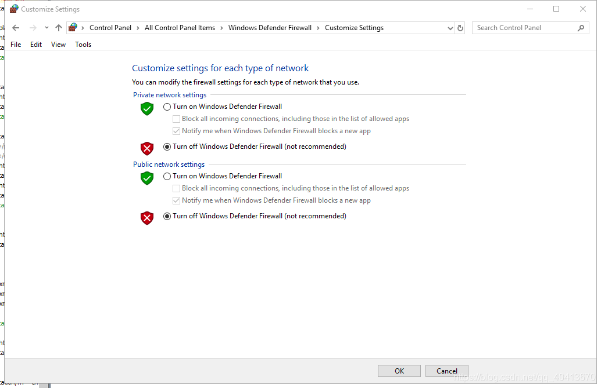

# Capturing HTTPS Traffic on Mobile (Fiddler & Packet Capture)

    I previously wrote a little script for a game called "EliminVirus" that helps with collecting coins. To use it, you need to obtain the openid, which requires capturing the HTTPS packets from WeChat. I've always used Fiddler to capture packets on the computer and Packet Capture to capture packets on the phone. Suddenly, I wanted to try capturing the phone's packets using the computer. 
    Link: https://github.com/WindrunnerMax/EliminVirus

## 1. Fiddler
First, download and install Fiddler.

Open Tools - Options - HTTPS and install the certificate.

Open Connections and allow remote hosts to connect. This operation requires restarting Fiddler to take effect.

To prevent the firewall from blocking the phone's connection, temporarily disable the firewall.
Control Panel - Firewall - Change Notification Settings

The phone and the computer need to be on the same local network. Check the local IP address of the device. Since I'm using Wi-Fi, I only need to look at the IP address displayed under the WLAN network card.

On the phone, open the IP:8888 to download and install the certificate. If prompted that the file cannot be found, go to the phone's Settings - Install Certificates from Storage, then set a password.

Open the connected Wi-Fi on the phone and click on "Set Proxy Manually."

Open WeChat - EliminVirus, and Fiddler will start capturing packets.

## 2. Packet Capture
Open the software and go to the options in the top right corner to set it up.

Install the certificate.

Click Start and choose WeChat.

Select the one on the right with "ssl" and you will be able to see the openid.

