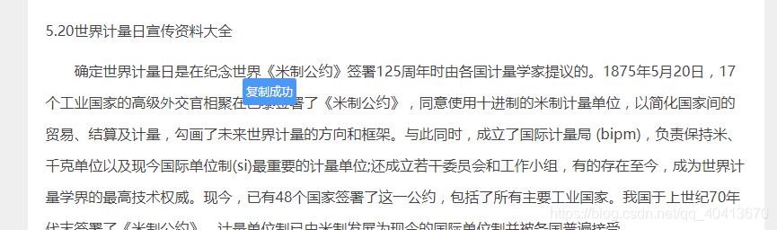

# Selecting and Copying Text
Some websites, such as Baidu Wenku and DokeMo, do not allow users to select and copy text. As a frontend developer, I find this unreasonable. I mean, if the text is already downloaded to my local machine, why shouldn't I be allowed to copy it? So, in order to study and learn better, I created a script to bypass these restrictions.

## Description
First, let's take a look at the screenshots. I'll use Baidu Wenku and DokeMo as examples to demonstrate the effect. Simply click the copy button to successfully copy the text.


Script download link: [https://greasyfork.org/scripts/405130-文本选中复制](https://greasyfork.org/scripts/405130-%E6%96%87%E6%9C%AC%E9%80%89%E4%B8%AD%E5%A4%8D%E5%88%B6)  
Github: [https://github.com/WindrunnerMax/TKScript/tree/master/src/copy](https://github.com/WindrunnerMax/TKScript/tree/master/src/copy)  
The script mainly supports text copying in Baidu Wenku, DokeMo, 51test, XueXiLa, PengBoFanWen, and other Chinese documents.

## Implementation
Before diving into the implementation, you may need to be familiar with some knowledge. Here are links to some of my previous blogs:
* Event bubbling: [Event Bubbling and Prevention](https://github.com/WindrunnerMax/EveryDay/blob/master/JavaScript/%E4%BA%8B%E4%BB%B6%E5%86%92%E6%B3%A1%E5%8F%8A%E9%98%BB%E6%AD%A2.md)
* Event flow model: [JavaScript Event Flow Model](https://github.com/WindrunnerMax/EveryDay/blob/master/JavaScript/JS%E4%BA%8B%E4%BB%B6%E6%B5%81%E6%A8%A1%E5%9E%8B.md)
* Browser events: [Browser Events](https://github.com/WindrunnerMax/EveryDay/blob/master/Browser/%E6%B5%8F%E8%A7%88%E5%99%A8%E4%BA%8B%E4%BB%B6.md)
* `ES6` related syntax: [ES6 New Features](https://github.com/WindrunnerMax/EveryDay/blob/master/JavaScript/ES6%E6%96%B0%E7%89%B9%E6%80%A7.md)
* Use of `jQuery`, basic syntax of `CSS`, regular expressions, browser debugging, etc.

### Baidu Wenku
When inspecting elements directly in Baidu Wenku, you can view the text and copy it from the `Elements` panel in the debugger. However, it can be a hassle. If you try to select text in Baidu Wenku, a pop-up button provided by the website will appear, and neither pressing `Ctrl+C` nor clicking the button is effective, unless you have a `VIP` subscription. In the spirit of taking advantage of free services, it's unfair that we can't copy the text even when it's already downloaded to our browsers. So, I first studied the website's `Event Listeners`.


Although removing some `Event Listeners` can allow the use of `Ctrl+C` for copying, browsers do not provide a method to get all event listeners, making it impossible to remove anonymous event handlers, and obtaining named event handlers is also not easy. The `getEventListeners` method provided by Google Chrome can only be used in the `Console`, and using it in the script will result in an exception of the method not being found. So, I came up with an alternative solution. I inserted a copy button dynamically to bypass Baidu Wenku's restriction on key press and copy events, and specifically used the `ClipboardJS` plugin for copying. Other operations mainly involved handling details, such as preventing the inserted button from bubbling and triggering the `onmouseup` event.

### WindrunnerMax

I have to say, this really surprised me. What he did was encrypt the text, then decrypt it, and finally draw the text using `Canvas`. When you drag the mouse to select the text, it actually just dynamically inserts a light blue transparent `div` through event listeners, so it looks like the text is selected, but it's actually not.


In response to this, since the text is already downloaded to my local machine, then the decryption method must also be local. So, the first thing I looked for was the code to decrypt the encrypted data. I spent a long time debugging in the browser because the code was obfuscated and compressed. The decryption-related code was quite messy and not easy to reproduce. So, I took a different approach. Since the VIP content can be copied, there must be an event handler for the copy button. By continuously debugging, I located an encrypted JavaScript file. Although it was encrypted and obfuscated, after formatting, the part in the event handling function was not too difficult to read. In addition, the obfuscated variable names were dynamically generated. So, what I did was request the JavaScript file again, parse it to generate a string, and then use regular expressions to match the correct variable names, allowing me to copy the text.


### Other Matters

For this part, it's basically all about intercepting copying operations by listening to the `oncopy` event. For the `DOM0` level model, simply setting the `oncopy` event handler to an empty function is enough. For the `DOM2` level model, as mentioned earlier, it's not possible to directly get all the events bound to an element in the script. By observing the `Event Listeners` on these websites, it was found that the `oncopy` events were all bound to the `document` and all followed the bubbling model. Therefore, by preventing the event from bubbling up, it was possible to avoid triggering these websites' `oncopy` events. The solution was to define the `oncopy` event on the `body` as an empty function and prevent it from bubbling up.



## Github

```
https://github.com/WindrunnerMax/TKScript
```