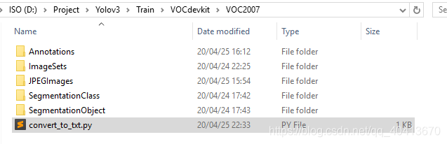
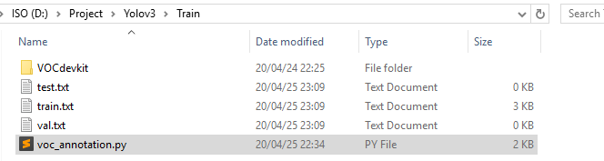
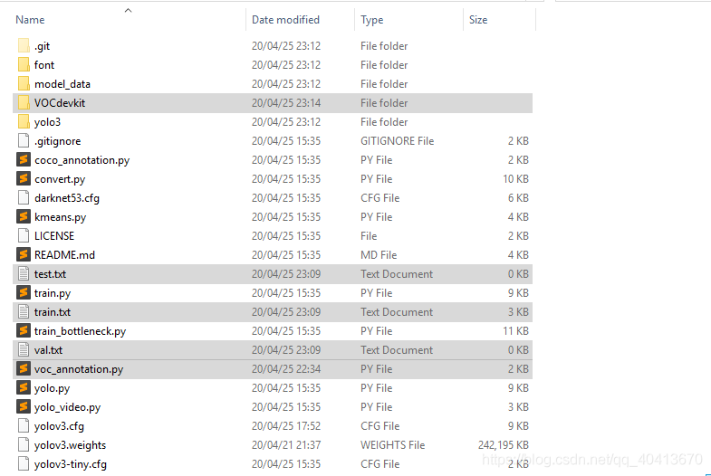
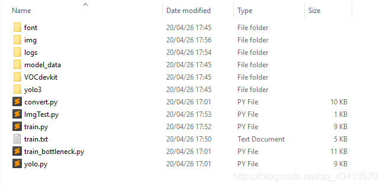

# YOLOV3 Object Detection
Learning to use `keras-yolov3` for image object detection from scratch, providing a detailed record of the preparation and training process. Also, offering an example of training a signal light object detection model and providing relevant code and training data.

## Demo Test
`YOLO` provides the model and source code. First, use the pre-trained weight file of `YOLO` for quick testing. Start by downloading the weight file:

```
https://pjreddie.com/media/files/yolov3.weights
```
Clone the `yolo3` repository to your local machine. The `commit id` for this test is `e6598d1`.

```shell
git clone git@github.com:qqwweee/keras-yolo3.git
```
Install various dependencies - install what's missing, pay attention to corresponding dependency versions. The following versions are for reference only:

```
Keras==2.2.4
numpy==1.16.0
tensorflow==1.12.0
...
```
Execute the `convert.py` file to convert `yolo` from `darknet` to a `h5` file that can be used for `keras`. The generated file is saved in the `model_data` directory. Additionally, `convert.py` and `yolov3.vfg` are provided in the root directory after `git clone`, so there's no need to download them separately.

```shell
python convert.py yolov3.cfg yolov3.weights model_data/yolo.h5
```
Use `python yolo_video.py -h` to get the `help` content.

```shell
usage: yolo_video.py [-h] [--model MODEL] [--anchors ANCHORS]
                     [--classes CLASSES] [--gpu_num GPU_NUM] [--image]
                     [--input [INPUT]] [--output [OUTPUT]]
optional arguments:
  -h, --help         show this help message and exit
  --model MODEL      path to model weight file, default model_data/yolo.h5
  --anchors ANCHORS  path to anchor definitions, default
                     model_data/yolo_anchors.txt
  --classes CLASSES  path to class definitions, default
                     model_data/coco_classes.txt
  --gpu_num GPU_NUM  Number of GPU to use, default 1
  --image            Image detection mode, will ignore all positional
                     arguments
  --input [INPUT]    Video input path
  --output [OUTPUT]  [Optional] Video output path
```
For image object detection testing, remember that when the parameter is `--image`, all positional arguments will be ignored. This means that every time you perform image detection, you will need to manually enter the position. Of course, this can be modified by self-building code in the future.

```shell
python yolo_video.py --image
```
Next, the prompt `Input image filename:` will appear. I placed it under `./img/3.jpg`, so I just entered the path directly.


After a short wait, the identification will be completed.


## Model Training

### Prepare the Dataset

First, you need to prepare the directory structure. You can download the `VOC2007` dataset from [http://host.robots.ox.ac.uk/pascal/VOC/voc2007/](http://host.robots.ox.ac.uk/pascal/VOC/voc2007/), then delete all the files, leaving only the directory structure. Alternatively, you can manually create the following directory structure:


Next, place all the images in the `JPEGImages` directory. Then, download the `labelImg` annotation tool from [https://github.com/tzutalin/labelImg](https://github.com/tzutalin/labelImg). This tool is used to annotate the images and create `XML` files containing the selected image boxes. Open the images using `labelImg`, annotate them, and save the generated `XML` files in the `Annotations` folder with the same names as the images.


### Prepare the Training Files

Create a `python` file in `VOCdevkit/VOC2007`, write the following code, and run it. This will generate four `txt` files in `VOCdevkit/VOC2007/ImageSets/Main`.



```python
import os
import random
 
trainval_percent = 0
train_percent = 1  # Divide all into the training set, as YOLO3 will still divide into training and test sets during training, no need to divide here
xmlfilepath = 'Annotations'
txtsavepath = 'ImageSets/Main'
total_xml = os.listdir(xmlfilepath)
 
num = len(total_xml)
lst = range(num)
tv = int(num * trainval_percent)
tr = int(tv * train_percent)
trainval = random.sample(lst, tv)
train = random.sample(trainval, tr)
 
ftrainval = open('ImageSets/Main/trainval.txt', 'w')
ftest = open('ImageSets/Main/test.txt', 'w')
ftrain = open('ImageSets/Main/train.txt', 'w')
fval = open('ImageSets/Main/val.txt', 'w')
 
for i in lst:
    name = total_xml[i][:-4] + '\n'
    if i in trainval:
        ftrainval.write(name)
        if i in train:
            ftest.write(name)
        else:
            fval.write(name)
    else:
        ftrain.write(name)
 
ftrainval.close()
ftrain.close()
fval.close()
ftest.close()
```

In the upper directory of `VOCdevkit`, which is currently in the `Train` directory, create a `python` file and run it. This will generate three `txt` files. Note that in this code, you need to change the `classes` to the categories you want to train. In my case, I only need to train the `person` category, so the array only contains the `person` category.



```python
import xml.etree.ElementTree as ET
from os import getcwd
```

```python
sets=[('2007', 'train'), ('2007', 'val'), ('2007', 'test')]

classes = ["person"]


def convert_annotation(year, image_id, list_file):
    in_file = open('VOCdevkit/VOC%s/Annotations/%s.xml'%(year, image_id),'rb')
    tree=ET.parse(in_file)
    root = tree.getroot()

    for obj in root.iter('object'):
        difficult = obj.find('difficult').text
        cls = obj.find('name').text
        if cls not in classes or int(difficult)==1:
            continue
        cls_id = classes.index(cls)
        xmlbox = obj.find('bndbox')
        b = (int(xmlbox.find('xmin').text), int(xmlbox.find('ymin').text), int(xmlbox.find('xmax').text), int(xmlbox.find('ymax').text))
        list_file.write(" " + ",".join([str(a) for a in b]) + ',' + str(cls_id))

wd = getcwd()

for year, image_set in sets:
    image_ids = open('VOCdevkit/VOC%s/ImageSets/Main/%s.txt'%(year, image_set)).read().strip().split()
    list_file = open('%s.txt'%(image_set), 'w')
    for image_id in image_ids:
        list_file.write('VOCdevkit/VOC%s/JPEGImages/%s.jpg'%(year, image_id))
        convert_annotation(year, image_id, list_file)
        list_file.write('\n')
    list_file.close()
```
Next, copy all the files in the `Train` directory to the directory after `git clone`. At this time, the file directory structure is as follows.



### Modify Parameters
At this point, you need to modify the `model_data/coco_classes.txt` and `voc_classes.txt` files. Both of these files need to contain the training categories. Similarly, I am only training the `person` category, so there is only one line `person` in this place.

Next, modify `yolov3.cfg`. If you don't need to load pre-trained weights, then it is unnecessary to modify this file. This file is for configuring the generation of `yolo_weights.h5`. Search for `yolo` in this file. There will be three matches, all of which require the same way of modification. Taking the first match as an example, there are three places for comments, which means a total of 9 lines need to be changed.
...
[convolutional]
size=1
stride=1
pad=1
filters=18  # 3*(5+len(classes)) # I train one category, thus 3*(5+1) = 18
activation=linear
```

[yolo]
mask = 6,7,8
anchors = 10,13,  16,30,  33,23,  30,61,  62,45,  59,119,  116,90,  156,198,  373,326
classes=1 # One type of category
num=9
jitter=.3
ignore_thresh = .5
truth_thresh = 1
random=1 # Change to 0 if the memory is small   
...
```
Run `python convert.py -w yolov3.cfg yolov3.weights model_data/yolo_weights.h5` to generate `model_data/yolo_weights.h5` for loading pretrained weights.

### Train Model
Then you can start training. Since I temporarily didn't have data at the beginning, I just tried a few pictures marked arbitrarily. Because there were less than ten pictures and I divided the dataset and training set when building the `VOC` dataset, and `train.py` defaults to divide the data into `0.1` as the training set, multiplying `0.1` by less than ten pictures equals `0`, which caused errors. It is important to note that you must have a validation set, which means you need at least two pictures, one as the training set and one as the validation set. Otherwise, running `train.py` will report a `KeyError: 'val_loss'` error, and running `train_bottleneck.py` will report a `IndexError: list index out of range`. In addition, it is also important to manually create the `logs/000/` directory to prevent the exception thrown when the model is saved. Generally, training can be done with `train.py`. For any issues that may occur, you can refer to `github`'s `issue` and `README`. For my training purposes, I made some slight modifications to `train.py`, and there are comments on some of the modifications I made.

```python
"""
Retrain the YOLO model for your own dataset.
"""

import numpy as np
import keras.backend as K
from keras.layers import Input, Lambda
from keras.models import Model
from keras.optimizers import Adam
from keras.callbacks import TensorBoard, ModelCheckpoint, ReduceLROnPlateau, EarlyStopping

from yolo3.model import preprocess_true_boxes, yolo_body, tiny_yolo_body, yolo_loss
from yolo3.utils import get_random_data


def _main():
    annotation_path = 'train.txt'
    log_dir = 'logs/000/'
    classes_path = 'model_data/voc_classes.txt'
    anchors_path = 'model_data/yolo_anchors.txt'
    class_names = get_classes(classes_path)
    num_classes = len(class_names)
    anchors = get_anchors(anchors_path)

    input_shape = (416,416) # multiple of 32, hw
```

# The judgment of create_tiny_model has been removed here # If load_pretrained is False, the pre-trained weights will not be loaded, and if it is True, the pre-trained weights will be loaded
model = create_model(input_shape, anchors, num_classes,load_pretrained=False,
        freeze_body=2, weights_path='model_data/yolo_weights.h5') # make sure you know what you freeze

logging = TensorBoard(log_dir=log_dir)

# Change ModelCheckpoint callback to check the model every 10 cycles
checkpoint = ModelCheckpoint(log_dir + 'ep{epoch:03d}-loss{loss:.3f}-val_loss{val_loss:.3f}.h5',
    monitor='val_loss', save_weights_only=True, save_best_only=True, period=10)
reduce_lr = ReduceLROnPlateau(monitor='val_loss', factor=0.1, patience=3, verbose=1)
early_stopping = EarlyStopping(monitor='val_loss', min_delta=0, patience=6000, verbose=1)

# Divide the input into training and test sets in proportion
val_split = 0.3
with open(annotation_path) as f:
    lines = f.readlines()
np.random.seed(10101)
np.random.shuffle(lines)
np.random.seed(None)
num_val = int(len(lines)*val_split)
num_train = len(lines) - num_val

# Train with frozen layers first, to get a stable loss.
# Adjust the number of epochs to your dataset. This step is enough to obtain a decent model.
if True:
    model.compile(optimizer=Adam(lr=1e-3), loss={
        # use custom yolo_loss Lambda layer.
        'yolo_loss': lambda y_true, y_pred: y_pred})

    # The batch_size needs to be changed according to the amount of VRAM
    batch_size = 10
    print('Train on {} samples, val on {} samples, with batch size {}.'.format(num_train, num_val, batch_size))

# epochs is the number of training times
model.fit_generator(data_generator_wrapper(lines[:num_train], batch_size, input_shape, anchors, num_classes),
        steps_per_epoch=max(1, num_train//batch_size),
        validation_data=data_generator_wrapper(lines[num_train:], batch_size, input_shape, anchors, num_classes),
        validation_steps=max(1, num_val//batch_size),
        epochs=50, 
        initial_epoch=0,
        callbacks=[logging, checkpoint])
model.save_weights(log_dir + 'trained_weights_stage_1.h5')

# Unfreeze and continue training, to fine-tune.
# Train longer if the result is not good.
if True:
    for i in range(len(model.layers)):
        model.layers[i].trainable = True
    model.compile(optimizer=Adam(lr=1e-4), loss={'yolo_loss': lambda y_true, y_pred: y_pred}) # recompile to apply the change
    print('Unfreeze all of the layers.')

    # batch_size needs to be adjusted for the VRAM
    batch_size = 10 # note that more GPU memory is required after unfreezing the body
    print('Train on {} samples, val on {} samples, with batch size {}.'.format(num_train, num_val, batch_size))

    # epochs is the number of training times
    model.fit_generator(data_generator_wrapper(lines[:num_train], batch_size, input_shape, anchors, num_classes),
        steps_per_epoch=max(1, num_train//batch_size),
        validation_data=data_generator_wrapper(lines[num_train:], batch_size, input_shape, anchors, num_classes),
        validation_steps=max(1, num_val//batch_size),
        epochs=50,
        initial_epoch=50)
    model.save_weights(log_dir + 'trained_weights_final.h5')

# Further training if needed.
```

```python
def get_classes(classes_path):
    '''loads the classes'''
    with open(classes_path) as f:
        class_names = f.readlines()
    class_names = [c.strip() for c in class_names]
    return class_names

def get_anchors(anchors_path):
    '''loads the anchors from a file'''
    with open(anchors_path) as f:
        anchors = f.readline()
    anchors = [float(x) for x in anchors.split(',')]
    return np.array(anchors).reshape(-1, 2)


def create_model(input_shape, anchors, num_classes, load_pretrained=True, freeze_body=2,
            weights_path='model_data/yolo_weights.h5'):
    '''create the training model'''
    K.clear_session() # get a new session
    image_input = Input(shape=(None, None, 3))
    h, w = input_shape
    num_anchors = len(anchors)

    y_true = [Input(shape=(h//{0:32, 1:16, 2:8}[l], w//{0:32, 1:16, 2:8}[l], \
        num_anchors//3, num_classes+5)) for l in range(3)]

    model_body = yolo_body(image_input, num_anchors//3, num_classes)
    print('Create YOLOv3 model with {} anchors and {} classes.'.format(num_anchors, num_classes))

    if load_pretrained:
        model_body.load_weights(weights_path, by_name=True, skip_mismatch=True)
        print('Load weights {}.'.format(weights_path))
        if freeze_body in [1, 2]:
            # Freeze darknet53 body or freeze all but 3 output layers.
            num = (185, len(model_body.layers)-3)[freeze_body-1]
            for i in range(num): model_body.layers[i].trainable = False
            print('Freeze the first {} layers of total {} layers.'.format(num, len(model_body.layers)))
```

```python
model_loss = Lambda(yolo_loss, output_shape=(1,), name='yolo_loss',
    arguments={'anchors': anchors, 'num_classes': num_classes, 'ignore_thresh': 0.5})(
    [*model_body.output, *y_true])
model = Model([model_body.input, *y_true], model_loss)

return model

def create_tiny_model(input_shape, anchors, num_classes, load_pretrained=True, freeze_body=2,
        weights_path='model_data/tiny_yolo_weights.h5'):
    '''create the training model, for Tiny YOLOv3'''
    K.clear_session() # get a new session
    image_input = Input(shape=(None, None, 3))
    h, w = input_shape
    num_anchors = len(anchors)

    y_true = [Input(shape=(h//{0:32, 1:16}[l], w//{0:32, 1:16}[l], \
        num_anchors//2, num_classes+5)) for l in range(2)]

    model_body = tiny_yolo_body(image_input, num_anchors//2, num_classes)
    print('Create Tiny YOLOv3 model with {} anchors and {} classes.'.format(num_anchors, num_classes))

    if load_pretrained:
        model_body.load_weights(weights_path, by_name=True, skip_mismatch=True)
        print('Load weights {}.'.format(weights_path))
        if freeze_body in [1, 2]:
            # Freeze the darknet body or freeze all but 2 output layers.
            num = (20, len(model_body.layers)-2)[freeze_body-1]
            for i in range(num): model_body.layers[i].trainable = False
            print('Freeze the first {} layers of total {} layers.'.format(num, len(model_body.layers)))

    model_loss = Lambda(yolo_loss, output_shape=(1,), name='yolo_loss',
        arguments={'anchors': anchors, 'num_classes': num_classes, 'ignore_thresh': 0.5})(
        [*model_body.output, *y_true])
    model = Model([model_body.input, *y_true], model_loss)

    return model
```

```python
def data_generator(annotation_lines, batch_size, input_shape, anchors, num_classes):
    '''Data generator for fit_generator'''
    n = len(annotation_lines)
    i = 0
    while True:
        image_data = []
        box_data = []
        for b in range(batch_size):
            if i==0:
                np.random.shuffle(annotation_lines)
            image, box = get_random_data(annotation_lines[i], input_shape, random=True)
            image_data.append(image)
            box_data.append(box)
            i = (i+1) % n
        image_data = np.array(image_data)
        box_data = np.array(box_data)
        y_true = preprocess_true_boxes(box_data, input_shape, anchors, num_classes)
        yield [image_data, *y_true], np.zeros(batch_size)

def data_generator_wrapper(annotation_lines, batch_size, input_shape, anchors, num_classes):
    n = len(annotation_lines)
    if n==0 or batch_size<=0: return None
    return data_generator(annotation_lines, batch_size, input_shape, anchors, num_classes)

if __name__ == '__main__':
    _main()

```
## Model Testing
Once the model training is completed, you can load the model for image testing.

```python
import sys
import argparse
from yolo import YOLO, detect_video
from PIL import Image


if __name__ == '__main__':
    config = {
        "model_path": "logs/000/trained_weights_final.h5", # Load model
        "score": 0.1, # Predictions exceeding this value will be displayed
        "iou": 0.5, # Intersection over Union
    }
    yolo = YOLO(**config)
    image = Image.open("./img/1.jpg")
    r_image = yolo.detect_image(image)
    r_image.save("./img/2.jpg")
```
Subsequently, you need to continue optimizing parameters and training. In fact, there are many files in the directory that are unnecessary or generally not used after the initial use, so it can be helpful to back up the code and appropriately streamline the directory structure.



## Model Training Example
Downloaded 50 images of traffic lights from Baidu as a training set. This instance is just a `demo` of model training. The dataset is relatively small, and the relevant information is for reference only.

### Runtime Environment

```
cuda 8.0
python 3.6
keras 2.1.5
tensorflow-gpu 1.4.0
```
### Related Configurations

```python
val_split = 0.1 # Proportion of training set to test set
batch_size = 5 # Number of samples selected for each training
epochs = 300 # Training three hundred times
```

### Running Result
There are more red lights in the dataset, so the confidence of the red lights in the training result is `0.60` and `0.72`, and there are fewer samples of green lights, so the confidence of recognizing green lights is `0.38`. Overall, the effect is still acceptable.
```python
loss: 25.8876 - val_loss: 38.1282
```

#### Original Image


#### Recognition


### Example Code
```
If you find it useful, please give us a star 😃
https://github.com/WindrunnerMax/Example
```