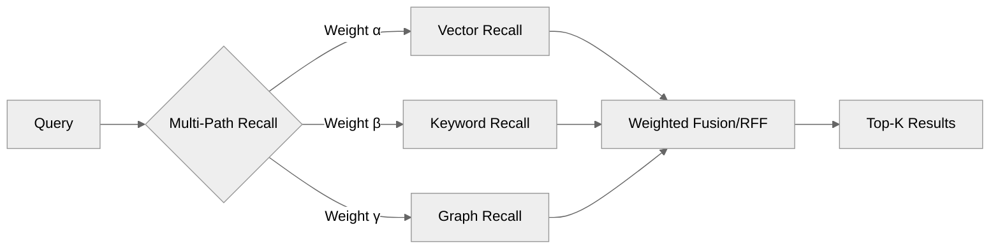
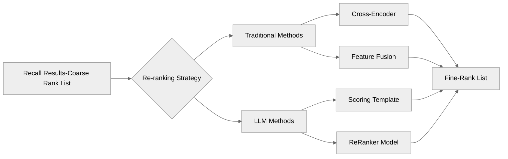

# Implementing Basic RAG Service Based on Vector Retrieval

`RAG Retrieval-Augmented Generation` is a model architecture used in natural language processing, combining retrieval and generation technologies. RAG services perform exceptionally well in tasks such as knowledge question-answering, code generation, fact verification, and domain-specific retrieval by enhancing the quality and accuracy of generated model answers through knowledge retrieval.

In reality, the development related to RAG is already quite mature, and it may not seem to be keeping up with the latest trends. However, the end of 2022 and now are considered the best times to learn about RAG. RAG services have a close relationship with current AI infrastructure development. Being a fundamental component, RAG is a complex system that operates around various data, knowledge, and LLMs services with search at its core.

## Overview

In our current discussion, the focus lies on the 'RA' part of RAG, which leans towards traditional NLP tasks. This article mainly covers text vectorization and vector retrieval. On the other hand, the 'G' part integrates retrieval and generation frameworks to enhance the capabilities of generation models. It can improve the quality and accuracy of generated text based on queries and retrieved content.

Vector retrieval is the core component of RAG services. However, its primary goal is content retrieval. Therefore, we are not limited to using vector methods for content retrieval. Whether it is utilizing a graph database like GraphRAG or ElasticSearch's full-text retrieval capability based on inverted indexing, these methods can be utilized to implement RAG retrieval services. This allows us to unify retrieval and ranking methods.

Moreover, when using LLMs, acquiring the latest knowledge can be challenging since models like GPT are pre-trained and cannot learn new information in real-time. Fine-tuning training using RL reinforcement learning, SFT supervised tuning, and other methods require higher annotation content and computational resources, resulting in higher costs.

Subsequently, RAG services offer a simple and cost-effective mode to input Context into LLMs. Tuning prompts can also be considered as a way to provide Context. Functions like Function Call and MCP can serve as ways to provide Context to LLMs. In simple terms, RAG services present the following scenarios of use:

- Need for acquiring recent knowledge content: When seeking the latest research developments in specific domains or real-time updated documents within a company, including common web search scenarios, these can be considered as variations of RAG services. For obtaining the latest relevant information, utilizing Function Call methods like real-time weather queries may be necessary.
- Providing domain-specific knowledge: When in need of accessing specialized knowledge in specific domains such as medicine, law, or internal company knowledge not included in general LLM training data, RAG services can be used to provide such content.
- Enhancing transparency and interpretability: In scenarios requiring verification, traceability, or understanding of LLM decision-making processes, such as financial analysis reports, initial legal advice drafts, medical information queries, RAG systems can provide generated answers along with retrieval sources, offering users a means to verify answer accuracy, increasing transparency, and trust in system outputs.
- Retrieval of data with a long-tail distribution: When data distribution follows a long-tail pattern, general LLMs may struggle to provide satisfactory answers due to insufficient training data coverage. RAG can aid in retrieving rare or uncommon cases, enhancing the model's performance on such long-tail data, which significantly relies on the retrieval capabilities of the RAG service.
- Vertical search and intelligent Q&A: RAG naturally fits scenarios such as intelligent search and question-answering bots tailored for specific domains or enterprise content. User queries trigger searches in exclusive knowledge bases, and the retrieved content is used to generate precise, concise, context-aware answers, offering more natural and informative responses compared to traditional keyword matching.

This article presents a very basic example of RAG implementation. It utilizes a lightweight `all-MiniLM-L6-v2` model for embedding and a lightweight `hnswlib-node` database for vector retrieval, facilitating direct execution in a node environment at <https://github.com/WindRunnerMax/webpack-simple-environment/tree/master/packages/hnsw-rag>.

Currently, many cloud service providers and open-source projects offer ready-to-use implementations of RAG services. Depending on requirements, one can decide whether to integrate such out-of-the-box services. However, if fine-tuning various functionalities like custom sharding strategies is necessary, it depends on whether the service exposes relevant implementations. Therefore, direct handling may not always be feasible.

It is typically advisable to let professionals handle specialized tasks, and using ready-to-use solutions usually poses no issues. However, as seen in my previous series of articles on building a rich text editor from scratch, relying more on browser capabilities requires dealing with complexities resulting from default behaviors, which similarly applies when using ready-to-use services. In cases where custom scenarios demand high precision, one might face uncontrollable situations.

Therefore, through implementing a simple RAG service in this article, it reflects what fine-tuning solutions we can implement to enhance recall rate and effectiveness. Understanding the possible parameter and data adjustments we can make to the service enables targeted optimization strategies.

## Text Vectorization

As mentioned earlier, the primary emphasis here is more towards traditional NLP retrieval tasks or text search tasks. Therefore, simplifying what we need to do involves the four parts of preprocessing, encoding, storing, and retrieval. In this section, we mainly focus on text preprocessing and encoding methods.

### Data Segmentation
During data preprocessing, our main tasks include data cleaning and segmentation. Data cleaning involves removing noise, duplicate content, filtering low-information text, and so on. The strategies in this part can be adjusted according to specific business needs. Segmentation, on the other hand, involves breaking down larger articles into smaller segments for easier vectorization and retrieval.

Here, we predominantly focus on the segmentation method which addresses two key issues. Firstly, document content can be lengthy; directly vectorizing the entire content could lead to high-dimensional vectors, incurring substantial computation and storage costs. Secondly, semantic information within the document may be distributed across different paragraphs, with much of it irrelevant to user queries, potentially diminishing the overall retrieval effectiveness post-vectorization.

An additional reason for segmentation is to prevent the entire document from being retrieved, thus conserving tokens. Moreover, when providing long contexts to Language Models (LLMs), initial content may be forgotten. Therefore, segmentation is a widely accepted solution. The approach of divide and conquer is particularly fitting here, enabling us to fine-tune the segmentation method to enhance recall rate and effectiveness.

Next, we can consider various segmentation methods, including fixed-size segmentation, sentence-based segmentation, structure-based segmentation, and more. Using the following text as an example, let's briefly discuss the way of segmentation. It's important to note that for demonstration purposes, the segments are relatively small; in practice, segments are often of lengths such as `512/1024/4096`.

```
## Deep Learning
Deep learning is a subset of machine learning that uses multiple layers of neural networks to mimic how the brain processes information. It has made significant advances in fields like image recognition, speech recognition, and natural language processing.
```

The most basic segmentation method involves dividing the text based on a fixed length, meaning a maximum length is set and the text is segmented accordingly. This straightforward approach allows for quick prototyping but may result in the loss of semantic information. For instance, if we segment the above text into segments of a maximum length of `30` characters each, the result would be:

```js
[
  "## Deep Learning\nDeep learning is a subset of",
  " machine learning...",
]
```

Although the text appears structured, the semantic information is fragmented, and some segments might contain padding or redundant information, lowering retrieval accuracy. To address this, a common strategy is to employ overlapping segmentation, which involves retaining a certain overlap between segments to preserve more contextual information. Building upon the previous example, we now introduce an overlap of `5` characters:

```js
[
  "## Deep Learning\nDeep learning is a subset",
  "et of machine learning that uses multiple layers of neur",
  "al networks to mimic how the brain processes information. I",
  "have made significant advances in fields like image recog",
  "cognition..."
]
```

Although this method appears to be an improvement, it still risks losing semantic information, especially when segment lengths are short, potentially leading to a loss of context. Segmentation with larger segment lengths generally performs better. In this article's example, we utilize this straightforward segmentation method.

```js
/**
 * Text segmentation method
 */
const splitTextChunks = (text: string): string[] => {
  // Here we segment directly based on fixed length + overlap; other strategies like structural segmentation can also be applied
  const chunkSize = 100;
  const overlap = 20;
  const chunks: string[] = [];
  for (let i = 0; i < text.length; i += chunkSize - overlap) {
    const chunk = text.slice(i, i + chunkSize);
    if (chunk.trim().length > 0) {
      chunks.push(chunk.trim());
    }
  }
  return chunks;
};
```

The second segmentation method involves sentence-based segmentation, where text is segmented based on sentences or paragraphs. This method better retains semantic information by typically segmenting at the boundaries of sentences or paragraphs rather than arbitrary lengths of characters. For example, segmenting the above text based on sentences results in:

```js
[
  "## Deep Learning",
  "Deep learning is a subset of machine learning that uses multiple layers of neural networks to mimic how the brain processes information.",
  "It has made significant advances in fields like image recognition, speech recognition, and natural language processing."
]
```

This method appears to preserve semantic information more effectively, ensuring coherent thought within segments. However, challenges remain, such as very short or excessively long sentences exceeding our Max Token limit.

Therefore, additional strategies need to be incorporated based on their actual performance. For short sentences, continuous concatenation of subsequent content until approaching the Max Token limit could be considered. For longer sentences, utilizing fixed-size segmentation to ensure each segment falls within a reasonable length range could better balance semantic integrity and segment length restrictions.

The third way of segmenting text is based on structural segmentation, which means segmenting the text based on its structure, such as titles, paragraphs, lists, etc. Especially since the input we usually provide to the model is in `Markdown` format, it naturally contains a certain level of structured information. By utilizing structural segmentation, we can better preserve the hierarchy and logical relationships of the text, thus avoiding the loss of semantic information.

```js
[
  "- List 1\n- List 2\n- List 3",
  "## Deep Learning\nDeep learning is a subset of machine learning that uses multi-layer neural networks to mimic the way the human brain processes information. It has made significant advances in areas such as image recognition, speech recognition, and natural language processing."
]
```

In reality, there is currently no universally applicable best segmentation strategy. The complexity of segmentation lies in determining the optimal size and structure of the segments. If the segments are too small, they may lose crucial contextual information, rendering them less meaningful. Conversely, if the segments are too large, the efficiency of the retrieval process will decrease, and irrelevant information may inadvertently be included, diluting the relevance of the results.

In addition to the above strategies, other important factors need to be considered when segmenting text. Ideally, segments should retain semantic units, such as complete sentences, paragraphs, or topics, to ensure coherence and prevent semantic interruption. Using overlapping segments or a sliding window is actually a quite effective solution, as it helps maintain context at segment boundaries, ensuring that key information or transitional contexts are not lost between segments.

Furthermore, we can even leverage Large Language Models (`LLMs`) to assist us in segmentation. Language models are more proficient in understanding and processing natural language text, making it a semantic-based segmentation strategy. However, when dealing with large amounts of data, efficiency and computational resource issues need to be considered, and LLMs are not a silver bullet. Specific effects still need to be validated through the construction of evaluation sets.

Another critical point is that metadata can be incorporated during segmentation, which is often overlooked. Metadata can include the document's title, author, publication date, etc. This information can help the model better understand the context and background of the segments. Furthermore, if we have manually annotated information related to the documents, it can further assist in reordering and content generation.

### Encoding
After data preprocessing is completed, the next consideration is the way the data is stored. Here, we first need to address the issue that computers cannot directly process text, as they inherently only operate on numbers. Hence, text needs to be converted into a numerical form that computers can understand, a process known as encoding.

Consider this in terms of font representation. If we were to directly process text into a byte stream encoded in `UTF-8`, could it be stored directly? While storage in this form is possible, retrieval becomes cumbersome as we aim to achieve semantic search, where understanding the meanings and intentions behind words and phrases is crucial. `UTF-8` alone cannot provide direct semantic information.

Similarly, the common usage of `Tokens` in NLP represents phrases rather than individual characters, following a similar line of thought. Words typically carry richer semantic information, whereas individual characters often lack such depth of meaning. For instance, the word "apple" carries a clear meaning, while the individual characters "a," "p," "p," "l," and "e" do not convey complete semantics. Segmenting text can reduce the length of text sequences, hence reducing complexity and computational requirements.

In implementing encoding, vectors are commonly used to represent phrases. The simplest form of vectorization is the `One-Hot` encoding method, where each phrase is represented by a high-dimensional sparse vector with only one element as `1` and the rest as `0`. This method is straightforward and intuitive but suffers from the curse of dimensionality and sparse semantic information issues.

```
Word   1   0   0   0   [1, 0, 0, 0]  
Language   0   1   0   0   [0, 1, 0, 0]
Processing   0   0   1   0   [0, 0, 1, 0]
Task   0   0   0   1   [0, 0, 0, 1]
```

Similar to the dimensionality issue in `One-Hot` encoding is the `TF-IDF` encoding method, based on Term Frequency-Inverse Document Frequency. `TF` represents term frequency, suggesting that a term's importance increases with its frequency within a single document. On the other hand, `IDF` inversely correlates with a term's importance across all documents; frequently occurring terms like stopwords are considered less important. While this method processes document-level features through word statistics rather than semantic information, the resulting high-dimensional vectors cause the same issue of sparse semantic information.

```
Document	Word1	 Word2	 Word3	 Word4
D1	   0.223   0.511   0     	0
D2     0.223   0	   0.916	0.121
D3	   0.223   0.511   0.916	0
```

In the development of word embedding techniques in NLP, Google's `Word2Vec` model is a significant milestone. Through neural network models, words within text are mapped to a high-dimensional vector space, wherein semantically similar words are located close to each other. This algorithm produces dense vectors capturing semantic relationships among words.

The two main training methods are `CBOW` and `Skip-Gram`. `CBOW` predicts the center word from context, akin to a fill-in-the-blank task, whereas `Skip-Gram` operates in reverse, predicting context from the center word. Both methods effectively connect to the semantic information of words during training, generating low-dimensional (dense) vectors that better represent relationships between words.

```
dog                            faster
    \                         /        \
    dogs     cats        fast   slower  fastest
      \      /                 /      \
       animals              slow      slowest
```

`Word2Vec` itself is already well-established, but it still has certain limitations. The meanings of its word vectors are fixed, with each word having only one vector, unable to express polysemy, like the company Apple and the fruit apple. Additionally, it disregards word order, treating sentences simply as a set of words, ignoring word sequence, for example, vectors for "cat chases dog" and "dog chases cat" are the same.

In our `RAG` system, the input benchmarks are entire paragraphs, not just a simple collection of words, so using `Word2Vec` alone is not enough. Thus, `Google` proposed the `Transformers` architecture `Attention Is All You Need`, which addresses the aforementioned issues by employing dynamic context encoding and capturing long-distance dependencies.

```
I ate an [apple].             apple => [0.8, -0.2, 1.1]
I bought an [apple] phone.    apple => [1.5, 0.3, -0.7]
```

However, `Transformers` are not a silver bullet either. Their computational complexity is high, especially when dealing with long texts, thereby facing challenges of computational resources and time cost in practical applications. Furthermore, due to the polysemy expression, if the dataset is not large or diverse enough, it might lead to the model's inability to effectively capture word polysemy and contextual information, necessitating a massive corpus.

On a side note, both `GPT` and `BERT` are based on the `Transformer` architecture. In my understanding at the time, `BERT` is undoubtedly a superior model as it can comprehend text, and by simply attaching a decoder such as a fully connected layer, tasks like text classification can be easily accomplished. Since `BERT` is essentially text encoding, connecting it with `GPT` as a decoder to generate text naturally works.

- Encoder: The main task of the encoder is to transform an input sequence into a representation that captures the global information of the input sequence.
- Decoder: The main task of the decoder is to generate an output sequence based on some input, which could be the encoder’s output or previous generation results.
- `GPT` Model: `GPT` utilizes a unidirectional `Transformer` decoder, utilizing only the contextual information from preceding text, suitable for generation tasks. By predictive modeling of the next word in an autoregressive language model, the training objective is to maximize the joint probability of sequences, thus fitting for tasks like text generation, text translation, generative answering, etc.
- `BERT` Model: Utilizing a bidirectional `Transformer` encoder, it can capture context information from both directions, suitable for understanding tasks. By utilizing `MLM` to randomly mask some words for prediction and `NSP` to determine if two sentences are continuous, it's suitable for tasks like understanding analysis, text classification, similarity comparison, etc.

However, currently, it seems that `GPT` has been more successful, relying on text generation and prompts to achieve certain tasks in a more indirect manner, making it easier to be widely adopted. With a unidirectional decoder for generative pre-training, along with prompt phrases, it can handle multifarious tasks without the need for individually designing models or training methods for each task.

Returning to our core `RAG` service, we employ a very lightweight model called `all-MiniLM-L6-v2` for text vectorization. Specifically, it is a quantized version using `INT8` because our main goal is running `DEMO`, not pursuing the highest accuracy and performance. For actual operations, one can utilize models provided by service providers like `bge-m3`, `text-embedding-3`, etc.

```js
import { env, pipeline } from "@xenova/transformers";

// Initialize the encoding model
const model = "Xenova/all-MiniLM-L6-v2";
env.localModelPath = path.resolve(__dirname, "../", "embedding");
const featureExtractor = await pipeline("feature-extraction", model);

/**
 * Text embedding
 */
const embeddingTextChunk = async (
  featureExtractor: FeatureExtractionPipeline,
  text: string
): Promise<number[]> => {
  const output = await featureExtractor(text, {
    pooling: "mean",
    normalize: true,
  });
  return Array.from(output.data);
};
```

## Vector Retrieval
After completing data preprocessing and encoding, we need to address data storage and retrieval methods. Despite this seeming too specialized, like calculating vector similarity, we can still optimize and adjust it, known as tuning or alchemy.

### Vector Distance
After putting in so much effort to introduce text vectorization, we finally get to put it to use. As we have mentioned earlier, the `RAG` service revolves around search, so in the context of text vectorization, the core of search is comparing the vector similarity between two text segments, namely the user's query and the text snippet to be retrieved.
```

When it comes to the importance of comparing text similarity, the smaller the vector distance, the higher the semantic similarity. Common methods for calculating vector similarity include Manhattan distance `L1`, Euclidean distance `L2`, and cosine similarity. In the field of `NLP`, cosine similarity is commonly used for the following reasons:

- Focuses on direction rather than length: Cosine similarity calculates the cosine value of the angle between vectors, disregarding vector magnitudes and only focusing on directional differences. This makes it more suitable for measuring textual semantic similarity, as the length of text vectors may be influenced by unrelated factors such as word frequency and document length.
- Suitable for high-dimensional sparse vectors: Cosine similarity performs well in high-dimensional space, effectively handling similarity calculations for high-dimensional sparse vectors. In high-dimensional space, Euclidean distance tends to become ineffective, making all vector distances tend to be similar, whereas cosine similarity can more sensitively capture directional differences.
- High computational efficiency and easy normalization: Calculating cosine similarity only requires dot product and magnitude calculations, making it computationally less complex, especially suitable for similarity retrieval tasks with large-scale textual data. The range of cosine distance is between `[-1, 1]`, making it easy for normalization, while the results of `L1` and `L2` distances fall within `[0, +∞)`.

Now, back to the implementation of our simplest `RAG` service, we are using the lightweight `hnswlib-node` service for vector retrieval functionality. `hnswlib` is an efficient library for approximate nearest neighbor search, supporting fast retrieval of high-dimensional dense vectors, and is also suitable for large-scale vector datasets.

```js
import { HierarchicalNSW } from "hnswlib-node";

const embeddingDIM = 384; // Dimension of embedding vectors
const maxElements = 1000; // Maximum number of elements
const efConstruction = 200; // Dynamic candidate list size during construction
const M = 16; // Maximum number of connections per node
const vectorStore = new HierarchicalNSW("cosine", embeddingDIM);
vectorStore.initIndex(maxElements, efConstruction, M);
```

Next, we need to slice the preset text content and store its vectorized form in `hnswlib`. First, we slice the text content, then process each slice into vectors, and finally store the vectors in `hnswlib`. There is a bit of business logic here - `hnswlib` only supports storing vectors with a single primary key `id`, so we have a parallel storage for storing the slices and `meta` data.

```js
const textChunks = spiltTextChunks(doc);
for (let chunkIndex = 0; chunkIndex < textChunks.length; chunkIndex++) {
  const chunk = textChunks[chunkIndex];
  const chunkId = `doc_${docIndex}_chunk_${chunkIndex}`;
  const vector = await embeddingTextChunk(featureExtractor, chunk);
  const documentChunk: DocumentChunk = {
    id: chunkId,
    content: chunk,
    metadata: { docIndex, chunkIndex },
  };
  const { label } = await getParallelStoreLabel(documentChunk);
  vectorStore.addPoint(vector, label);
}
```

Now we can use `hnswlib` for vector retrieval. After the user inputs a query, it needs to be vectorized, then the `searchKnn` method of `hnswlib` is used for vector retrieval, returning the most similar text chunks to the query content, completing a full retrieval process.

```js
const searchQuery = "What is machine learning?";
const queryEmbedding = await embeddingTextChunk(featureExtractor, searchQuery);
const searchResults = vectorStore.searchKnn(queryEmbedding, /** TopK */ 3);
const results = searchResults.neighbors.map((index, i) => ({
  id: labelMap[index].id,
  chunk: labelMap[index].content,
  metadata: labelMap[index].metadata,
  score: 1 - searchResults.distances[i],
}));
```

A rather interesting point here is that our vector retrieval actually only recalls the segment `id`s related to the query content, while the actual content is obtained from the parallel storage. Therefore, there could be additional refinement done when storing content in the vector database, for example, the title format of `Md`. Users typically do not include `##` markers in their input, which might result in better matching during retrieval. When recalling the content from the parallel storage, it can be obtained as shown below:

```js
// Vector database
["Machine learning", 0]

// Parallel storage
["## Machine learning", 0]
```

Of course, the implementation here is closely related to the implementation of the vector database itself. If the database supports storing `meta` information, we can directly retrieve the relevant content from the vector database without the need for additional parallel storage. In fact, most databases that support vector queries also support storing `meta` information, so we can retrieve the relevant content directly from the vector database.

### Multi-Path Recall

As we mentioned at the beginning, the essence of using vector retrieval is to compare semantic similarity, thereby conducting retrieval and recall, with the core goal being fuzzy search. Naturally, we can combine multiple search methods, such as inverted index, knowledge graph, etc., to overcome the limitations of a single method, thereby achieving a more comprehensive and precise information retrieval.

Although we have studied many word vector encoding methods before and found that `transformers` related to `LLMs` have better vector similarity calculation effects, traditional keyword search is not completely ineffective. In fact, keyword search is still very effective in processing specific types of queries, and if combined with sharding keyword element information, it can allow users to dynamically adjust search weights.

There are many ways to combine vector retrieval and keyword search, such as using keyword search for preliminary screening and then using vector retrieval for fine-grained result sorting. Alternatively, starting with vector retrieval for recall and then using keyword search for filtering and sorting. However, nowadays both methods are usually launched simultaneously, and then the recall results of the two methods are uniformly weighted and sorted using algorithms like `RRF`, taking the `TopN` results.



Moreover, if there is a high requirement for rewriting the `Query`, it is possible to fine-tune smaller models for use. Although `LLMs` are usually general models, they are now also evolving towards specialization. For example, the Claude series models tend to answer questions with code implementations rather than the common question-answer mode. There are also models for specific tasks, such as embedding and rerank tasks.

In fact, this also reflects the complexity of the retrieval part of the `RAG`. It is evident that `RAG` is not just a simple vector similarity search but may involve a complex system of multiple technologies working together. Creating a simple system is relatively straightforward, but developing a high-quality `RAG` service requires considering multiple factors comprehensively.

### Recall Re-ranking

Recall re-ranking is a crucial post-processing step in the `RAG` process, aiming to further optimize the results of the initial retrieval stage to improve the accuracy and relevance of the final generated responses. It is not just about sorting, but rather evaluating the context relevance of the retrieved documents to ensure the most meaningful segments surface at the top.

Re-ranking can be done in two ways. First, filtering out obviously irrelevant segments from the recall results, and second, sorting the recall results to have the most relevant segments placed at the top. In fact, even running our simple `RAG` service, we may find that the segments we consider most relevant are not necessarily at the top, hence re-ranking is essential.

This re-ranking part can significantly improve the quality of recall results, especially when dealing with a large number of recall results. Traditional methods in the NLP field can use cross-encoders like `Cross-Encoder`, for example, using `BERT` as a cross-encoder to perform the `NSP` task, calculating the refined relevance between queries and documents for re-ranking recall results.

More modern solutions typically use `LLMs` for re-ranking, as `LLMs` can re-rank recall results by utilizing more complex contextual understanding and generation capabilities. Using the recalled data as coarse-ranking data, along with the user's `Query` as input, the `LLMs` provide refined ranking data, which is a way to improve the quality of recall results. To ensure efficiency and cost-effectiveness, smaller models are usually chosen for processing.

In addition, remember the metadata mentioned when data sharding? In re-ranking, metadata can also be used as part of the input, such as update time, to help `LLMs` better understand the context and background of segments, thus improving the re-ranking effectiveness. Providing some manually labeled sample data can further enhance the re-ranking results.

Similar to embedding models, cloud service providers now offer `ReRanker` model services, such as `BGE-Reranker-v2-M3`, `Qwen3-Reranker`, etc. These specialized `ReRanker` models are usually task-specific models that provide lower latency and more stable services, suitable for larger task scales.



In practical applications, we may adjust the number of recalls first to obtain more results, and then use re-ranking to filter and sort these results. However, adding these relatively complex tasks to our system is not always a straightforward positive outcome, as it inevitably leads to increased complexity and response time. Therefore, it is necessary to consider specific scenarios and requirements when handling `RAG` tasks.

## LLMs
At first glance, **LLMs** seem to primarily play the role of generators in the **RAG** system, but their role goes far beyond that. In reality, the current **RAG** service has deeply integrated the capabilities of **LLMs**, so inevitably we need to consider the applications of **LLMs** in the **RAG** service. However, here we will discuss it more simply.

### Query Rewriting
In the **RAG** service, users' query content is usually in the form of natural language. In such cases, users' query content may have issues such as spelling errors, multiple intentions, being too colloquial, overly broad, lack of context association, and more. Therefore, we need to rewrite users' query content to better match relevant document fragments. Here are a few examples:

- Spelling errors: `microsft office` download method => `Microsoft Office` download method
- Multiple intentions: What to do for headaches caused by insomnia => Symptoms and comprehensive treatment options for headaches caused by insomnia
- Colloquialism: I want to find a reasonably priced Italian restaurant not too far from my current location => Nearby Italian restaurants
- Overly broad: Olympics medal standings => `2024` Paris Olympics medal standings
- Context association: Multi-turn dialogue, `Python` installation tutorial - `Mac` system => `Mac` system `Python` installation tutorial

User query content is usually not the most suitable, especially in more specialized knowledge base scenarios. It is necessary to standardize the user input through rewriting. This process is closely related to business relevance, and **LLMs** are well-suited for handling such natural language rewriting tasks. Theoretically, after rewriting, there should be a more positive performance.

We can implement some general strategies to address the issue of query rewriting. However, for specific domain rules and technical terms, special handling will be required. In this aspect, it is important to strike a subtle balance as overly specific rewriting may exclude relevant results, while overly broad rewriting may lead to irrelevant results.

- Noise reduction: Correct spelling errors or grammar issues to make queries clearer.
- Decomposition: Break down complex queries containing multiple intentions into structured sub-queries.
- Expansion: Add relevant terms or synonyms to the original query to widen the scope of retrieval and increase recall.
- Restructuring: Rewrite colloquial or ambiguous queries into more formal and precise expressions to better match the content in the knowledge base.

### Input Optimization
In modern **RAG** services, **LLMs** are integrated into the entire process. In addition to query rewriting, **LLMs** can also be used for input optimization. The scope of this term is quite broad because **RAG** services fundamentally involve text processing, and **LLMs** have powerful capabilities in text processing. Therefore, theoretically, any task related to text processing can involve **LLMs**.

Firstly, **LLMs** can be used for text chunking and encoding. Although we have already discussed how text chunking and encoding are done earlier, **LLMs** can actually better understand the semantics and structure of the text, thus enabling more intelligent text chunking and encoding. For instance, **LLMs** can automatically determine the size and placement of text chunks based on the text's semantics and structure, thus better retaining contextual information.

Secondly, **LLMs** can be used for entity relation extraction to build knowledge graphs. Microsoft's open-source **GraphRAG** uses **LLMs** to provide named entities within documents, and then uses this knowledge to construct knowledge graphs. Constructing knowledge graphs can not only be used for building knowledge bases but also for tasks such as checking knowledge relevance and coverage, thereby increasing the intelligence level of the **RAG** service.

Moreover, **LLMs** can be widely used for extracting information from multimodal content, such as images, audio, etc. While we have been dealing with text content so far, this multimodal information also needs to be converted into text for the embedding process. Now, we can directly perform embeddings on such multimodal content, skipping the text conversion step.

Lastly, we can observe that the entire flow of the **RAG** service involves numerous steps, especially if we incorporate more extended services like multi-way recall or recall rearrangement. Could we then have a free combination of nodes in a similar manner to flow composition? Perhaps even resembling a Function Call structure, letting the model determine how to execute subsequent processes.

### Generation Enhancement
Generation enhancement involves the common ability of **LLMs** to generate content. This part is relatively straightforward. The recalled fragment content is used as context, and if necessary, parts of the original document content are combined with the user's query to generate the final answer using **LLMs**.

This process can be seen as a text generation task. **LLMs** can generate more natural and fluent answers based on the recalled fragment content and the user's query. After all, simply returning the recalled fragment content to the user may result in inconclusive answers or a lack of contextual information, making it difficult for users to read.

Here, we can ponder a question. Since **LLMs** are ultimately used to generate answers, why do we still need recall rearrangement? Essentially, the main purpose here is to enhance the quality of recall results, especially when there are numerous recall results, by reducing noise and improving relevance. This is also a manifestation of divide and conquer; proper process design can allow each step to play its maximum role.

In essence, at this point, we have essentially completed the entire process. Personally, I think a significant advantage of the **RAG** system is its ability to provide sources of generated answers. This transparency increases users' trust in the system's output, as users consider it reliable rather than questioning if it's a model illusion. We can further enhance the user experience, and after clicking a link, users can be directly taken to the original text position, which should theoretically provide a good experience.

## Conclusion
In this article, we have discussed the basic implementation of the **RAG** service, primarily covering data preprocessing, data encoding, vector retrieval, multi-way recall, recall rearrangement, and the application of **LLMs**. We have demonstrated how to implement a basic **RAG** service through a simple example and introduced the relevant technical details and implementation methods.

In addition to the applications mentioned above, the `RAG` service plays an important role as a `Context` supplementary service for `LLMs`. Some time ago, I came across a question on Zhihu, asking whether it is necessary to use the `RAG` service to supplement `Context` information if `LLMs` have sufficiently long inputs. Actually, I had considered this question before, and for now, the answer is definitely no.

The most apparent issue is the cost. Although the cost of tokens has significantly decreased now, the cost difference between using `RAG` and inputting everything as a `Prompt` is still substantial. Furthermore, even though Transformers can accommodate longer contexts, the longer the content, the more the model's processing time and resource consumption will increase significantly, and excessively long contexts can also lead to forgetting.

Initially, I intended to use `LangChain` to build this simple `RAG` service, but I found that the service encapsulation in `LangChain` was too complex, which actually hindered the understanding of the basic implementation of `RAG`. This corresponds to the issue we initially discussed. If an out-of-the-box service is needed, `LangChain` is a good choice; otherwise, a more flexible implementation approach is required.

## Question of the Day

- <https://github.com/WindRunnerMax/EveryDay>

## References
- <https://www.zhihu.com/question/653424464>
- <https://www.volcengine.com/docs/82379/1583857>
- <https://blog.langchain.com/evaluating-rag-pipelines-with-ragas-langsmith/>