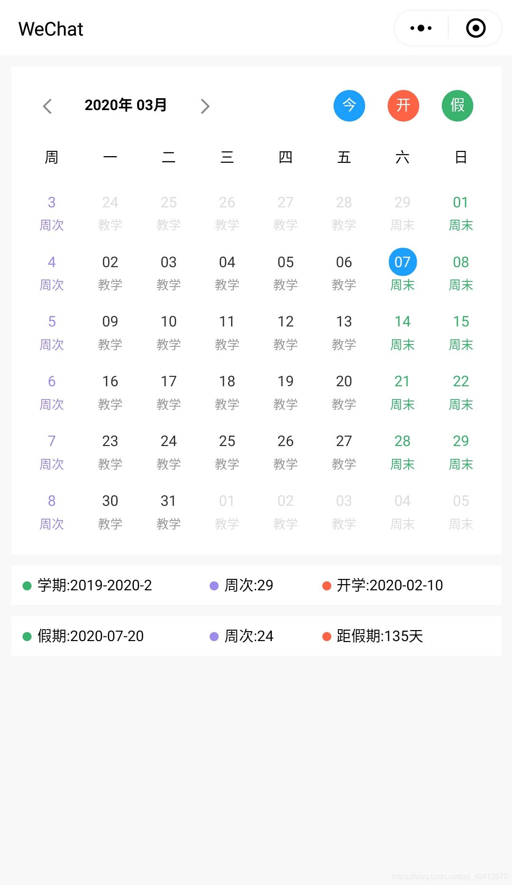

# 微信小程序校历组件

> 校历组件，可以作为校园小程序的插件，如果觉得不错，点个star吧 :-)  
> Github: https://github.com/WindrunnerMax/SCalendar  
> 山科小站小程序: https://github.com/WindrunnerMax/SHST

## 效果图



## 使用
导入微信开发者工具即可测试DEMO
```xml
<!-- 参数说明 -->
<calendar term="2019-2020-2" termStart="2020-02-10" weekCount="29" vacationStart="24"></calendar>
<!-- 
    term: 当前学期 
    termStart: 开学日期
    weekCount: 学期总周次
    vacationStart: 假期开始周次
-->
<!-- 注意: 所有填写日期需符合 yyyy-MM-dd 格式，例如 2020-03-01 而不是 2020-3-1 -->
```


## 实现

### 引用工具类
这是我的小程序( [山科小站](https://github.com/WindrunnerMax/SHST) )写好的时间操作工具类，在组件中引用此工具类
```javascript
/**
 * yyyy年 MM月 dd日 hh1~12小时制(1-12) HH24小时制(0-23) mm分 ss秒 S毫秒 K周
 */
const formatDate = (fmt = "yyyy-MM-dd", date = new Date()) => {
  var week = ["星期日", "星期一", "星期二", "星期三", "星期四", "星期五", "星期六"];
  var o = {
    "M+": date.getMonth() + 1, //月份
    "d+": date.getDate(), //日
    "h+": date.getHours(), //小时
    "m+": date.getMinutes(), //分
    "s+": date.getSeconds(), //秒
    "q+": Math.floor((date.getMonth() + 3) / 3), //季度
    "S": date.getMilliseconds(), //毫秒
    "K": week[date.getDay()]
  };
  if (/(y+)/.test(fmt)) fmt = fmt.replace(RegExp.$1, (date.getFullYear() + "").substr(4 - RegExp.$1.length));
  for (var k in o) {
    if (new RegExp("(" + k + ")").test(fmt)) fmt = fmt.replace(RegExp.$1, (RegExp.$1.length == 1) ? (o[k]) : (("00" + o[k]).substr(("" + o[k]).length)));
  }
  return fmt;
}

/**
 * 拓展Date原型
 */
const extDate = () => {
  Date.prototype.addDate = function (years = 0, months = 0, days = 0) {
    if (days !== 0) this.setDate(this.getDate() + days);
    if (months !== 0) this.setMonth(this.getMonth() + months);
    if (years !== 0) this.setFullYear(this.getFullYear() + years);
  }
}

/**
 * 计算日期差
 */
const dateDiff = (startDateString, endDateString) => {
  var separator = "-"; //日期分隔符
  var startDates = startDateString.split(separator);
  var endDates = endDateString.split(separator);
  var startDate = new Date(startDates[0], startDates[1] - 1, startDates[2]);
  var endDate = new Date(endDates[0], endDates[1] - 1, endDates[2]);
  var diff = parseInt((endDate - startDate) / 1000 / 60 / 60 / 24); //把相差的毫秒数转换为天数
  return diff;
}


module.exports = {
  formatDate: formatDate,
  extDate: extDate,
  dateDiff: dateDiff
}

```

### JS逻辑
首先得根据年月将本月的日历打印出来，使用`util.formatDate("yyyy-MM-01", date)`获取本月的`1`号的`Data`对象，然后计算他是本周的周几，使用`Date.addDate()`将日期转到`1`号所在的那周的周一，就是本月日历要打印的第一天，由于校历一般是周一作为一周的开始，所以需要稍微处理一下，不能直接减掉周次来将`Date`对象指向打印日历的第一天。  
由于每月的日历最多是五个周，所以我们直接打印五个周的时间即可，使用`Date.addDate()`将日期一天一天累加，并将数据保存即可。
对于日期的样式，我是用了相对比较简单的办法，通过`if`判断日期来给予其特定的样式，我是将不同的`class`拼接为字符串赋值到`unitObj`上的，对于显示的颜色等，通过`css`的优先级控制，单元样式继承于容器，对于需要特定现实的样式提供一个`detach`字段保存。
跳转日期则直接获取时间来拼接月份然后调用日历月份处理方法即可。

```javascript
const util = require("calendarUtil.js");
const date = new Date();
Component({
  properties: {
    term: {
      type: String,
      value: '2019-2020-2',
    },
    termStart: {
      type: String,
      value: '2020-02-10',
    },
    weekCount: {
      type: Number,
      value: 29
    },
    vacationStart: {
      type: Number,
      value: 24
    }
  },
  data: {
    calendarData: [],
    vacationDateDiff: 0,
    vacationStartDate: "",
    curMonth: util.formatDate("MM", date),
    curYear: util.formatDate("yyyy", date),
    today: util.formatDate(undefined, date)
  },
  created: function () {
    util.extDate();
  },
  ready: function () {
    this.calcVacation();
    this.redayForDate(date);
  },
  methods: {
    jumpDate: function(e){
      var d = new Date(e.currentTarget.dataset.d);
      this.data.curMonth = util.formatDate("MM", d);
      this.data.curYear = util.formatDate("yyyy", d);
      this.redayForDate(d);
      this.setData({
        curMonth: this.data.curMonth,
        curYear: this.data.curYear,
      })
    },
    switchMonth:function(e){
      var d = new Date(this.data.curYear+"-"+this.data.curMonth+"-01");
      var s = e.currentTarget.dataset.s;
      if (s === "l") d.addDate(0,-1);
      else d.addDate(0,1);
      this.data.curMonth = util.formatDate("MM", d);
      this.data.curYear = util.formatDate("yyyy", d);
      this.redayForDate(d);
      this.setData({
        curMonth: this.data.curMonth,
        curYear: this.data.curYear,
      })
    },
    redayForDate: function(date){
      var curMonthDay = util.formatDate("yyyy-MM-01", date);
      var monthStart = new Date(curMonthDay);
      var monthStartWeekDay = monthStart.getDay();
      monthStartWeekDay = monthStartWeekDay === 0 ? 7 : monthStartWeekDay;
      var calendarStart = monthStart;
      calendarStart.addDate(0, 0, -(monthStartWeekDay - 1));
      this.showCalendar(calendarStart);
    },
    showCalendar: function (start) {
      var showArr = [];
      for (let i = 0; i < 6; ++i) {
        let innerArr = [];
        let week = 0;
        for (let k = 0; k < 7; ++k) {
          let unitDate = util.formatDate("yyyy-MM-dd", start);
          if (k === 0) {
            week = parseInt((util.dateDiff(this.data.termStart, unitDate) / 7)) + 1;
            week = week > 0 ? week : 0;
            innerArr.push({ day: week, color: "week ", type: "周次", detach:"" })
          }
          let unitObj = { day: unitDate.split("-")[2], color: "notCurMonth ", type: "--", detach: ""};
          if (util.formatDate("MM", start) === this.data.curMonth) unitObj.color = "curMonth ";
          if (unitDate === this.data.today) unitObj.color = "today ";
          if (unitDate === this.data.termStart) unitObj.color = "termStart ";
          if (unitDate === this.data.vacationStartDate) unitObj.color = "vacationStart ";
          if (k === 5 || k === 6) {
            unitObj.type = "周末";
            unitObj.color += "weekend ";
          } else if (week && week < this.data.weekCount) {
            var tmpColor = "classes ";
            unitObj.type = "教学"; unitObj.detach = "cdetach";
            if (week >= this.data.vacationStart) { unitObj.type = "假期"; tmpColor = "vacation "; unitObj.detach=""; }
            unitObj.color += tmpColor;
          }
          innerArr.push(unitObj);
          start.addDate(0, 0, 1);
        }
        showArr.push(innerArr);
      }
      this.setData({
        calendarData: showArr
      })
    },
    calcVacation: function () {
      var d = new Date(this.data.termStart);
      d.addDate(0, 0, (this.data.vacationStart - 1) * 7);
      var vacationStartDate = util.formatDate(undefined, d);
      this.setData({ 
        vacationStartDate: vacationStartDate,
        vacationDateDiff: util.dateDiff(this.data.today, vacationStartDate)
      })
    }
  }
})
```

### wxml视图
视图就是普通的使用循环建立日历

```xml
<view class="card">
  <view class="y-CenterCon head">
    <view class="y-CenterCon">
      <view class="arrow-left" bindtap="switchMonth" data-s="l"></view>
      <view class="showDate">{{curYear}}年 {{curMonth}}月</view>
      <view class="arrow-right" bindtap="switchMonth" data-s="r"></view>
    </view>
    <view class="y-CenterCon">
      <view class="opt y-CenterCon x-CenterCon" style="background-color: #1E9FFF;" bindtap="jumpDate" data-d="{{today}}">今</view>
      <view class="opt y-CenterCon x-CenterCon" style="background-color: #FF6347;" bindtap="jumpDate" data-d="{{termStart}}">开</view>
      <view class="opt y-CenterCon x-CenterCon" style="background-color: #3CB371;" bindtap="jumpDate" data-d="{{vacationStartDate}}">假</view>
    </view>
  </view>

  <view>
    <view class="y-CenterCon line">
      <view wx:for='{{["周","一","二","三","四","五","六","日"]}}' wx:key="{{index}}" class="unit">{{item}}</view>
    </view>
    <view wx:for="{{calendarData}}" wx:key="{{index}}" class="line">
      <view wx:for="{{item}}" wx:for-item="innerItem" wx:for-index="innerIndex" wx:key="{{innerIndex}}">
        <view class="unitCon {{innerItem.color}}">
          <view class="unit u">{{innerItem.day}}</view>
          <view class="x-CenterCon intro {{innerItem.detach}}">{{innerItem.type}}</view>
        </view>
      </view>
    </view>

  </view>
</view>

<view class="card y-CenterCon info">
  <view style="width: 40%;">
    <view class="a-dot" style="background: #3CB371;"></view>
    <view >学期:{{term}}</view>
  </view>
  <view style="width: 24%;">
    <view class="a-dot" style="background: #9F8BEC;"></view>
    <view>周次:{{weekCount}}</view>
  </view>
  <view style="width: 36%;">
    <view class="a-dot" style="background: #FF6347;"></view>
    <view >开学:{{termStart}}</view>
  </view>
</view>

<view class="card y-CenterCon info">
  <view style="width: 40%;">
    <view class="a-dot" style="background: #3CB371;"></view>
    <view >假期:{{vacationStartDate}}</view>
  </view>
  <view style="width: 24%;">
    <view class="a-dot" style="background: #9F8BEC;"></view>
    <view>周次:{{vacationStart}}</view>
  </view>
  <view style="width: 36%;">
    <view class="a-dot" style="background: #FF6347;"></view>
    <view >距假期:{{vacationDateDiff}}天</view>
  </view>
</view>
```
### wxss样式
多使用`flex`布局，通过样式的优先级来控制颜色的覆盖，即可控制不同日期的颜色

```css
page{
  margin: 0;
    font-family: Arial, Helvetica, 'STHeiti STXihei', 'Microsoft YaHei', Tohoma, sans-serif;
    padding: 10px;
    box-sizing: border-box;
    font-size: 13px;
    background-color: #F8F8F8;
}

.card{
  padding: 10px;
  background: #fff;
  margin-bottom: 10px;
  box-sizing: border-box;
}

.head{
  justify-content: space-between;
  margin: 5px 5px 5px 10px;
}

.showDate{
  margin: 10px 20px;
  font-weight: bold;
}

.opt{
  width: 20px;
  line-height: 20px;
  padding: 4px;
  margin: 0 10px;
  color: #fff;
  background-color: #9F8BEC;
  border-radius: 30px;
}

.line{
  display: flex;
  justify-content: space-around;
  align-content: center;
  margin: 10px 0;
}

.unitCon{
  color: #333;
}

.unitCon view{
  color: inherit;
}

.unit{
  line-height: 25px;
  width: 25px;
  margin: 2.5px;
  display: flex;
  justify-content: center;
  align-items: center;
}

.notCurMonth{
  color: #ddd !important;
}

.today > .u,.termStart > .u,.vacationStart > .u{
  color: #fff !important;
  border-radius: 30px;
  background: #1E9FFF;
}

.termStart > .u{
  background: #FF6347;
}

.vacationStart > .u{
  background: #3CB371;
}

.week{
  color:#9F8BEC;
}

.intro{
    font-size: 11px;
}

.curMonth > .cdetach{
  color: #999;
}

.weekend,.vacation{
  color: #3CB371;
}

.x-CenterCon {
    display: flex;
    justify-content: center;
}

.y-CenterCon {
    display: flex;
    align-items: center;
}

.a-full{
  flex: 1;
}

.arrow-left,.arrow-right{
  width: 25px;
  height: 25px;
  background-size: 25px 25px;
  background-repeat: no-repeat;
  background-image: url("data:image/svg+xml,%3C?xml version='1.0' standalone='no'?%3E%3C!DOCTYPE svg PUBLIC '-//W3C//DTD SVG 1.1//EN' 'http://www.w3.org/Graphics/SVG/1.1/DTD/svg11.dtd'%3E%3Csvg t='1583569368665' class='icon' viewBox='0 0 1024 1024' version='1.1' xmlns='http://www.w3.org/2000/svg' p-id='1602' xmlns:xlink='http://www.w3.org/1999/xlink' width='200' height='200'%3E%3Cdefs%3E%3Cstyle type='text/css'%3E%3C/style%3E%3C/defs%3E%3Cpath d='M641.28 278.613333l-45.226667-45.226666-278.634666 278.762666 278.613333 278.485334 45.248-45.269334-233.365333-233.237333z' p-id='1603' fill='%238a8a8a'%3E%3C/path%3E%3C/svg%3E");
}

.arrow-right{
  transform:rotate(180deg);
}

.a-hr {
    display: block;
    height: 1px;
    background: #EEEEEE;
    border: none;
    margin: 10px 5px;
}

.a-dot {
    width: 8px;
    height: 8px;
    border-radius: 8px;
    background-color: #1E9FFF;
  margin-right: 5px; 
}

.a-dot + view{
  margin-right: 5px;
}

.info view{
  display: flex;
  align-items: center;
}
```
