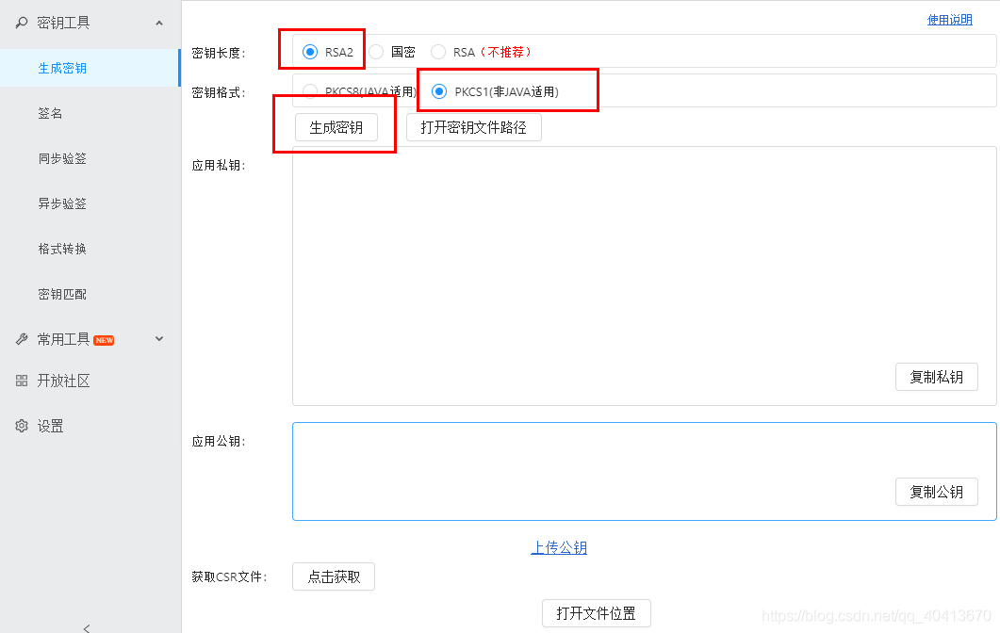

# 支付宝小程序获取 user_id(openid) ThinkPHP版
> 近期支付宝小程序个人公测了，就想着玩一下，没想到就获取用户唯一标识都这么麻烦，微信的openid的话Get请求一下就完事了，支付宝的user_id，需要对接SDK以及公钥私钥验签，而且支付宝的开发工具巨占内存，打开就至少占用2G内存，脑阔疼

1. 首先注册一个小程序，附一些用得到的链接  
[支付宝小程序注册链接](https://mini.open.alipay.com/channel/miniIndex.htm)  
[开发工具下载链接](https://opendocs.alipay.com/mini/ide/download)  
[SDK下载地址](https://docs.open.alipay.com/20180417160701241302/litbla/)  
[支付宝小程序开发文档](https://opendocs.alipay.com/mini/006kyi)  
[RSA 密钥生成工具下载地址](https://docs.open.alipay.com/291/105971/)  
2. 注册完成后将上边提供的软件都下载好，在开发中心—小程序应用—选择小程序—开发管理–功能列表(在底部)中添加 [ 获取会员基础信息 ] 功能。


3. 使用RSA生成工具生成密钥，并且这个工具以后可以用来验签使用



生成应用私钥和应用公钥后，复制应用公钥，在 [ 开发中心—小程序应用—选择小程序-设置–开发设置–设置接口加密方式 ] 


4. 前端部分，我是使用的静默获取，不会弹出授权框，我只需user_id即可

```javascript
my.getAuthCode({
      scopes: 'auth_base', 
      success:(res) =>{
        //在此处将res.authCode发送到后端
        //可以参照https://blog.csdn.net/qq_40413670/article/details/103796680 五、部署类 dispose.js的9. APP启动事件
      }
})
```
5. ThinkPHP部分，首选下载SDK，SDK中有很多很多类，如果只需要获取user_id则只需要下面6个类

```powershell
AopClient.php
AopEncrypt.php
EncryptParseItem.php
EncryptResponseData.php
SignData.php
request/AlipaySystemOauthTokenRequest.php
```
依照他的目录结构，那就将前五个类归属于同一个命名空间，第六个类在上层命名空间的request下
我将SDK放在根目录的extend目录下，列出这几个类更改的前几部分，后边与SDK相同，主要是标注namespace，并且由TP框架的自动加载机制，不需要再手动引入

```php
// AopClient.php
<?php
namespace lib\alipay;

use think\Exception;

class AopClient
{
    //应用ID
    public $appId;
    // ..................
}
```

```php
// AopEncrypt.php
<?php
namespace lib\alipay;
/**
 *   加密工具类
 *
 * User: jiehua
 * Date: 16/3/30
 * Time: 下午3:25
 */


/**
 * 加密方法
 * @param string $str
 * @return string
 */
function encrypt($str, $screct_key)
{
    // ..................
}
```

```php
// EncryptParseItem.php
<?php
namespace lib\alipay;
/**
 *  TODO 补充说明
 *
 * User: jiehua
 * Date: 16/3/30
 * Time: 下午8:55
 */

class EncryptParseItem
{
    // ..................
}
```

```php
// EncryptResponseData.php
<?php
namespace lib\alipay;
/**
 *  TODO 补充说明
 *
 * User: jiehua
 * Date: 16/3/30
 * Time: 下午8:51
 */

class EncryptResponseData
{

    public $realContent;
    public $returnContent;
} 
```

```php
// SignData.php
<?php
namespace lib\alipay;
/**
 * Created by PhpStorm.
 * User: jiehua
 * Date: 15/5/2
 * Time: 下午6:21
 */

class SignData
{
    public $signSourceData = null;
    public $sign = null;
} 
```

```php
// AlipaySystemOauthTokenRequest.php
<?php
namespace lib\alipay\request;
/**
 * ALIPAY API: alipay.system.oauth.token request
 *
 * @author auto create
 * @since 1.0, 2019-07-03 12:05:01
 */
class AlipaySystemOauthTokenRequest
{
    // ........................
}
```
调用类得到user_id

```php
$c = new AopClient();
$c->appId = "";       // APPID
$c->rsaPrivateKey = "";      // 生成的RSA私钥
$c->alipayrsaPublicKey = "";   // 生成的RSA公钥
$c->signType= "RSA2";
$request= new AlipaySystemOauthTokenRequest();
$request -> setCode($_POST['code']); //前端传来的code
$request -> setGrantType("authorization_code");
$response= $c->execute($request);
$user_id =$response -> alipay_system_oauth_token_response -> user_id;
```
至此，获取user_id完成，如果有验签错误的话，可以使用上述RSA生成工具进行调试，此外返回值中还有token等数据，按需取用