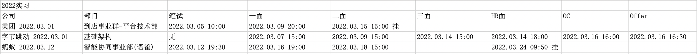
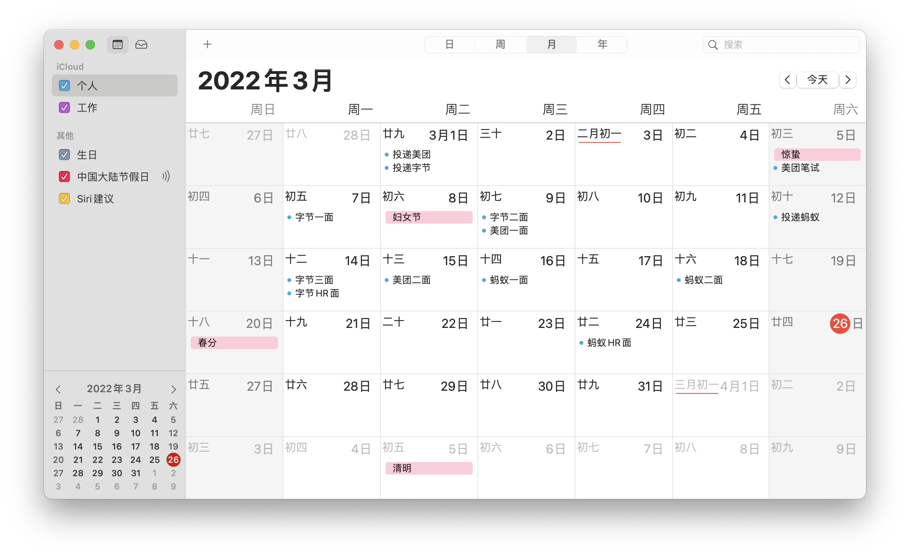
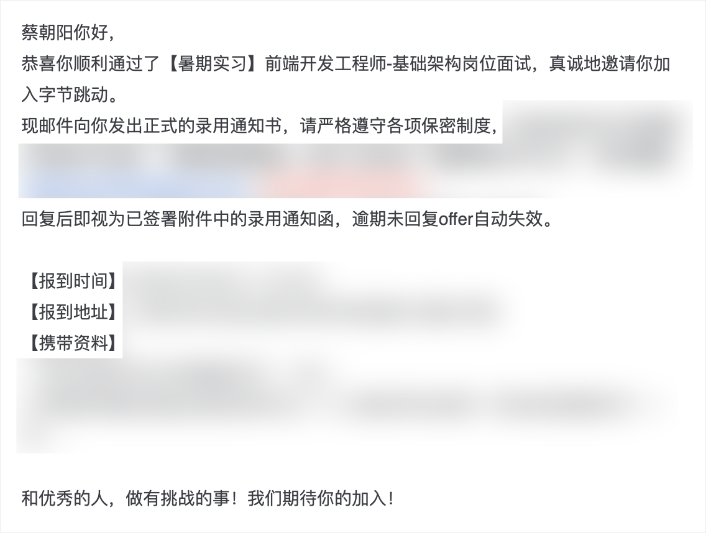
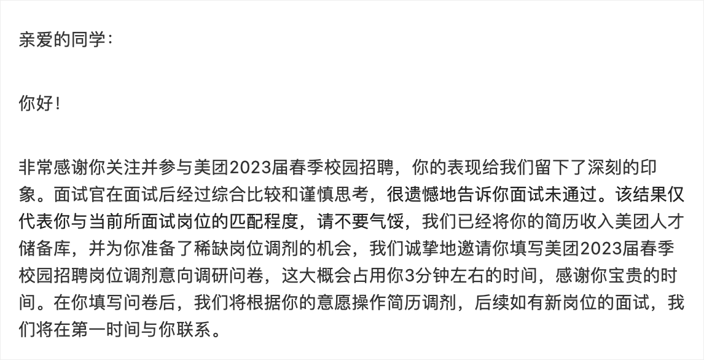
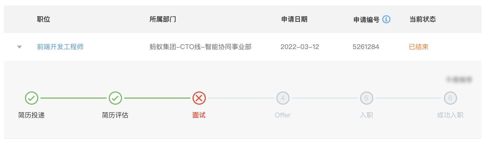

# 记2022年实习春招历程
先说说今年的实习春招结果吧，我是`23`届的毕业生，需要在这个时间找实习，然后为今年的秋招做准备。今年的实习我一共投了三家公司，分别是字节跳动、美团、蚂蚁，最终只拿到了字节跳动的暑期实习`offer`，美团二面之后挂了，蚂蚁`HR`面之后挂了。去年我也是投递了腾讯、美团、字节跳动三家公司，最终也只是拿到了腾讯的`offer`，这么一比较的话，一年了水平好像没有啥增长啊哈哈哈。  

作为参加过`21`年实习与`22`年实习的，我觉得我还是有点资格对比一下今年和去年的情况的。先说结论，今年`HC`也就是萝卜坑大幅度缩水，在数量上相比于去年直接出现了断层，找工作的难度远高于去年，简直没法比。在今年寒假的时候，说实话我还是踌躇满志的，因为我觉得当前的形势还是不差的，造成我这个错误的判断主要有两点，一是在`21`年底的时候有相当多的大厂开辟了日常实习的通道，这个计划那个计划的，就是招聘日常实习，而且招聘力度还不小。二当时虽然有很多厂传出裁员消息，但是招聘的力度并没有下降，而且当时疫情控制的还可以，感觉经济有一点恢复的势头，虽然有一些利空，但是总归还算是在预期之内吧。所以我一开始并没有着急找实习，虽然`21`年也有过不少面试经验，但是还是准备一下的好。直到开学的前夕，也就是二月底，我正式开始准备找实习了。其实从我研究生开始的时候，我就已经打听好了哪些公司招收日常实习可以研一去，哪些公司转正率高可以研二去，所以我一开始就去找了研一就找好的阿里的内推，然后得到了一个坏消息，他们那里只招收`985211`，不招收双非。然后又去问了问我的学长，还有一些朋友，得到的消息是，某宝、某里云、某钉都不要双非。这对我无异于当头一棒，我立即意识到了今年的形势将会异常艰难，今年恐怕工作是很难找了，我开始慌了，但是事情还是得按部就班地来，总是得一步步地解决。接下来一段时间，某些公司甚至还有极限操作，某些部门劝退了当时已经实习入职的双非实习生，有些核心部门卡第一学历的`23`所。截止到我写下这篇文章的时候也就是`2022.03.25`，腾讯的`22`年实习招聘依旧没有开放，这几天某公司裁员的事也闹的沸沸扬扬，甚至毁掉了一些已经签了三方的`22`届毕业生的`offer`，可能对于公司来说，毁三方只是那`5000`块钱的合同，但是对于`22`届的同学，那是要面对`22`年春招的地狱级别难度。这里就有一位`22`届同学现身说法了，他说秋招的时候随便投了简历都有十多家公司给他面试，今年投了很多家只有一家给面试机会了。

今年将会是不好过的一年，从中概股可以略知一二，很多上市公司的股票相较于最高点已经腰斩，甚至已经不如`1/3`，今年`A`股的绿也是有目共睹的，美联储还要连续的几次加息，虽然对于这些事情都已经有预期，但是当悬着的达摩克里斯之剑真正落下的时候，还是阵痛不断的。今年有将近千万级别的毕业生，大厂卷不过的去卷中厂，中厂卷不过的去小厂，小厂卷不过的可能就回去考研或者考公，以及本来就有考研和考公的意愿的，在毕业之后的几年里应届生的身份是可以保留的，考研考公还会积攒前几年的考研和考公大军，今年大概有`300w`人考研失利的新闻相信也都略有耳闻，考公的人只会更多。如果形势继续这么差的话，“今年是过去十年最差的一年，又是未来最好的一年”这句话可能将不会成为一句茶语笑谈了。今年我看到了一句非常让我触动的话，考研唯一的技巧：无他，唯早考耳。现在看来这句话可以用来形容的可多了，找工作是，考研也是，考公也是，等等等等。如果大家想考研的话，我觉得还是找好退路，居安思危，否则的话，怕是只能往死里卷了。

再说回我自己吧，毕竟也是记录春招实习的历程的，今年我是想只投几家然后拿到`offer`去实习就可以了，虽然今年比较艰难但是计划还是没变的，当然海投也是可以的，认识的同学有投`8`家甚至投`20`家的。

第一个打算投的公司是字节，然后因为内推的老哥忙的没理我，最后到了下午才投的，当然最终我是被`AI`部门截胡一次，又被基础架构截胡一次，基础架构这边是个`HR`实习生小姐姐捞的我，实习生不为难实习生哈哈哈，所以我的简历在基础架构停下了，说到这，我都`offer`了，在字节校招的官网我的个人中心的状态依然是投递简历，我主动投递的部门那边的流程就卡在那里了。不得不说字节的效率是真的高，要是`All in`的话我觉得一个半周走完所有流程不是问题。面试的层次也挺清晰，一面基础、二面工程化、三面生活、`HR`面瞎聊哈哈哈，不过每一面至少都有一个算法题确实是挺顶的。从`2022.03.01`投递开始，`2022.03.16`拿到`offer`，既然也只有这一个`offer`，那就准备去上海了吧。

美团的话笔试是必不可少的，因为只有笔试完成之后才能继续下边的流程，所以我第一次笔试就直接参加了，想尽快推进流程。其实关于笔试也挺看运气的，因为会安排很多场笔试，看他们说起来，第二次笔试的难度明显是低于第一次的难度的，所以如果流程在第一个周没发起的话，可能在后边就比较难发起了，当然只是有这个可能性而已。关于面试的话，一面的面试官是比较和善的，面试也是基本跟聊天一样，在聊天的时候穿插着一些问题，面试风格让人特别舒服，二面面试官就很严肃，问一些很偏门的问题而且也不给指引，不过最后给我的建议还是挺好的。不管怎么说，面过两次美团挂了两次，那也没办法了，也收到了人生第一封感谢信。

蚂蚁是`okbug`非得让我投，然后正好当时差不多字节也快面完了，就可以继续我的双线程面试流程，然后我就投递了，蚂蚁的流程也是真的快，投递的当晚就给我打电话约面试然后给我发笔试题了，当然他给我挂的也快哈哈哈。关于面试的话，我的体验都是挺好的，一面面试官问的问题很广，无论是前端后端还是数据库运维方面都有涉及，但是我也只是略有涉猎而已，在面上的回答还行，再往下深入就不太会了，二面面试官是大佬，面试也是聊天，而且挺爱笑的哈哈哈，但是我后期复盘的时候感觉我这场面试发挥的不好，感觉很多东西并没有展现出来，我反思了一下我觉得我也应该提及一下我相关的优势，不能只在面试官问的问题上回答，`HR`面的时候我觉得`HR`姐姐给我的建议也是非常中肯的，并且也跟我稍微分析了一下当前的校招和社招的形势，其实整体下来感觉都挺好的。我是在`HR`面后的第二天被挂了的，哈哈哈流程快不需要耽误时间等待了，不过我算是在`HR`面之后挂的，可能鱼池前边排序有很多`985211`而且`HC`很少吧，那也没办法了，蚂蚁这边没有感谢信，只有一个比较干巴巴的流程结束。

回头看了看我的`2021`年实习春招历程，最后有对今年的期待，“希望明年技术成长能更快一些，春招更顺利一些吧哈哈”，前半部分我觉得我可能实现了，但是后边这半部分，说实话并不算顺利，诸多坎坷不言而喻，还有“要卷就得早卷”这句话我也没有做到，现在回头看真的是比较失策。但是人总是需要有一些希望的，虽然今年秋招可能是一个往死里卷的状态，但还是希望能有一个比较顺利的秋招吧，也许等今年秋招的时候我再回头看这篇文章，那时的形势要比现在好得多呢哈哈哈。

