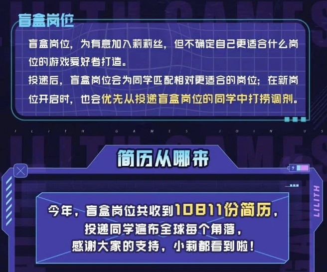

# 记2022年秋招历程
我是`23`届毕业生，所以在`22`年就需要参加秋招，在毕业之前签了三方之后，拿到毕业证直接去就可以了。今年的秋招是真的折磨，经济肉眼可见的差让所有公司都快速降低了对未来的预期，看起来的结果就是所有公司都不愿意继续扩张了，并且基本都在收缩业务，表现出来的就是都在裁员，大厂都是如此，就更不用说小公司了，这种情况下对于`23`届的同学来说简直是噩梦，当然很多`22`届的同学也遭了殃，`22`届同学们是经历了最好的一次秋招，同样也经历了最大的应届生毕业潮以及三方违约潮，说到三方这件事，对于公司来说违约大概就是`5k`的违约金，对于应届生来说可能就是错过春招导致相当一段时间找不到工作。至于`23`届同学，那就是经历了近年来最差的一次秋招了，至于三方违约这件事就不好说了，毕竟一共也没发几个`offer`，就算违约也谈不上大规模违约了。

今年秋招的`HC`究竟是什么样子的，对比一下数据就知道了，字节，从`22`年的`8000`减到`23`年的`3000`，缩减`60%`多；美团，从`22`年的`10000`减到`23`年的`5000`，砍掉一半；百度，从`22`年的`80000`缩减到`23`年的`2000`，缩减了`75%`；荣耀，从`22`年的`4000`缩减到`23`年的`2000`，同样砍掉`50%`；腾讯，`23`年只招`500`人，比起`22`年的`7000`断崖式狂砍`93%`。实际情况可能比这个更加惨烈，因为这都是名义上的`HC`，究竟会不会真的招这么多人还是未知数。如果上边的数据不够震撼的话，我们一起来看一下莉莉丝的一个盲盒岗位的复盘报告吧，莉莉丝算是个很不错的中厂，比较出名的游戏有剑与远征。

图里可以看到，盲盒岗位共收到`10811`份简历，有`68`位同学进入到了最终的面试环节，有`3`位同学最终拿到了`offer`。虽然并不是所有的岗位都是这个样子的，但是也可见一斑了，再比如网传网易的后端校招开了之后，一天时间收到了两万份简历，然后网易下架了这个岗位。可能大家并不是特别在意这些比较大的厂，认为这些厂就是有激烈的竞争，但是现在的情况就是一层一层的卷，大厂卷不过去中厂卷，中厂卷不过去小厂卷，一层一层的卷，绝大部分普通人都会受到影响。当然今年也有比较给力的厂，比如比亚迪，为这惨淡的秋招点缀了一抹光彩。

春招实习的总结我说过：“如果形势继续这么差的话，今年是过去十年最差的一年，又是未来最好的一年这句话可能将不会成为一句茶语笑谈了。今年我看到了一句非常让我触动的话，考研唯一的技巧：无他，唯早考耳。现在看来这句话可以用来形容的可多了，找工作是，考研也是，考公也是，等等等等。如果大家想考研的话，我觉得还是找好退路，居安思危，否则的话，怕是只能往死里卷了。”，这次秋招又听到了一句话，这就是非常具体了哈哈哈哈：磨刀不误砍柴工，读完硕士找不到工。

再说回我自己吧，对于我自己来说，秋招也是极其的惨烈，我秋招投了`32`家，再加字节的转正就算`33`家，一共`10`家公司给了面试机会，其他的公司不是简历挂就是笔试挂，流程走到终面的一共`6`家，最终拿到了`5`个`offer`。今年情况确实是太差了，跟找实习完全不是一个难度了，去年找实习投了三家拿了一个腾讯的`offer`，今年找实习投了三家拿了一个字节的`offer`，秋招投了`33`家，拿了字节、顺丰、携程、拼多多、`360`的`offer`。

可以看到我整个秋招战线是拉的相当长的，从`7`月份到`11`月份，而且`7`月和`8`月两个月的时间只有百度给了个面试机会，而且二面还挂了，这也就导致了整个`7`月和`8`月都是在疯狂的投简历做笔试，但是几乎没有任何面试的机会，这个情况直到九月份才稍微好了一些，不过话又说回来，因为没有面试机会，这也就导致我格外珍惜转正答辩的机会，所以可以说是做足了准备。此外，因为一直没有面试机会，感觉要失业了，然后跟网络中心那边老师吐槽了两句，没想到那边老师竟然还跟我说可以帮我申请留校，好家伙这是我没想到的，也是非常感谢老师能给一个这种非常神奇的机会哈哈哈。

第一个收到的`offer`是字节的，这也是经历了非常艰难的转正历程才拿到的，想想答辩的时候要`1v11`就很刺激，我准备了很长时间，到现在答辩的`PPT`讲稿我都还能背下来，为了各位大佬们的提问我还预先准备了很多问题，每天约个会议室演练一遍，想想压力是真的大。拿转正来说，放在去年是没有不转正的同学，今年那就是拉了，我认识的很多同学都没能转正。

第二个收到的`offer`是顺丰的，顺丰二面的老哥我印象特别深刻，这是我第一个连自我介绍都不需要的面试，老哥上来直接问我要最近做的项目的一些`DEMO`，那我就直接把我的`Github`给老哥看了，真刺激。最后也是顺利拿下了顺丰的`offer`，非常感谢顺丰。

第三个收到的`offer`是携程的，橙子让我印象最深的也是二面，面试官是真的随和，一点架子都没有，基本上就是俩人在一起东扯西聊的。橙子的这个`offer`让我很是心动啊，听说不卷没有那么累，每周还有两天的`WFH`，想想就很爽。

第四个收到的`offer`是拼多多的，多多让我印象最深的是一面，面试官是个漂亮小姐姐，非常感谢小姐姐忍受了我老掉线的这个网络哈哈哈，可能是因为刮台风的原因。多多最近出海做的是真的不错，而且在低端市场无人能敌，还是比较有发展空间的，挺不错的。

第五个收到的`offer`是`360`的，`360`让我印象最深的是二面，当时是真的遇上了懂行的了，和我深挖富文本相关的内容，我当时也没接触太多，还是个小菜鸡，就接不住大佬的问题，很尴尬哈哈哈。`360`听说也是很`WLB`的，感觉还是很值得去的。

回顾了下`2022`的实习春招历程，文章的最后是希望能有一个比较顺利的秋招，希望形式能够变好，可惜这美好的期待没有做到，而且情况是越来越差，难度上简直不是一个量级上的。不过相对来说，我又是幸运的，起码我还是找到了工作，并且也拿到了不错的`offer`。但是后边会怎么发展，谁也不敢保证，卷这件事情，一旦开始就停不下来了，就拿目前的情况来说，应届生还是比较危险的，所以现在还是需要保持警惕，保持危机意识，努力提升自己吧。
